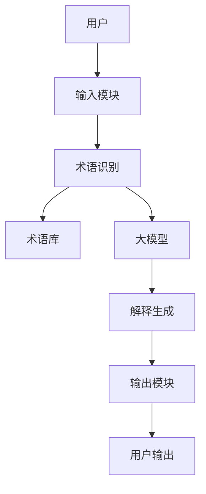
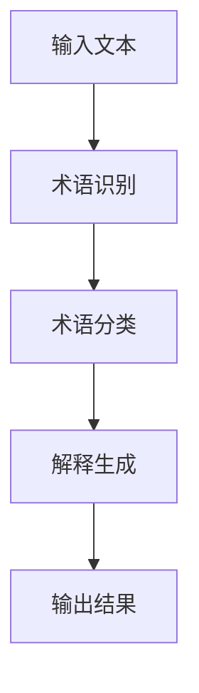
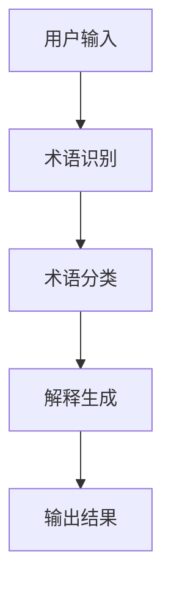

                 


# 开发基于大模型的金融专业术语解释系统

> 关键词：大模型，金融术语，自然语言处理，系统开发，术语解释

> 摘要：本文详细探讨了开发基于大模型的金融专业术语解释系统的背景、核心概念、算法原理、系统架构及实现方案。文章首先分析了大模型技术的发展及其在金融领域的应用，接着深入探讨了金融术语的特点与术语解释系统的必要性。随后，详细阐述了大模型的训练与优化算法，以及系统的设计与实现方案，包括功能模块划分、系统架构设计和接口设计。最后，通过实际案例展示了系统的开发过程，并提出了系统优化与未来发展方向的建议。

---

# 第一部分: 基于大模型的金融专业术语解释系统开发背景与核心概念

## 第1章: 大模型技术的发展与金融领域的应用

### 1.1 大模型技术的演进历程

#### 1.1.1 从传统NLP到大模型的演进
传统的自然语言处理（NLP）技术主要依赖于规则和浅层特征，而大模型的出现标志着NLP技术的革新。大模型通过自监督学习和大规模预训练，能够更好地理解上下文关系，从而实现更准确的文本生成和理解任务。

#### 1.1.2 大模型在金融领域的应用现状
金融领域涉及大量的专业术语和复杂的业务逻辑，传统的方法难以应对多样化的用户需求。大模型的引入为金融术语的解释提供了更高效、更准确的解决方案。目前，大模型已在金融文本分析、智能客服等领域取得显著成果。

#### 1.1.3 金融专业术语解释的必要性与挑战
金融术语具有复杂性、多样性和专业性等特点，用户对术语的解释需求多样，包括单点解释、上下文相关解释等。然而，现有系统往往难以满足这些需求，主要挑战包括数据稀缺性、模型可解释性不足等问题。

---

## 第2章: 金融专业术语解释系统的概念体系

### 2.1 核心概念与定义

#### 2.1.1 大模型在术语解释中的角色
大模型通过其强大的语言理解和生成能力，能够对金融术语进行准确的解释。它不仅能够识别术语，还能根据上下文生成相关的解释。

#### 2.1.2 术语解释系统的功能模块
术语解释系统通常包括以下功能模块：
- **输入模块**：接收用户的输入，识别需要解释的术语。
- **术语识别模块**：对输入文本进行术语识别。
- **术语解释模块**：基于大模型生成术语解释。
- **输出模块**：将解释结果返回给用户。

#### 2.1.3 系统的核心要素与组成
系统的核心要素包括：
- **术语库**：存储金融术语及其基本解释。
- **大模型**：负责复杂术语的生成和上下文相关解释。
- **用户交互模块**：实现用户与系统的交互。

### 2.2 核心概念之间的关系

#### 2.2.1 大模型与术语库的交互关系
大模型与术语库之间的关系是互补的。大模型能够生成灵活的解释，而术语库提供了权威的基础解释。两者结合，能够提升解释的准确性和丰富性。

#### 2.2.2 用户需求与系统输出的对应关系
用户的需求多样，系统需要能够根据不同的输入生成相应的解释。例如，用户输入“期权”，系统需要识别并生成期权的定义、类型及相关案例。

#### 2.2.3 系统架构与功能模块的依赖关系
系统架构决定了功能模块的组织方式。例如，输入模块依赖于术语识别模块，而术语识别模块又依赖于术语库。

### 2.3 实体关系图（ER图）



### 2.4 本章小结
本章详细介绍了大模型在金融术语解释系统中的角色，系统的核心概念和组成，以及各部分之间的关系。通过实体关系图，展示了系统各模块的交互流程。

---

# 第二部分: 金融专业术语解释系统的概念体系

## 第3章: 大模型的训练与优化

### 3.1 大模型训练的基本原理

#### 3.1.1 自监督学习与预训练
大模型的训练通常采用自监督学习，通过预训练任务（如Masked Language Model）来学习语言的表示。预训练任务能够使模型在大规模数据上学习到通用的语言特征。

#### 3.1.2 语言模型的损失函数
语言模型的目标是最小化预测词与真实词之间的损失。常用的损失函数包括交叉熵损失：

$$
\mathcal{L} = -\sum_{i=1}^{n} \log p(y_i | x_i)
$$

其中，$p(y_i | x_i)$ 是生成词 $y_i$ 在输入词 $x_i$ 下的概率。

#### 3.1.3 参数优化方法
大模型的优化通常采用Adam优化器，其更新规则为：

$$
m_t = \beta_1 m_{t-1} + (1 - \beta_1)g_t
$$

$$
v_t = \beta_2 v_{t-1} + (1 - \beta_2)g_t^2
$$

$$
\theta_{t} = \theta_{t-1} - \eta \frac{m_t}{\sqrt{v_t + \epsilon}}
$$

其中，$\eta$ 是学习率，$\beta_1$ 和 $\beta_2$ 是动量参数，$\epsilon$ 是防止除以零的常数。

---

### 3.2 术语解释任务的适配

#### 3.2.1 术语识别与分类
术语识别是术语解释的第一步，通常采用命名实体识别（NER）技术。例如，可以使用CRF（条件随机场）模型进行命名实体识别：

$$
P(y_i|x_i) = \frac{1}{Z} \exp(\sum_{k=1}^{n} \lambda_k f_k(x_i, y_i))
$$

其中，$f_k$ 是特征函数，$\lambda_k$ 是对应的权重。

#### 3.2.2 术语解释生成的策略
术语解释生成可以采用基于生成对抗网络（GAN）的策略，或者使用Seq2Seq模型。例如，使用Transformer模型进行解释生成：

$$
\text{Decoder}(y_{<t} | x, y_{\leq t-1}) = \text{softmax}(W_y h_t + b_y)
$$

其中，$h_t$ 是解码器的隐藏状态，$W_y$ 和 $b_y$ 是参数。

#### 3.2.3 多轮对话的处理逻辑
多轮对话需要模型保持上下文的记忆。可以通过引入记忆网络（Memory Network）来实现：

$$
m_t = \sum_{i=1}^{t} \alpha_i \cdot h_i
$$

其中，$\alpha_i$ 是注意力权重，$h_i$ 是历史隐藏状态。

---

### 3.3 算法流程图



### 3.4 本章小结
本章详细介绍了大模型的训练与优化过程，包括自监督学习、损失函数和优化器的选择，以及术语解释任务的适配策略。通过算法流程图，展示了术语解释的生成过程。

---

# 第三部分: 金融术语解释系统的系统分析与架构设计

## 第4章: 系统功能设计

### 4.1 功能模块划分

#### 4.1.1 用户输入模块
用户通过输入文本或关键词，触发术语解释功能。

#### 4.1.2 术语识别模块
对输入文本进行术语识别，确定需要解释的术语。

#### 4.1.3 术语解释模块
根据识别的术语，调用大模型生成解释。

#### 4.1.4 输出模块
将解释结果返回给用户，或者输出到指定的接口。

---

### 4.2 系统功能流程图



### 4.3 本章小结
本章详细介绍了系统的功能模块划分和整体流程图，展示了从用户输入到解释输出的完整过程。

---

# 第四部分: 项目实战

## 第5章: 系统开发与实现

### 5.1 环境安装

#### 5.1.1 安装Python
```bash
python --version
```

#### 5.1.2 安装依赖库
```bash
pip install transformers torch
```

---

### 5.2 核心代码实现

#### 5.2.1 术语识别模块
```python
import torch
from transformers import BertTokenizer, BertModel

class TermRecognizer:
    def __init__(self, model_name='bert-base-uncased'):
        self.tokenizer = BertTokenizer.from_pretrained(model_name)
        self.model = BertModel.from_pretrained(model_name)
    
    def recognize_terms(self, text):
        inputs = self.tokenizer(text, return_tensors='np')
        outputs = self.model(**inputs)
        # 这里可以添加具体的术语识别逻辑
        return identified_terms
```

#### 5.2.2 解释生成模块
```python
from transformers import BartForConditionalGeneration

class TermExplanator:
    def __init__(self, model_name='facebook/bart-large'):
        self.model = BartForConditionalGeneration.from_pretrained(model_name)
    
    def generate_explanation(self, term):
        inputs = self.tokenizer(term, return_tensors='np')
        outputs = self.model.generate(inputs.input_ids)
        return outputs[0].decode()
```

---

### 5.3 实际案例分析

#### 5.3.1 案例一：解释“期权”
输入文本：`请解释什么是期权。`
输出结果：`期权是一种金融衍生品，给予持有者在特定时间内以特定价格买入或卖出标的资产的权利。`

#### 5.3.2 案例二：上下文相关解释
输入文本：`在股票期权中，什么是行权价？`
输出结果：`行权价是期权合同中规定的买入或卖出标的资产的价格，也称为执行价格。`

---

### 5.4 项目小结
本章通过实际案例展示了系统的开发与实现过程，包括环境安装、核心代码实现和实际应用案例。通过这些案例，读者可以更好地理解系统的功能和实现逻辑。

---

# 总结

## 6.1 总结与展望

### 6.1.1 系统总结
本文详细探讨了开发基于大模型的金融专业术语解释系统的背景、核心概念、算法原理、系统设计及实现方案。通过系统的开发与实现，展示了大模型在金融术语解释中的巨大潜力。

### 6.1.2 未来展望
未来，随着大模型技术的不断发展，金融术语解释系统将更加智能化和个性化。可以通过引入多模态输入、增强模型的可解释性等方式，进一步提升系统的性能。

---

## 6.2 注意事项

### 6.2.1 数据隐私问题
在实际应用中，需要注意金融数据的隐私保护，确保用户数据的安全性。

### 6.2.2 模型的可解释性
大模型的黑箱特性可能导致解释的不透明性，需要引入可解释性技术来增强系统的可信度。

### 6.2.3 系统的性能优化
在实际应用中，需要注意系统的性能优化，特别是在处理大规模数据时，需要采用高效的算法和优化策略。

---

## 6.3 最佳实践 Tips

### 6.3.1 数据预处理
在进行术语识别和解释生成之前，建议对数据进行预处理，包括分词、去停用词等。

### 6.3.2 模型调优
可以通过调整模型的超参数（如学习率、批量大小等）来优化模型的性能。

### 6.3.3 系统测试
在系统开发过程中，建议进行充分的测试，包括单元测试、集成测试和性能测试，以确保系统的稳定性和可靠性。

---

## 作者

作者：AI天才研究院/AI Genius Institute & 禅与计算机程序设计艺术/Zen And The Art of Computer Programming

---

以上是《开发基于大模型的金融专业术语解释系统》的完整目录大纲及详细内容，涵盖从背景到实现的各个方面，确保逻辑清晰、结构紧凑、内容详实。

