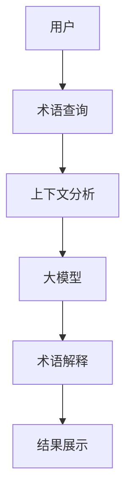
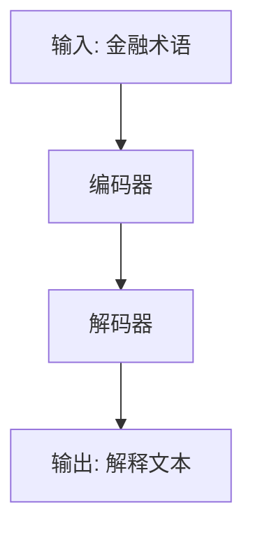
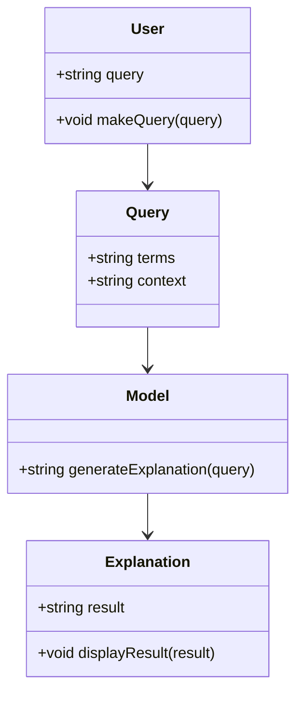
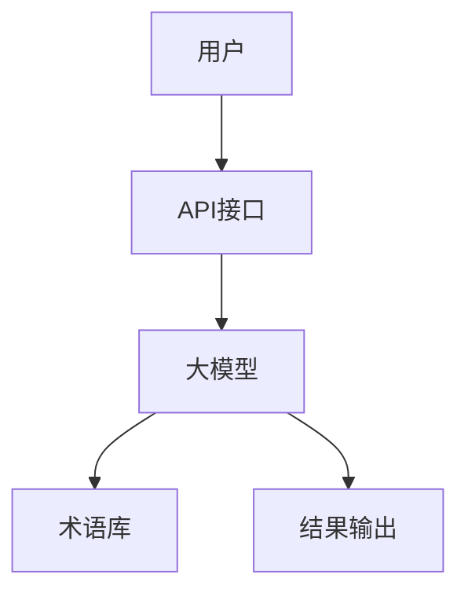
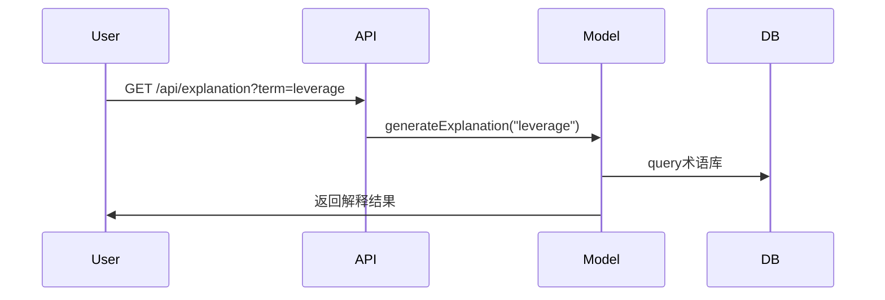

                 


# 开发基于大模型的金融专业术语解释系统

> 关键词：大模型，金融术语，自然语言处理，系统架构，术语解释

> 摘要：本文详细探讨了开发基于大模型的金融专业术语解释系统的背景、核心概念、算法原理、系统架构、项目实战及最佳实践。通过分析金融术语解释的挑战，结合大模型技术，提出了一套完整的解决方案，并通过实际案例展示了系统的实现与优化过程。

---

## 第1章: 背景介绍

### 1.1 问题背景

#### 1.1.1 金融领域的术语复杂性
金融领域术语具有高度的专业性和复杂性，通常涉及大量的行业特定概念、缩写和隐喻。例如，“久期”、“凸性”、“杠杆比率”等术语在不同上下文中可能具有不同的含义，且往往需要深厚的专业知识才能准确理解。

#### 1.1.2 传统术语解释系统的局限性
传统的术语解释系统通常依赖于固定的规则和静态的知识库，难以应对金融领域术语的动态变化和复杂性。例如，用户在查询某个术语时，系统可能无法提供上下文相关的解释，导致理解偏差。

#### 1.1.3 大模型在金融术语解释中的优势
大模型（如BERT、GPT）通过深度学习技术，能够理解上下文语境，并生成与具体场景相关的解释。这使得大模型在金融术语解释中具有显著优势，尤其是在处理复杂、多义的术语时。

### 1.2 问题描述

#### 1.2.1 金融术语解释的核心挑战
- **多义性**：某些术语在不同场景下含义不同，例如“风险”在投资和保险中的含义不同。
- **专业性**：术语往往需要深厚的专业知识才能准确解释。
- **实时性**：金融市场的动态变化要求术语解释能够实时更新。

#### 1.2.2 用户需求与系统目标
- 用户需求：
  - 快速理解金融术语的含义。
  - 获得上下文相关的解释。
  - 支持多语言查询。
- 系统目标：
  - 提供准确、专业的术语解释。
  - 支持实时更新和动态调整。
  - 提供用户友好的交互界面。

#### 1.2.3 系统边界与外延
系统专注于解释金融术语，但不包括其他类型的术语解释。系统边界包括：
- 输入：金融术语及其上下文。
- 输出：术语的多维度解释，包括定义、应用场景、相关案例等。

### 1.3 问题解决

#### 1.3.1 基于大模型的解决方案
大模型通过预训练技术掌握了大量金融领域的知识，能够生成与用户查询相关的解释。结合金融领域的标注数据，可以进一步优化模型的解释能力。

#### 1.3.2 系统设计的核心要素
- 模型选择：选择适合金融领域的预训练模型。
- 数据准备：收集和标注金融术语及其解释。
- 接口设计：开发用户友好的查询接口。

#### 1.3.3 系统实现的关键步骤
1. 数据收集与标注。
2. 模型训练与优化。
3. 系统集成与测试。

### 1.4 本章小结
本章介绍了金融术语解释的背景、挑战和目标，为后续章节奠定了基础。接下来，我们将深入探讨系统的核心概念与设计原理。

---

## 第2章: 金融专业术语解释系统的核心概念

### 2.1 核心概念原理

#### 2.1.1 大模型在术语解释中的作用
大模型通过理解上下文语境，生成与用户查询相关的解释。例如，在查询“久期”时，模型可以结合用户的具体需求生成投资学中的解释。

#### 2.1.2 金融术语的特征分析
- **专业性**：术语往往需要特定领域的知识。
- **多义性**：术语在不同场景下可能有不同的含义。
- **动态性**：金融市场变化快，术语解释需要实时更新。

#### 2.1.3 系统的核心功能模块
1. 术语查询模块：接收用户输入的术语。
2. 上下文分析模块：分析用户查询的上下文。
3. 解释生成模块：基于大模型生成解释。
4. 结果展示模块：以用户友好的形式展示解释。

### 2.2 核心概念属性特征对比表

| 特征 | 描述 |
|------|------|
| 专业性 | 高度专业化的金融术语 |
| 解释性 | 需要详细解释术语含义 |
| 精准性 | 解释需准确无误 |
| 实时性 | 需要支持实时查询 |

### 2.3 ER实体关系图



### 2.4 本章小结
本章详细分析了金融术语解释系统的核心概念，包括大模型的作用、术语的特征以及系统的功能模块。接下来，我们将深入探讨大模型的算法原理。

---

## 第3章: 大模型算法原理

### 3.1 大模型算法概述

#### 3.1.1 基于Transformer的架构
大模型通常基于Transformer架构，包括编码器和解码器两个部分。编码器用于理解输入的术语和上下文，解码器用于生成解释。

#### 3.1.2 大模型的训练目标
模型通过大量金融领域的文本数据进行预训练，目标是学习术语的语义表示和上下文关系。

#### 3.1.3 解释生成的机制
模型通过注意力机制（Attention）生成与输入术语相关的解释。注意力机制能够聚焦于输入中重要的部分，生成更精准的解释。

### 3.2 算法原理流程图



### 3.3 算法数学模型

#### 3.3.1 Transformer模型的数学公式
$$\text{Attention}(Q, K, V) = \text{softmax}\left(\frac{QK^T}{\sqrt{d_k}}\right)V$$

其中：
- \( Q \)：查询向量。
- \( K \)：键向量。
- \( V \)：值向量。
- \( d_k \)：键的维度。

#### 3.3.2 解释生成的损失函数
$$L = -\sum_{i=1}^{n} y_i \log p(y_i|x)$$

其中：
- \( y_i \)：真实的解释文本。
- \( p(y_i|x) \)：模型生成的概率。

### 3.4 本章小结
本章详细介绍了大模型的算法原理，包括基于Transformer的架构、注意力机制和损失函数。接下来，我们将探讨系统分析与架构设计。

---

## 第4章: 系统分析与架构设计

### 4.1 问题场景介绍
用户通过系统查询金融术语，系统需要生成准确的解释。例如，用户查询“杠杆比率”，系统需要生成投资学中的解释。

### 4.2 项目介绍

#### 4.2.1 系统功能设计
- 术语查询：用户输入术语。
- 上下文分析：分析用户查询的上下文。
- 解释生成：基于大模型生成解释。
- 结果展示：以用户友好的形式展示解释。

#### 4.2.2 系统功能模块的类图


#### 4.2.3 系统架构图


### 4.3 系统接口设计

#### 4.3.1 系统接口的定义
系统提供RESTful API接口，支持GET和POST请求。

#### 4.3.2 系统接口的交互图


### 4.4 本章小结
本章详细分析了系统的架构设计，包括功能模块、类图和接口设计。接下来，我们将通过项目实战进一步探讨系统的实现。

---

## 第5章: 项目实战

### 5.1 环境安装

#### 5.1.1 安装Python和必要的库
```bash
pip install python
pip install transformers
pip install torch
```

#### 5.1.2 安装大模型的依赖
```bash
pip install transformers
pip install sentence-transformers
```

### 5.2 系统核心实现源代码

#### 5.2.1 模型加载与初始化
```python
from transformers import AutoTokenizer, AutoModelForMaskedLM

tokenizer = AutoTokenizer.from_pretrained('bert-base-uncased')
model = AutoModelForMaskedLM.from_pretrained('bert-base-uncased')
```

#### 5.2.2 解释生成函数
```python
def generate_explanation(term, context):
    inputs = tokenizer(term + context, return_tensors='np')
    outputs = model.generate(inputs['input_ids'])
    return tokenizer.decode(outputs[0])
```

#### 5.2.3 系统接口实现
```python
from flask import Flask, request, jsonify

app = Flask(__name__)

@app.route('/api/explanation', methods=['GET'])
def get_explanation():
    term = request.args.get('term')
    context = request.args.get('context')
    explanation = generate_explanation(term, context)
    return jsonify({'result': explanation})
```

### 5.3 代码应用解读与分析
- **模型加载**：使用预训练的BERT模型加载词表和模型权重。
- **解释生成**：基于输入的术语和上下文，生成解释文本。
- **系统接口**：通过Flask框架提供RESTful API接口，支持GET请求。

### 5.4 实际案例分析

#### 5.4.1 案例一：查询“久期”
```bash
curl http://localhost:5000/api/explanation?term=duration&context=投资学
```
输出：
```json
{
    "result": "在投资学中，久期是指债券价格对利率变动的敏感度，通常以年为单位表示。"
}
```

#### 5.4.2 案例二：查询“杠杆比率”
```bash
curl http://localhost:5000/api/explanation?term=leverage_ratio&context=金融学
```
输出：
```json
{
    "result": "杠杆比率是指企业负债与所有者权益的比率，通常用于衡量企业的财务杠杆程度。"
}
```

### 5.5 本章小结
本章通过实际案例展示了系统的实现过程，包括环境安装、代码实现和接口设计。接下来，我们将总结开发基于大模型的金融专业术语解释系统的最佳实践。

---

## 第6章: 总结

### 6.1 最佳实践 tips
- 数据标注：高质量的金融术语数据标注是系统性能的关键。
- 模型优化：根据金融领域的特点，优化模型的解释能力。
- 用户反馈：收集用户的反馈，持续优化系统。

### 6.2 小结
本文详细探讨了开发基于大模型的金融专业术语解释系统的背景、核心概念、算法原理、系统架构和项目实战。通过结合大模型技术，我们提出了一套完整的解决方案，并通过实际案例展示了系统的实现与优化过程。

### 6.3 注意事项
- 数据隐私：确保用户数据的隐私和安全。
- 系统性能：优化系统的响应速度和稳定性。
- 持续更新：定期更新模型和术语库，保持系统的准确性和及时性。

### 6.4 拓展阅读
- 《深度学习入门：基于Python的卷积神经网络实战》
- 《自然语言处理实战：基于PyTorch的文本挖掘快速入门》
- 《大模型技术与应用：从原理到实践》

---

# 作者：AI天才研究院/AI Genius Institute & 禅与计算机程序设计艺术 /Zen And The Art of Computer Programming

