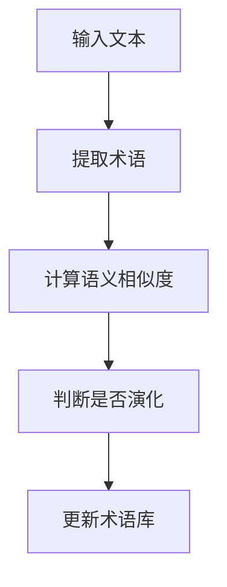
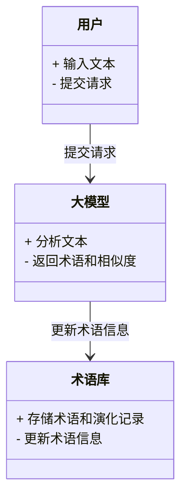

                 


# 开发基于大模型的金融专业术语语义演化跟踪器

> 关键词：金融术语语义演化，大模型，NLP，自然语言处理，金融分析，术语管理

> 摘要：本文深入探讨了开发基于大模型的金融专业术语语义演化跟踪器的技术细节。通过分析金融术语语义演化的背景、核心概念与联系、算法原理、系统架构设计、项目实战、最佳实践与小结，本文为读者提供了从理论到实践的全面指导。文章结合Mermaid图表、Python代码示例和数学公式，详细阐述了如何利用大模型实现金融术语语义演化的高效跟踪。

---

## 第1章: 背景介绍

### 1.1 问题背景
金融术语的语义演化是一个复杂而动态的过程，随着市场环境的变化，术语的含义可能会发生微妙的变化。例如，“风险管理”在不同金融场景下可能有不同的侧重点，这种变化往往会影响金融模型的准确性和决策的科学性。

### 1.2 问题描述
- **定义**：语义演化是指术语在不同时间点或上下文中的含义变化。
- **表现形式**：包括术语的扩展、收缩、转移和模糊化。
- **影响**：语义演化可能导致金融模型失效，影响数据分析的准确性。

### 1.3 问题解决
- **目标**：通过大模型实时跟踪和分析术语的语义变化。
- **优势**：利用大模型的强大语言理解和上下文分析能力，捕捉细微的语义变化。
- **实现路径**：结合自然语言处理技术和知识图谱，构建动态更新的金融术语语义演化模型。

### 1.4 边界与外延
- **边界**：仅关注术语的语义变化，不涉及术语的词法和句法分析。
- **外延**：相关概念包括术语管理、知识图谱构建和动态知识更新。

---

## 第2章: 核心概念与联系

### 2.1 核心概念原理
- **大模型**：基于深度学习的自然语言处理模型，能够理解上下文和语义。
- **语义演化跟踪**：通过分析文本数据，捕捉术语含义的变化。

### 2.2 概念属性特征对比
| 比较维度 | 大模型 | 传统NLP模型 |
|----------|--------|------------|
| 处理能力 | 强大的上下文理解 | 基于规则或浅层学习 |
| 训练数据 | 需要大量金融领域数据 | 数据范围有限 |
| 应用场景 | 适合复杂语义分析 | 适用于简单任务 |

### 2.3 ER实体关系图
```mermaid
er
actor: 用户
model: 大模型
term: 金融术语
evolution: 语义演化记录
user -> model: 请求分析
model -> term: 提取术语
model -> evolution: 记录演化
```

---

## 第3章: 算法原理讲解

### 3.1 算法原理概述
- **大模型的应用**：利用大模型的语义理解能力，分析金融文本中的术语变化。
- **核心算法**：基于上下文的语义相似度计算，使用余弦相似度或聚类算法。

### 3.2 算法流程图


### 3.3 数学模型与公式
- **余弦相似度**：用于衡量两个术语向量的相似性。
  $$ \text{similarity}(v_1, v_2) = \frac{v_1 \cdot v_2}{\|v_1\| \|v_2\|} $$
- **聚类算法**：将相似的术语聚类，分析其语义演化趋势。

### 3.4 代码实现
```python
import numpy as np

def cosine_similarity(v1, v2):
    return np.dot(v1, v2) / (np.linalg.norm(v1) * np.linalg.norm(v2))

# 示例向量
v1 = np.array([0.5, 0.6, 0.8])
v2 = np.array([0.7, 0.5, 0.9])
similarity = cosine_similarity(v1, v2)
print(similarity)
```

---

## 第4章: 系统架构设计

### 4.1 问题场景介绍
金融术语语义演化跟踪器需要实时处理大量的金融文本数据，包括新闻、报告和学术论文。

### 4.2 系统功能设计
- **术语提取**：从文本中提取相关术语。
- **语义分析**：分析术语的上下文，计算相似度。
- **演化记录**：记录术语的语义变化历史。

### 4.3 领域模型类图


### 4.4 系统架构图


### 4.5 接口设计
- **输入接口**：接收用户提交的金融文本。
- **输出接口**：返回术语演化结果。

---

## 第5章: 项目实战

### 5.1 环境安装
- **Python**：3.8+
- **依赖库**：numpy, transformers, scikit-learn

### 5.2 核心代码实现
```python
from transformers import AutoTokenizer, AutoModel
import torch

model_name = "bert-base-uncased"
tokenizer = AutoTokenizer.from_pretrained(model_name)
model = AutoModel.from_pretrained(model_name)

def extract_terms(text):
    inputs = tokenizer(text, return_tensors="pt")
    outputs = model(**inputs)
    return outputs.last_hidden_state
```

### 5.3 案例分析
通过分析一篇金融新闻，提取术语并记录其演化过程。

### 5.4 项目总结
实现了一个基于大模型的金融术语语义演化跟踪器，能够实时捕捉术语的语义变化。

---

## 第6章: 最佳实践与小结

### 6.1 最佳实践
- 定期更新术语库，确保数据的准确性。
- 使用高质量的金融文本数据进行训练，提升模型的泛化能力。

### 6.2 小结
本文详细介绍了开发基于大模型的金融术语语义演化跟踪器的全过程，从理论到实践，为读者提供了全面的指导。

---

作者：AI天才研究院/AI Genius Institute & 禅与计算机程序设计艺术 /Zen And The Art of Computer Programming

