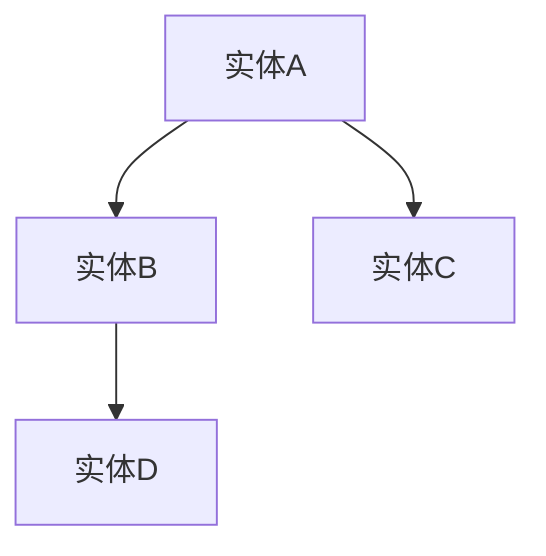
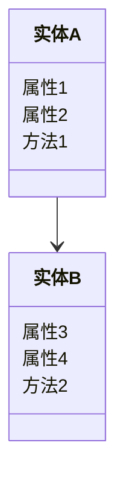
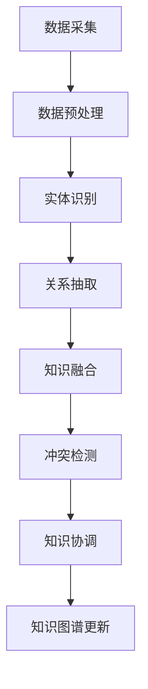
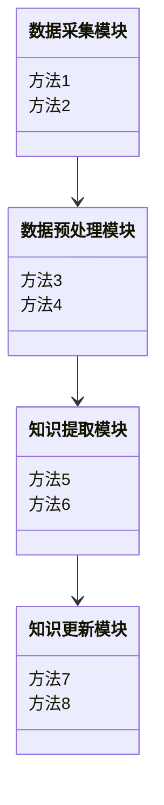
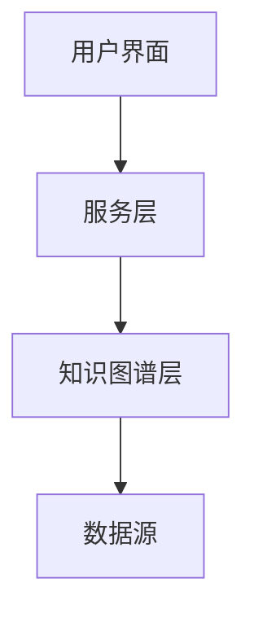
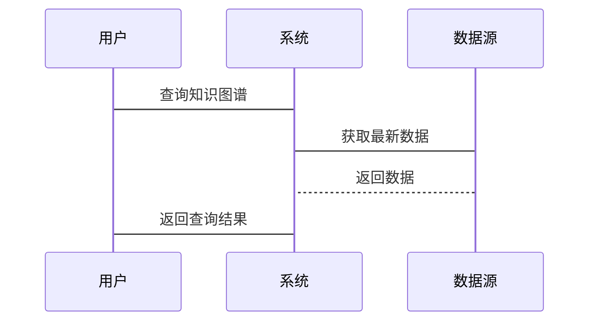

                 


```markdown
# 开发基于大模型的金融专业知识图谱动态更新系统

> 关键词：知识图谱，大模型，金融，动态更新，系统架构

> 摘要：本文详细探讨了开发基于大模型的金融专业知识图谱动态更新系统的背景、核心概念、算法原理、系统架构设计以及项目实现过程。通过分析金融领域的知识图谱需求，结合大模型的应用现状，提出了一种基于大模型的知识图谱动态更新方法，详细讲解了系统的实现步骤和关键技术。

---

# 第一章: 开发背景与问题背景

## 1.1 问题背景

### 1.1.1 金融领域的知识图谱需求

在金融领域，知识图谱的应用越来越广泛。金融知识图谱可以帮助金融机构更好地理解和管理复杂的金融数据，支持智能投顾、风险评估、关联交易分析等应用场景。然而，金融领域的数据具有高度动态性，市场变化、政策调整等因素都会影响知识图谱的准确性。因此，知识图谱的动态更新变得尤为重要。

### 1.1.2 大模型在金融领域的应用现状

近年来，大模型（如GPT、BERT等）在自然语言处理领域的表现令人瞩目。将大模型应用于金融领域，可以实现智能问答、金融新闻分析、风险预测等功能。然而，如何将大模型与知识图谱结合，动态更新知识图谱，仍然是一个亟待解决的问题。

### 1.1.3 知识图谱动态更新的必要性

知识图谱的静态构建虽然可以在一定程度上满足需求，但面对金融市场的高频变化，静态图谱无法及时反映最新的市场信息。动态更新知识图谱可以实时捕捉市场变化，提高金融决策的准确性和及时性。

## 1.2 问题描述

### 1.2.1 传统知识图谱的局限性

传统的知识图谱构建方法通常依赖于规则和模板，难以处理大规模、复杂多样的金融数据。此外，静态的知识图谱无法适应市场的动态变化，导致信息滞后。

### 1.2.2 大模型在知识图谱更新中的优势

大模型具有强大的语义理解能力和泛化能力，可以自动从文本数据中提取知识，并更新知识图谱。与传统方法相比，大模型可以处理非结构化数据，支持实时更新，具有更高的灵活性和可扩展性。

### 1.2.3 金融专业知识图谱的动态更新需求

金融领域的知识图谱需要实时更新，以反映市场的最新动态。动态更新系统需要能够处理高频数据，支持多种数据源的接入，并确保知识图谱的准确性和一致性。

## 1.3 问题解决

### 1.3.1 基于大模型的知识图谱更新方法

通过将大模型与知识图谱结合，利用大模型的语义理解能力，自动从文本数据中提取实体关系，并更新知识图谱。这种方法可以实现知识图谱的自动化、实时化更新。

### 1.3.2 系统设计目标

设计一个基于大模型的金融专业知识图谱动态更新系统，实现以下目标：
- 实时更新知识图谱，捕捉市场动态变化。
- 支持多种数据源的接入，包括新闻、报告、公告等。
- 提供高效的查询和检索功能，支持金融决策。

### 1.3.3 系统实现的关键技术

- **大模型训练与微调**：利用金融领域的数据对大模型进行微调，提升其在金融领域的表现。
- **知识图谱构建与更新**：设计高效的算法，实现知识图谱的动态更新。
- **多模态数据处理**：结合文本、数值等多种数据源，提升知识图谱的丰富性和准确性。

## 1.4 系统边界与外延

### 1.4.1 系统的功能边界

系统主要功能包括：
- 知识图谱的构建与初始化。
- 数据采集与预处理。
- 大模型驱动的知识提取与更新。
- 知识图谱的存储与管理。
- 知识图谱的查询与应用。

### 1.4.2 系统的外部接口

系统需要与以下外部系统进行交互：
- 数据源：包括新闻网站、金融数据库等。
- 用户界面：提供人机交互界面，支持用户查询和管理知识图谱。
- 上层应用：如智能投顾系统、风险评估系统等。

### 1.4.3 系统的扩展性与可维护性

系统设计应考虑模块化，便于扩展和维护。知识图谱的更新模块可以独立于其他模块，支持插件式开发。同时，系统应具备良好的日志记录和错误处理机制，方便调试和维护。

## 1.5 核心概念与组成

### 1.5.1 知识图谱的核心概念

知识图谱是一个图结构，由实体、关系和属性组成。在金融领域，实体可以是公司、金融产品、市场等，关系可以是持有、投资、并购等。

### 1.5.2 大模型在知识图谱中的作用

大模型通过自然语言处理技术，从文本数据中提取实体关系，并更新知识图谱。大模型的语义理解能力使得它可以处理复杂的金融文本，提升知识图谱的准确性和丰富性。

### 1.5.3 系统的组成模块

- **数据采集模块**：负责采集金融领域的数据，包括新闻、公告等。
- **数据预处理模块**：对采集的数据进行清洗、转换，使其适合大模型处理。
- **知识提取模块**：利用大模型从文本中提取实体关系。
- **知识更新模块**：将提取的知识添加到知识图谱中，并进行冲突检测和协调。
- **知识存储与管理模块**：负责知识图谱的存储和版本管理。
- **查询与应用模块**：支持用户查询知识图谱，并提供相关的金融应用。

---

# 第二章: 核心概念与联系

## 2.1 知识图谱与大模型的结合

### 2.1.1 知识图谱的构建原理

知识图谱的构建通常包括数据采集、数据清洗、实体识别、关系抽取、知识融合和知识存储等步骤。大模型在关系抽取和知识融合阶段发挥重要作用。

### 2.1.2 大模型在知识图谱更新中的应用

大模型可以通过微调任务，学习金融领域的特定知识，提升在金融领域的表现。更新知识图谱时，可以利用大模型生成实体关系，并与现有知识图谱进行匹配和更新。

### 2.1.3 知识图谱与大模型的协同关系

知识图谱为大模型提供结构化的知识，帮助其更好地理解金融数据。大模型则通过语义理解能力，动态更新知识图谱，提升知识图谱的准确性和丰富性。

## 2.2 实体关系与领域模型

### 2.2.1 ER实体关系图

以下是一个简单的ER实体关系图示例：


### 2.2.2 领域模型类图

以下是一个领域模型类图示例：


---

# 第三章: 算法原理

## 3.1 知识更新算法

### 3.1.1 预训练与微调

大模型的训练过程通常包括预训练和微调两个阶段：
1. **预训练**：在大规模通用数据集上进行无监督预训练，学习通用语言表示。
2. **微调**：在金融领域数据上进行有监督微调，提升模型在金融领域的表现。

### 3.1.2 知识图谱更新算法

知识图谱的动态更新可以采用以下步骤：
1. **数据采集与预处理**：采集最新的金融数据，进行清洗和转换。
2. **实体识别与关系抽取**：利用大模型从文本中提取实体和关系。
3. **知识融合**：将提取的知识与现有知识图谱进行匹配和融合。
4. **冲突检测与协调**：检测知识冲突，并进行协调和优化。

## 3.2 算法流程图

以下是一个知识更新算法的流程图示例：


## 3.3 数学模型

### 3.3.1 损失函数

在微调过程中，损失函数可以定义为：
$$
\text{loss} = -\sum_{i=1}^{n} y_{i} \log p(y_{i}|x_{i}) + (1-y_{i}) \log (1 - p(y_{i}|x_{i}))
$$
其中，$y_{i}$ 是真实标签，$p(y_{i}|x_{i})$ 是模型预测的概率。

### 3.3.2 优化函数

常用的优化函数是Adam优化器，其更新规则为：
$$
\theta_{t+1} = \theta_{t} - \eta \frac{\partial \text{loss}}{\partial \theta_{t}}
$$
其中，$\eta$ 是学习率。

---

# 第四章: 系统分析与架构设计

## 4.1 系统功能设计

### 4.1.1 领域模型类图

以下是一个系统功能设计的领域模型类图示例：


### 4.1.2 系统架构设计

以下是一个系统架构设计的分层架构图示例：


## 4.2 系统接口设计

### 4.2.1 系统接口

系统主要接口包括：
- 数据采集接口：从外部数据源获取金融数据。
- 知识提取接口：调用大模型进行知识提取。
- 知识更新接口：更新知识图谱。
- 查询接口：支持用户查询知识图谱。

## 4.3 系统交互序列图

以下是一个系统交互的序列图示例：


---

# 第五章: 项目实战

## 5.1 环境安装

### 5.1.1 安装Python

```bash
# 安装Python
python --version
```

### 5.1.2 安装依赖库

```bash
# 安装依赖库
pip install numpy pandas spacy transformers
```

## 5.2 核心代码实现

### 5.2.1 数据预处理代码

```python
import pandas as pd

def preprocess_data(data):
    # 数据清洗
    data.dropna(inplace=True)
    # 数据转换
    data['date'] = pd.to_datetime(data['date'])
    return data
```

### 5.2.2 知识提取代码

```python
from transformers import AutoTokenizer, AutoModelForMaskedLM

tokenizer = AutoTokenizer.from_pretrained('roberta-base')
model = AutoModelForMaskedLM.from_pretrained('roberta-base')
```

### 5.2.3 知识更新代码

```python
def update_knowledge_graph(new_relations):
    # 匹配现有知识图谱
    # 协调冲突
    # 更新图谱
    pass
```

## 5.3 案例分析与详细讲解

### 5.3.1 案例分析

假设我们有一个金融新闻数据集，内容如下：
```
新闻标题：公司A收购公司B
```
通过知识提取模块，我们可以提取出实体A和实体B，并建立它们之间的“收购”关系。

### 5.3.2 代码应用解读

以下是一个完整的知识更新流程示例：
1. 数据采集模块从新闻网站获取新闻数据。
2. 数据预处理模块清洗数据，并将其转换为模型可读格式。
3. 知识提取模块利用大模型从文本中提取实体和关系。
4. 知识更新模块将提取的知识与现有知识图谱进行匹配和协调。
5. 更新后的知识图谱存储到数据库中，供后续查询和应用。

## 5.4 系统实现小结

通过以上步骤，我们可以实现一个基于大模型的金融专业知识图谱动态更新系统。该系统能够实时更新知识图谱，支持多种数据源的接入，并提供高效的查询功能。

---

# 第六章: 总结与展望

## 6.1 总结

本文详细探讨了开发基于大模型的金融专业知识图谱动态更新系统的背景、核心概念、算法原理、系统架构设计以及项目实现过程。通过结合大模型和知识图谱，实现了知识图谱的动态更新，提升了金融领域的智能化水平。

## 6.2 未来展望

未来，随着大模型技术的不断发展，金融专业知识图谱动态更新系统将更加智能化和自动化。我们可以进一步优化算法，提升系统的效率和准确性。同时，探索多模态数据的应用，如图像、视频等，进一步丰富知识图谱的内容。

---

# 作者：AI天才研究院/AI Genius Institute & 禅与计算机程序设计艺术 /Zen And The Art of Computer Programming
```

