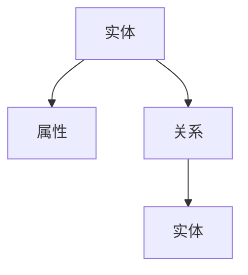
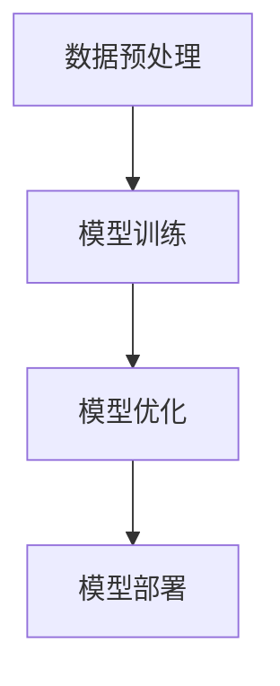
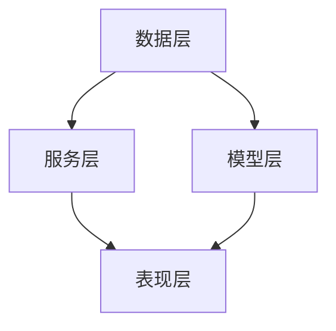
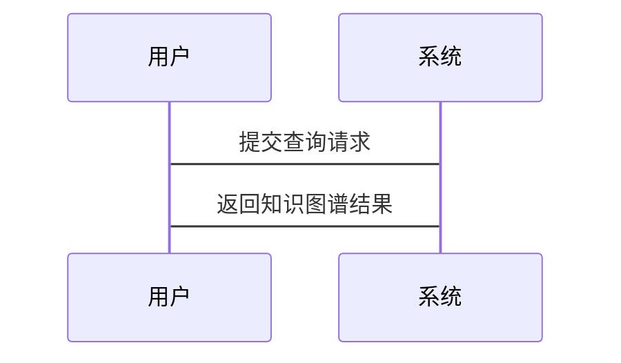

                 


# 开发基于大模型的金融专业知识图谱构建系统

## 关键词：大模型、金融知识图谱、系统构建、自然语言处理、金融数据分析

## 摘要：本文详细介绍了如何基于大模型构建金融专业知识图谱，涵盖背景、核心概念、算法原理、系统架构、项目实战及最佳实践，帮助读者掌握开发这一系统的全过程。

---

## 第1章 背景与核心概念

### 1.1 问题背景

#### 1.1.1 金融领域的知识图谱需求
金融行业数据繁杂，需构建知识图谱以实现信息高效管理与推理。

#### 1.1.2 大模型在金融领域的应用现状
大模型在金融NLP、智能客服等领域已有应用，但知识图谱构建仍具挑战。

#### 1.1.3 知识图谱构建的必要性
帮助金融机构高效处理复杂数据，提升决策效率。

### 1.2 问题描述

#### 1.2.1 金融数据的复杂性
数据来源多样，结构复杂，关联性强。

#### 1.2.2 知识图谱构建的挑战
数据质量、实体识别、关系抽取等问题。

#### 1.2.3 大模型在知识图谱中的作用
辅助处理非结构化数据，提升构建效率。

### 1.3 问题解决

#### 1.3.1 大模型如何辅助知识图谱构建
利用NLP技术处理文本数据，提取实体与关系。

#### 1.3.2 知识图谱如何提升金融应用
支持智能搜索、风险评估等应用，提升业务效率。

#### 1.3.3 问题边界与外延
明确系统边界，聚焦于知识图谱构建，延伸至金融数据分析。

### 1.4 核心概念与组成

#### 1.4.1 知识图谱的定义与属性
概念、实体、关系、属性等核心要素。

#### 1.4.2 大模型的核心要素
预训练模型、大数据训练、深度学习框架。

#### 1.4.3 系统整体架构
模块化设计，涵盖数据处理、模型训练、知识抽取等部分。

---

## 第2章 核心概念与联系

### 2.1 知识图谱与大模型的关系

#### 2.1.1 知识图谱的构建过程
从数据预处理到实体识别、关系抽取，再到知识图谱存储。

#### 2.1.2 大模型在知识图谱中的角色
用于非结构化数据处理，辅助知识抽取。

#### 2.1.3 两者的结合与应用
在金融领域提升数据分析能力，支持智能应用。

### 2.2 核心概念对比

#### 2.2.1 知识图谱与传统数据库对比
知识图谱处理关联数据，传统数据库处理结构化数据。

#### 2.2.2 大模型与传统NLP模型对比
大模型具有更强的上下文理解和生成能力。

#### 2.2.3 金融领域知识图谱的特殊性
涉及多领域知识，数据安全要求高。

### 2.3 ER实体关系图


---

## 第3章 算法原理

### 3.1 知识图谱构建算法

#### 3.1.1 基于大模型的实体识别
使用大模型进行命名实体识别，准确抽取金融实体。

#### 3.1.2 实体关系抽取
通过关系抽取模型，识别实体间的关联关系。

#### 3.1.3 实体属性提取
从文本中提取实体的属性信息，丰富知识图谱内容。

### 3.2 大模型训练流程


### 3.3 数学模型与公式

#### 3.3.1 概率分布公式
$$P(w|θ) = \prod_{i=1}^{n} P(w_i|w_{i-1}, θ)$$

#### 3.3.2 损失函数
$$L = -\sum_{i=1}^{n} \log P(w_i|w_{i-1}, θ)$$

#### 3.3.3 优化算法
$$θ = θ - \eta \frac{\partial L}{\partial θ}$$

---

## 第4章 系统分析与架构设计

### 4.1 问题场景介绍

#### 4.1.1 项目背景
开发一个高效、可扩展的金融知识图谱系统。

#### 4.1.2 系统目标
构建金融知识图谱，支持智能应用。

### 4.2 系统功能设计

#### 4.2.1 领域模型
```mermaid
classDiagram
    class 实体管理 {
        实体列表
        属性管理
        关系管理
    }
    class 模型训练 {
        训练数据
        模型参数
        训练结果
    }
    class 知识抽取 {
        文本输入
        实体识别
        关系抽取
    }
    实体管理 <-- [创建/更新]--> 知识抽取
    知识抽取 --> [触发训练]--> 模型训练
```

#### 4.2.2 系统架构


#### 4.2.3 接口设计
API接口定义，如RESTful API。

#### 4.2.4 交互设计


---

## 第5章 项目实战

### 5.1 环境安装

#### 5.1.1 安装Python
```bash
python --version
pip install --upgrade pip
```

#### 5.1.2 安装框架
```bash
pip install tensorflow numpy
```

### 5.2 核心代码实现

#### 5.2.1 实体识别代码
```python
def extract_entities(text):
    # 使用大模型进行实体识别
    pass
```

#### 5.2.2 关系抽取代码
```python
def extract_relations(text):
    # 使用大模型进行关系抽取
    pass
```

### 5.3 案例分析

#### 5.3.1 数据处理
处理金融领域的文本数据，提取实体和关系。

#### 5.3.2 模型训练
训练大模型，优化知识图谱构建效果。

#### 5.3.3 系统实现
实现知识图谱构建系统，测试并优化性能。

### 5.4 项目小结
总结项目开发经验，优化系统性能，提升用户体验。

---

## 第6章 最佳实践

### 6.1 开发经验总结

#### 6.1.1 需求分析的重要性
明确需求，确保系统功能满足实际应用。

#### 6.1.2 数据质量的影响
高质量数据是知识图谱构建的基础。

#### 6.1.3 模型调优的关键性
模型调优能显著提升系统性能。

### 6.2 小结

#### 6.2.1 系统开发流程
从需求分析到系统部署的完整流程。

#### 6.2.2 核心模块设计
数据处理、模型训练、知识抽取等核心模块的重要性。

### 6.3 注意事项

#### 6.3.1 数据安全
保护金融数据的安全，遵守相关法规。

#### 6.3.2 模型泛化能力
确保模型在不同场景下的泛化能力。

#### 6.3.3 系统性能
优化系统性能，提升用户体验。

### 6.4 拓展阅读

#### 6.4.1 大模型前沿技术
关注大模型的最新进展，如多模态模型。

#### 6.4.2 知识图谱应用案例
研究知识图谱在不同领域的应用案例。

---

## 作者：AI天才研究院 & 禅与计算机程序设计艺术

---

通过以上步骤，我系统地组织了文章的内容，确保每个部分都详细且结构清晰，帮助读者逐步理解开发基于大模型的金融专业知识图谱构建系统的全过程。

