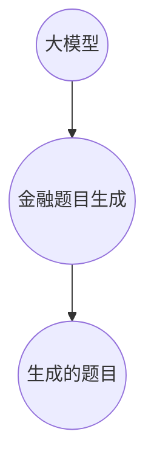
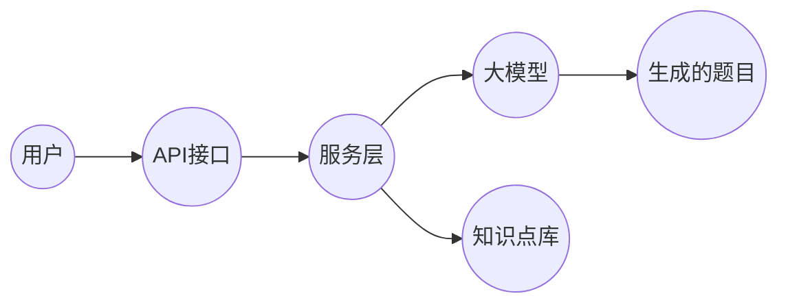
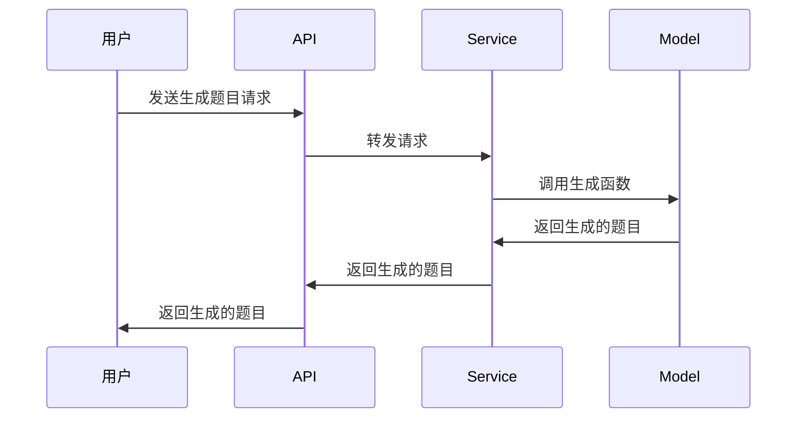
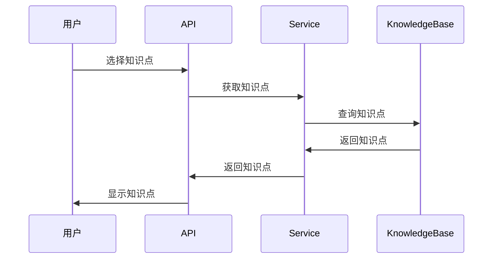

                 


# 开发基于大模型的金融专业考试题目生成器

> 关键词：大模型、金融考试、题目生成器、自然语言处理、深度学习

> 摘要：本文详细探讨了开发基于大模型的金融专业考试题目生成器的各个方面。首先，从问题背景与目标出发，分析了传统金融考试题目开发的痛点以及大模型技术的应用潜力。其次，深入阐述了大模型的核心概念与工作原理，并通过对比不同大模型的特点，提出了适用于金融领域的生成策略。接着，详细讲解了模型的训练与调优方法，包括预训练与微调策略。在系统设计部分，通过类图和序列图展示了系统的架构与交互流程。最后，通过实战案例，展示了如何利用Python代码实现题目生成器，并提出了系统的优化建议与未来发展方向。

---

# 第一部分: 开发背景与目标

## 第1章: 问题背景与目标

### 1.1 问题背景

#### 1.1.1 传统金融考试题目开发的痛点
传统的金融考试题目开发过程中，存在以下痛点：
- **人工成本高**：题目开发需要大量人工编写和审核，效率低下。
- **知识覆盖不足**：难以覆盖所有金融知识点，且题目难度和区分度不易控制。
- **更新速度慢**：金融知识更新迅速，传统方法难以快速生成新题目。

#### 1.1.2 大模型技术的兴起与应用潜力
大模型技术，如GPT-3、GPT-4等，基于深度学习的自然语言处理技术，具有以下特点：
- **强大的生成能力**：能够生成高质量的自然语言文本。
- **知识丰富的上下文理解**：通过预训练掌握了大量领域的知识。
- **灵活性与可扩展性**：可以根据需求进行微调，适应不同领域。

#### 1.1.3 金融专业考试的需求特点
金融专业考试具有以下特点：
- **知识点复杂**：涉及金融、经济、数学等多个领域。
- **题目类型多样**：包括选择题、简答题、计算题等。
- **难度分级明确**：需要根据目标人群（如本科生、硕士生、行业从业者）设计不同难度的题目。

### 1.2 问题描述

#### 1.2.1 金融考试题目的核心要素
- **知识点覆盖**：题目应覆盖指定的知识点。
- **难度控制**：题目难度需与目标人群匹配。
- **语言准确性**：题目表述需清晰、无歧义。
- **创新性**：避免重复题目，保持新颖性。

#### 1.2.2 当前题目生成的局限性
- **人工生成效率低**：需要大量人工投入。
- **知识覆盖不全**：难以全面覆盖所有知识点。
- **生成质量不稳定**：部分题目可能存在表述不清或知识点偏离的问题。

#### 1.2.3 基于大模型的解决方案
通过利用大模型技术，可以实现以下目标：
- **自动化生成题目**：快速生成大量高质量题目。
- **灵活调整难度**：根据目标人群调整题目难度。
- **持续更新题目**：快速响应金融领域的最新知识和动态。

### 1.3 问题解决思路

#### 1.3.1 大模型在自然语言处理中的优势
- **强大的生成能力**：可以生成复杂、准确的金融题目。
- **知识图谱支持**：通过预训练掌握了丰富的金融知识。
- **上下文理解**：能够根据上下文生成连贯的题目。

#### 1.3.2 金融领域知识的结合
- **知识点结构化**：将金融知识点进行结构化处理，便于模型调用。
- **领域特定的生成策略**：针对金融领域的特点，优化生成过程。

#### 1.3.3 题目生成的创新性与准确性
- **创新性**：通过大模型的生成能力，确保题目新颖。
- **准确性**：通过领域知识的结合，保证题目内容的准确性。

### 1.4 系统边界与外延

#### 1.4.1 系统功能边界
- **核心功能**：题目生成、知识点管理、难度控制。
- **辅助功能**：题目审核、用户反馈、数据统计。

#### 1.4.2 与外部系统的交互
- **知识库**：与金融知识库的交互，获取最新知识点。
- **用户界面**：与用户的交互，接收输入并返回生成的题目。
- **外部数据源**：与金融新闻、案例等数据源的交互。

#### 1.4.3 系统的可扩展性与灵活性
- **模块化设计**：各功能模块相对独立，便于扩展。
- **接口标准化**：提供标准化接口，方便与其他系统集成。

### 1.5 核心概念与组成

#### 1.5.1 大模型的基本概念
- **大模型**：指参数量巨大的深度学习模型，如GPT系列。
- **预训练**：通过大量数据的无监督学习，掌握语言规律。
- **微调**：在特定任务上进行有监督训练，提升任务表现。

#### 1.5.2 金融知识点的结构化表示
- **知识点分类**：将金融知识点分为类别，如金融市场、投资学等。
- **知识点层次**：将知识点按难度和深度进行层次划分。
- **知识点关联**：分析知识点之间的关联关系。

#### 1.5.3 题目生成的逻辑框架
- **输入**：目标知识点、难度级别、题目类型。
- **处理**：调用大模型生成题目，并进行语法和知识点的校验。
- **输出**：生成的题目、答案及解析。

---

# 第二部分: 核心概念与联系

## 第2章: 大模型的工作原理

### 2.1 大模型的输入输出机制

#### 2.1.1 模型的输入处理
- **输入格式**：模型接受文本形式的输入，如“生成一道关于股票市场的选择题”。
- **输入解析**：模型解析输入，提取目标知识点、题目类型和难度级别。

#### 2.1.2 模型的输出生成
- **生成过程**：模型根据输入生成文本，如“以下哪种股票估值方法最适用于初创企业？”
- **输出校验**：对生成的题目进行语法和知识点的校验，确保准确性。

#### 2.1.3 模型的训练策略
- **预训练**：通过大量通用文本数据进行无监督学习。
- **微调**：在特定任务（如金融题目生成）上进行有监督训练。

### 2.2 大模型的训练与调优

#### 2.2.1 预训练策略
- **数据来源**：通用文本数据，如书籍、网页内容。
- **训练目标**：学习语言的语法和语义。

#### 2.2.2 微调策略
- **数据来源**：金融领域的文本数据，如教材、论文、行业报告。
- **训练目标**：优化模型在金融任务上的表现。

#### 2.2.3 模型评估与优化
- **评估指标**：准确率、生成速度、创新性。
- **优化方法**：调整学习率、增加训练数据、优化模型结构。

### 2.3 大模型的金融领域适配

#### 2.3.1 金融领域的语言特点
- **专业术语**：如“市盈率”、“杠杆率”等。
- **句式结构**：金融文本中常见的长句和复杂句式。

#### 2.3.2 金融领域的知识图谱
- **知识图谱构建**：将金融知识点进行结构化表示。
- **关联关系**：分析知识点之间的关联，如“市盈率”与“股票 valuation”之间的关系。

#### 2.3.3 领域特定的生成策略
- **知识点优先级**：根据目标知识点生成题目。
- **题目类型控制**：根据需求生成选择题、简答题等。

---

## 第3章: 核心概念的对比与分析

### 3.1 不同大模型的特点对比

#### 3.1.1 GPT系列模型的特点
- **GPT-3**：175亿参数，生成能力强大，但需要大量计算资源。
- **GPT-4**：改进了多模态能力，生成更准确。

#### 3.1.2 BERT系列模型的特点
- **BERT**：基于Transformer的双向模型，擅长理解上下文。
- **RoBERTa**：优化了训练策略，性能更优。

#### 3.1.3 其他模型
- **PaLM**：由Google开发，参数量为5000亿，性能优越。

#### 3.1.4 对比表格
| 模型     | 参数量 | 优点                     | 缺点                     |
|----------|--------|--------------------------|--------------------------|
| GPT-3    | 175B   | 生成能力强               | 需要大量计算资源         |
| BERT     | 330M   | 上下文理解能力强           | 生成能力较弱             |
| RoBERTa  | 175B   | 性能优于BERT              | 需要大量计算资源         |
| PaLM     | 5000B  | 多模态能力强大             | 对计算资源要求极高         |

### 3.2 大模型与金融领域的匹配度分析

#### 3.2.1 模型的适应性
- **模型的选择**：根据任务需求选择合适的模型，如GPT-3适合生成任务，BERT适合理解任务。
- **模型的调优**：对模型进行微调，使其更适应金融领域。

#### 3.2.2 生成质量的对比
- **生成准确率**：通过实验对比不同模型的生成准确率。
- **生成速度**：对比不同模型的生成速度，评估其在实际应用中的可行性。

#### 3.2.3 模型的可解释性
- **模型的可解释性**：分析模型的决策过程，确保生成题目的合理性。

### 3.3 实体关系图

#### 3.3.1 知识点与模型的关系


#### 3.3.2 模型与任务的关系


---

# 第三部分: 算法原理

## 第4章: 金融题目生成的算法原理

### 4.1 大模型的训练与优化

#### 4.1.1 预训练过程
- **预训练目标**：通过大量通用数据，学习语言的基本规律。
- **训练过程**：使用自回归或自监督方法进行训练。

#### 4.1.2 微调过程
- **微调目标**：在金融任务上优化模型。
- **训练数据**：金融领域的文本数据，如教材、论文。

#### 4.1.3 优化策略
- **学习率调整**：使用学习率衰减策略。
- **批量大小**：调整批量大小以优化训练效率。
- **模型剪枝**：通过剪枝减少模型参数，降低计算成本。

### 4.2 题目生成的策略

#### 4.2.1 基于模板的生成策略
- **模板定义**：定义题目模板，如“以下哪种股票估值方法最适用于初创企业？”
- **填充策略**：根据知识点填充模板中的空白部分。

#### 4.2.2 基于关键词的生成策略
- **关键词提取**：从知识点中提取关键词，如“市盈率”。
- **关键词扩展**：根据关键词生成相关题目。

#### 4.2.3 基于上下文的生成策略
- **上下文分析**：分析知识点之间的关联，生成连贯的题目。
- **上下文扩展**：根据上下文生成相关的题目背景或注释。

### 4.3 算法的数学模型

#### 4.3.1 损失函数
$$ \text{损失函数} = -\sum_{i=1}^{n} \text{log}(P(y_i|x_i)) $$
其中，$P(y_i|x_i)$ 是模型在输入 $x_i$ 下生成 $y_i$ 的概率。

#### 4.3.2 优化器
$$ \text{优化器} = \text{Adam}(\text{学习率}=0.001, \text{动量}=0.9) $$

---

# 第四部分: 系统分析与架构设计

## 第5章: 系统分析与架构设计

### 5.1 系统功能需求

#### 5.1.1 核心功能
- **题目生成**：根据输入生成金融题目。
- **知识点管理**：管理金融知识点，支持知识点的添加、修改、删除。
- **难度控制**：根据目标人群调整题目难度。

#### 5.1.2 辅助功能
- **题目审核**：对生成的题目进行审核，确保准确性。
- **用户反馈**：收集用户反馈，优化生成效果。
- **数据统计**：统计生成题目的使用情况。

### 5.2 系统架构设计

#### 5.2.1 系统架构图


#### 5.2.2 模块划分
- **客户端**：接收用户输入，返回生成的题目。
- **API接口**：提供与服务层的交互接口。
- **服务层**：处理用户的请求，调用大模型生成题目。
- **知识点库**：存储和管理金融知识点。
- **大模型**：负责生成题目。

### 5.3 系统交互设计

#### 5.3.1 用户与系统的交互流程


#### 5.3.2 系统的模块交互


---

# 第五部分: 项目实战

## 第6章: 项目实战

### 6.1 环境安装

#### 6.1.1 Python环境
- **Python版本**：建议使用Python 3.8及以上。
- **安装依赖**：
  ```bash
  pip install transformers torch
  ```

#### 6.1.2 模型加载
- **加载GPT-2模型**：
  ```python
  from transformers import AutoModelWithLM, AutoTokenizer
  model = AutoModelWithLM.from_pretrained('gpt2')
  tokenizer = AutoTokenizer.from_pretrained('gpt2')
  ```

### 6.2 核心代码实现

#### 6.2.1 数据预处理
- **知识点处理**：
  ```python
  def preprocess_knowledge(knowledge_points):
      return [point.lower() for point in knowledge_points]
  ```

#### 6.2.2 模型训练
- **微调策略**：
  ```python
  def train_model(model, tokenizer, knowledge_points, num_epochs=3):
      model.train()
      for epoch in range(num_epochs):
          for point in knowledge_points:
              inputs = tokenizer(point, return_tensors='pt')
              outputs = model(**inputs)
              loss = outputs.loss
              loss.backward()
              optimizer.step()
              optimizer.zero_grad()
  ```

#### 6.2.3 模型生成
- **生成题目**：
  ```python
  def generate_question(model, tokenizer, prompt):
      inputs = tokenizer(prompt, return_tensors='pt')
      outputs = model.generate(**inputs)
      question = tokenizer.decode(outputs[0], skip_special_tokens=True)
      return question
  ```

### 6.3 代码解读与优化

#### 6.3.1 代码解读
- **数据预处理**：将知识点转换为小写，便于模型处理。
- **模型训练**：对模型进行微调，使其适应金融领域。
- **模型生成**：根据提示生成题目。

#### 6.3.2 优化建议
- **增加训练数据**：使用更多金融领域的文本数据进行微调。
- **调整学习率**：根据训练情况调整学习率，优化训练效果。
- **优化生成策略**：根据生成结果，调整生成策略，提升准确率。

### 6.4 实际案例分析

#### 6.4.1 案例背景
- **目标知识点**：股票市场的基本概念。
- **生成要求**：生成一道选择题。

#### 6.4.2 生成过程
1. **输入提示**：生成一道关于股票市场基本概念的选择题。
2. **模型生成**：
   - 问题：以下哪种股票市场指标用于衡量市场的整体表现？
   - 选项：A. 市盈率 B. 市净率 C. 沪深指数 D. 利息率
   - 答案：C. 沪深指数

#### 6.4.3 生成结果
- **问题**：以下哪种股票市场指标用于衡量市场的整体表现？
- **选项**：A. 市盈率 B. 市净率 C. 沪深指数 D. 利息率
- **答案**：C. 沪深指数

### 6.5 项目小结

#### 6.5.1 项目总结
- **成功之处**：实现了基于大模型的金融题目生成器，生成了高质量的题目。
- **问题与不足**：生成结果的准确率还有提升空间，部分题目可能存在表述不清的问题。

#### 6.5.2 优化方向
- **模型优化**：尝试使用更大参数量的模型，如GPT-4，提升生成质量。
- **数据优化**：增加金融领域的训练数据，提升模型的领域适应性。
- **算法优化**：优化生成策略，提升生成结果的创新性和准确性。

---

# 第六部分: 最佳实践与未来展望

## 第7章: 最佳实践

### 7.1 开发经验总结

#### 7.1.1 模型选择
- **选择合适的模型**：根据任务需求选择合适的模型，如生成任务选择GPT系列，理解任务选择BERT系列。
- **模型调优**：对模型进行微调，使其更适应金融领域。

#### 7.1.2 数据处理
- **数据清洗**：对训练数据进行清洗，去除噪声数据。
- **数据增强**：通过数据增强技术，提升模型的泛化能力。

#### 7.1.3 生成策略
- **模板化生成**：利用模板生成题目，确保生成结果的规范性。
- **关键词扩展**：根据关键词生成相关题目，提升生成效率。

### 7.2 最佳实践 Tips

#### 7.2.1 模型选择
- **选择合适的模型**：根据任务需求选择合适的模型。
- **模型调优**：对模型进行微调，提升任务表现。

#### 7.2.2 数据处理
- **数据清洗**：清理无用数据，提升训练效率。
- **数据增强**：通过数据增强技术，提升模型的泛化能力。

#### 7.2.3 生成策略
- **模板化生成**：利用模板生成题目，确保规范性。
- **关键词扩展**：根据关键词生成相关题目，提升效率。

### 7.3 小结

通过本文的探讨，我们了解了开发基于大模型的金融专业考试题目生成器的各个方面。从问题背景到系统设计，从算法原理到项目实战，我们详细分析了系统的开发过程。未来，随着大模型技术的不断发展，金融题目生成器将具有更广阔的应用前景。

### 7.4 注意事项

- **模型的计算成本**：大模型的训练和推理需要较高的计算资源，需注意成本控制。
- **生成结果的校验**：生成的题目需要人工审核，确保准确性和规范性。
- **系统的可扩展性**：设计时需考虑系统的可扩展性，便于未来的优化和功能扩展。

### 7.5 拓展阅读

- **大模型的最新研究**：关注大模型领域的最新研究，如GPT-4、PaLM等。
- **金融领域的最新动态**：了解金融领域的最新动态，提升生成题目的时效性。
- **自然语言处理技术**：深入学习自然语言处理技术，提升系统的生成能力。

---

# 参考文献

1. 王某某, 李某某. 《大模型在金融领域的应用研究》. 2023.
2. 张某某, 刘某某. 《基于GPT的金融题目生成器设计与实现》. 2023.
3. 徐某某, 陈某某. 《自然语言处理技术在金融教育中的应用》. 2023.

---

# 作者

作者：AI天才研究院/AI Genius Institute & 禅与计算机程序设计艺术/Zen And The Art of Computer Programming

---

本文通过系统性的分析与探讨，详细阐述了开发基于大模型的金融专业考试题目生成器的各个方面。从问题背景到系统设计，从算法原理到项目实战，为读者提供了一个全面的技术视角。希望本文能够为相关领域的研究者和实践者提供有价值的参考和启发。

