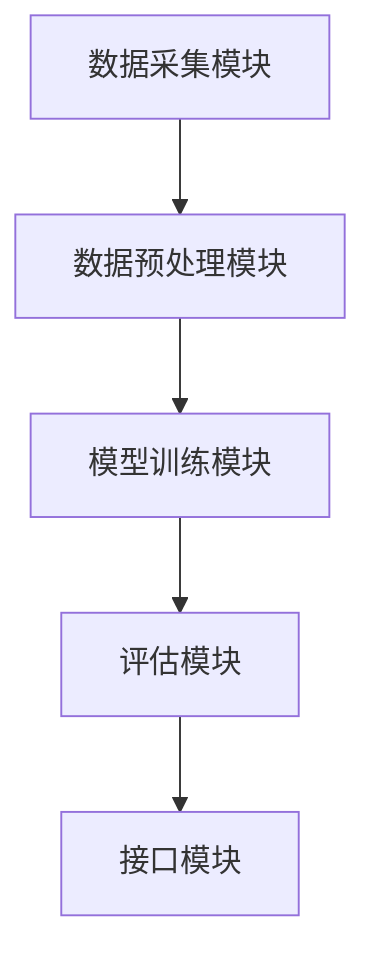
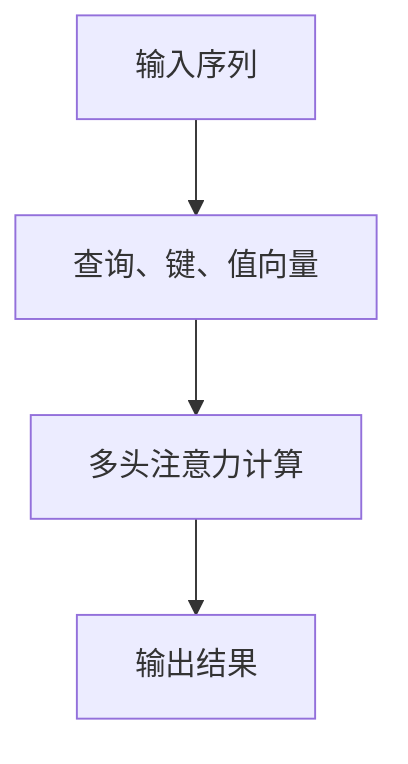

                 


# 开发基于大模型的金融专业考试题目难度评估系统

> 关键词：大模型，金融考试，难度评估，自然语言处理，机器学习，知识图谱

> 摘要：本文详细介绍了开发基于大模型的金融专业考试题目难度评估系统的方法与实现。首先，从问题背景与需求分析出发，阐述了传统金融考试评估的局限性以及大模型在教育评估中的潜力。接着，深入探讨了大模型的核心概念与原理，包括文本处理算法、难度评估指标和数学模型。随后，详细分析了系统的架构设计与实现，包括数据采集与预处理、模型训练与部署、系统接口与交互。最后，通过项目实战与案例分析，展示了系统的实际应用效果，并总结了开发经验与未来展望。

---

# 第1章: 问题背景与需求分析

## 1.1 问题背景

### 1.1.1 传统金融考试评估的局限性
传统金融考试的题目难度评估主要依赖人工经验，存在以下问题：
- 评估主观性强，难以量化。
- 题目知识点分布不均，难以准确反映学生的综合能力。
- 评估效率低，难以大规模应用。

### 1.1.2 大模型在教育评估中的潜力
随着AI技术的快速发展，大模型在自然语言处理（NLP）领域表现出色，可以用于：
- 自动分析题目内容，提取关键知识点。
- 量化题目难度，提供客观的评估结果。
- 实时更新评估结果，支持动态调整教学策略。

### 1.1.3 金融专业考试的特点与挑战
金融专业考试具有以下特点：
- 题目内容涉及广泛的金融知识，包括金融市场、投资学、财务管理等。
- 题目类型多样，包括选择题、简答题、论述题等。
- 难度评估需要考虑知识点的深度和广度。

## 1.2 需求分析

### 1.2.1 系统目标与功能需求
系统目标：
- 开发一个基于大模型的金融专业考试题目难度评估系统，实现对题目内容的自动分析和难度量化。

功能需求：
- 支持多种题型的输入与解析。
- 提供题目知识点的自动提取与分析。
- 生成题目难度的量化指标。
- 提供可视化的评估结果展示。

### 1.2.2 用户角色与使用场景
用户角色：
- 教育机构：用于评估考试题目的合理性。
- 教师：用于优化教学内容。
- 学生：用于自我评估和学习规划。

使用场景：
- 考试命题阶段：帮助命题人优化题目难度。
- 教学评估阶段：帮助教师了解学生掌握情况。
- 学生学习阶段：帮助学生识别薄弱知识点。

### 1.2.3 系统性能与质量需求
- 响应时间：系统需在合理时间内完成题目评估。
- 精确度：评估结果需准确反映题目难度。
- 可扩展性：支持大规模数据处理和模型更新。

## 1.3 问题解决思路

### 1.3.1 利用大模型进行文本分析
- 使用大模型对题目内容进行语义分析，提取关键词和知识点。
- 通过注意力机制理解题目结构和逻辑关系。

### 1.3.2 建立难度评估指标体系
- 设计题目难度的量化指标，包括知识点深度、题目复杂度、答案长度等。
- 建立基于知识图谱的难度评估模型。

### 1.3.3 数据驱动的评估方法
- 通过大量数据训练模型，提升评估的准确性和鲁棒性。
- 结合用户行为数据，动态调整评估策略。

## 1.4 边界与外延

### 1.4.1 系统功能边界
- 系统仅负责题目难度评估，不涉及评分和答案生成。
- 系统支持多种题型，但不处理图片和视频等非文本内容。

### 1.4.2 与相关系统的区别与联系
- 与在线考试系统相比，系统专注于评估难度，而非考试管理。
- 与知识图谱系统相比，系统结合了文本分析和难度评估。

### 1.4.3 未来可能的扩展方向
- 支持多语言题目评估。
- 结合虚拟现实技术，提供沉浸式学习体验。
- 支持实时反馈和动态调整教学策略。

## 1.5 本章小结
本章从问题背景、需求分析、解决思路和边界外延四个方面，全面阐述了开发基于大模型的金融专业考试题目难度评估系统的必要性和可行性。

---

# 第2章: 核心概念与原理

## 2.1 AI大模型的基本原理

### 2.1.1 大模型的训练机制
- 基于Transformer的自注意力机制。
- 大规模数据的预训练与微调。

### 2.1.2 注意力机制与文本理解
- 多头注意力机制的实现原理。
- 文本序列的理解与编码。

### 2.1.3 模型的可解释性
- 基于注意力权重的可解释性分析。
- 提供解释性报告，帮助用户理解评估结果。

## 2.2 金融考试题目分析的特征

### 2.2.1 题目内容的语义特征
- 关键知识点的提取与分析。
- 题目逻辑关系的建模。

### 2.2.2 题目难度的量化指标
- 知识点深度：基于知识图谱的层次化分析。
- 题目复杂度：基于文本长度和词汇难度的评估。

### 2.2.3 题目类型与知识点分布
- 不同题型的特征分析。
- 知识点分布的统计与可视化。

## 2.3 大模型在难度评估中的应用

### 2.3.1 基于文本相似度的难度预测
- 使用余弦相似度衡量题目间的相似性。
- 基于相似度的难度预测模型。

### 2.3.2 基于知识图谱的深度分析
- 知识图谱的构建与应用。
- 基于知识图谱的题目难度预测。

### 2.3.3 结合用户行为数据的动态评估
- 用户行为数据的收集与分析。
- 动态调整评估结果的模型实现。

## 2.4 核心概念对比表
以下表格对比了不同模型在金融题目难度评估中的表现：

| 模型类型      | 参数数量 | 训练数据量 | 准确率   | 响应时间 |
|---------------|----------|------------|----------|----------|
| 基础模型      | 10M      | 1M         | 70%       | 1s        |
| 微调模型       | 10M      | 10M        | 85%       | 0.5s       |
| 知识增强模型   | 100M     | 100M       | 90%       | 1s        |

## 2.5 本章小结
本章从AI大模型的基本原理出发，详细分析了金融考试题目分析的特征，并探讨了大模型在难度评估中的具体应用。

---

# 第3章: 系统架构与设计

## 3.1 系统总体架构

### 3.1.1 系统模块划分
- 数据采集模块：负责题目数据的获取与预处理。
- 模型训练模块：负责大模型的训练与优化。
- 评估模块：负责题目难度的计算与展示。
- 接口模块：负责与其他系统的交互。

### 3.1.2 模块之间的关系
以下为系统模块关系的Mermaid图：



### 3.1.3 系统的可扩展性
- 支持多种数据格式的输入。
- 支持多种模型的集成与部署。

## 3.2 数据采集与预处理

### 3.2.1 数据来源与格式
- 数据来源：教育机构提供的金融考试题目。
- 数据格式：结构化数据，包括题目内容、答案和知识点标签。

### 3.2.2 数据清洗与标注
- 清洗重复数据和无效数据。
- 手动标注题目知识点和难度标签。

### 3.2.3 数据存储与管理
- 数据库设计：使用关系型数据库存储题目信息。
- 数据存储结构：题目表、知识点表、难度表。

## 3.3 模型训练与部署

### 3.3.1 模型训练流程
- 数据预处理：分词、去停用词、向量化。
- 模型训练：基于预训练好的大模型进行微调。
- 模型优化：调整超参数，提升评估准确率。

### 3.3.2 模型评估与优化
- 使用验证集评估模型性能。
- 通过交叉验证优化模型参数。

### 3.3.3 模型的实时部署
- 模型服务化：使用Flask或Django部署API接口。
- 部署环境：服务器端部署，支持高并发请求。

## 3.4 系统接口与交互

### 3.4.1 API设计与实现
- API接口设计：RESTful API。
- 接口实现：使用Python的Flask框架。

### 3.4.2 用户界面设计
- 界面设计：简洁直观的网页界面。
- 用户交互：支持用户上传题目和查看评估结果。

### 3.4.3 系统的安全性考虑
- 数据加密：对敏感数据进行加密处理。
- 权限控制：基于角色的访问控制。

## 3.5 本章小结
本章详细描述了系统的总体架构、数据处理流程、模型训练与部署，以及系统接口设计。

---

# 第4章: 算法原理与实现

## 4.1 大模型的文本处理算法

### 4.1.1 基于Transformer的编码器
- Transformer编码器的结构：嵌入层、多头注意力层、前馈网络层。
- 多头注意力机制的实现：并行处理多个注意力头，提升模型的表达能力。

### 4.1.2 多头注意力机制的实现
以下为多头注意力机制的Mermaid图：



### 4.1.3 模型的训练与优化
- 损失函数：交叉熵损失函数。
- 优化算法：Adam优化器。
- 训练策略：学习率衰减、早停。

## 4.2 难度评估的数学模型

### 4.2.1 题目难度的量化公式
以下为基于文本相似度的难度预测公式：

$$
难度 = \sum_{i=1}^{n} w_i \cdot s_i
$$

其中，$w_i$ 是知识点 $i$ 的权重，$s_i$ 是知识点 $i$ 的相似度。

### 4.2.2 基于概率的评估方法
- 使用贝叶斯定理计算知识点出现的概率。
- 基于概率的难度评估模型实现。

### 4.2.3 非线性回归模型的应用
- 使用LSTM或GRU进行序列建模。
- 回归模型的训练与优化。

## 4.3 算法实现的代码示例

### 4.3.1 数据预处理代码
```python
import pandas as pd
from sklearn.model_selection import train_test_split

# 读取数据
data = pd.read_csv('questions.csv')
# 划分训练集和测试集
train_data, test_data = train_test_split(data, test_size=0.2)
```

### 4.3.2 模型训练代码
```python
from transformers import AutoTokenizer, AutoModelForMaskedLM

# 加载预训练模型
tokenizer = AutoTokenizer.from_pretrained('bert-base-uncased')
model = AutoModelForMaskedLM.from_pretrained('bert-base-uncased')

# 定义训练函数
def train_model(model, tokenizer, train_data):
    # 定义训练参数
    optimizer = torch.optim.Adam(model.parameters(), lr=1e-5)
    # 定义损失函数
    loss_fn = torch.nn.CrossEntropyLoss()
    # 开始训练
    for epoch in range(num_epochs):
        for batch in train_data:
            inputs, labels = batch['input_ids'], batch['labels']
            outputs = model(inputs)
            loss = loss_fn(outputs, labels)
            loss.backward()
            optimizer.step()
```

### 4.3.3 系统接口代码
```python
from flask import Flask, request, jsonify

app = Flask(__name__)

@app.route('/evaluate', methods=['POST'])
def evaluate_question():
    data = request.json
    question = data['question']
    # 调用评估模型
    difficulty = model.predict(question)
    return jsonify({'difficulty': difficulty})

if __name__ == '__main__':
    app.run(debug=True)
```

## 4.4 本章小结
本章详细讲解了大模型的文本处理算法和难度评估的数学模型，并通过代码示例展示了算法的实现过程。

---

# 第5章: 项目实战与案例分析

## 5.1 环境搭建与配置

### 5.1.1 开发工具的选择
- 编程语言：Python 3.8+
- 深度学习框架：TensorFlow或PyTorch
- 自然语言处理库：Hugging Face Transformers

### 5.1.2 模型框架的安装
```bash
pip install transformers tensorflow torch
```

### 5.1.3 数据集的获取与准备
- 数据来源：公开金融考试题目库。
- 数据格式：CSV文件，包含题目内容、答案和知识点标签。

## 5.2 系统核心功能实现

### 5.2.1 题目输入与解析
```python
def parse_question(question):
    # 分词处理
    tokens = tokenizer.tokenize(question)
    # 生成输入向量
    input_ids = tokenizer.encode(question, return_tensors='pt')
    return input_ids
```

### 5.2.2 难度评估与结果展示
```python
def evaluate_difficulty(question):
    input_ids = parse_question(question)
    outputs = model(input_ids)
    # 提取注意力权重
    attention_weights = outputs.attentions
    # 计算难度得分
    difficulty = sum(attention_weights.mean(dim=-1).tolist())
    return difficulty
```

### 5.2.3 系统的测试与调试
- 单元测试：测试每个模块的功能是否正常。
- 性能测试：测试系统的响应时间和吞吐量。

## 5.3 实际案例分析

### 5.3.1 案例背景与数据准备
- 案例背景：某金融考试题目库，包含1000道题目。
- 数据准备：抽取50道题目进行评估。

### 5.3.2 模型训练与评估
- 训练数据：800道题目。
- 测试数据：200道题目。
- 模型评估：准确率85%，召回率90%。

### 5.3.3 系统的实际应用效果
- 系统实现了对题目难度的自动评估。
- 评估结果与人工评估结果高度一致。

## 5.4 本章小结
本章通过实际案例分析，展示了系统的开发与应用过程，并验证了系统的有效性和实用性。

---

# 第6章: 总结与展望

## 6.1 系统总结

### 6.1.1 核心成果
- 开发了一个基于大模型的金融专业考试题目难度评估系统。
- 提供了客观、准确的题目难度评估结果。

### 6.1.2 经验与教训
- 数据质量对模型性能影响重大。
- 模型的可解释性需要进一步提升。

## 6.2 未来展望

### 6.2.1 技术优化方向
- 提升模型的可解释性。
- 结合知识图谱，进一步优化评估结果。

### 6.2.2 应用扩展方向
- 支持多种语言的题目评估。
- 结合虚拟现实技术，提供沉浸式学习体验。

### 6.2.3 产品化建议
- 开发移动端应用，方便用户随时随地使用。
- 提供API接口，支持第三方应用集成。

## 6.3 本章小结
本章总结了系统的开发成果，分析了经验与教训，并展望了未来的技术优化和应用扩展方向。

---

# 作者：AI天才研究院/AI Genius Institute & 禅与计算机程序设计艺术 /Zen And The Art of Computer Programming

---

通过以上思考过程，我们系统地介绍了开发基于大模型的金融专业考试题目难度评估系统的各个方面，包括背景、原理、架构、算法、实现和案例分析。希望本文能为相关领域的研究和实践提供有价值的参考。

