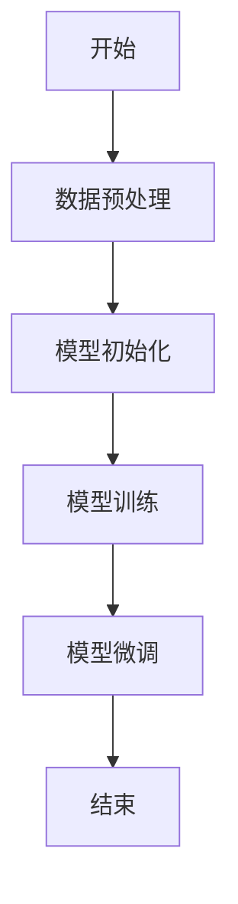
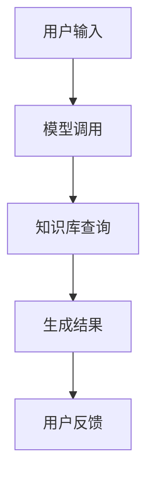

                 


# 开发基于大模型的金融专业论文写作辅助系统

## 关键词：
AI大模型，金融论文，写作辅助，NLP技术，系统架构，算法原理

## 摘要：
随着人工智能技术的快速发展，生成式AI在学术写作中的应用越来越广泛。本文探讨如何利用大模型开发金融专业论文写作辅助系统，从系统背景、核心概念、算法原理到系统架构、项目实战，全面解析系统的开发过程与实现细节。文章还结合实际案例，展示系统的功能与优势，并总结开发经验与未来发展方向。

---

# 第一部分: 开发背景与需求分析

## 第1章: 问题背景与需求分析

### 1.1 问题背景
#### 1.1.1 金融领域的论文写作挑战
金融领域的论文写作具有高度的专业性和复杂性。论文作者需要处理大量复杂的金融术语、引用最新研究文献，并确保论文结构符合学术规范。然而，许多研究人员在论文写作过程中面临以下挑战：
- 知识更新速度快，难以及时获取最新研究动态。
- 论文结构复杂，包括引言、文献综述、研究方法、数据分析与结论等部分。
- 需要反复修改与优化，以满足期刊或会议的投稿要求。

#### 1.1.2 AI大模型在学术写作中的潜力
生成式AI（如GPT系列模型）具有强大的自然语言生成能力，能够帮助作者快速生成论文草稿、优化语言表达、提供建议和改进。金融领域的论文写作辅助系统可以通过大模型实现以下功能：
- 自动生成论文摘要。
- 提供文献综述的写作建议。
- 帮助设计实验方法与数据分析框架。
- 优化论文语言表达，确保符合学术规范。

#### 1.1.3 金融专业论文的特点与复杂性
金融专业论文的特点包括：
- 高度专业性：涉及金融理论、经济模型、数据分析等。
- 结构复杂性：论文需要包含引言、文献综述、研究方法、数据分析、结论与建议等部分。
- 知识更新快：金融领域的研究热点和技术方法不断变化。

### 1.2 问题描述
#### 1.2.1 传统论文写作的痛点
传统论文写作过程中，作者需要花费大量时间在以下几个方面：
- 撰写引言和文献综述，需要广泛阅读和整理文献。
- 设计研究方法和数据分析框架，需要反复修改和优化。
- 语言表达不够流畅，需要多次修改以符合学术规范。

#### 1.2.2 基于大模型的论文写作辅助系统的必要性
随着生成式AI的快速发展，利用大模型开发论文写作辅助系统，可以显著提高论文写作的效率和质量。系统可以通过以下方式帮助作者：
- 自动生成论文摘要和引言。
- 提供文献综述的写作建议。
- 帮助设计实验方法与数据分析框架。
- 优化论文语言表达，确保符合学术规范。

#### 1.2.3 系统的目标与边界
系统的目标是通过大模型提供金融专业论文写作的辅助功能，帮助作者提高写作效率和质量。系统的主要功能包括：
- 论文主题分析与建议。
- 文献综述生成与优化。
- 论文结构优化与建议。
- 语言表达优化与润色。

系统的边界包括：
- 不直接参与数据收集与分析，但可以提供数据分析框架的设计建议。
- 不直接生成数据，但可以提供实验方法的设计建议。

### 1.3 问题解决
#### 1.3.1 基于大模型的解决方案
利用大模型开发论文写作辅助系统，可以通过以下步骤解决问题：
1. 数据预处理：收集金融领域的学术论文数据，构建领域知识库。
2. 模型训练：基于领域知识库，对大模型进行微调，使其适应金融论文写作的需求。
3. 系统开发：开发用户友好的写作辅助界面，集成大模型的生成能力。

#### 1.3.2 系统的功能定位
系统的核心功能包括：
- 论文主题分析：基于用户输入的主题，生成相关研究方向的建议。
- 文献综述生成：根据用户提供的参考文献，生成文献综述的初稿。
- 论文结构优化：根据论文主题和目标，提供论文结构的建议。
- 语言优化：优化论文的语言表达，使其更符合学术规范。

#### 1.3.3 系统的用户群体与应用场景
系统的用户群体主要为金融领域的研究人员、研究生和期刊编辑。应用场景包括：
- 论文初稿生成：帮助作者快速生成论文初稿。
- 文献综述优化：帮助作者优化文献综述部分。
- 论文结构优化：帮助作者设计合理的论文结构。
- 语言润色：帮助作者优化论文的语言表达。

---

# 第二部分: 核心概念与联系

## 第2章: 核心概念与联系

### 2.1 大模型的基本原理
#### 2.1.1 生成式AI的原理
生成式AI（如GPT系列模型）基于Transformer架构，通过自注意力机制和前馈网络生成文本。模型的核心思想是利用大规模数据的统计规律，生成与输入上下文相关的新文本。

#### 2.1.2 大模型的训练与推理机制
大模型的训练过程包括以下步骤：
1. 数据预处理：将文本数据转换为模型可接受的格式。
2. 模型初始化：随机初始化模型参数。
3. 模型训练：通过最小化预测损失函数，优化模型参数。
4. 模型推理：利用训练好的模型生成文本。

#### 2.1.3 大模型在NLP中的应用
大模型在NLP中的主要应用包括文本生成、文本摘要、问答系统和机器翻译。在论文写作辅助系统中，文本生成和文本摘要功能尤为重要。

### 2.2 金融领域的知识体系
#### 2.2.1 金融领域的核心概念
金融领域的核心概念包括：
- 股票、债券、基金等金融工具。
- 资本市场、货币市场等金融市场。
- 风险管理、投资组合优化等金融理论。

#### 2.2.2 金融论文的结构特点
金融论文的结构通常包括：
1. 引言：介绍研究背景、研究问题和研究目标。
2. 文献综述：总结相关领域的研究进展。
3. 研究方法：描述研究方法和数据来源。
4. 数据分析：展示数据分析结果。
5. 结论与建议：总结研究发现并提出政策建议。

#### 2.2.3 金融术语与专业表达
金融论文中常用的术语包括：
- 收益率（Return）：资产在一定时间内的收益。
- 风险（Risk）：资产收益的不确定性。
- 投资组合（Portfolio）：多种资产的集合。

### 2.3 系统的核心要素
#### 2.3.1 大模型的调用与适配
系统需要调用大模型的API，实现文本生成功能。为了适应金融领域的特殊需求，需要对模型进行微调，使其生成的文本更符合金融论文的风格。

#### 2.3.2 金融知识库的构建
金融知识库是系统的核心资源，包括金融术语、研究方法、数据分析工具等。知识库可以通过爬取学术论文和整理行业报告构建。

#### 2.3.3 系统的用户交互界面
系统的用户交互界面需要简洁直观，方便用户输入论文主题和相关参数，输出论文写作的建议和优化方案。

---

## 第3章: 算法原理与数学模型

### 3.1 大模型的训练过程
#### 3.1.1 数据预处理
数据预处理包括：
- 分词：将文本数据分割成单词或短语。
- 填充：将不同长度的文本填充为相同的长度。
- 词表映射：将文本映射到模型的词表中。

#### 3.1.2 模型初始化
模型初始化包括：
- 初始化模型参数：随机初始化模型的权重和偏置。
- 初始化优化器：选择合适的优化器（如Adam）并初始化参数。

#### 3.1.3 模型训练
模型训练包括：
- 前向传播：将输入数据输入模型，计算输出结果。
- 损失计算：计算预测结果与真实结果的损失。
- 反向传播：通过反向传播算法计算梯度，并更新模型参数。

#### 3.1.4 模型微调
为了适应金融领域的特殊需求，需要对模型进行微调。微调过程包括：
- 数据预处理：收集金融领域的文本数据。
- 模型加载：加载预训练好的大模型。
- 微调训练：在金融领域数据上进行小批量训练，优化模型参数。

### 3.2 生成式AI的数学模型
#### 3.2.1 变量与参数
生成式AI的数学模型包括以下变量和参数：
- 输入序列：$x_1, x_2, \ldots, x_n$
- 输出序列：$y_1, y_2, \ldots, y_m$
- 模型参数：$\theta$

#### 3.2.2 概率分布
生成式AI基于概率分布生成文本。模型通过计算条件概率$P(y|x)$生成输出序列。

#### 3.2.3 损失函数
生成式AI的损失函数通常采用交叉熵损失函数：
$$
\text{Loss} = -\sum_{i=1}^{n} \log P(y_i|x_{<i})
$$

### 3.3 算法流程图


---

## 第4章: 系统分析与架构设计

### 4.1 系统应用场景
系统的主要应用场景包括：
1. 论文主题分析：帮助用户确定研究方向。
2. 文献综述生成：根据用户提供的参考文献，生成文献综述的初稿。
3. 论文结构优化：根据论文主题和目标，提供论文结构的建议。
4. 语言优化：优化论文的语言表达，使其更符合学术规范。

### 4.2 系统功能设计
#### 4.2.1 功能模块
系统功能模块包括：
- 用户输入模块：接收用户的输入，如论文主题和参考文献。
- 模型调用模块：调用大模型生成文本。
- 知识库查询模块：查询金融领域的知识库。
- 用户反馈模块：接收用户的反馈，优化生成结果。

#### 4.2.2 功能流程


### 4.3 系统架构设计
#### 4.3.1 分层架构
系统采用分层架构，包括：
- 数据层：存储金融领域的学术论文数据。
- 计算层：调用大模型进行文本生成。
- 应用层：实现用户交互界面和功能模块。

#### 4.3.2 模块化设计
系统模块化设计包括：
- 输入模块：接收用户的输入。
- 输出模块：展示生成结果。
- 管理模块：管理系统的运行状态。

### 4.4 系统交互设计
系统交互设计包括：
- 用户输入论文主题。
- 系统调用大模型生成论文摘要。
- 用户查看生成结果并提出修改建议。
- 系统根据用户反馈优化生成结果。

---

## 第5章: 项目实战

### 5.1 环境安装
#### 5.1.1 安装Python
安装Python 3.8或更高版本：
```bash
python --version
```

#### 5.1.2 安装依赖库
安装必要的依赖库：
```bash
pip install transformers
pip install torch
```

### 5.2 核心代码实现
#### 5.2.1 加载大模型
```python
from transformers import AutoTokenizer, AutoModelForCausalLM
tokenizer = AutoTokenizer.from_pretrained("gpt2")
model = AutoModelForCausalLM.from_pretrained("gpt2")
```

#### 5.2.2 处理用户输入
```python
def process_input(input_text):
    inputs = tokenizer(input_text, return_tensors="pt")
    input_ids = inputs.input_ids
    attention_mask = inputs.attention_mask
    return input_ids, attention_mask
```

#### 5.2.3 生成输出
```python
def generate_output(model, tokenizer, input_ids, attention_mask, max_length=50):
    outputs = model.generate(
        input_ids=input_ids,
        attention_mask=attention_mask,
        max_length=max_length,
        do_sample=True,
        temperature=0.7,
        top_k=50
    )
    return tokenizer.decode(outputs[0], skip_special_tokens=True)
```

### 5.3 代码解读
- 加载大模型：使用Hugging Face的`transformers`库加载GPT-2模型。
- 处理用户输入：将用户输入转换为模型可接受的格式。
- 生成输出：基于用户输入生成文本，设置生成长度和采样参数。

### 5.4 案例分析
用户输入：`"金融市场的波动性分析"`
系统输出：`"金融市场的波动性分析是金融学中的重要研究方向。本文将从以下几个方面展开研究：（1）金融市场波动性的定义与测量；（2）影响金融市场波动性的主要因素；（3）金融市场波动性的预测方法。"`

### 5.5 项目小结
通过实际案例，展示了系统的核心功能，包括论文主题分析和文献综述生成。系统的实现基于生成式AI和领域知识库的结合，能够显著提高论文写作的效率和质量。

---

## 第6章: 最佳实践与小结

### 6.1 开发经验总结
#### 6.1.1 模型选择
在选择大模型时，需要考虑模型的生成能力、训练效率和适用性。对于金融领域的论文写作辅助系统，建议选择GPT系列模型。

#### 6.1.2 数据处理
数据预处理是系统开发的关键步骤。需要对金融领域的学术论文进行分类和标注，构建高质量的知识库。

#### 6.1.3 系统优化
系统优化包括模型调优和用户界面优化。模型调优可以通过微调和超参数优化实现；用户界面优化可以通过用户反馈实现。

### 6.2 系统总结
本文详细介绍了开发基于大模型的金融专业论文写作辅助系统的背景、核心概念、算法原理、系统架构和项目实战。通过实际案例展示了系统的功能与优势。

### 6.3 未来展望
未来的发展方向包括：
- 模型优化：进一步优化模型的生成能力，提高文本的质量。
- 功能扩展：增加更多的功能模块，如数据可视化和实验设计。
- 应用场景扩展：将系统应用于更多领域，如法律和医学领域。

---

## 结论与展望

开发基于大模型的金融专业论文写作辅助系统是一项具有重要意义的工程。通过结合生成式AI和金融领域的知识体系，系统能够显著提高论文写作的效率和质量。未来，随着大模型技术的不断发展，系统的功能和性能将进一步优化，为学术研究提供更强大的支持。

---

## 作者：AI天才研究院/AI Genius Institute & 禅与计算机程序设计艺术 /Zen And The Art of Computer Programming

作者邮箱：[email]

