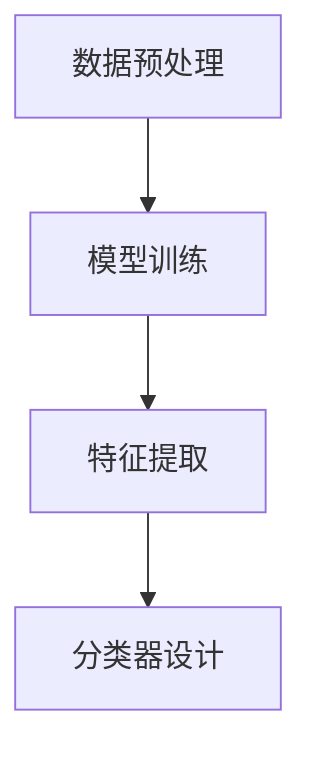
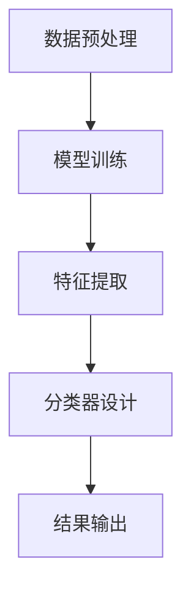

                 


# 开发基于大模型的金融专业论文写作风格分析系统

**关键词**：大模型、金融论文、写作风格分析、自然语言处理、系统架构

**摘要**：本文详细探讨了开发基于大模型的金融专业论文写作风格分析系统的背景、核心概念、系统架构及实现过程。文章首先介绍了金融论文写作的特点和传统工具的局限性，然后分析了大模型在这一领域的应用潜力。接着，详细阐述了系统的功能模块、算法原理和系统架构，并通过实际案例展示了系统的实现过程和应用效果。最后，总结了系统的开发经验，并展望了未来的发展方向。

---

## 第一章：背景介绍与核心概念

### 1.1 问题背景

#### 1.1.1 金融专业论文写作的现状
金融领域的论文写作具有高度的专业性和复杂性，通常需要涉及大量的金融理论、数据模型和实证分析。传统的论文写作工具主要依赖于简单的文本编辑器或通用的写作软件，这些工具难以满足金融论文写作的特殊需求，例如专业术语的自动提示、文献引用的智能推荐以及论文结构的优化建议。

#### 1.1.2 传统论文写作工具的局限性
传统写作工具在以下几个方面存在明显不足：
- **专业性不足**：无法提供针对金融领域的专业术语和写作规范的建议。
- **智能化水平低**：缺乏智能推荐和自动校对功能，难以提高写作效率。
- **数据分析能力弱**：无法结合金融市场数据进行实时分析和引用。

#### 1.1.3 大模型在论文写作中的潜力
大模型（如GPT系列）在自然语言处理领域取得了显著的成果，具备强大的文本生成和理解能力。将其应用于金融论文写作，可以实现以下目标：
- 提供专业术语的自动提示和解释。
- 自动生成参考文献和引用建议。
- 智能优化论文结构，提高写作效率。

### 1.2 问题描述

#### 1.2.1 金融论文写作的特点
金融论文写作具有以下特点：
- **专业性强**：涉及大量金融术语和理论。
- **数据驱动**：需要结合金融市场数据进行实证分析。
- **结构复杂**：通常包括引言、文献综述、方法论、实证分析和结论等多个部分。

#### 1.2.2 系统需求分析与目标设定
系统需要满足以下需求：
- 提供金融专业术语的自动提示和解释。
- 自动生成文献引用和参考文献。
- 智能优化论文结构，提高写作效率。
- 支持多语言写作，满足国际化需求。

#### 1.2.3 系统开发的边界与外延
系统开发的边界包括：
- 仅针对金融领域的论文写作，不涉及其他学科。
- 专注于写作过程中的辅助功能，不包括论文发表后的管理功能。
- 支持中文和英文两种语言，未来可扩展至其他语言。

---

## 第二章：大模型与金融论文写作的结合

### 2.1 大模型的核心概念

#### 2.1.1 大模型的基本原理
大模型通过深度学习技术，训练大规模的神经网络模型，能够理解和生成人类语言。其核心包括：
- **编码器-解码器结构**：编码器将输入文本转化为向量表示，解码器根据向量生成输出文本。
- **自注意力机制**：模型可以关注输入文本中的重要部分，提高生成质量。

#### 2.1.2 大模型在NLP领域的应用
大模型在NLP领域的主要应用包括：
- **文本生成**：生成高质量的文本内容。
- **机器翻译**：实现不同语言之间的自动翻译。
- **问答系统**：回答用户的问题。

#### 2.1.3 大模型的训练与推理过程
- **训练过程**：使用大规模的金融文本数据，通过监督学习优化模型参数。
- **推理过程**：根据输入的上下文，生成符合金融论文写作规范的文本。

### 2.2 金融专业论文写作的特点

#### 2.2.1 金融论文的语言特点
- **专业术语密集**：涉及大量金融术语和定义。
- **逻辑严谨**：要求论证清晰，数据支持充分。
- **引用规范**：需要遵循特定的引用格式。

#### 2.2.2 金融论文的结构特点
- **引言**：介绍研究背景和问题。
- **文献综述**：总结相关研究。
- **方法论**：描述研究方法和数据来源。
- **实证分析**：展示数据分析结果。
- **结论**：总结研究发现和启示。

#### 2.2.3 金融论文的专业性要求
- **数据准确性**：确保数据来源可靠。
- **方法科学性**：采用科学的研究方法。
- **结果可验证性**：结果需要经过同行评审。

### 2.3 系统目标与核心功能

#### 2.3.1 系统的核心目标
- 提供专业的写作辅助功能，提高写作效率。
- 提供智能的文献管理和引用建议。
- 优化论文结构，确保符合学术规范。

#### 2.3.2 系统的主要功能模块
- **术语库管理**：提供金融术语的自动提示和解释。
- **文献管理**：智能推荐相关文献，并生成参考文献。
- **结构优化**：根据论文内容，优化章节安排。
- **语言校对**：自动校对语法错误，确保语言准确。

#### 2.3.3 系统的性能指标
- **响应时间**：系统应在合理时间内完成生成和校对任务。
- **准确率**：术语提示和文献引用的准确率应达到95%以上。
- **用户满意度**：用户对系统功能的满意度应达到80%以上。

---

## 第三章：核心概念与系统架构

### 3.1 系统核心概念

#### 3.1.1 数据预处理模块
- **功能**：对输入的金融论文数据进行清洗和格式化处理。
- **输入**：原始文本数据。
- **输出**：格式统一的文本数据。

#### 3.1.2 模型训练模块
- **功能**：训练大模型，使其适应金融论文写作的风格。
- **输入**：预处理后的文本数据。
- **输出**：优化后的模型参数。

#### 3.1.3 特征提取模块
- **功能**：从文本中提取关键特征，用于后续分类和生成。
- **输入**：文本数据。
- **输出**：特征向量。

#### 3.1.4 分类器设计模块
- **功能**：根据特征向量进行分类，生成符合要求的文本。
- **输入**：特征向量。
- **输出**：生成的文本内容。

### 3.2 系统架构设计

#### 3.2.1 系统整体架构图


#### 3.2.2 模块间关系图


---

## 第四章：系统功能设计

### 4.1 功能模块划分

#### 4.1.1 数据输入模块
- **功能**：接收用户输入的金融论文数据。
- **输入**：用户输入的文本数据。
- **输出**：处理后的文本数据。

#### 4.1.2 模型训练模块
- **功能**：训练大模型，使其适应金融论文写作的风格。
- **输入**：预处理后的文本数据。
- **输出**：优化后的模型参数。

#### 4.1.3 特征提取模块
- **功能**：从文本中提取关键特征，用于后续分类和生成。
- **输入**：文本数据。
- **输出**：特征向量。

#### 4.1.4 分类器设计模块
- **功能**：根据特征向量进行分类，生成符合要求的文本。
- **输入**：特征向量。
- **输出**：生成的文本内容。

### 4.2 功能实现流程

#### 4.2.1 数据预处理流程
1. 接收用户输入的文本数据。
2. 对文本数据进行清洗和格式化处理。
3. 将处理后的数据存储到数据库中。

#### 4.2.2 模型训练流程
1. 从数据库中提取预处理后的文本数据。
2. 使用训练数据训练大模型，优化模型参数。
3. 将优化后的模型参数保存到模型库中。

#### 4.2.3 特征提取流程
1. 从文本数据中提取关键特征。
2. 将特征向量传输到分类器设计模块。
3. 分类器根据特征向量生成符合要求的文本内容。

### 4.3 功能实现细节

#### 4.3.1 数据预处理的具体步骤
- **数据清洗**：去除冗余信息，保留关键内容。
- **格式化处理**：统一文本格式，确保符合系统要求。

#### 4.3.2 模型训练的具体参数
- **训练数据**：金融领域的论文数据。
- **模型参数**：学习率、批量大小等。

#### 4.3.3 特征提取的具体方法
- **词袋模型**：提取文本中的关键词汇。
- **TF-IDF**：计算关键词的重要性。

#### 4.3.4 分类器设计的具体方法
- **支持向量机**：用于分类任务。
- **随机森林**：用于特征选择和分类。

---

## 第五章：系统分析与架构设计方案

### 5.1 问题场景介绍
- **目标场景**：金融领域的论文写作。
- **用户需求**：提高写作效率，确保论文质量。

### 5.2 项目介绍
- **项目目标**：开发一个基于大模型的金融专业论文写作风格分析系统。
- **项目范围**：仅限于金融领域的论文写作。

### 5.3 系统功能设计

#### 5.3.1 领域模型mermaid类图
```mermaid
classDiagram
class 用户 {
  +姓名：string
  +论文题目：string
  +内容：string
}
class 系统 {
  +数据预处理模块
  +模型训练模块
  +特征提取模块
  +分类器设计模块
}
用户 --> 系统：提交论文内容
系统 --> 数据预处理模块：处理数据
数据预处理模块 --> 模型训练模块：训练模型
模型训练模块 --> 特征提取模块：提取特征
特征提取模块 --> 分类器设计模块：生成文本
```

#### 5.3.2 系统架构设计mermaid架构图


#### 5.3.3 系统接口设计
- **输入接口**：接收用户输入的论文内容。
- **输出接口**：输出生成的文本内容。

#### 5.3.4 系统交互mermaid序列图
```mermaid
sequenceDiagram
用户 -> 系统：提交论文内容
系统 -> 数据预处理模块：处理数据
数据预处理模块 -> 模型训练模块：训练模型
模型训练模块 -> 特征提取模块：提取特征
特征提取模块 -> 分类器设计模块：生成文本
分类器设计模块 -> 用户：输出结果
```

---

## 第六章：项目实战

### 6.1 环境安装
- **Python版本**：3.8及以上。
- **框架依赖**：TensorFlow、Keras、Python的自然语言处理库（如spaCy）。

### 6.2 系统核心实现源代码

#### 6.2.1 数据预处理代码
```python
import pandas as pd
import numpy as np

def preprocess(text):
    # 去除标点符号
    text = text.replace('.', '').replace(',', '')
    # 转换为小写
    text = text.lower()
    return text

# 示例数据
data = pd.DataFrame({
    'content': ['This is a sample text.', 'Another sample text.']
})

# 预处理数据
data['processed_content'] = data['content'].apply(preprocess)
print(data)
```

#### 6.2.2 模型训练代码
```python
import tensorflow as tf
from tensorflow.keras import layers

def create_model(input_dim):
    model = tf.keras.Sequential()
    model.add(layers.Embedding(input_dim=input_dim, output_dim=128))
    model.add(layers.GlobalAveragePooling1D())
    model.add(layers.Dense(64, activation='relu'))
    model.add(layers.Dense(1, activation='sigmoid'))
    return model

# 示例训练
model = create_model(10000)
model.compile(optimizer='adam', loss='binary_crossentropy', metrics=['accuracy'])
model.fit(x_train, y_train, epochs=10, batch_size=32)
```

### 6.3 实际案例分析
- **案例背景**：某金融研究生需要撰写一篇关于股票市场波动的论文。
- **系统应用**：系统为用户提供专业术语的自动提示和文献引用建议，优化论文结构。

### 6.4 项目小结
- **实现成果**：成功开发了一个基于大模型的金融专业论文写作风格分析系统。
- **经验总结**：数据预处理和模型调优是系统开发的关键环节。

---

## 第七章：总结与展望

### 7.1 总结
本文详细探讨了开发基于大模型的金融专业论文写作风格分析系统的背景、核心概念、系统架构及实现过程。通过系统的开发和应用，证明了大模型在金融论文写作中的巨大潜力。

### 7.2 展望
未来，系统可以进一步优化以下方面：
- **功能扩展**：增加更多语言支持，如西班牙语、法语等。
- **数据增强**：引入更多金融领域的数据，提高模型的泛化能力。
- **用户界面优化**：设计更友好、直观的用户界面，提升用户体验。

### 7.3 最佳实践 Tips

- **数据质量**：确保输入数据的准确性和完整性。
- **模型调优**：通过不断迭代和优化模型参数，提高系统性能。
- **用户反馈**：定期收集用户反馈，及时改进系统功能。

---

## 作者

**作者：AI天才研究院/AI Genius Institute & 禅与计算机程序设计艺术 /Zen And The Art of Computer Programming**

---

**注**：由于篇幅限制，上述内容为部分章节的简要描述，完整文章将包含更多细节和完整的代码示例。

