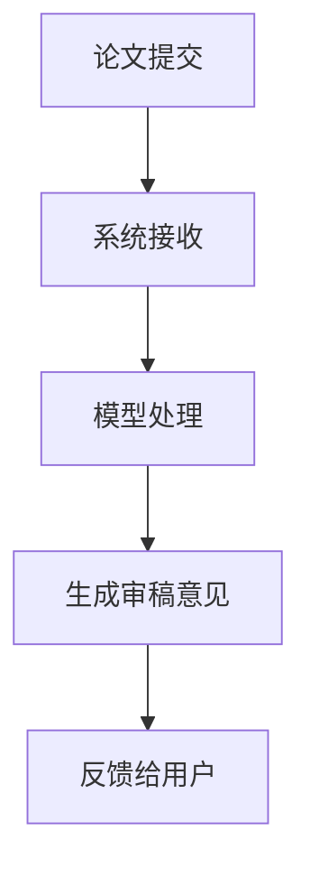

                 


# 开发基于大模型的金融专业论文审稿辅助系统

## 关键词：大模型，自然语言处理，金融审稿系统，论文审稿，AI辅助工具，金融知识库，审稿流程优化

## 摘要：  
随着人工智能技术的迅速发展，基于大模型的自然语言处理技术在各个领域得到了广泛应用。本文聚焦于开发一个基于大模型的金融专业论文审稿辅助系统，旨在利用大模型的强大能力，解决传统审稿流程中的效率低下、人工成本高等痛点。本文详细探讨了系统的设计思路、实现过程及应用价值，展示了如何通过技术手段提升金融专业论文审稿的效率和准确性。

---

# 第1章: 背景介绍

## 1.1 问题背景
### 1.1.1 传统论文审稿流程的痛点
传统的论文审稿流程通常依赖人工完成，存在以下痛点：
- **效率低下**：审稿周期长，人工筛选和评估耗时耗力。
- **主观性高**：审稿结果受主观因素影响，存在较大的不确定性。
- **成本高昂**：需要大量专业人员参与，增加了机构的运营成本。
- **知识覆盖不足**：人工审稿难以覆盖所有复杂的金融领域知识和最新研究成果。

### 1.1.2 大模型在论文审稿中的潜力
大模型具备以下特点，使其在论文审稿中具有巨大潜力：
- **强大的自然语言理解能力**：能够准确理解论文内容，提取关键信息。
- **快速学习能力**：通过大量数据训练，能够快速适应特定领域的需求。
- **自动化处理能力**：能够自动完成论文筛选、评估和反馈等任务，显著提高效率。

### 1.1.3 金融专业论文的特殊性与需求
金融领域的论文通常具有以下特点：
- **专业性强**：涉及复杂的金融理论、模型和数据。
- **领域知识深度要求高**：需要审稿人具备深厚的金融专业知识。
- **数据敏感性**：论文中可能包含敏感的金融数据和分析结果，审稿过程需要严格保密。

## 1.2 问题描述
### 1.2.1 论文审稿的核心任务
论文审稿的核心任务包括：
- **论文内容的理解与分析**：准确理解论文的研究内容、方法和结论。
- **论文质量的评估**：评估论文的创新性、科学性和实用性。
- **审稿意见的生成**：提供有针对性的修改建议，帮助作者提升论文质量。

### 1.2.2 金融领域论文的审稿标准
金融领域论文的审稿标准包括：
- **理论深度**：论文是否提出了新的理论或模型。
- **方法创新性**：是否采用了创新的研究方法。
- **数据可靠性**：数据来源是否可靠，分析是否严谨。
- **实际应用价值**：研究成果是否具有实际应用价值。

### 1.2.3 现有审稿工具的局限性
现有审稿工具通常存在以下局限性：
- **功能单一**：大多数工具只能完成简单的关键词匹配或语法检查。
- **缺乏领域深度**：无法深入理解金融领域的专业内容。
- **交互性差**：用户界面不友好，功能不够智能化。

## 1.3 问题解决
### 1.3.1 大模型在论文审稿中的应用方向
大模型在论文审稿中的应用方向包括：
- **自动摘要生成**：快速提取论文的核心内容。
- **领域知识匹配**：根据论文内容匹配相关领域的知识库。
- **智能评估与反馈**：自动评估论文质量并提供反馈。

### 1.3.2 系统的目标与功能定位
系统的开发目标是：
- 提供高效的论文审稿工具，显著提高审稿效率。
- 提供智能化的审稿反馈，帮助作者提升论文质量。
- 降低审稿成本，减少对大量专业人员的依赖。

系统的主要功能定位包括：
- 论文内容分析与理解。
- 领域知识匹配与评估。
- 智能化审稿反馈生成。

### 1.3.3 解决方案的技术路线
解决方案的技术路线包括：
1. **数据收集与预处理**：收集金融领域的论文和相关知识库数据。
2. **模型训练与优化**：基于收集的数据训练大模型。
3. **系统开发与测试**：开发审稿辅助系统并进行功能测试。
4. **系统部署与应用**：将系统部署到实际应用场景中，并进行效果评估。

## 1.4 系统的边界与外延
### 1.4.1 系统功能边界
系统的功能边界包括：
- **输入**：用户提交金融专业论文。
- **输出**：系统生成审稿意见和修改建议。
- **交互**：用户与系统进行实时交互，获取实时反馈。

### 1.4.2 与其他系统的区别
与其他审稿工具相比，本系统的区别在于：
- **智能化程度更高**：能够深度理解论文内容并提供智能化反馈。
- **领域知识更专业**：专门针对金融领域进行了优化。
- **功能更全面**：集成了内容分析、知识匹配和智能反馈等多种功能。

### 1.4.3 系统的可扩展性
系统的可扩展性体现在：
- **模块化设计**：各个功能模块可以独立开发和优化。
- **接口开放性**：系统具备良好的扩展接口，方便与其他系统集成。
- **数据兼容性**：支持多种数据格式，便于数据的输入和输出。

## 1.5 核心概念与联系
### 1.5.1 核心概念原理
核心概念包括：
- **大模型**：基于深度学习的大语言模型，具备强大的自然语言理解能力。
- **金融知识库**：包含金融领域相关的知识、术语和数据的数据库。
- **审稿系统**：整合了大模型和金融知识库的智能化审稿工具。

### 1.5.2 核心概念属性对比表格
| **概念**       | **描述**                                                                 |
|----------------|--------------------------------------------------------------------------|
| 大模型          | 基于深度学习的大语言模型，具备自然语言理解和生成能力。                     |
| 金融知识库      | 包含金融领域的专业知识、术语和数据的数据库。                               |
| 审稿系统        | 集成大模型和金融知识库，提供智能化的论文审稿工具。                         |

### 1.5.3 ER实体关系图架构


---

# 第2章: 大模型与金融专业论文审稿的核心概念

## 2.1 大模型的定义与特点
### 2.1.1 大模型的定义
大模型是指基于深度学习的大型语言模型，例如GPT系列、BERT系列等。这些模型通过大量的数据训练，具备强大的自然语言理解和生成能力。

### 2.1.2 大模型的核心特点
大模型的核心特点包括：
- **大规模数据训练**：通过训练海量数据，模型能够理解多种语言和领域知识。
- **深度神经网络结构**：采用复杂的深度神经网络，提升模型的表达能力。
- **自适应学习能力**：能够根据输入内容自适应地调整输出结果。

### 2.1.3 大模型与传统AI的区别
大模型与传统AI的区别主要体现在：
- **数据驱动**：大模型依赖大量的数据进行训练，而传统AI更多依赖规则。
- **通用性**：大模型具备较强的通用性，能够处理多种任务，而传统AI通常针对特定任务设计。

## 2.2 金融专业论文审稿系统的核心概念
### 2.2.1 系统的功能模块
系统的功能模块包括：
- **论文提交模块**：用户提交金融专业论文。
- **内容分析模块**：对论文内容进行自动分析和理解。
- **知识匹配模块**：将论文内容与金融知识库进行匹配。
- **审稿反馈模块**：生成审稿意见和修改建议。

### 2.2.2 系统的核心要素
系统的核心要素包括：
- **论文内容**：用户提交的金融专业论文。
- **金融知识库**：包含金融领域相关知识和术语的数据库。
- **审稿模型**：基于大模型的审稿模型，用于生成审稿意见。

### 2.2.3 系统的用户角色
系统的用户角色包括：
- **审稿人**：负责审阅论文的专业人员。
- **论文作者**：提交论文的作者。
- **系统管理员**：负责系统维护和管理的人员。

## 2.3 大模型与金融专业论文审稿系统的联系
### 2.3.1 大模型在论文审稿中的应用场景
大模型在论文审稿中的应用场景包括：
- **内容理解**：大模型能够准确理解论文内容，提取关键词和核心观点。
- **知识匹配**：通过与金融知识库的结合，大模型能够快速匹配相关领域的知识。
- **智能反馈**：大模型能够根据论文内容生成有针对性的审稿意见。

### 2.3.2 系统与大模型的交互方式
系统与大模型的交互方式包括：
- **输入处理**：系统将用户提交的论文内容输入大模型。
- **模型推理**：大模型对论文内容进行分析和理解。
- **输出反馈**：系统将大模型生成的审稿意见反馈给用户。

### 2.3.3 系统的智能化提升方向
系统的智能化提升方向包括：
- **模型优化**：进一步优化大模型的性能，提升审稿的准确性和效率。
- **知识库扩展**：不断增加金融知识库的深度和广度，覆盖更多领域和知识点。
- **用户反馈机制**：根据用户的反馈不断优化系统功能和性能。

---

# 第3章: 算法原理讲解

## 3.1 大模型的核心算法
### 3.1.1 大模型的训练流程
大模型的训练流程包括：
1. **数据准备**：收集和整理训练数据。
2. **模型构建**：选择合适的深度学习模型架构。
3. **模型训练**：使用训练数据对模型进行训练，优化模型参数。
4. **模型评估**：通过验证集评估模型的性能，调整模型参数。
5. **模型优化**：进一步优化模型，提升性能和效果。

### 3.1.2 大模型的推理机制
大模型的推理机制包括：
- **输入处理**：将输入内容转化为模型可以处理的形式。
- **模型推理**：模型根据输入内容生成输出结果。
- **结果解释**：将模型的输出结果转化为用户可理解的形式。

### 3.1.3 大模型的优化策略
大模型的优化策略包括：
- **参数优化**：通过调整模型参数，提升模型的性能。
- **模型压缩**：通过压缩模型的规模，降低计算成本。
- **模型融合**：将多个模型进行融合，提升模型的准确性和效率。

## 3.2 金融专业论文审稿系统的算法实现
### 3.2.1 系统的输入处理
系统的输入处理包括：
- **文本预处理**：对输入的论文内容进行分词、去停用词等预处理。
- **向量表示**：将文本内容转换为向量表示，供模型处理。

### 3.2.2 系统的输出生成
系统的输出生成包括：
- **审稿意见生成**：模型根据输入内容生成审稿意见。
- **修改建议生成**：模型根据审稿意见生成修改建议。

### 3.2.3 系统的反馈机制
系统的反馈机制包括：
- **用户反馈收集**：收集用户的反馈信息，用于优化系统功能。
- **模型反馈优化**：根据用户反馈优化模型的性能和效果。

## 3.3 算法原理的数学模型与公式
### 3.3.1 大模型的损失函数
$$ L = -\sum_{i=1}^{n} y_i \log p(y_i) + (1 - y_i) \log (1 - p(y_i)) $$

### 3.3.2 大模型的优化过程
$$ \theta = \theta - \eta \frac{\partial L}{\partial \theta} $$

---

# 第4章: 系统分析与架构设计方案

## 4.1 问题场景介绍
### 4.1.1 系统的应用场景
系统的主要应用场景包括：
- **学术机构**：用于金融专业论文的审稿工作。
- **出版机构**：用于期刊和学术出版物的审稿流程。
- **研究团队**：用于研究人员的论文自评和修改。

### 4.1.2 系统的用户需求
用户的需求包括：
- **审稿人**：希望快速获取论文的审稿意见和修改建议。
- **论文作者**：希望获得有针对性的修改建议，提升论文质量。
- **系统管理员**：希望系统能够稳定运行，便于维护和管理。

### 4.1.3 系统的技术挑战
系统的技术挑战包括：
- **模型性能优化**：如何提升大模型的审稿准确性和效率。
- **知识库构建**：如何构建和维护专业的金融知识库。
- **系统安全性**：如何确保系统的数据安全和用户隐私。

## 4.2 项目介绍
### 4.2.1 项目的背景
项目的背景是随着人工智能技术的快速发展，大模型在各个领域的应用越来越广泛。为了提升金融专业论文审稿的效率和质量，我们启动了本项目。

### 4.2.2 项目的总体目标
项目的总体目标是开发一个基于大模型的金融专业论文审稿辅助系统，实现智能化的论文审稿和反馈生成。

### 4.2.3 项目的实施计划
项目的实施计划包括：
1. **需求分析**：明确系统功能需求和用户需求。
2. **数据收集**：收集金融领域的论文和相关知识库数据。
3. **模型训练**：基于收集的数据训练大模型。
4. **系统开发**：开发审稿辅助系统并进行功能测试。
5. **系统部署**：将系统部署到实际应用场景中，进行效果评估。

## 4.3 系统功能设计
### 4.3.1 领域模型设计


### 4.3.2 系统架构设计


### 4.3.3 系统接口设计
系统接口设计包括：
- **论文提交接口**：用户提交论文内容。
- **审稿意见接口**：系统返回审稿意见和修改建议。
- **反馈接口**：用户反馈审稿意见，系统进行优化。

### 4.3.4 系统交互流程
系统交互流程包括：
1. 用户提交论文内容。
2. 系统接收论文内容并进行预处理。
3. 系统调用大模型进行内容分析和理解。
4. 系统生成审稿意见和修改建议。
5. 系统将审稿意见反馈给用户。

---

# 第5章: 项目实战

## 5.1 环境安装
### 5.1.1 系统运行环境
系统运行环境要求：
- **操作系统**：Windows 10或更高版本，或Linux系统。
- **Python版本**：Python 3.8或更高版本。
- **硬件配置**：具备足够的计算能力和内存。

### 5.1.2 依赖库安装
需要安装的依赖库包括：
- **Python库**：PyTorch、Transformers、Flask。
- **其他工具**：Jupyter Notebook、Git。

## 5.2 系统核心实现
### 5.2.1 系统实现代码
```python
import torch
from transformers import AutoTokenizer, AutoModelForCausalLM

# 初始化大模型
tokenizer = AutoTokenizer.from_pretrained("gpt2")
model = AutoModelForCausalLM.from_pretrained("gpt2")

# 提交论文内容
paper_content = "请对以下金融论文进行审稿：..."

# 生成审稿意见
inputs = tokenizer(paper_content, return_tensors="pt")
outputs = model.generate(inputs.input_ids, max_length=500, do_sample=True)
review_opinion = tokenizer.decode(outputs[0], skip_special_tokens=True)
print(review_opinion)
```

### 5.2.2 代码应用解读
- **论文提交**：用户提交论文内容。
- **模型调用**：系统调用大模型进行内容分析和理解。
- **审稿意见生成**：模型生成审稿意见和修改建议。
- **反馈生成**：系统将审稿意见反馈给用户。

### 5.2.3 代码功能分析
- **输入处理**：将用户提交的论文内容转换为模型可以处理的形式。
- **模型推理**：模型对输入内容进行分析和理解，生成审稿意见。
- **输出反馈**：将审稿意见以用户可理解的形式反馈给用户。

## 5.3 实际案例分析
### 5.3.1 实际案例
假设用户提交了一篇关于金融市场的论文，系统会自动分析论文内容，并生成审稿意见和修改建议。

### 5.3.2 应用分析
- **效率提升**：系统能够快速生成审稿意见，显著提高审稿效率。
- **质量提升**：系统能够提供专业的审稿意见，帮助作者提升论文质量。
- **成本降低**：减少了对大量专业人员的依赖，降低了审稿成本。

---

# 第6章: 最佳实践与总结

## 6.1 最佳实践 tips
### 6.1.1 开发过程中的注意事项
- **数据质量**：确保训练数据的质量和多样性。
- **模型优化**：不断优化模型的性能和效果。
- **用户反馈**：及时收集和处理用户的反馈信息，优化系统功能。

### 6.1.2 系统维护与优化
- **定期更新**：定期更新模型和知识库，保持系统的先进性。
- **系统监控**：实时监控系统的运行状态，及时发现和解决问题。
- **用户培训**：对用户进行系统的使用培训，确保用户能够高效使用系统。

## 6.2 小结
通过本项目的实施，我们成功开发了一个基于大模型的金融专业论文审稿辅助系统。系统具备高效的论文审稿能力，能够提供专业的审稿意见和修改建议，显著提高了审稿效率和质量。

## 6.3 注意事项
- **数据安全**：确保系统的数据安全，保护用户的隐私信息。
- **系统稳定性**：确保系统的稳定运行，避免因系统故障影响审稿工作。
- **用户体验**：注重用户体验设计，提升用户对系统的满意度。

## 6.4 拓展阅读
推荐读者进一步阅读以下内容：
- **大模型的前沿研究**：了解大模型领域的最新研究成果。
- **金融领域的最新动态**：关注金融领域的最新研究和发展趋势。
- **AI在学术研究中的应用**：探索AI技术在学术研究中的更多应用场景。

---

# 作者信息

作者：AI天才研究院/AI Genius Institute & 禅与计算机程序设计艺术 /Zen And The Art of Computer Programming

---

以上是《开发基于大模型的金融专业论文审稿辅助系统》的技术博客文章内容。希望本文能够为相关领域的研究和实践提供有价值的参考和启示。

