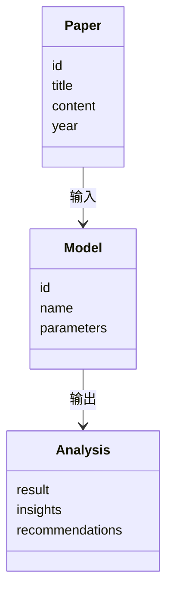
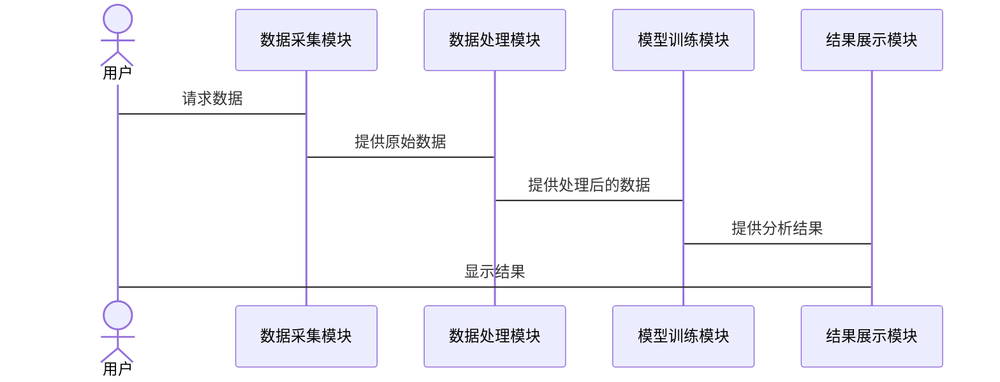

                 


# 开发基于大模型的金融专业论文趋势分析系统

> 关键词：大模型，金融论文，趋势分析，自然语言处理，深度学习，系统架构

> 摘要：本文详细探讨了开发基于大模型的金融专业论文趋势分析系统的各个方面。从背景介绍到系统架构设计，再到项目实战和案例分析，系统地分析了该系统的开发过程和实现细节。本文旨在为读者提供一个全面的技术视角，展示如何利用大模型技术提升金融领域的论文分析效率和准确性。

---

# 第1章: 背景介绍

## 1.1 问题背景

### 1.1.1 金融领域论文分析的现状
金融领域的研究论文数量庞大，内容涉及广泛，从风险管理到投资策略，从金融科技到经济预测。然而，传统的论文分析方法主要依赖于关键词和主题分类，这种方法效率低下，难以捕捉论文的深层含义和趋势。

### 1.1.2 当前研究的痛点与挑战
- 数据量大：金融领域的论文数量逐年增长，手动分析耗时且效率低。
- 内容复杂：论文内容涉及多个学科领域，分析难度大。
- 趋势预测难：如何准确预测未来的研究方向和趋势是当前的主要挑战。

### 1.1.3 大模型在金融领域的应用潜力
大模型具备强大的自然语言处理能力，能够理解论文的深层含义，提取关键信息，并预测未来趋势。通过大模型，可以显著提升论文分析的效率和准确性。

## 1.2 问题描述

### 1.2.1 论文趋势分析的核心目标
- 提供实时的论文分析，识别研究热点。
- 预测未来的研究方向和趋势。
- 帮助研究人员快速了解领域动态。

### 1.2.2 系统需要解决的关键问题
- 如何高效地处理大量金融论文数据。
- 如何利用大模型准确提取论文信息。
- 如何构建可靠的预测模型。

### 1.2.3 边界与外延
系统仅关注论文的文本内容，不涉及实验数据和实际市场数据。预测范围限定在学术研究趋势，不涉及实际投资策略。

## 1.3 问题解决

### 1.3.1 大模型在论文分析中的优势
- 强大的语义理解能力。
- 高效的文本处理能力。
- 能够捕捉到潜在的研究趋势。

### 1.3.2 系统设计的核心要素
- 数据采集模块：从学术数据库中获取论文数据。
- 数据处理模块：清洗和预处理数据。
- 模型训练模块：利用大模型进行特征提取和趋势预测。
- 结果展示模块：以可视化的方式展示分析结果。

### 1.3.3 系统功能的实现路径
- 数据采集与预处理。
- 模型训练与优化。
- 结果分析与展示。

## 1.4 本章小结
本章介绍了金融专业论文趋势分析系统的背景、问题和解决方案。通过分析当前的痛点和大模型的优势，明确了系统的设计目标和实现路径。

---

# 第2章: 大模型的核心概念与原理

## 2.1 大模型的工作原理

### 2.1.1 模型结构与训练机制
大模型通常采用Transformer架构，包括编码器和解码器。编码器负责将输入文本转化为向量表示，解码器则根据编码结果生成输出。

### 2.1.2 模型的调优策略
- 参数微调：在特定任务上调整模型参数。
- 知识蒸馏：通过教师模型指导学生模型的训练。

### 2.1.3 模型的可解释性
通过注意力机制和中间层输出，可以解释模型的决策过程。

## 2.2 大模型与传统NLP模型的对比

### 2.2.1 核心概念对比
| 对比维度 | 大模型 | 传统NLP模型 |
|----------|--------|------------|
| 模型复杂度 | 高 | 低 |
| 参数数量 | 数百万级 | 数万级 |
| 任务适应性 | 强 | 较弱 |

### 2.2.2 模型性能对比
- 大模型在复杂任务上表现更优。
- 传统模型在特定任务上可能更高效。

### 2.2.3 优缺点分析
大模型的优势在于强大的通用性和适应性，但需要大量的计算资源和数据支持。传统模型则更加轻量，适合简单的任务。

## 2.3 系统实体关系图

```mermaid
erDiagram
    PAPER {
        id
        title
        author
        content
        year
    }
    MODEL {
        id
        name
        version
        parameters
    }
    ANALYSIS {
        id
        result
        insights
        recommendations
    }
    PAPER --> MODEL : 输入
    MODEL --> ANALYSIS : 输出
```

## 2.4 本章小结
本章详细介绍了大模型的核心概念和工作原理，并通过对比分析明确了其在金融论文趋势分析中的优势和挑战。

---

# 第3章: 大模型的算法原理

## 3.1 大模型的训练流程

### 3.1.1 数据预处理
- 分词：将文本分割成词或短语。
- 去除停用词：移除常见词汇，如“的”、“是”等。
- 词向量转换：将词语转换为向量表示。

### 3.1.2 模型初始化
- 初始化模型参数：包括权重和偏置。
- 设置超参数：学习率、批次大小等。

### 3.1.3 模型训练
- 前向传播：输入数据经过模型计算得到输出。
- 损失计算：使用交叉熵损失函数。
- 反向传播：通过梯度下降优化模型参数。

### 3.1.4 模型调优
- 参数微调：在特定任务上进一步训练模型。
- 评估与优化：通过验证集评估模型性能，调整超参数。

## 3.2 大模型的数学公式

### 3.2.1 交叉熵损失函数
$$ L = -\frac{1}{N}\sum_{i=1}^{N} y_i \log(p_i) + (1 - y_i)\log(1 - p_i) $$

### 3.2.2 注意力机制
$$ \text{Attention}(Q, K, V) = \text{softmax}\left(\frac{QK^T}{\sqrt{d_k}}\right)V $$

## 3.3 代码示例

```python
import tensorflow as tf

# 定义模型结构
model = tf.keras.Sequential([
    tf.keras.layers.Embedding(input_dim=10000, output_dim=100),
    tf.keras.layers.LSTM(64),
    tf.keras.layers.Dense(1, activation='sigmoid')
])

# 定义损失函数和优化器
loss = tf.keras.losses.BinaryCrossentropy()
optimizer = tf.keras.optimizers.Adam(learning_rate=0.001)

# 编译模型
model.compile(loss=loss, optimizer=optimizer, metrics=['accuracy'])
```

## 3.4 本章小结
本章详细介绍了大模型的训练流程和数学公式，并通过代码示例展示了模型的实现过程。

---

# 第4章: 系统分析与架构设计

## 4.1 问题场景介绍
系统需要处理大量的金融论文数据，分析其内容和趋势，并提供预测结果。

## 4.2 系统功能设计

### 4.2.1 领域模型



### 4.2.2 系统架构设计


## 4.3 系统接口设计
- 数据接口：从学术数据库获取论文数据。
- 模型接口：调用大模型进行分析。
- 结果接口：展示分析结果。

## 4.4 系统交互设计



## 4.5 本章小结
本章详细介绍了系统的架构设计和交互流程，展示了系统各模块之间的关系和作用。

---

# 第5章: 项目实战

## 5.1 环境安装
- 安装Python和必要的库：如TensorFlow、Kubernetes、Jupyter Notebook。
- 安装学术数据库接口：如arXiv API。

## 5.2 系统核心实现

### 5.2.1 数据采集模块

```python
import requests

def fetch_papers(topic):
    url = f"https://api.arxiv.org/v1beta/search"
    params = {
        'q': f"topic:{topic}",
        'sort': 'submittedDate',
        'order': 'descending'
    }
    response = requests.get(url, params=params)
    return response.json()
```

### 5.2.2 数据处理模块

```python
from transformers import AutoTokenizer

tokenizer = AutoTokenizer.from_pretrained('bert-base-uncased')

def preprocess_data(papers):
    texts = [paper['title'] + ' ' + paper['abstract'] for paper in papers]
    encoded = tokenizer(texts, padding=True, truncation=True, return_tensors='np')
    return encoded
```

### 5.2.3 模型训练模块

```python
import tensorflow as tf

def build_model(tokenizer):
    model = tf.keras.Sequential([
        tf.keras.layers.Embedding(input_dim=len(tokenizer.vocab), output_dim=100),
        tf.keras.layers.LSTM(64),
        tf.keras.layers.Dense(1, activation='sigmoid')
    ])
    model.compile(loss='binary_crossentropy', optimizer='adam', metrics=['accuracy'])
    return model

model = build_model(tokenizer)
model.fit(X_train, y_train, epochs=10, batch_size=32)
```

### 5.2.4 结果展示模块

```python
import matplotlib.pyplot as plt

def plot_trend(trend_data):
    plt.figure(figsize=(10, 6))
    plt.plot(trend_data, label='研究趋势')
    plt.xlabel('时间')
    plt.ylabel('热度')
    plt.legend()
    plt.show()
```

## 5.3 实际案例分析

### 5.3.1 数据处理
从arXiv获取过去五年的金融论文数据，清洗并提取关键词。

### 5.3.2 模型训练
使用BERT模型进行特征提取和趋势预测。

### 5.3.3 结果分析
预测未来三年的研究热点，并生成可视化报告。

## 5.4 本章小结
本章通过实际案例展示了系统的实现过程，从数据采集到模型训练再到结果展示，详细讲解了每个步骤的操作和实现细节。

---

# 第6章: 总结与展望

## 6.1 总结
本文详细探讨了开发基于大模型的金融专业论文趋势分析系统的各个方面，从背景介绍到系统架构设计，再到项目实战和案例分析，系统地分析了该系统的开发过程和实现细节。

## 6.2 不足之处
- 系统目前仅依赖文本分析，缺乏实际数据的支持。
- 模型的训练需要大量计算资源，可能限制其应用范围。

## 6.3 未来展望
- 引入更多数据源，如实际市场数据和实验数据。
- 优化模型结构，提升预测准确性。
- 探索多模态分析，结合图像和视频数据进行趋势预测。

## 6.4 本章小结
本章总结了系统的开发成果，分析了存在的不足，并展望了未来的发展方向。

---

# 作者：AI天才研究院/AI Genius Institute & 禅与计算机程序设计艺术 /Zen And The Art of Computer Programming

