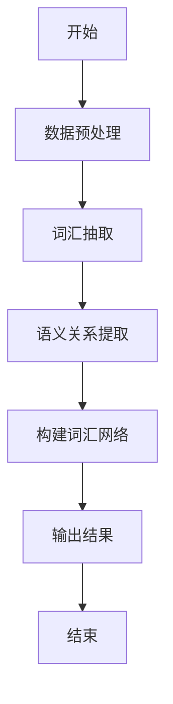
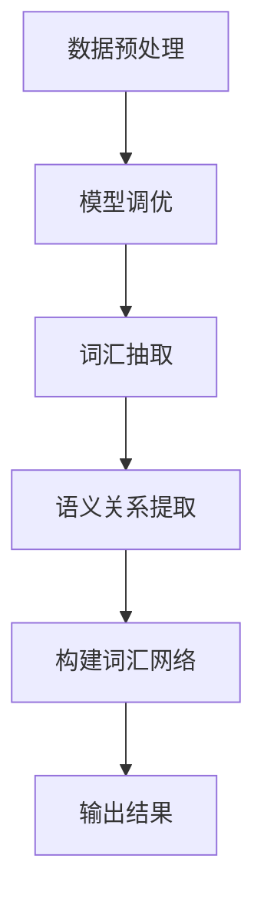
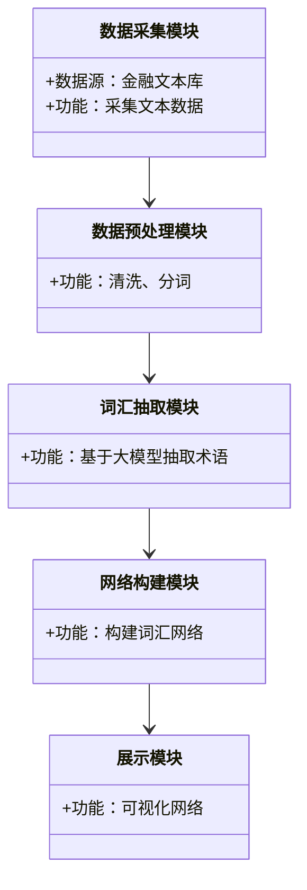
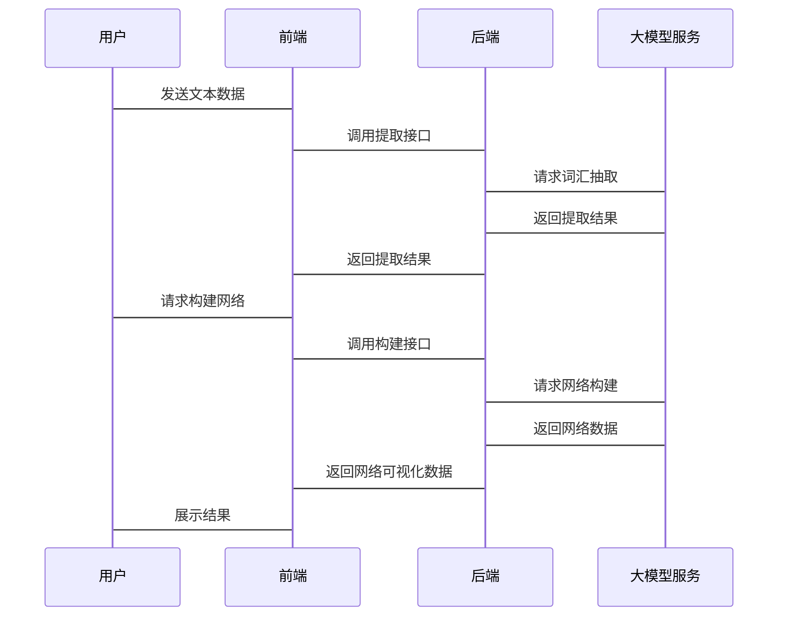

                 


# 开发基于大模型的金融专业词汇网络构建器

## 关键词：金融专业词汇网络、大模型、自然语言处理、知识图谱、金融信息处理、词汇网络构建

## 摘要：本文详细探讨了基于大模型的金融专业词汇网络构建器的开发过程，从背景概述、核心概念到算法原理、系统架构，再到项目实战和最佳实践，全面解析了如何利用大模型技术高效构建金融专业词汇网络，为金融信息处理和知识图谱构建提供了新的思路和解决方案。

---

# 第一部分: 背景与概述

## 第1章: 问题背景与目标

### 1.1 问题背景
#### 1.1.1 金融领域的信息处理挑战
金融领域信息复杂，涉及大量专业术语和复杂的语义关系。传统的词汇网络构建方法难以高效捕捉这些复杂关系，导致信息处理效率低下。

#### 1.1.2 专业词汇网络的重要性
专业词汇网络是金融信息处理的基础，能够帮助实现高效的信息检索、知识图谱构建和语义理解。

#### 1.1.3 大模型在金融领域的应用潜力
大模型技术在自然语言处理领域的突破为金融专业词汇网络的构建提供了新的可能性，能够更准确地提取和关联金融术语。

### 1.2 问题描述
#### 1.2.1 金融专业词汇的复杂性
金融领域术语繁多，且语义复杂，传统的词汇网络构建方法难以有效处理。

#### 1.2.2 传统词汇网络构建的局限性
传统方法依赖人工标注，效率低，且难以捕捉深层语义关系。

#### 1.2.3 基于大模型的解决方案
通过利用大模型的强大语义理解能力，可以更高效、准确地构建金融专业词汇网络。

### 1.3 问题解决思路
#### 1.3.1 大模型在词汇抽取中的优势
大模型能够自动提取文本中的金融术语，并建立它们之间的语义联系。

#### 1.3.2 网络构建的智能化方法
通过大模型驱动的自动化流程，构建动态、智能的词汇网络。

#### 1.3.3 金融场景中的具体应用
在金融信息检索、知识图谱构建、智能问答等领域，基于大模型的词汇网络构建器具有广泛的应用前景。

### 1.4 边界与外延
#### 1.4.1 项目范围界定
明确项目的目标和范围，例如限定在特定金融领域或特定类型的数据。

#### 1.4.2 相关领域的区别与联系
与文本挖掘、知识图谱等领域的区别与联系，明确项目的独特性和创新点。

#### 1.4.3 未来发展的可能性
探讨未来可能的发展方向，例如结合实时数据更新、多模态信息处理等。

### 1.5 概念结构与核心要素
#### 1.5.1 核心概念的定义
定义金融专业词汇网络、大模型、语义关系等核心概念。

#### 1.5.2 各要素之间的关系
描述大模型如何驱动词汇网络的构建，以及词汇网络如何应用于金融信息处理。

#### 1.5.3 系统整体架构
概述整个系统的架构，包括数据输入、模型处理、网络构建和应用输出等部分。

---

# 第二部分: 核心概念与联系

## 第2章: 金融专业词汇网络构建器的核心原理

### 2.1 核心概念原理
#### 2.1.1 大模型在词汇抽取中的作用
大模型通过预训练和微调，能够准确识别文本中的金融术语。

#### 2.1.2 词汇网络的构建逻辑
基于大模型提取的词汇，通过语义关联构建词汇网络，形成复杂的语义图谱。

#### 2.1.3 网络节点与边的定义
节点代表金融术语，边代表它们之间的语义关系。

### 2.2 核心概念属性对比
#### 2.2.1 词汇抽取的准确性对比
对比传统方法和基于大模型的方法在词汇抽取准确率上的差异。

#### 2.2.2 网络构建的效率对比
分析两种方法在构建网络时的效率和资源消耗。

#### 2.2.3 应用效果的对比
展示基于大模型的词汇网络在金融信息处理中的实际效果。

### 2.3 ER实体关系图和Mermaid流程图

#### 2.3.1 ER实体关系图
```mermaid
erDiagram
    customer {
        +int id
        +string name
        +string email
    }
    transaction {
        +int id
        +int amount
        +date date
    }
    customer --> transaction : "makes"
```

#### 2.3.2 Mermaid流程图


---

# 第三部分: 算法原理

## 第3章: 算法原理讲解

### 3.1 算法原理概述
基于大模型的金融专业词汇网络构建算法，通过预处理、模型调优和网络构建三个主要步骤完成任务。

### 3.2 Mermaid流程图


### 3.3 Python核心代码实现

#### 3.3.1 环境安装
```bash
pip install transformers
pip install networkx
pip install matplotlib
```

#### 3.3.2 核心代码
```python
from transformers import AutoTokenizer, AutoModelForMaskedLM
import networkx as nx
import matplotlib.pyplot as plt

# 加载预训练模型
model_name = "bert-large-uncased"
tokenizer = AutoTokenizer.from_pretrained(model_name)
model = AutoModelForMaskedLM.from_pretrained(model_name)

def extract_financial_terms(text):
    # 使用模型进行词汇抽取
    inputs = tokenizer.encode_plus(text, return_tensors="pt", truncation=True, padding=True)
    with torch.no_grad():
        outputs = model(**inputs)
    # 提取词汇
    terms = tokenizer.decode(outputs.logits.argmax(dim=-1).squeeze().tolist())
    return terms

def build_network(terms):
    # 构建词汇网络
    G = nx.Graph()
    G.add_nodes_from(terms)
    # 添加语义关系
    # 这里简化为随机连接，实际应根据语义分析
    for i in range(len(terms)):
        for j in range(i+1, len(terms)):
            if random.random() < 0.3:
                G.add_edge(terms[i], terms[j])
    return G

def visualize_network(G):
    # 可视化网络
    plt.figure(figsize=(10, 10))
    nx.draw(G, node_size=1000, alpha=0.8, edge_color="b", edge_alpha=0.6)
    plt.title("Financial Terms Network")
    plt.show()

# 示例
text = "在金融市场中，股票、债券、基金等都是重要的投资工具。风险管理、资产配置是金融分析的核心内容。"
terms = extract_financial_terms(text)
G = build_network(terms)
visualize_network(G)
```

### 3.4 算法数学模型与公式
#### 3.4.1 词汇抽取的损失函数
$$ \text{Loss} = \sum_{i=1}^{n} \text{CrossEntropy}(y_i, y_{\text{pred}}_i) $$

#### 3.4.2 语义关系计算的相似度公式
$$ \text{Similarity}(a, b) = \frac{\sum_{i=1}^{n} w_i a_i b_i}{\sqrt{\sum_{i=1}^{n} w_i a_i^2} \cdot \sqrt{\sum_{i=1}^{n} w_i b_i^2}} } $$

---

# 第四部分: 系统分析与架构设计

## 第4章: 系统分析与架构设计方案

### 4.1 问题场景介绍
构建一个金融专业词汇网络的系统，目标是实现高效、智能的金融信息处理。

### 4.2 项目介绍
系统名称：金融专业词汇网络构建器

### 4.3 系统功能设计


### 4.4 系统架构设计


### 4.5 系统接口设计
#### 4.5.1 API接口
```python
# 提供词汇抽取接口
@app.route('/extract', methods=['POST'])
def extract():
    data = request.get_json()
    text = data['text']
    terms = extract_financial_terms(text)
    return jsonify({'terms': terms})
```

#### 4.5.2 网络构建接口
```python
@app.route('/build_network', methods=['POST'])
def build_network():
    data = request.get_json()
    terms = data['terms']
    G = build_network(terms)
    return jsonify({'network': serialize(G)})
```

### 4.6 系统交互设计


---

# 第五部分: 项目实战

## 第5章: 项目实战

### 5.1 环境安装
```bash
pip install transformers networkx matplotlib flask
pip install requests
```

### 5.2 系统核心实现

#### 5.2.1 数据采集模块
```python
import requests

def fetch_financial_text(url):
    response = requests.get(url)
    return response.text
```

#### 5.2.2 数据预处理模块
```python
from transformers import AutoTokenizer

def preprocess_text(text):
    tokenizer = AutoTokenizer.from_pretrained("bert-base-uncased")
    return tokenizer.tokenize(text)
```

#### 5.2.3 词汇抽取模块
```python
def extract_financial_terms(text):
    # 使用预训练模型进行微调
    model = AutoModelForMaskedLM.from_pretrained("bert-large-uncased")
    inputs = tokenizer.encode_plus(text, return_tensors="pt", truncation=True, padding=True)
    with torch.no_grad():
        outputs = model(**inputs)
    terms = tokenizer.decode(outputs.logits.argmax(dim=-1).squeeze().tolist())
    return terms
```

#### 5.2.4 网络构建模块
```python
def build_network(terms):
    G = nx.Graph()
    G.add_nodes_from(terms)
    # 简化为随机连接，实际应根据语义分析
    for i in range(len(terms)):
        for j in range(i+1, len(terms)):
            if random.random() < 0.3:
                G.add_edge(terms[i], terms[j])
    return G
```

#### 5.2.5 展示模块
```python
def visualize_network(G):
    plt.figure(figsize=(10, 10))
    nx.draw(G, node_size=1000, alpha=0.8, edge_color="b", edge_alpha=0.6)
    plt.title("Financial Terms Network")
    plt.show()
```

### 5.3 代码应用解读与分析
通过上述代码，我们可以实现从数据采集到网络构建和可视化的完整流程，展示大模型在金融专业词汇网络构建中的应用。

### 5.4 实际案例分析
以某金融领域的文本为例，展示如何通过上述代码实现词汇网络的构建，并分析其在实际应用中的效果。

### 5.5 项目小结
总结项目实现的关键步骤和成果，分析可能的优化方向。

---

# 第六部分: 最佳实践与其他内容

## 第6章: 最佳实践

### 6.1 开发注意事项
- 数据隐私与安全
- 模型调优与优化
- 系统性能与扩展性

### 6.2 小结
回顾全文，总结基于大模型的金融专业词汇网络构建器的核心思想和实现步骤。

### 6.3 注意事项
- 数据来源的可靠性
- 模型的可解释性
- 系统的可维护性

### 6.4 拓展阅读
推荐相关领域的书籍和论文，供读者进一步学习。

---

# 结语

## 作者

作者：AI天才研究院/AI Genius Institute & 禅与计算机程序设计艺术/Zen And The Art of Computer Programming

