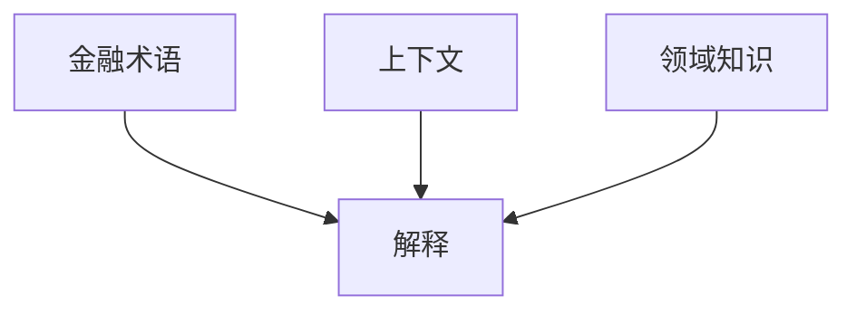
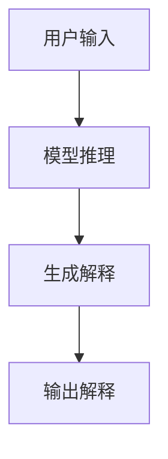
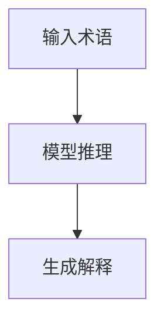
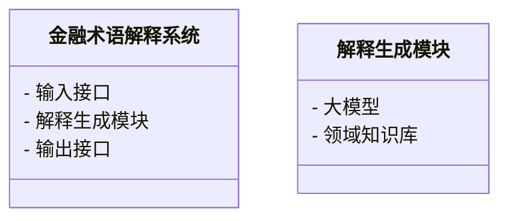
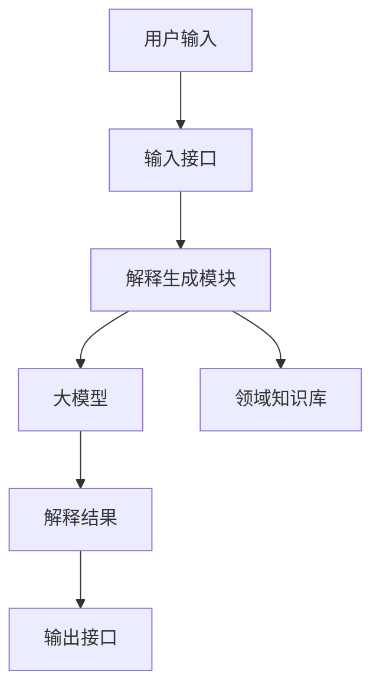
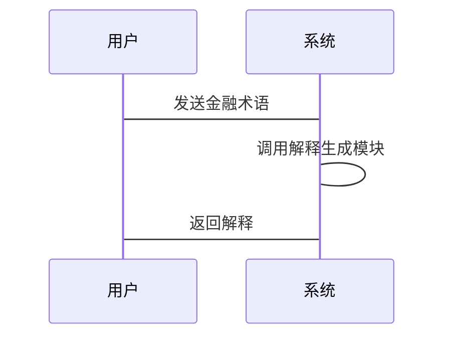

                 


# 开发基于大模型的金融专业词汇解释系统

## 关键词：大模型、金融术语、解释系统、NLP、系统架构

## 摘要：本文详细介绍了如何开发一个基于大模型的金融专业词汇解释系统，从背景介绍、核心概念到算法实现、系统架构，再到项目实战和优化，系统性地探讨了该系统的开发过程和实现细节，提供了丰富的技术见解和实践经验。

---

## 第一部分: 开发基于大模型的金融专业词汇解释系统概述

### 第1章: 背景介绍

#### 1.1 问题背景与描述

##### 1.1.1 金融领域专业词汇的复杂性

金融领域的术语通常具有高度的专业性和复杂性，例如“Black-Scholes模型”、“套利机会”、“久期分析”等。这些术语不仅涉及数学、统计学和经济学，还常常依赖于上下文和领域知识。对于非专业人士来说，理解这些术语往往具有挑战性。

##### 1.1.2 当前金融术语解释系统的主要挑战

传统的金融术语解释系统通常依赖于规则引擎或静态知识库，这种方式难以应对金融领域的动态变化和术语的多样性。此外，现有系统往往缺乏上下文感知能力，无法根据具体场景提供个性化的解释。

##### 1.1.3 大模型在金融术语解释中的优势

大模型（如GPT-3、GPT-4等）具有强大的自然语言处理能力，能够通过上下文理解和生成相关文本。结合领域知识，大模型可以生成准确且个性化的金融术语解释，显著提升了解释的质量和用户体验。

---

### 第2章: 核心概念与联系

#### 2.1 大模型的基本原理

##### 2.1.1 大模型的训练机制

大模型通常采用Transformer架构，通过大量的金融文本数据进行预训练。训练过程中，模型学习了金融术语的语义、上下文关系以及领域知识。

##### 2.1.2 大模型的推理过程

在推理阶段，用户输入一个金融术语，模型通过生成式算法生成相应的解释。整个过程涉及词嵌入、注意力机制和解码器的协同工作。

##### 2.1.3 大模型与金融术语解释的结合

通过微调和领域知识注入，大模型能够更好地适应金融领域的特定需求。例如，可以训练模型识别金融术语中的关键实体（如公司名称、指标名称）并生成相应的解释。

#### 2.2 金融专业词汇的特征

##### 2.2.1 专业术语的定义与分类

金融术语可以分为资产类别（如股票、债券）、金融工具（如期权、期货）和市场术语（如波动率、收益率）等。

##### 2.2.2 术语之间的关系与依赖

许多金融术语之间存在复杂的依赖关系。例如，“beta系数”与“资产波动性”密切相关，而“alpha系数”则与投资策略相关。

##### 2.2.3 术语解释的复杂性与多样性

不同术语的解释可能涉及多个方面，例如定义、公式、应用场景和相关案例。因此，解释系统需要具备灵活性和深度。

#### 2.3 实体关系与架构设计

##### 2.3.1 实体关系图（ER图）分析



##### 2.3.2 系统架构的初步设计



---

### 第3章: 算法原理与实现

#### 3.1 大模型的训练流程

##### 3.1.1 数据预处理

- 数据清洗：去除噪声数据，保留高质量的金融文本。
- 分词与标注：对文本进行分词和实体标注，例如标记金融术语和相关解释。

##### 3.1.2 模型训练

- 使用金融领域的数据集进行微调。
- 采用Adam优化器和学习率衰减策略。

##### 3.1.3 模型调优

- 调整模型参数（如学习率、批量大小）以优化性能。
- 通过验证集评估模型的解释准确性。

#### 3.2 解释生成算法

##### 3.2.1 解释生成的流程



##### 3.2.2 解释生成的优化方法

- 引入领域知识图谱，提升解释的准确性。
- 采用多轮推理，增强解释的深度和广度。

#### 3.3 代码实现示例

##### 3.3.1 环境配置

```python
import torch
import torch.nn as nn
from transformers import AutoTokenizer, AutoModelForCausalLM
```

##### 3.3.2 核心算法实现

```python
def generate_explanation(model, tokenizer, term):
    input = f"解释以下金融术语：{term}\n"
    inputs = tokenizer.encode_plus(input, return_tensors='pt')
    outputs = model.generate(inputs['input_ids'], max_length=100)
    explanation = tokenizer.decode(outputs[0], skip_special_tokens=True)
    return explanation
```

---

### 第4章: 数学模型与公式

#### 4.1 词嵌入与注意力机制

词嵌入将金融术语转换为向量表示：

$$
\text{embedding}(w_i) = E_i
$$

注意力机制计算权重：

$$
\alpha_i = \frac{\exp(e_i)}{\sum_{j} \exp(e_j)}
$$

其中，$e_i$ 是查询与词的相似度得分。

#### 4.2 解释生成的损失函数

使用交叉熵损失函数：

$$
\mathcal{L} = -\sum_{i=1}^{n} y_i \log(p_i) + (1 - y_i) \log(1 - p_i)
$$

其中，$y_i$ 是真实标签，$p_i$ 是生成概率。

---

## 第五部分: 系统分析与架构设计

### 第4章: 系统分析与架构设计

#### 4.1 问题场景介绍

金融术语解释系统需要满足以下需求：
- 支持多种金融术语的解释。
- 提供上下文相关的解释。
- 支持多种输出格式（文本、图表）。

#### 4.2 项目介绍

##### 4.2.1 项目背景

开发一个基于大模型的金融术语解释系统，旨在为用户提供准确、个性化的解释。

##### 4.2.2 系统功能设计



#### 4.3 系统架构设计

##### 4.3.1 系统架构图



#### 4.4 系统接口设计

##### 4.4.1 输入接口

- 接口类型：RESTful API
- 接口描述：接收金融术语字符串。

##### 4.4.2 输出接口

- 接口类型：RESTful API
- 接口描述：返回解释文本或结构化数据。

#### 4.5 系统交互流程

##### 4.5.1 交互流程图



---

## 第六部分: 项目实战

### 第5章: 项目实战

#### 5.1 环境安装

```bash
pip install torch transformers
```

#### 5.2 核心代码实现

##### 5.2.1 模型加载

```python
model = AutoModelForCausalLM.from_pretrained('your_model_name')
tokenizer = AutoTokenizer.from_pretrained('your_model_name')
```

##### 5.2.2 解释生成

```python
def generate_explanation(term):
    inputs = tokenizer.encode_plus(f"解释以下金融术语：{term}", return_tensors='pt')
    outputs = model.generate(inputs['input_ids'], max_length=100)
    return tokenizer.decode(outputs[0], skip_special_tokens=True)
```

#### 5.3 实际案例分析

案例1：输入“Black-Scholes模型”，系统生成解释：

> "Black-Scholes模型是一种用于期权定价的数学模型，主要考虑股票价格的波动性和期权的剩余时间。该模型假设市场无摩擦，且股票价格服从几何布朗运动。"

---

## 第七部分: 最佳实践、小结、注意事项、拓展阅读

### 第6章: 最佳实践

#### 6.1 开发过程中的经验总结

- 确保数据质量：使用高质量的金融文本数据进行训练。
- 模型调优：通过微调和参数调整提升解释准确性。

#### 6.2 小结

开发基于大模型的金融术语解释系统是一个复杂的工程，涉及自然语言处理、领域知识和系统架构等多个方面。通过合理的系统设计和算法优化，可以显著提升系统的性能和用户体验。

#### 6.3 注意事项

- 数据隐私：确保用户数据的安全和隐私。
- 系统性能：优化模型推理速度和资源消耗。

#### 6.4 拓展阅读

- 大模型的金融应用：探索更多金融领域的应用场景。
- 多模态解释：结合图表和视频等多模态信息，提升解释的直观性。

---

## 总结与展望

开发基于大模型的金融专业词汇解释系统是一项具有重要意义的工作。通过结合大模型的自然语言处理能力和金融领域的专业知识，可以为用户提供高效、准确的术语解释服务。未来，随着大模型技术的不断发展，金融术语解释系统将更加智能化和个性化。

---

## 作者

作者：AI天才研究院/AI Genius Institute & 禅与计算机程序设计艺术 /Zen And The Art of Computer Programming

---

以上是《开发基于大模型的金融专业词汇解释系统》的技术博客文章的详细内容，涵盖了从背景介绍到系统架构设计，再到项目实战和优化的全过程。希望对您有所帮助！

