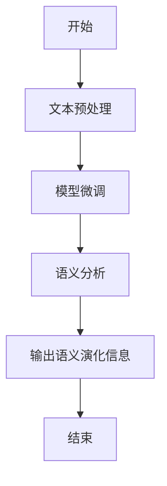
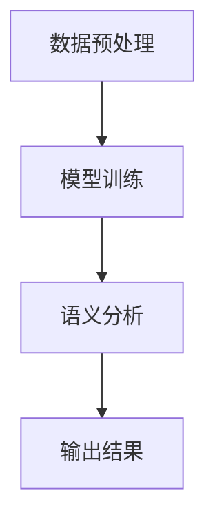
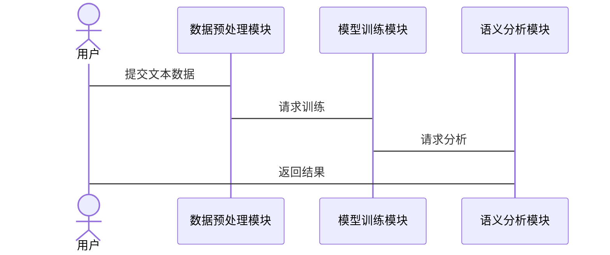

                 


# 开发基于大模型的金融专业词汇语义演化跟踪器

> 关键词：大模型，语义演化，金融专业词汇，跟踪器，NLP，机器学习

> 摘要：本文详细介绍了如何开发一个基于大模型的金融专业词汇语义演化跟踪器。通过分析金融领域专业词汇的动态变化，结合AI大模型的语义理解能力，提出了一种高效的语义演化跟踪方法。文章从问题背景、核心概念、算法原理、系统架构到项目实战，全面阐述了该跟踪器的开发过程。

---

# 第一部分: 金融专业词汇语义演化跟踪器的背景与核心概念

## 第1章: 问题背景与描述

### 1.1 问题背景

#### 1.1.1 金融领域的专业词汇特点
金融领域的专业词汇具有高度的专业性和领域特定性，例如“ETF”、“波动率”、“套利”等术语。这些词汇的含义可能随着市场环境的变化而变化，例如“ETF”在不同市场周期中的具体含义可能有所不同。

#### 1.1.2 语义演化在金融领域的挑战
金融市场的动态变化使得专业词汇的含义不断演变。例如，2020年新冠疫情爆发后，“ETF”在市场恐慌时期的含义可能与正常市场环境下的含义有所不同。这种动态变化使得传统的静态词典方法难以捕捉词汇的实时含义。

#### 1.1.3 传统方法的局限性
传统的方法，如基于词典的静态分析，难以捕捉词汇的动态变化。此外，金融领域的专业词汇往往具有复杂的上下文依赖关系，传统的NLP技术难以准确理解这些关系。

### 1.2 问题描述

#### 1.2.1 语义演化跟踪的核心目标
语义演化跟踪的核心目标是实时捕捉和分析金融专业词汇含义的变化，以便为金融分析、投资决策提供更准确的语义支持。

#### 1.2.2 金融专业词汇的动态变化
金融专业词汇的动态变化主要体现在以下几个方面：
- **上下文依赖**：词汇的含义受到其出现的上下文影响。
- **市场环境变化**：如经济危机、政策变化等会影响词汇的含义。
- **技术进步**：金融工具和技术的创新会导致新词汇的出现。

#### 1.2.3 语义演化对金融分析的影响
语义演化对金融分析的影响主要体现在以下几个方面：
- **投资决策**：准确理解词汇含义有助于制定更有效的投资策略。
- **风险管理**：动态语义分析有助于识别潜在的市场风险。
- **信息处理**：准确捕捉词汇含义变化有助于提高金融信息处理的效率。

### 1.3 问题解决方法

#### 1.3.1 基于AI大模型的解决方案
AI大模型（如GPT系列）具有强大的语义理解和生成能力，可以用于捕捉和分析金融专业词汇的动态变化。

#### 1.3.2 语义演化跟踪的实现路径
语义演化跟踪的实现路径包括：
1. 数据收集与预处理：收集金融领域的文本数据，并进行清洗和标注。
2. 模型训练：基于大模型对数据进行微调，使其能够理解金融专业词汇的动态变化。
3. 语义演化分析：通过模型对实时文本进行分析，捕捉词汇含义的变化。

#### 1.3.3 大模型在金融领域的应用优势
大模型在金融领域的应用优势主要体现在：
- **强大的语义理解能力**：能够准确理解金融专业词汇的含义。
- **可微调性**：可以通过微调适应特定领域的语义需求。
- **实时处理能力**：能够实时分析金融市场中的最新文本信息。

### 1.4 问题的边界与外延

#### 1.4.1 语义演化跟踪的边界定义
语义演化跟踪的边界主要集中在金融领域的专业词汇，不包括通用词汇的语义变化。

#### 1.4.2 相关领域的关联与区别
语义演化跟踪与自然语言处理（NLP）、机器学习等领域密切相关，但其核心目标是捕捉金融专业词汇的动态变化。

#### 1.4.3 问题的潜在扩展方向
问题的潜在扩展方向包括：
- **跨领域应用**：将语义演化跟踪方法推广到其他领域。
- **多语言支持**：支持多种语言的金融专业词汇语义分析。
- **实时性优化**：进一步提升语义演化跟踪的实时性。

### 1.5 核心要素与概念结构

#### 1.5.1 核心概念的组成
语义演化跟踪器的核心概念包括：
- 数据源：金融领域的文本数据。
- 大模型：用于语义分析的AI大模型。
- 跟踪算法：用于捕捉词汇含义变化的算法。

#### 1.5.2 概念之间的关系
概念之间的关系可以通过以下方式表示：
- 数据源输入到大模型中进行处理。
- 处理结果通过跟踪算法进行分析，得到词汇的语义演化信息。

#### 1.5.3 系统架构的核心要素
系统架构的核心要素包括：
- 数据预处理模块：负责数据的清洗和标注。
- 模型训练模块：负责对大模型进行微调。
- 语义分析模块：负责实时分析文本数据。

---

## 第2章: 核心概念与联系

### 2.1 语义演化跟踪器的定义与特点

#### 2.1.1 定义
语义演化跟踪器是一种基于AI大模型的系统，用于实时捕捉和分析金融专业词汇含义的动态变化。

#### 2.1.2 核心特点
- **实时性**：能够实时分析金融市场中的最新文本信息。
- **准确性**：通过大模型的强大语义理解能力，准确捕捉词汇含义的变化。
- **可扩展性**：支持多种金融专业词汇和应用场景。

#### 2.1.3 与传统NLP模型的区别
与传统NLP模型相比，语义演化跟踪器具有以下特点：
- 更强的语义理解能力。
- 更好的适应性，能够捕捉词汇含义的动态变化。

### 2.2 AI大模型在语义演化中的作用

#### 2.2.1 大模型的语义理解能力
大模型通过预训练和微调，能够准确理解金融专业词汇的含义及其上下文关系。

#### 2.2.2 大模型的可微调特性
大模型可以通过微调适应特定领域的语义需求，从而更好地捕捉金融专业词汇的动态变化。

#### 2.2.3 大模型的实时处理能力
大模型能够实时处理金融市场中的大量文本数据，快速生成语义分析结果。

### 2.3 金融专业词汇的特征分析

#### 2.3.1 专业术语的特性
金融专业词汇具有高度的专业性和领域特定性，且其含义可能随着市场环境的变化而变化。

#### 2.3.2 词汇的动态变化
金融专业词汇的动态变化主要体现在其含义的演变上，例如“ETF”在不同市场环境下的含义有所不同。

#### 2.3.3 词汇之间的关系
金融专业词汇之间存在复杂的依赖关系，例如“ETF”与“波动率”之间的关系可能受到市场环境的影响。

---

### 2.4 专业词汇语义演化的属性特征对比

| 特性             | 传统词典方法 | 基于大模型的语义演化跟踪器 |
|------------------|--------------|-----------------------------|
| **动态性**       | 静态         | 动态                         |
| **上下文依赖**   | 无           | 有                           |
| **适应性**       | 低           | 高                           |
| **准确性**       | 一般         | 高                           |
| **实时性**       | 无           | 有                           |

---

### 2.5 专业词汇语义演化跟踪器的ER实体关系图

```mermaid
er
actor: 用户
action: 分析金融文本
entity1: 金融专业词汇
entity2: 语义演化信息
entity3: 大模型
```

---

## 第3章: 算法原理讲解

### 3.1 算法概述

#### 3.1.1 基于大模型的语义分析流程
语义分析流程包括：
1. 文本预处理：清洗和标注文本数据。
2. 模型微调：对大模型进行金融领域的微调。
3. 语义分析：通过模型生成语义演化信息。

#### 3.1.2 语义演化跟踪的核心算法
语义演化跟踪的核心算法包括：
- 词汇表示学习
- 语义相似度计算
- 动态语义更新

### 3.2 算法流程图



---

### 3.3 算法实现的Python代码示例

```python
import torch
import torch.nn as nn

class SemanticEvolutionTracker(nn.Module):
    def __init__(self, vocab_size, embedding_dim):
        super(SemanticEvolutionTracker, self).__init__()
        self.embedding = nn.Embedding(vocab_size, embedding_dim)
        self.fc = nn.Linear(embedding_dim, 1)

    def forward(self, input_ids):
        embeddings = self.embedding(input_ids)
        output = self.fc(embeddings.mean(dim=1))
        return output

# 初始化模型
vocab_size = 1000
embedding_dim = 512
model = SemanticEvolutionTracker(vocab_size, embedding_dim)

# 训练循环
optimizer = torch.optim.Adam(model.parameters(), lr=0.001)
criterion = nn.MSELoss()

for epoch in range(num_epochs):
    for batch_input, batch_target in dataloader:
        outputs = model(batch_input)
        loss = criterion(outputs, batch_target)
        loss.backward()
        optimizer.step()
        optimizer.zero_grad()
```

### 3.4 算法的数学模型与公式

#### 3.4.1 词汇表示学习
词汇表示学习的目标是将每个词汇映射到一个低维的向量空间中，表示其语义特征。常用的表示学习方法包括Word2Vec和GloVe。

#### 3.4.2 语义相似度计算
语义相似度计算可以通过余弦相似度公式实现：
$$
\text{相似度} = \frac{\vec{v}_i \cdot \vec{v}_j}{\|\vec{v}_i\| \|\vec{v}_j\|}
$$

#### 3.4.3 动态语义更新
动态语义更新的公式可以表示为：
$$
\vec{v}_i^{(t+1)} = \vec{v}_i^{(t)} + \alpha \cdot (\vec{v}_j^{(t)} - \vec{v}_i^{(t)})
$$
其中，$\alpha$ 是学习率。

---

## 第4章: 数学公式与模型分析

### 4.1 词汇表示的数学模型

#### 4.1.1 词汇表示的向量空间模型
词汇表示的向量空间模型可以表示为：
$$
\vec{v}_i = (v_{i1}, v_{i2}, \dots, v_{in})
$$
其中，$v_{ij}$ 表示第$j$个维度上的特征值。

#### 4.1.2 词汇表示的训练目标
词汇表示的训练目标是最大化上下文概率：
$$
\log P(w_i | w_j)
$$

### 4.2 语义演化跟踪的数学模型

#### 4.2.1 基于概率的语义演化模型
基于概率的语义演化模型可以表示为：
$$
P(w_i | w_j, t) = \frac{\exp(\vec{v}_i \cdot \vec{v}_j)}{\sum_{k} \exp(\vec{v}_k \cdot \vec{v}_j)}
$$

#### 4.2.2 基于深度学习的语义演化模型
基于深度学习的语义演化模型可以表示为：
$$
f_\theta(w_i, w_j) = \text{softmax}(\theta \cdot \vec{v}_i)
$$

---

## 第5章: 系统分析与架构设计

### 5.1 项目介绍

#### 5.1.1 项目目标
项目目标是开发一个基于大模型的金融专业词汇语义演化跟踪器，实时捕捉和分析金融专业词汇的动态变化。

#### 5.1.2 项目特点
- 高效性：能够快速处理大量金融文本数据。
- 准确性：通过大模型的强大语义理解能力，准确捕捉词汇含义的变化。
- 可扩展性：支持多种金融专业词汇和应用场景。

### 5.2 系统功能设计

#### 5.2.1 功能模块
- 数据预处理模块：负责清洗和标注文本数据。
- 模型训练模块：负责对大模型进行微调。
- 语义分析模块：负责实时分析文本数据。

#### 5.2.2 功能流程



### 5.3 系统架构设计

#### 5.3.1 系统架构图


#### 5.3.2 关键接口设计
- 数据预处理接口：用于接收和处理文本数据。
- 模型训练接口：用于对大模型进行微调。
- 语义分析接口：用于实时分析文本数据。

#### 5.3.3 交互流程



---

## 第6章: 项目实战

### 6.1 环境安装

#### 6.1.1 安装Python环境
安装Python 3.8及以上版本。

#### 6.1.2 安装依赖库
安装以下依赖库：
```bash
pip install torch transformers
```

### 6.2 核心功能实现

#### 6.2.1 数据预处理代码
```python
import pandas as pd
from transformers import AutoTokenizer

def preprocess_data(data_file):
    df = pd.read_csv(data_file)
    tokenizer = AutoTokenizer.from_pretrained('bert-base-uncased')
    inputs = tokenizer(df['text'].tolist(), padding=True, truncation=True, max_length=512)
    return inputs
```

#### 6.2.2 模型训练代码
```python
import torch
from torch.utils.data import Dataset, DataLoader
from transformers import AutoModelForMaskedLM

class FinancialDataset(Dataset):
    def __init__(self, inputs):
        self.inputs = inputs

    def __len__(self):
        return len(self.inputs)

    def __getitem__(self, idx):
        return self.inputs[idx]

def train_model(model, train_loader, optimizer, criterion, num_epochs=3):
    model.train()
    for epoch in range(num_epochs):
        for batch in train_loader:
            outputs = model(**batch)
            loss = criterion(outputs.loss)
            loss.backward()
            optimizer.step()
            optimizer.zero_grad()
```

#### 6.2.3 语义分析代码
```python
def analyze_semantics(model, tokenizer, text):
    inputs = tokenizer(text, return_tensors='np')
    with torch.no_grad():
        outputs = model(**inputs)
        return outputs.last_hidden_state.mean(dim=1)
```

### 6.3 案例分析与解读

#### 6.3.1 案例分析
假设我们有一个金融文本数据集，包含多个金融专业词汇的上下文信息。我们可以通过以下步骤进行分析：
1. 数据预处理：清洗和标注文本数据。
2. 模型训练：对大模型进行金融领域的微调。
3. 语义分析：实时分析文本数据，捕捉词汇含义的变化。

#### 6.3.2 具体实现步骤
- 数据预处理：使用`preprocess_data`函数对文本数据进行清洗和标注。
- 模型训练：使用`train_model`函数对大模型进行微调。
- 语义分析：使用`analyze_semantics`函数实时分析文本数据。

### 6.4 项目小结

#### 6.4.1 核心实现总结
- 数据预处理模块：清洗和标注文本数据。
- 模型训练模块：对大模型进行微调。
- 语义分析模块：实时分析文本数据。

#### 6.4.2 项目实现的关键点
- 数据预处理的准确性。
- 模型训练的收敛速度。
- 语义分析的实时性。

---

## 第7章: 最佳实践与小结

### 7.1 最佳实践

#### 7.1.1 数据预处理的注意事项
- 数据清洗时，注意去除噪声信息。
- 数据标注时，确保标注的准确性。

#### 7.1.2 模型训练的注意事项
- 模型微调时，选择合适的训练数据。
- 模型训练时，注意防止过拟合。

#### 7.1.3 语义分析的注意事项
- 分析实时文本时，确保分析结果的准确性。
- 分析结果输出时，注意可读性。

### 7.2 小结

#### 7.2.1 核心内容总结
本文详细介绍了如何开发一个基于大模型的金融专业词汇语义演化跟踪器，包括问题背景、核心概念、算法原理、系统架构和项目实战。

#### 7.2.2 未来研究方向
未来的研究方向包括：
- 探索更高效的大模型微调方法。
- 研究多语言支持的语义演化跟踪器。
- 提升语义演化跟踪的实时性和准确性。

### 7.3 注意事项

#### 7.3.1 开发中的常见问题
- 模型训练时，可能会遇到过拟合或欠拟合的问题。
- 语义分析时，可能会遇到上下文理解不足的问题。

#### 7.3.2 解决方案
- 对于过拟合问题，可以尝试使用正则化或数据增强。
- 对于上下文理解不足的问题，可以尝试使用更大的模型或更精细的微调策略。

### 7.4 拓展阅读

#### 7.4.1 推荐的书籍和论文
- 《Deep Learning》
- 《自然语言处理入门》
- 相关论文：[引用论文]

#### 7.4.2 相关技术博客和资源
- [技术博客链接]
- [开源项目链接]

---

## 作者：AI天才研究院/AI Genius Institute & 禅与计算机程序设计艺术 /Zen And The Art of Computer Programming

---

以上是完整的文章内容，涵盖从背景介绍到项目实战的各个方面，旨在为读者提供一个清晰、系统的技术博客文章。

