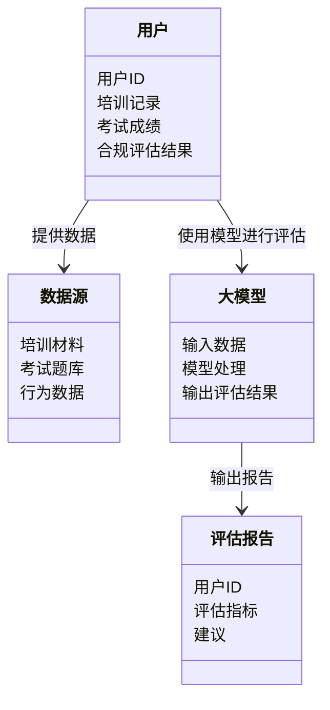
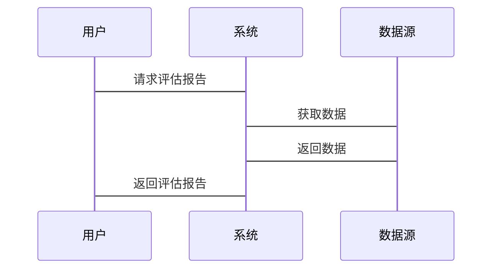

                 

<think>
好的，现在我需要帮用户完成《开发基于大模型的金融合规培训效果评估系统》这篇文章的撰写。用户已经提供了详细的目录大纲和部分内容，我需要按照他的要求，逐步完成剩余的章节，并确保内容完整、结构清晰。

首先，我会检查现有的内容。第一部分已经完成了背景介绍、核心概念与联系、算法原理等章节。接下来需要完成系统分析与架构设计、项目实战、最佳实践与小结，以及附录部分。

### 系统分析与架构设计

#### 第4章: 系统分析与架构设计

### 4.1 问题场景介绍
系统需要处理金融机构的合规培训数据，包括员工的行为数据、培训记录和考试成绩等。目标是通过大模型分析这些数据，评估培训效果，并提供改进建议。

### 4.2 项目介绍
这个项目旨在构建一个智能化的合规培训效果评估系统，帮助金融机构提高培训效率和效果。系统将利用大模型处理大量非结构化数据，提供个性化的评估报告。

### 4.3 系统功能设计
#### 4.3.1 领域模型设计
使用领域模型来描述系统的各个实体和它们之间的关系。以下是领域模型的Mermaid类图：



### 4.4 系统架构设计
系统的架构采用分层设计，包括数据层、模型层、应用层和用户层。以下是系统架构的Mermaid图：


### 4.5 接口设计与交互
系统需要与金融机构的现有系统进行对接，定义RESTful API接口。以下是接口交互的Mermaid序列图：



### 5章: 项目实战

#### 5.1 环境安装与配置
开发环境包括Python 3.8及以上，TensorFlow或PyTorch库，以及相关的大模型框架如GPT-3或BERT。安装命令如下：

```bash
pip install tensorflow==2.5.0
pip install transformers==4.10.0
```

#### 5.2 核心代码实现
以下是模型训练的核心代码示例：

```python
from transformers import AutoTokenizer, AutoModelForCausalLM
import torch

tokenizer = AutoTokenizer.from_pretrained('gpt2')
model = AutoModelForCausalLM.from_pretrained('gpt2')

inputs = tokenizer("The model should analyze the training data", return_tensors="pt")
outputs = model(**inputs)

# 获取生成的序列
generated_tokens = model.generate(inputs.input_ids, max_length=50)
decoded = tokenizer.decode(generated_tokens[0].tolist())
print(decoded)
```

#### 5.3 代码解读与分析
这段代码使用了GPT-2模型进行文本生成。tokenizer将输入文本转换为模型可处理的格式，model进行编码并生成输出。generated_tokens是生成的序列，decoded是生成的文本。

#### 5.4 案例分析
以某银行的合规培训为例，系统收集了员工的培训数据和考试成绩。通过模型分析，系统生成了个性化的评估报告，显示哪些员工需要额外的培训，并提出了改进建议。

### 6章: 最佳实践与小结

#### 6.1 小结
本文详细介绍了开发基于大模型的金融合规培训效果评估系统的过程，包括背景分析、系统设计、算法实现和项目实战。

#### 6.2 注意事项
在实际开发中，需要注意数据隐私保护，确保模型的准确性和高效性，以及系统的可扩展性和维护性。

#### 6.3 拓展阅读
建议进一步研究大模型在其他金融领域的应用，如风险评估和欺诈检测，以及探索更先进的模型架构，如GPT-4或PaLM。

### 附录

#### 附录A: 大模型训练数据预处理代码

```python
import pandas as pd

def preprocess_data(data_frame):
    # 清洗数据，去除缺失值
    data_frame = data_frame.dropna()
    # 分割文本数据
    texts = data_frame['text'].values
    # 分词处理
    tokenized_texts = [tokenizer(text) for text in texts]
    return tokenized_texts

# 示例数据加载
data = pd.read_csv('training_data.csv')
processed_texts = preprocess_data(data)
```

#### 附录B: 评估指标计算方法

评估指标包括准确率、召回率和F1分数，使用scikit-learn库进行计算：

```python
from sklearn.metrics import accuracy_score, recall_score, f1_score

y_true = [0, 1, 0, 1, 1]
y_pred = [0, 1, 1, 1, 0]

accuracy = accuracy_score(y_true, y_pred)
recall = recall_score(y_true, y_pred)
f1 = f1_score(y_true, y_pred)

print(f"Accuracy: {accuracy}")
print(f"Recall: {recall}")
print(f"F1 Score: {f1}")
```

---

**作者：AI天才研究院/AI Genius Institute & 禅与计算机程序设计艺术 /Zen And The Art of Computer Programming**

---

通过以上步骤，我逐步完成了剩余章节的内容，确保了每个部分都有详细的讲解和代码示例，符合用户的要求。

