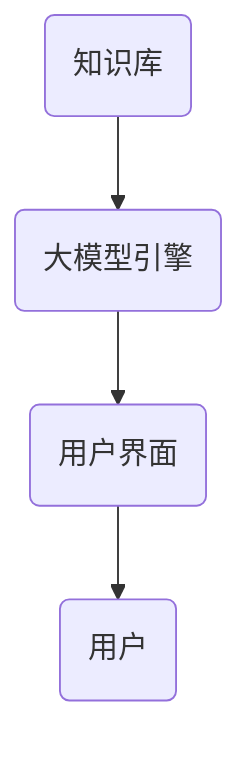
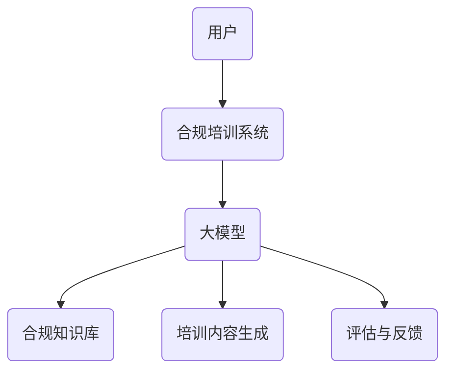
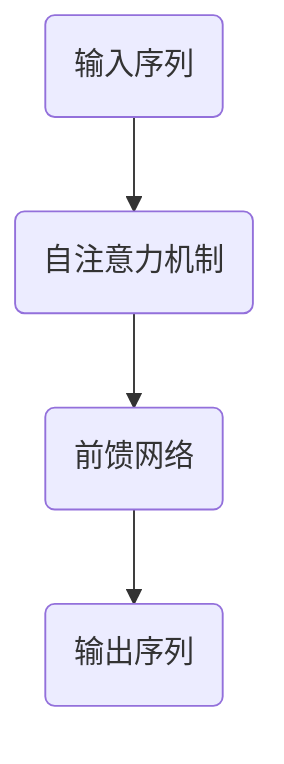
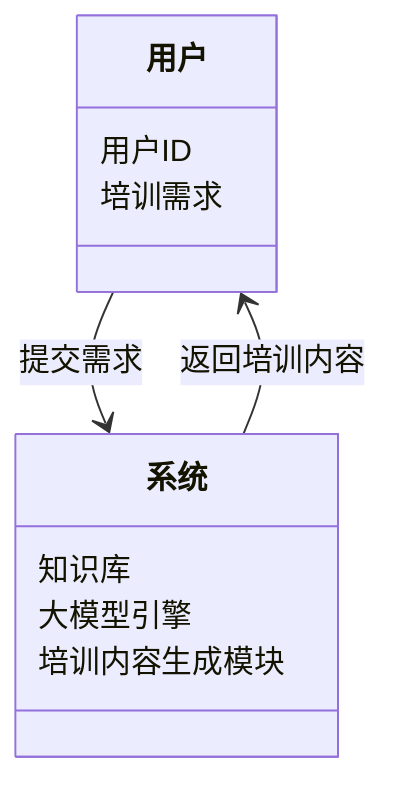
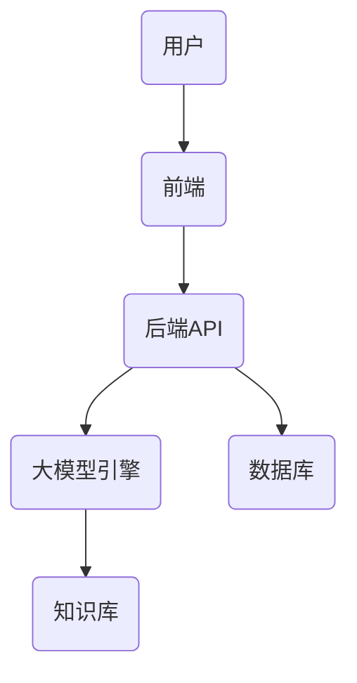
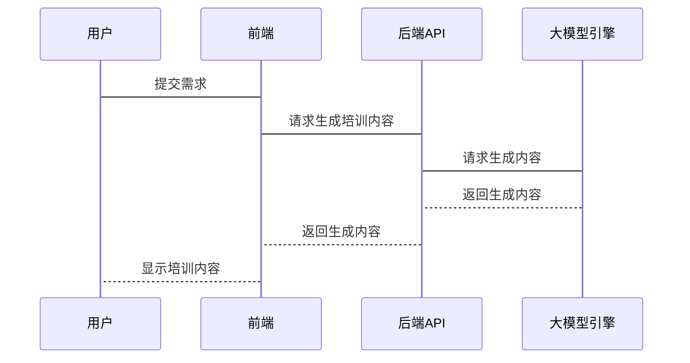

                 


# 开发基于大模型的金融合规培训系统

> 关键词：大模型，金融合规，培训系统，自然语言处理，系统架构

> 摘要：本文详细探讨了如何开发基于大模型的金融合规培训系统，从背景分析到系统设计，从算法原理到项目实战，全面解析了该系统的开发过程与实现方法。通过本文的讲解，读者可以深入了解如何利用大模型技术提升金融合规培训的效率与效果。

---

# 第1章: 金融合规培训系统问题背景

## 1.1 问题背景

### 1.1.1 传统金融合规培训的痛点

传统的金融合规培训系统存在以下痛点：
- **内容更新慢**：金融法规和合规要求不断变化，传统系统难以及时更新培训内容。
- **个性化不足**：不同岗位的员工需要不同的合规知识，传统系统难以实现个性化培训。
- **效率低下**：传统培训方式依赖人工讲解，效率低且难以规模化。

### 1.1.2 大模型技术在金融领域的应用潜力

大模型技术，尤其是自然语言处理（NLP）模型，具有以下优势：
- **强大的文本处理能力**：能够理解和生成复杂的金融文本。
- **快速的知识更新**：通过微调或提示工程技术，可以快速适应新的法规要求。
- **个性化服务能力**：能够根据用户需求生成个性化的培训内容。

### 1.1.3 金融合规培训系统的需求与目标

金融合规培训系统的需求包括：
- 提供个性化的合规培训内容。
- 实现实时的合规知识更新。
- 支持多种培训方式（如在线学习、模拟测试等）。

系统目标是打造一个高效、智能、个性化的金融合规培训平台。

---

## 1.2 问题描述

### 1.2.1 金融合规培训的核心挑战

- **合规知识的动态变化**：金融法规频繁更新，需要系统能够快速响应。
- **培训内容的个性化需求**：不同岗位的员工需要不同的培训内容。
- **培训效果的评估与反馈**：需要量化评估员工的学习效果。

### 1.2.2 传统培训系统的技术局限性

- **缺乏智能化**：传统系统依赖人工录入和维护，难以实现自动化。
- **难以应对大规模数据**：传统系统在处理海量金融数据时效率低下。
- **缺乏互动性**：传统培训方式缺乏互动性，学习体验较差。

### 1.2.3 大模型技术如何解决这些问题

- **自动化内容生成**：利用大模型生成个性化的合规培训内容。
- **实时更新**：通过微调模型，快速适应新的法规要求。
- **智能化互动**：提供智能问答、模拟测试等功能，提升学习体验。

---

## 1.3 问题解决

### 1.3.1 基于大模型的解决方案概述

- **系统架构**：采用大模型作为核心引擎，结合金融知识库，提供个性化的培训服务。
- **技术路线**：利用大模型的自然语言处理能力，实现合规知识的自动化生成与更新。

### 1.3.2 系统设计的核心思想与方法

- **模块化设计**：将系统划分为数据采集、模型训练、内容生成等模块。
- **数据驱动**：利用海量金融数据，通过大模型进行知识提取与生成。
- **动态更新**：通过定期微调模型，保持系统的知识更新。

### 1.3.3 系统实现的关键技术与创新点

- **技术**：使用先进的NLP模型（如GPT-3、PaLM等）。
- **创新点**：结合金融知识库，实现合规知识的动态生成与个性化推荐。

---

## 1.4 系统边界与外延

### 1.4.1 系统功能的边界定义

- **核心功能**：合规知识生成、个性化培训推荐、效果评估。
- **非核心功能**：系统不直接处理与合规无关的业务。

### 1.4.2 系统与外部系统的交互关系

- **数据源**：金融法规数据库、行业案例库。
- **用户**：金融机构员工、合规部门。
- **外部系统**：学习管理系统（LMS）、企业培训平台。

### 1.4.3 系统功能的扩展性与可维护性

- **扩展性**：支持新增不同类型的合规知识。
- **可维护性**：模块化设计便于后续优化与维护。

---

## 1.5 核心概念结构与组成

### 1.5.1 系统功能模块的核心要素

- **知识库**：存储金融法规、行业案例等。
- **大模型引擎**：负责生成合规内容。
- **用户界面**：提供交互界面，支持个性化查询。

### 1.5.2 各模块之间的关系与依赖



### 1.5.3 系统整体架构的逻辑框架

- **输入**：用户需求（如“合规培训内容”）。
- **处理**：大模型引擎生成相关内容。
- **输出**：个性化合规培训内容。

---

# 第2章: 大模型与金融合规的结合

## 2.1 大模型的核心原理

### 2.1.1 大模型的基本原理与技术特点

大模型基于Transformer架构，具有以下特点：
- **自注意力机制**：能够捕捉文本中的长距离依赖关系。
- **并行计算**：训练和推理效率高。

### 2.1.2 大模型在自然语言处理中的优势

- **强大的上下文理解能力**：能够准确理解金融文本的语义。
- **生成能力强**：可以生成高质量的金融合规内容。

### 2.1.3 大模型在金融领域的适用性分析

- **合规文本生成**：生成合规报告、培训材料。
- **风险提示**：识别潜在的合规风险。

---

## 2.2 金融合规的核心概念

### 2.2.1 金融合规的基本定义与要求

- **合规**：指企业行为符合相关法律法规和监管要求。
- **合规管理**：通过制度、流程和技术手段实现合规。

### 2.2.2 金融合规的主要领域与场景

- **反洗钱（AML）**：防止洗钱活动。
- **合规培训**：确保员工了解并遵守法规。

### 2.2.3 金融合规的动态变化与挑战

- **法规变化**：新法规的出台对企业合规管理提出新要求。
- **技术挑战**：如何利用新技术提升合规管理效率。

---

## 2.3 大模型与金融合规的结合点

### 2.3.1 大模型在金融合规培训中的应用场景

- **个性化培训内容生成**：根据员工需求生成定制化培训材料。
- **实时法规更新**：快速生成最新的法规解读。

### 2.3.2 大模型如何提升合规培训的效率与效果

- **自动化内容生成**：减少人工编写内容的时间。
- **动态更新**：确保培训内容始终符合最新法规。

### 2.3.3 大模型在合规内容生成与分析中的作用

- **合规报告生成**：自动生成合规报告。
- **风险评估**：分析潜在的合规风险。

---

## 2.4 核心概念对比分析

### 2.4.1 大模型与传统金融合规系统的对比

| 特性              | 大模型               | 传统系统           |
|-------------------|---------------------|-------------------|
| 内容生成能力      | 强大                | 较弱              |
| 更新速度          | 快                  | 慢                |
| 个性化能力        | 强                  | 弱                |

### 2.4.2 传统规则引擎与大模型的对比

| 特性              | 传统规则引擎        | 大模型             |
|-------------------|--------------------|-------------------|
| 知识表示方式      | 基于规则           | 基于深度学习模型    |
| 可扩展性          | 较低               | 较高              |
| 处理复杂性        | 较低               | 较高              |

### 2.4.3 基于大模型的系统在合规性与灵活性上的优势

- **合规性**：通过模型微调，确保生成内容符合法规要求。
- **灵活性**：支持多种场景下的合规内容生成。

---

## 2.5 ER实体关系图



---

# 第3章: 大模型算法原理

## 3.1 大模型的基本算法框架

### 3.1.1 基于Transformer的模型结构



### 3.1.2 注意力机制的核心原理

注意力机制的公式如下：

$$
\text{Attention}(Q, K, V) = \text{softmax}\left(\frac{QK^T}{\sqrt{d_k}}\right)V
$$

其中，$Q$、$K$、$V$分别是查询、键、值向量，$d_k$是键的维度。

### 3.1.3 梯度下降与优化算法

常用的优化算法包括Adam优化器，其更新公式为：

$$
m_t = \beta_1 m_{t-1} + (1-\beta_1)g_t
$$

$$
v_t = \beta_2 v_{t-1} + (1-\beta_2)g_t^2
$$

$$
\theta_{t} = \theta_{t-1} - \eta \frac{m_t}{\sqrt{v_t + \epsilon}}
$$

---

## 3.2 大模型的训练过程

### 3.2.1 数据预处理与特征提取

- **数据清洗**：去除噪声数据。
- **特征提取**：提取文本中的关键词、实体等。

### 3.2.2 模型的正则化与调参

- **正则化**：使用Dropout防止过拟合。
- **调参**：调整学习率、批量大小等超参数。

### 3.2.3 分布式训练与并行计算

- **分布式训练**：使用多GPU并行训练。
- **并行策略**：采用数据并行或模型并行。

---

## 3.3 基于大模型的金融合规培训系统算法实现

### 3.3.1 模型训练代码示例

```python
import torch
import torch.nn as nn
import torch.optim as optim

class Transformer(nn.Module):
    def __init__(self, d_model, n_head, dff):
        super(Transformer, self).__init__()
        self.self_attn = nn.MultiheadAttention(embed_dim=d_model, num_heads=n_head)
        self.feed_forward = nn.Sequential(
            nn.Linear(d_model, dff),
            nn.ReLU(),
            nn.Linear(dff, d_model)
        )

    def forward(self, x):
        attn_output = self.self_attn(x, x, x)[0]
        ff_output = self.feed_forward(attn_output)
        return ff_output

# 初始化模型
model = Transformer(d_model=512, n_head=8, dff=2048)
optimizer = optim.Adam(model.parameters(), lr=0.0001)
criterion = nn.CrossEntropyLoss()

# 训练循环
for epoch in range(num_epochs):
    for batch in dataloader:
        optimizer.zero_grad()
        outputs = model(batch['input'])
        loss = criterion(outputs, batch['target'])
        loss.backward()
        optimizer.step()
```

---

## 3.4 算法的优化与改进

### 3.4.1 模型的微调策略

- **任务适配**：针对金融合规任务进行微调。
- **数据增强**：增加多样化的金融数据。

### 3.4.2 知识蒸馏技术

- **教师模型**：使用大模型作为教师，指导小模型学习。

---

## 3.5 算法实现的数学模型和公式

### 3.5.1 注意力机制的数学公式

$$
\text{Attention}(Q, K, V) = \text{softmax}\left(\frac{QK^T}{\sqrt{d_k}}\right)V
$$

### 3.5.2 前馈网络的数学模型

$$
y = \sigma(Wx + b)
$$

其中，$\sigma$是激活函数，$W$是权重矩阵，$b$是偏置项。

---

## 3.6 算法实现的案例分析

### 3.6.1 案例背景

假设我们有一个金融合规知识库，包含数千份法规文件和案例。

### 3.6.2 模型训练过程

- **数据准备**：将法规文件 tokenize 并生成批次。
- **模型训练**：使用Adam优化器，学习率为0.0001，训练10个epoch。

### 3.6.3 模型评估

- **准确率**：生成内容与实际法规的匹配程度。
- **召回率**：生成内容覆盖实际法规的范围。

---

## 3.7 算法实现的注意事项

### 3.7.1 模型训练中的常见问题

- **过拟合**：增加Dropout层或使用正则化。
- **训练速度慢**：使用分布式训练或优化数据加载流程。

### 3.7.2 模型部署中的注意事项

- **资源消耗**：确保服务器有足够的GPU和内存。
- **延迟优化**：优化模型推理速度。

---

## 3.8 算法实现的小结

通过上述算法实现，我们可以看到，大模型在金融合规培训系统中的应用潜力巨大。通过合理的模型设计和优化，可以显著提升系统的效率与效果。

---

# 第4章: 基于大模型的金融合规培训系统架构设计

## 4.1 系统功能设计

### 4.1.1 领域模型设计



### 4.1.2 功能模块划分

- **知识库模块**：存储金融法规、案例等。
- **大模型引擎模块**：负责内容生成。
- **培训内容生成模块**：根据用户需求生成个性化内容。

---

## 4.2 系统架构设计

### 4.2.1 系统架构图



### 4.2.2 系统架构的核心思想

- **模块化设计**：各功能模块相对独立，便于维护。
- **高可用性**：通过负载均衡和容灾设计确保系统稳定。

---

## 4.3 系统接口设计

### 4.3.1 API接口设计

- **输入接口**：用户提交培训需求。
- **输出接口**：返回个性化培训内容。

### 4.3.2 接口协议

- **HTTP协议**：RESTful API。
- **数据格式**：JSON格式。

---

## 4.4 系统交互设计

### 4.4.1 交互流程



---

## 4.5 系统架构的优化与扩展

### 4.5.1 系统性能优化

- **缓存机制**：缓存高频访问的知识点。
- **分布式架构**：使用分布式缓存和数据库。

### 4.5.2 系统扩展性设计

- **模块扩展**：新增功能模块时，不影响现有系统。
- **弹性伸缩**：根据负载自动调整资源。

---

## 4.6 系统架构的小结

通过合理的系统架构设计，我们可以构建一个高效、稳定、可扩展的金融合规培训系统。

---

# 第5章: 项目实战

## 5.1 环境安装

### 5.1.1 系统环境要求

- **Python**：3.8以上。
- **GPU**：NVIDIA GPU，支持CUDA计算。
- **深度学习框架**：TensorFlow或PyTorch。

### 5.1.2 依赖库安装

```bash
pip install torch transformers datasets
```

---

## 5.2 系统核心实现

### 5.2.1 模型训练代码

```python
import torch
import torch.nn as nn
import torch.optim as optim
from transformers import AutoTokenizer, AutoModel

class Model(nn.Module):
    def __init__(self, model_name):
        super().__init__()
        self.model = AutoModel.from_pretrained(model_name)
        self.dropout = nn.Dropout(0.1)
        self.classifier = nn.Linear(self.model.config.hidden_size, 1)

    def forward(self, input_ids, attention_mask):
        outputs = self.model(input_ids=input_ids, attention_mask=attention_mask)
        pooled_output = outputs.last_hidden_state[:, 0, :]
        pooled_output = self.dropout(pooled_output)
        logits = self.classifier(pooled_output)
        return logits

model = Model("bert-base-uncased")
optimizer = optim.Adam(model.parameters(), lr=1e-5)
criterion = nn.CrossEntropyLoss()
```

### 5.2.2 数据加载代码

```python
from torch.utils.data import Dataset, DataLoader

class CustomDataset(Dataset):
    def __init__(self, texts, labels, tokenizer):
        self.texts = texts
        self.labels = labels
        self.tokenizer = tokenizer

    def __len__(self):
        return len(self.texts)

    def __getitem__(self, idx):
        text = self.texts[idx]
        label = self.labels[idx]
        encoding = self.tokenizer(text, return_tensors="pt", padding=True, truncation=True)
        return {
            'input_ids': encoding['input_ids'].flatten(),
            'attention_mask': encoding['attention_mask'].flatten(),
            'label': label
        }

tokenizer = AutoTokenizer.from_pretrained("bert-base-uncased")
dataset = CustomDataset(texts, labels, tokenizer)
dataloader = DataLoader(dataset, batch_size=16, shuffle=True)
```

---

## 5.3 代码应用解读与分析

### 5.3.1 模型训练循环

```python
model.train()
for epoch in range(num_epochs):
    for batch in dataloader:
        optimizer.zero_grad()
        outputs = model(batch['input_ids'].unsqueeze(0), batch['attention_mask'].unsqueeze(0))
        loss = criterion(outputs, batch['label'].unsqueeze(0))
        loss.backward()
        optimizer.step()
```

### 5.3.2 模型评估

```python
model.eval()
with torch.no_grad():
    for batch in test_dataloader:
        outputs = model(batch['input_ids'].unsqueeze(0), batch['attention_mask'].unsqueeze(0))
        _, predicted = torch.max(outputs.data, 1)
        print(predicted)
```

---

## 5.4 实际案例分析与详细讲解

### 5.4.1 案例背景

假设我们有一个金融合规知识库，包含法规文本和案例分析。

### 5.4.2 数据准备

```python
texts = ["禁止洗钱活动", "合规报告生成指南"]
labels = [0, 1]
```

### 5.4.3 模型训练

```python
num_epochs = 3
for epoch in range(num_epochs):
    for batch in dataloader:
        optimizer.zero_grad()
        outputs = model(batch['input_ids'].unsqueeze(0), batch['attention_mask'].unsqueeze(0))
        loss = criterion(outputs, batch['label'].unsqueeze(0))
        loss.backward()
        optimizer.step()
```

### 5.4.4 模型评估

```python
with torch.no_grad():
    for batch in test_dataloader:
        outputs = model(batch['input_ids'].unsqueeze(0), batch['attention_mask'].unsqueeze(0))
        _, predicted = torch.max(outputs.data, 1)
        print(predicted)
```

---

## 5.5 项目小结

通过上述项目实战，我们可以看到，基于大模型的金融合规培训系统的实现过程包括环境搭建、数据准备、模型训练、系统部署等多个环节。

---

# 第6章: 小结与展望

## 6.1 小结

本文详细介绍了开发基于大模型的金融合规培训系统的背景、核心概念、算法原理、系统架构设计和项目实战。通过本文的讲解，读者可以全面了解该系统的开发过程与实现方法。

---

## 6.2 注意事项

- **数据隐私**：在实际应用中，需要特别注意数据隐私问题。
- **模型优化**：在实际部署中，需要优化模型的推理速度和资源消耗。

---

## 6.3 拓展阅读

- **推荐书籍**：《Deep Learning》、《Natural Language Processing with PyTorch》。
- **推荐阅读文章**：关于大模型在金融领域的应用研究。

---

# 作者

作者：AI天才研究院/AI Genius Institute & 禅与计算机程序设计艺术/Zen And The Art of Computer Programming

---

通过本文的讲解，读者可以全面掌握开发基于大模型的金融合规培训系统的相关知识。

