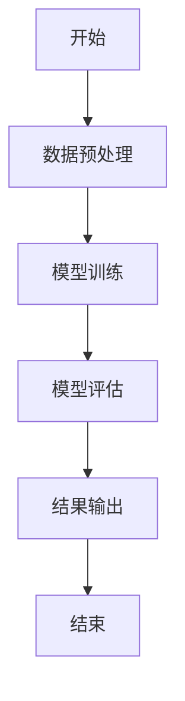
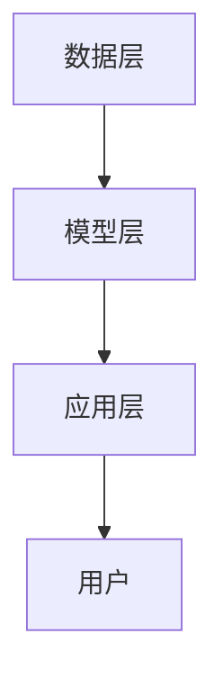

                 


```markdown
# 开发基于大模型的金融政策影响评估工具

> 关键词：大模型，金融政策，影响评估，自然语言处理，时间序列分析

> 摘要：本文详细探讨了开发基于大模型的金融政策影响评估工具的背景、核心概念、算法原理、系统架构设计以及项目实战。通过结合大模型的自然语言处理能力和金融领域的专业知识，提出了一个高效、准确的金融政策影响评估工具，并通过实际案例展示了其应用效果。

---

## 第一部分: 金融政策影响评估工具开发背景与核心概念

### 第1章: 金融政策影响评估工具的背景与意义

#### 1.1 问题背景
- **金融政策评估的复杂性**：金融政策的影响涉及多个维度，包括经济、市场和社会等，传统的评估方法难以全面捕捉这些复杂因素。
- **传统评估方法的局限性**：基于专家经验的传统评估方法存在主观性强、效率低、难以量化等问题。
- **大模型技术的引入动机**：大模型（如GPT、BERT等）具有强大的自然语言处理能力和数据驱动的特征提取能力，能够有效应对金融政策评估中的复杂性问题。

#### 1.2 问题描述
- **金融政策影响的多维度分析**：金融政策可能对GDP增长、就业率、市场波动、社会稳定等产生影响，需要综合考虑多个指标。
- **数据的多样性与实时性要求**：金融政策评估需要处理大量异构数据（文本、时间序列等），并且要求实时或近实时的分析能力。
- **模型的可解释性与准确性需求**：金融政策评估需要模型不仅准确，还需要具备较高的可解释性，以便政策制定者理解和信任评估结果。

#### 1.3 问题解决思路
- **基于大模型的自然语言处理能力**：利用大模型对政策文本的深度理解和语义分析能力，提取关键信息。
- **结合金融领域的专业知识**：引入金融领域的知识图谱和专家经验，增强模型的行业适应性。
- **数据驱动的方法**：通过大量历史数据训练模型，提升其预测能力和泛化能力。

#### 1.4 边界与外延
- **金融政策的定义范围**：明确金融政策的范围，例如货币政策、财政政策、金融监管政策等。
- **工具的适用场景与限制**：工具适用于政策文本分析、市场反应预测等场景，但在极端情况下（如黑天鹅事件）可能表现不佳。
- **与其他金融工具的区分**：与传统的金融分析工具（如Excel模型、计量经济学模型）相比，大模型工具具有更高的自动化和智能化特点。

#### 1.5 核心概念结构与组成
- **大模型的作用机制**：大模型通过预训练和微调，学习金融政策文本中的语义和模式，从而实现政策影响的自动化评估。
- **金融政策的影响维度**：包括经济指标（如GDP增长率）、市场指标（如股票指数波动）、社会指标（如就业率）等。
- **工具的系统架构**：工具由数据层、模型层和应用层组成，分别负责数据输入、模型计算和结果输出。

---

## 第2章: 大模型与金融政策评估的核心概念

### 2.1 大模型的基本原理
- **大模型的训练过程**：
  - 预训练：在大规模通用文本数据上进行无监督学习，提取语言模型的参数。
  - 微调：在特定领域的金融政策文本数据上进行有监督学习，优化模型的领域适应性。
- **模型的特征提取能力**：大模型能够提取文本中的语义信息、上下文关系和领域知识，为金融政策评估提供丰富的特征表示。
- **模型的可扩展性与适应性**：大模型可以通过参数调整和架构优化，适应不同类型的金融政策评估任务。

### 2.2 金融政策评估的关键指标
- **经济影响指标**：GDP增长率、通货膨胀率、失业率等。
- **市场反应指标**：股票指数波动、债券收益率变化、外汇汇率波动等。
- **社会影响指标**：社会稳定指数、公众舆论 sentiment、政策实施后的社会反馈等。

### 2.3 大模型与金融政策评估的结合点
- **自然语言处理在政策文本分析中的应用**：利用大模型对政策文本进行语义分析，提取关键信息。
- **时间序列分析在政策影响预测中的应用**：结合大模型的文本分析能力，预测政策实施后的经济和社会指标变化。
- **统计学习在政策效果评估中的应用**：通过统计学习方法，评估政策的因果关系和效果强度。

---

## 第3章: 大模型在金融政策评估中的优势与挑战

### 3.1 大模型的优势
- **高效的数据处理能力**：大模型能够快速处理大量异构数据，包括文本、时间序列和结构化数据。
- **强大的模式识别能力**：通过深度学习，大模型能够识别复杂的模式和关系，帮助发现潜在的政策影响。
- **可扩展的应用场景**：大模型可以应用于多种金融政策评估任务，具有较高的通用性和灵活性。

### 3.2 大模型的挑战
- **模型的可解释性问题**：大模型的决策过程通常是黑箱的，缺乏透明性，这在金融政策评估中可能引发信任问题。
- **数据的隐私与安全问题**：金融政策评估可能涉及敏感数据，如何确保数据的安全性和隐私性是一个重要挑战。
- **算法的稳定性和鲁棒性问题**：大模型在面对极端情况或小样本数据时，可能表现出不稳定或不准确的结果。

### 3.3 应对挑战的策略
- **提高模型的可解释性**：通过模型解构技术（如注意力机制可视化）和可解释性模型（如线性模型）来增强模型的可解释性。
- **加强数据安全与隐私保护**：采用数据加密、数据脱敏和联邦学习等技术，确保数据的安全性和隐私性。
- **优化算法的稳定性和鲁棒性**：通过模型集成、正则化和数据增强等方法，提升模型的稳定性和鲁棒性。

---

## 第4章: 大模型的训练与优化

### 4.1 大模型的训练过程
- **预训练阶段**：
  - 使用大规模通用文本数据（如维基百科、新闻文章）进行无监督学习，提取语言模型的参数。
  - 采用自监督学习任务（如掩码词预测、句子关系预测）来提升模型的语义理解能力。
- **微调阶段**：
  - 在特定领域的金融政策文本数据上进行有监督学习，优化模型的领域适应性。
  - 使用金融领域的标注数据（如政策文本分类数据）进行微调，提升模型在金融政策评估任务中的表现。
- **评估阶段**：
  - 使用验证集或测试集对模型进行评估，验证模型的准确性和可解释性。
  - 通过交叉验证和对比实验，进一步优化模型的参数和架构。

### 4.2 模型优化策略
- **参数优化**：
  - 通过梯度下降（如Adam优化器）优化模型参数，降低模型的损失函数值。
  - 调整学习率、批量大小等超参数，找到最优的训练配置。
- **模型压缩**：
  - 使用模型剪枝、知识蒸馏等技术，减少模型的参数数量，降低计算成本。
  - 优化模型的计算效率，使其能够在资源受限的环境中运行。
- **模型集成**：
  - 使用集成学习方法（如投票、加权平均）结合多个模型的输出，提升模型的准确性和稳定性。
  - 通过集成多个大模型的预测结果，进一步提高模型的泛化能力。

---

## 第5章: 金融政策影响评估的算法实现

### 5.1 算法原理
- **基于大模型的文本分析**：
  - 使用大模型对金融政策文本进行语义分析，提取政策的关键信息（如政策目标、实施时间、涉及领域等）。
  - 通过文本相似度计算，识别政策文本之间的关系，帮助预测政策的潜在影响。
- **基于时间序列的预测模型**：
  - 使用ARIMA、LSTM等时间序列模型，预测政策实施后的经济和社会指标变化。
  - 结合大模型的文本分析能力，将政策文本特征与时间序列数据相结合，提升预测的准确性。
- **统计学习方法的结合**：
  - 使用回归分析、因果推断等统计方法，评估政策的因果关系和效果强度。
  - 结合大模型的特征提取能力，构建更复杂的统计模型，提升评估的深度和广度。

### 5.2 算法流程图


---

## 第6章: 系统架构设计与实现

### 6.1 问题场景介绍
- **金融政策评估的场景**：政策制定者需要快速了解政策的潜在影响，以便做出科学决策。
- **系统目标**：开发一个基于大模型的金融政策影响评估工具，提供高效、准确的评估服务。
- **用户需求**：政策制定者、金融分析师、学术研究人员等需要一个易于使用的工具，快速获取政策评估结果。

### 6.2 系统功能设计
- **数据层**：
  - 数据采集：从多种数据源（如政府公告、新闻媒体、学术论文）获取金融政策文本和相关数据。
  - 数据预处理：清洗、标注和结构化数据，确保数据的可用性和一致性。
- **模型层**：
  - 文本分析模块：利用大模型对政策文本进行语义分析和特征提取。
  - 时间序列预测模块：基于模型预测政策实施后的经济和社会指标变化。
  - 统计评估模块：结合统计学习方法，评估政策的因果关系和效果强度。
- **应用层**：
  - 用户界面：提供友好的用户界面，方便用户输入政策文本并获取评估结果。
  - 结果展示：以可视化的方式呈现政策评估结果，包括影响指标、预测曲线和评估报告。

### 6.3 系统架构设计


---

## 第7章: 项目实战与应用案例

### 7.1 环境安装与配置
- **开发环境**：
  - 安装Python 3.8及以上版本。
  - 安装深度学习框架（如TensorFlow、PyTorch）和大模型库（如Hugging Face的Transformers库）。
  - 安装数据处理和可视化工具（如Pandas、Matplotlib、Seaborn）。
- **依赖管理**：
  - 使用虚拟环境管理项目依赖，确保各个模块的版本兼容性。
  - 安装必要的依赖包（如transformers、scikit-learn、pandas等）。

### 7.2 系统核心实现
- **文本分析模块实现**：
  ```python
  from transformers import AutoTokenizer, AutoModelForMaskedLM
  model_name = "bert-large-uncased"
  tokenizer = AutoTokenizer.from_pretrained(model_name)
  model = AutoModelForMaskedLM.from_pretrained(model_name)
  # 对政策文本进行编码和分析
  inputs = tokenizer("This is a sample policy text.", return_tensors="pt")
  outputs = model(**inputs)
  ```
- **时间序列预测模块实现**：
  ```python
  from statsmodels.tsa.arima_model import ARIMA
  model = ARIMA(train_data, order=(5,1,0))
  model_fit = model.fit()
  forecast, conf_int = model_fit.forecast(5)
  ```
- **统计评估模块实现**：
  ```python
  import statsmodels.api as sm
  model = sm.OLS(y, sm.add_constant(X))
  results = model.fit()
  print(results.summary())
  ```

### 7.3 实际案例分析
- **案例背景**：假设某国实施一项新的货币政策，需要评估其对GDP增长率的影响。
- **数据准备**：
  - 政策文本：货币政策的具体内容和实施计划。
  - 历史数据：过去几年的GDP增长率、通货膨胀率、利率等经济指标。
- **模型训练与评估**：
  - 使用大模型对政策文本进行语义分析，提取关键词和主题。
  - 基于时间序列数据训练ARIMA模型，预测政策实施后的GDP增长率。
  - 结合统计学习方法，评估政策的因果关系和效果强度。
- **结果展示**：
  - 可视化政策实施前后的GDP增长率变化。
  - 提供政策评估报告，包括预测结果、置信区间和模型的可解释性分析。

---

## 第8章: 最佳实践、小结与注意事项

### 8.1 最佳实践
- **数据质量管理**：
  - 确保数据的准确性和完整性，避免因数据质量问题影响模型的性能。
  - 定期更新数据，保持模型的实时性和准确性。
- **模型优化策略**：
  - 定期对模型进行再训练和优化，提升其适应性和准确性。
  - 使用模型集成和知识蒸馏等技术，平衡模型的性能和计算成本。
- **用户教育与培训**：
  - 提供用户友好的界面和操作指南，降低工具的使用门槛。
  - 通过培训和文档支持，帮助用户更好地理解和使用工具。

### 8.2 小结
- 本文详细探讨了开发基于大模型的金融政策影响评估工具的背景、核心概念、算法原理、系统架构设计以及项目实战。
- 通过结合大模型的自然语言处理能力和金融领域的专业知识，提出了一种高效、准确的金融政策影响评估工具。
- 实际案例展示了工具的应用效果，验证了其可行性和有效性。

### 8.3 注意事项
- **数据隐私与安全**：
  - 在处理敏感数据时，必须遵守相关法律法规，确保数据的安全性和隐私性。
  - 采用数据加密、脱敏和联邦学习等技术，降低数据泄露风险。
- **模型的可解释性**：
  - 在金融政策评估中，模型的可解释性至关重要，需要通过可视化和解释性模型增强模型的透明性。
- **模型的稳定性和鲁棒性**：
  - 在面对极端情况或小样本数据时，模型可能会出现不稳定或不准确的情况，需要通过模型集成和数据增强等技术加以优化。

---

## 作者：AI天才研究院/AI Genius Institute & 禅与计算机程序设计艺术 /Zen And The Art of Computer Programming
```

