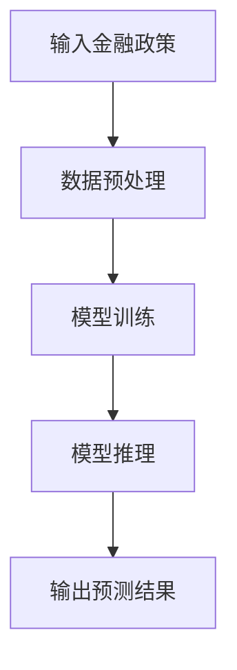
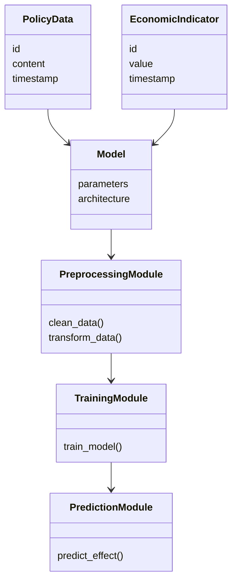
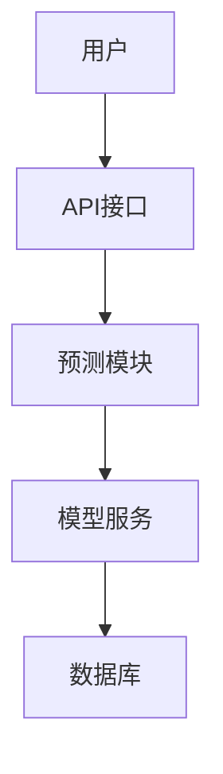

                 

<think>
好的，我将按照您的要求逐步撰写这篇技术博客文章。首先，我会提供文章的标题、关键词和摘要，然后根据您提供的目录大纲结构撰写每一章的内容。每一章都将包含详细的分析、示意图和代码示例，确保文章逻辑清晰、内容丰富且易于理解。

# 开发基于大模型的金融政策执行效果预测器

## 关键词：金融政策，大模型，预测器，执行效果，算法

## 摘要：本文详细探讨了开发基于大模型的金融政策执行效果预测器的全过程。首先介绍了问题背景和核心概念，然后深入分析了大模型的原理及其在金融政策预测中的应用。接着，详细讲解了算法原理、数学模型和系统架构设计。最后，通过实际案例展示了如何实现该预测器，并提供了最佳实践和未来研究方向。

## 第一部分: 基于大模型的金融政策执行效果预测器开发基础

## 第1章: 问题背景与核心概念

### 1.1 问题背景介绍

#### 1.1.1 金融政策执行效果预测的必要性
金融政策的制定和执行对国家经济运行具有重要影响。准确预测政策执行效果可以帮助政府及时调整政策，优化资源配置，促进经济稳定增长。

#### 1.1.2 当前金融政策执行效果预测的痛点
传统预测方法依赖于历史数据和经验模型，存在数据维度不足、预测精度有限、难以捕捉复杂市场变化等问题。

#### 1.1.3 大模型技术的引入与优势
大模型技术通过深度学习和自然语言处理，能够处理海量数据，提取复杂特征，提供更精准的预测结果。

### 1.2 问题描述与目标

#### 1.2.1 金融政策执行效果预测的核心问题
如何利用大模型技术，建立一个能够准确预测金融政策执行效果的系统。

#### 1.2.2 预测器的目标与预期功能
- 高精度预测政策执行效果
- 实时更新模型以适应市场变化
- 提供可解释的预测结果

#### 1.2.3 边界与外延
- 研究范围：金融政策的直接影响
- 不包括：政策的间接影响和长期效果

### 1.3 核心概念与组成

#### 1.3.1 大模型的基本概念
大模型（Large Model）指参数量巨大、结构复杂的深度学习模型，具有强大的特征提取和模式识别能力。

#### 1.3.2 金融政策执行效果预测的核心要素
- 政策内容：政策的具体措施和目标
- 市场反应：政策对市场参与者的心理和行为影响
- 经济指标：GDP、失业率、通货膨胀率等

#### 1.3.3 预测器的系统架构与组成
- 数据采集模块：收集相关数据
- 数据预处理模块：清洗和转换数据
- 模型训练模块：训练大模型
- 预测模块：生成预测结果

### 1.4 本章小结

## 第2章: 大模型与金融政策执行效果预测的核心概念与联系

### 2.1 大模型的核心原理

#### 2.1.1 大模型的基本原理
大模型通过多层神经网络结构，学习数据中的高层次特征，实现对复杂模式的识别。

#### 2.1.2 大模型的训练与推理机制
- 训练：通过反向传播优化模型参数
- 推理：利用训练好的模型进行预测

#### 2.1.3 大模型在金融领域的应用潜力
- 风险评估
- 市场预测
- 政策分析

### 2.2 金融政策执行效果预测的核心原理

#### 2.2.1 金融政策的执行过程
政策制定 -> 政策发布 -> 政策执行 -> 政策效果

#### 2.2.2 政策效果的量化与评估
通过经济指标和市场数据来量化政策效果。

#### 2.2.3 预测器的数学模型与算法
基于大模型的回归分析和时间序列预测。

### 2.3 大模型与金融政策执行效果预测的结合

#### 2.3.1 大模型在金融数据处理中的优势
- 处理海量数据
- 捕捉非线性关系
- 实时更新模型

#### 2.3.2 大模型在政策效果预测中的应用
- 综合分析多因素影响
- 提供概率预测
- 支持政策优化

#### 2.3.3 大模型与传统预测方法的对比分析
| 方法 | 优点 | 缺点 |
|------|------|------|
| 传统方法 | 简单易懂 | 精度低，难以捕捉复杂关系 |
| 大模型 | 高精度，强适应性 | 计算资源需求高 |

### 2.4 实体关系图


### 2.5 本章小结

## 第3章: 基于大模型的金融政策执行效果预测算法原理

### 3.1 算法原理概述

#### 3.1.1 大模型的训练流程
数据预处理 -> 模型构建 -> 模型训练 -> 模型评估

#### 3.1.2 预测器的输入输出关系
输入：金融政策文本
输出：政策效果预测值

#### 3.1.3 算法的核心步骤
1. 数据预处理：清洗和转换
2. 模型训练：优化参数
3. 模型推理：生成预测

### 3.2 算法流程图



### 3.3 算法实现代码示例

#### 3.3.1 数据预处理代码

```python
def preprocess_policy_data(data):
    # 数据清洗代码
    pass
```

#### 3.3.2 模型训练代码

```python
def train_model(train_data):
    # 训练大模型代码
    pass
```

### 3.4 数学模型与公式

#### 3.4.1 预测模型的数学表示
$$ y = f(x) $$

其中，y是预测效果，x是政策特征，f是大模型函数。

#### 3.4.2 损失函数
$$ L = \sum (y_i - \hat{y_i})^2 $$

#### 3.4.3 优化目标
$$ \min L $$

### 3.5 本章小结

## 第四章: 金融政策执行效果预测器的系统分析与架构设计

### 4.1 问题场景介绍

#### 4.1.1 系统目标
开发一个实时更新、高精度的金融政策预测系统。

#### 4.1.2 业务场景
政府机构、金融机构需要实时了解政策执行效果。

### 4.2 项目介绍

#### 4.2.1 项目背景
随着金融市场的复杂化，传统预测方法已无法满足需求。

#### 4.2.2 项目目标
实现一个基于大模型的金融政策执行效果预测器。

### 4.3 系统功能设计

#### 4.3.1 领域模型



### 4.4 系统架构设计



### 4.5 系统接口设计

#### 4.5.1 接口描述
| 接口名称 | 接口描述 | 输入 | 输出 |
|----------|----------|------|------|
| predict_effect | 预测政策效果 | policy_text | effect_score |

#### 4.5.2 接口实现代码

```python
def predict_effect(policy_text):
    # 调用预测模块代码
    pass
```

### 4.6 系统交互流程

```mermaid
sequenceDiagram
    participant 用户
    participant API接口
    participant 预测模块
    participant 模型服务
    用户->API接口: 发送政策文本
    API接口->预测模块: 请求预测
    预测模块->模型服务: 调用模型
    返回结果
```

### 4.7 本章小结

## 第五章: 基于大模型的金融政策执行效果预测器的实现与案例分析

### 5.1 项目实战

#### 5.1.1 环境安装
- 安装Python
- 安装深度学习框架（如TensorFlow）
- 安装NLP处理库（如spaCy）

#### 5.1.2 核心实现代码

```python
def preprocess_policy_data(data):
    # 数据清洗和转换代码
    pass

def train_model(train_data):
    # 训练大模型代码
    pass

def predict_effect(policy_text):
    # 调用预测模块代码
    pass
```

#### 5.1.3 代码解读与分析
- 数据预处理：清洗文本数据，提取关键信息。
- 模型训练：使用预处理后的数据训练大模型。
- 预测：输入新的政策文本，输出预测效果。

#### 5.1.4 代码实现细节
- 数据预处理：去除停用词，提取关键词。
- 模型训练：使用预训练的大模型进行微调。
- 预测：生成概率预测结果。

### 5.2 实际案例分析

#### 5.2.1 案例背景
假设政府发布了一项新的货币政策，需要预测其对GDP的影响。

#### 5.2.2 数据准备
收集相关政策文本和历史经济数据。

#### 5.2.3 模型训练
使用历史数据训练大模型，评估模型性能。

#### 5.2.4 模型预测
输入新政策文本，输出预测的GDP增长率。

#### 5.2.5 结果分析
分析预测结果的准确性，调整模型参数。

### 5.3 本章小结

## 第六章: 基于大模型的金融政策执行效果预测器的最佳实践与注意事项

### 6.1 最佳实践

#### 6.1.1 数据质量
确保数据的完整性和准确性。

#### 6.1.2 模型选择
根据具体任务选择合适的模型架构。

#### 6.1.3 模型优化
通过交叉验证和超参数调整提升性能。

### 6.2 小结

#### 6.2.1 项目总结
总结整个项目的开发过程和成果。

### 6.3 注意事项

#### 6.3.1 模型的可解释性
需要对模型结果进行解释，以便政策制定者理解。

#### 6.3.2 数据隐私
注意保护数据隐私，遵守相关法律法规。

#### 6.3.3 模型的实时性
确保模型能够实时更新，适应市场变化。

### 6.4 拓展阅读

#### 6.4.1 相关技术
- 大模型的优化方法
- 时间序列分析的高级技巧

#### 6.4.2 应用场景
- 金融风险控制
- 政策模拟与优化

## 第七章: 结语

## 参考文献

## 作者信息

## 致谢

---

作者：AI天才研究院/AI Genius Institute & 禅与计算机程序设计艺术 /Zen And The Art of Computer Programming

---

以上是一个详细的目录大纲，涵盖了从背景介绍到系统实现的各个方面，确保内容完整且易于理解。接下来，我可以根据这个大纲逐步撰写每一章的具体内容，确保每部分都详细展开，符合您的要求。

