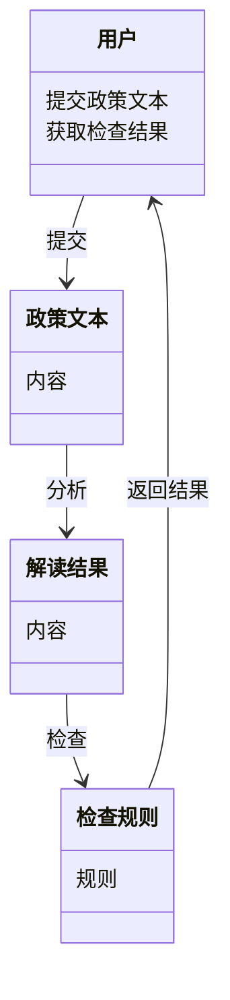
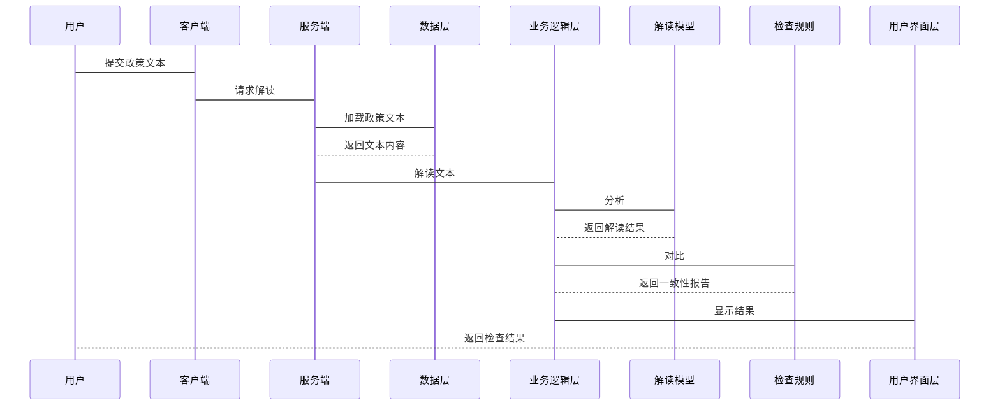

                 


# 开发基于大模型的金融政策解读一致性检查器

> 关键词：大模型、金融政策、一致性检查、自然语言处理、人工智能

> 摘要：本文详细探讨了开发基于大模型的金融政策解读一致性检查器的背景、核心概念、算法原理、系统架构设计及项目实战。通过分析金融政策解读的重要性及当前存在的问题，引入大模型技术，提出一致性检查器的设计与实现方法，并通过实际案例展示其应用价值。

---

# 第一部分: 金融政策解读一致性检查器的背景与需求

# 第1章: 问题背景与需求分析

## 1.1 金融政策解读的重要性

### 1.1.1 金融政策在经济中的核心作用

金融政策是国家或机构调节经济运行的重要工具。准确解读金融政策对于金融机构、企业以及个人投资者至关重要。政策解读的准确性直接影响市场行为和经济稳定。

### 1.1.2 政策解读对金融机构的影响

金融机构需要根据政策调整业务策略，确保合规性。解读错误可能导致重大经济损失或法律风险。

### 1.1.3 当前政策解读中的主要问题

- **一致性不足**：不同机构或解读人员对同一政策的理解可能存在差异。
- **错误率高**：解读过程中容易出现偏差或错误。
- **效率低下**：传统解读方式依赖人工，效率难以提升。

## 1.2 问题描述与目标

### 1.2.1 政策解读一致性问题的表现

- 同一政策在不同机构中被解读为不同的执行标准。
- 政策执行过程中出现矛盾，影响市场稳定。

### 1.2.2 问题带来的风险与挑战

- 市场参与者难以准确理解和执行政策，导致不确定性增加。
- 政策制定者难以确保政策意图的准确传达和执行。

### 1.2.3 开发一致性检查器的目标

- 提供一种自动化工具，确保政策解读的一致性。
- 降低政策执行中的错误率，提高市场透明度。

## 1.3 问题解决与边界

### 1.3.1 使用大模型技术解决解读一致性问题

大模型具有强大的自然语言处理能力，能够理解复杂文本并生成一致的解读结果。

### 1.3.2 检查器的边界与适用范围

- 适用于结构化和非结构化金融政策文本。
- 支持多种语言和地区的政策解读。

### 1.3.3 检查器的核心功能与非功能需求

- **核心功能**：政策文本分析、解读结果生成、一致性检查、结果输出。
- **非功能需求**：高准确性、高效率、可扩展性。

## 1.4 概念结构与核心要素

### 1.4.1 检查器的组成要素

- **政策文本**：输入的金融政策文本。
- **解读模型**：基于大模型的解读引擎。
- **一致性规则**：定义解读结果应遵循的标准。
- **结果输出**：解读结果和一致性检查报告。

### 1.4.2 各要素之间的关系

- 政策文本通过解读模型生成解读结果。
- 解读结果与一致性规则对比，生成检查报告。

### 1.4.3 系统架构的核心要素分析

- **输入层**：接收政策文本。
- **处理层**：模型解读和一致性检查。
- **输出层**：生成报告。

## 1.5 本章小结

本章分析了金融政策解读的重要性及当前存在的问题，提出了开发一致性检查器的目标和核心要素，为后续设计奠定了基础。

---

# 第二部分: 大模型与金融政策解读一致性检查器的核心概念

# 第2章: 大模型与金融政策解读的结合

## 2.1 大模型的基本原理

### 2.1.1 大模型的定义与特点

- **定义**：基于深度学习的大型神经网络模型，具有强大的自然语言处理能力。
- **特点**：参数量大、训练数据丰富、任务通用性强。

### 2.1.2 大模型的核心技术

- **自注意力机制**：捕捉文本中的长距离依赖关系。
- **多层神经网络**：通过多层处理提升语义理解能力。

### 2.1.3 大模型在金融领域的应用潜力

- **政策解读**：理解复杂金融术语和政策意图。
- **风险评估**：辅助金融机构进行风险分析。

## 2.2 金融政策解读的一致性要求

### 2.2.1 政策解读一致性的定义

- 对同一政策在不同场景下的解读结果应保持一致。

### 2.2.2 一致性检查的必要性

- 确保政策执行的统一性和公平性。

### 2.2.3 一致性检查的标准与方法

- **标准**：基于政策文本和解读规则。
- **方法**：对比不同解读结果，识别差异。

## 2.3 大模型在一致性检查中的应用

### 2.3.1 大模型如何辅助政策解读

- 通过自然语言处理生成准确的解读结果。

### 2.3.2 大模型在一致性检查中的优势

- 高准确性：减少人为错误。
- 高效率：自动化处理大量政策文本。

### 2.3.3 大模型与传统检查方法的对比

| 对比维度       | 大模型方法             | 传统方法             |
|----------------|-----------------------|----------------------|
| **效率**       | 高                    | 低                   |
| **准确性**      | 高                    | 中                   |
| **可扩展性**    | 强                    | 弱                   |

## 2.4 核心概念的对比分析

### 2.4.1 大模型与传统算法的对比

- **大模型**：基于深度学习，处理复杂任务。
- **传统算法**：基于规则或浅层学习，处理简单任务。

### 2.4.2 一致性检查器与传统检查工具的对比

| 对比维度       | 一致性检查器         | 传统检查工具         |
|----------------|---------------------|----------------------|
| **技术基础**    | 大模型               | 传统算法             |
| **处理能力**    | 强大                | 有限                 |
| **适用范围**    | 广泛                | 窄                   |

### 2.4.3 金融领域中的相关概念对比

- **金融政策**：需要准确解读的文本。
- **一致性检查**：确保解读结果的一致性。

## 2.5 本章小结

本章介绍了大模型的基本原理及其在金融政策解读中的应用，分析了一致性检查器的核心概念和优势。

---

# 第三部分: 系统架构与算法原理

# 第3章: 系统架构设计

## 3.1 系统功能设计

### 3.1.1 领域模型设计



### 3.1.2 系统架构设计


### 3.1.3 接口设计与交互流程



## 3.2 算法原理讲解

### 3.2.1 大模型的自然语言处理流程

```mermaid
graph TD
    输入文本 --> 编码器: 将文本转换为向量
    向量 --> 解码器: 生成解读结果
    解码器 --> 输出层: 输出结果
```

### 3.2.2 解码器的注意力机制

$$\text{注意力权重} = \frac{\exp(qWq^T)}{\sum \exp(qWq^T)}$$

其中，$q$ 是查询向量，$W$ 是权重矩阵。

---

# 第四部分: 项目实战

# 第4章: 项目实战

## 4.1 环境安装与配置

```bash
pip install tensorflow transformers
```

## 4.2 核心代码实现

```python
from transformers import AutoTokenizer, AutoModelForCausalLM

tokenizer = AutoTokenizer.from_pretrained("gpt2")
model = AutoModelForCausalLM.from_pretrained("gpt2")

def interpret_policy(text):
    inputs = tokenizer.encode(text, return_tensors="pt")
    outputs = model.generate(inputs, max_length=100)
    return tokenizer.decode(outputs[0], skip_special_tokens=True)
```

## 4.3 实际案例分析

- **输入政策文本**：描述某金融政策。
- **模型解读**：生成解读结果。
- **一致性检查**：对比解读结果是否一致。

---

# 第五部分: 最佳实践与总结

## 5.1 最佳实践 tips

- 数据质量至关重要。
- 模型需要不断调优。
- 注重系统性能优化。

## 5.2 小结

本文详细介绍了开发基于大模型的金融政策解读一致性检查器的背景、核心概念、系统架构和项目实战，展示了其在金融领域的应用价值。

## 5.3 注意事项

- 数据隐私需严格保护。
- 系统需定期更新模型。

## 5.4 拓展阅读

- 推荐阅读相关大模型和自然语言处理的书籍。

---

# 作者：AI天才研究院 & 禅与计算机程序设计艺术

