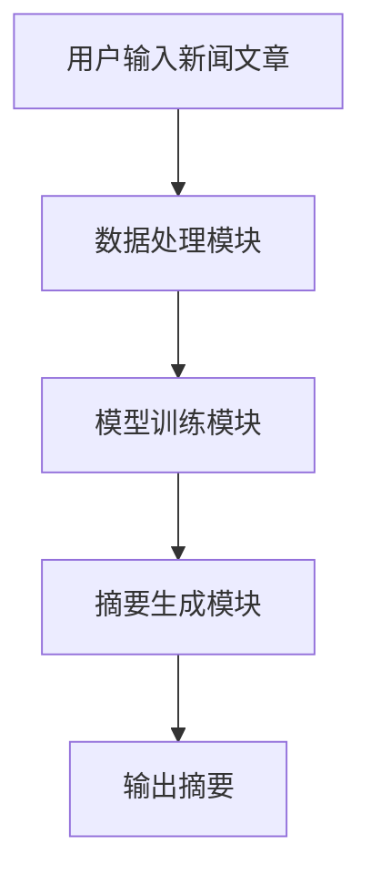

                 


# 开发基于大模型的金融新闻摘要生成器

> 关键词：大模型，自然语言处理，文本生成，金融新闻，摘要生成器

> 摘要：本文详细探讨了基于大模型的金融新闻摘要生成器的开发过程，涵盖从理论基础到实际应用的各个方面。文章首先介绍大模型的基本概念和自然语言处理的基础知识，接着深入分析生成式AI的原理和金融领域的自然语言处理技术。然后，详细讲解大模型在金融新闻摘要中的应用，包括任务定义、模型选择与优化、结果评估等。最后，通过系统设计与实现、项目实战等部分，展示如何将理论应用于实际项目中，提供完整的代码示例和系统架构设计。

---

# 第1章：背景与基础

## 1.1 问题背景

### 1.1.1 金融新闻摘要的重要性
金融新闻摘要的生成对于投资者、分析师和研究人员来说至关重要。快速获取关键信息可以帮助他们做出及时的决策。传统的摘要方法依赖于人工操作，效率低下且成本高昂，而基于大模型的自动摘要生成器可以显著提高效率并降低成本。

### 1.1.2 大模型在文本生成中的优势
大模型，如GPT-3、BERT等，具备强大的语言理解和生成能力。它们通过大量数据的预训练，能够生成连贯且上下文相关的文本。此外，大模型可以轻松扩展到金融领域，通过微调适应特定领域的语言模式。

### 1.1.3 传统方法的局限性
传统文本摘要方法通常基于规则或统计模型，难以处理复杂语义和上下文信息。例如，基于字面的剪切粘贴方法容易遗漏关键信息，而基于特征的提取方法难以捕捉深层语义关系。

## 1.2 大模型概述

### 1.2.1 大模型的基本概念
大模型是指具有大量参数的深度学习模型，通常由Transformer架构构成。这些模型通过预训练掌握了广泛的语义知识，能够处理多种语言任务。

### 1.2.2 大模型的训练机制
大模型的训练通常分为预训练和微调两个阶段。预训练阶段使用通用的大规模文本数据进行无监督学习，微调阶段则使用特定领域的数据进行有监督优化。

### 1.2.3 大模型的应用领域
大模型已在多个领域得到广泛应用，包括文本生成、机器翻译、问答系统等。在金融领域，大模型被用于新闻摘要、风险评估、市场分析等任务。

## 1.3 自然语言处理基础

### 1.3.1 词向量与句子表示
词向量（如Word2Vec、GloVe）和句子表示（如BERT）是自然语言处理的基础。词向量能够捕捉词语的语义信息，句子表示则能够捕捉句子的上下文信息。

### 1.3.2 生成式模型简介
生成式模型通过学习数据分布，生成新的数据样本。常见的生成式模型包括循环神经网络（RNN）、变种自注意力网络（Transformer）等。

### 1.3.3 大模型在文本生成中的应用
大模型在文本生成中的应用主要体现在以下几点：
1. **文本补全**：根据输入的前半部分生成后半部分。
2. **对话生成**：在聊天机器人中生成回复。
3. **新闻摘要**：将长篇文章压缩成简洁的摘要。

---

# 第2章：生成式AI的原理

## 2.1 大模型的训练过程

### 2.1.1 预训练目标
预训练目标通常包括：
- **语言模型任务**：预测句子中的下一个词。
- **掩码语言模型任务**：在输入中随机遮蔽部分词，要求模型根据上下文预测被遮蔽的词。

### 2.1.2 微调策略
微调是指在预训练的基础上，使用特定领域的数据对模型进行进一步优化。例如，使用金融领域的新闻数据对大模型进行微调，使其更适合生成金融摘要。

### 2.1.3 模型评估方法
常用的评估方法包括：
- **自动评估指标**：如BLEU、ROUGE等。
- **人工评估**：邀请专家对生成结果进行打分。

## 2.2 文本生成机制

### 2.2.1 解码策略
解码策略决定了生成文本的方式：
- **贪心解码**：每次选择概率最高的词。
- **随机解码**：在每个步骤中随机选择一个词，增加生成结果的多样性。
- **束搜索**：生成多个候选序列，选择最优的一个。

### 2.2.2 模型的生成过程
生成过程通常包括以下步骤：
1. **输入处理**：将输入文本转换为模型可处理的形式。
2. **解码**：根据编码结果生成输出序列。
3. **输出处理**：将生成的序列转换为人类可读的文本。

### 2.2.3 模型的调优技巧
- **学习率调整**：使用学习率衰减策略。
- **早停机制**：防止过拟合。
- **批量处理**：提高训练效率。

## 2.3 大模型的数学基础

### 2.3.1 概率论基础
生成模型基于概率分布生成文本，例如，语言模型的目标是最大化生成文本的概率。

### 2.3.2 神经网络结构
Transformer模型由编码器和解码器组成，编码器负责将输入序列编码为上下文向量，解码器负责根据编码结果生成输出序列。

### 2.3.3 注意力机制的数学表达
注意力机制的数学表达式如下：
$$
\text{Attention}(Q, K, V) = \text{softmax}\left(\frac{QK^T}{\sqrt{d_k}}\right)V
$$
其中，$Q$是查询向量，$K$是键向量，$V$是值向量，$d_k$是向量的维度。

---

# 第3章：金融领域的自然语言处理

## 3.1 金融文本的特点

### 3.1.1 专业术语
金融文本中包含大量专业术语，如“每股收益”、“市盈率”等，这些术语的理解对摘要生成至关重要。

### 3.1.2 文本结构
金融新闻通常具有固定的结构，如标题、导语、正文和结论。了解这种结构有助于模型更好地捕捉关键信息。

### 3.1.3 领域知识
金融领域有丰富的领域知识，如经济指标、市场趋势等。这些知识可以帮助模型生成更准确的摘要。

## 3.2 金融数据预处理

### 3.2.1 数据清洗
数据清洗包括去除噪声数据、填补缺失值等步骤。例如，去除重复的新闻标题，填补缺失的日期信息。

### 3.2.2 数据标注
数据标注包括为文本添加标签，如“正面”、“负面”、“中性”等情感标签，以及实体标注如公司名称、日期等。

### 3.2.3 数据增强
数据增强方法包括同义词替换、句式变换等，以增加数据的多样性，提高模型的泛化能力。

## 3.3 金融实体识别与关系抽取

### 3.3.1 实体识别技术
实体识别（NER）用于识别文本中的金融实体，如公司名称、股票代码等。常用的算法包括CRF、LSTM等。

### 3.3.2 关系抽取方法
关系抽取用于识别实体之间的关系，如“公司A收购了公司B”。常用的方法包括基于规则的抽取、基于模式的匹配等。

### 3.3.3 技术挑战与解决方案
技术挑战包括金融术语的多样性、文本复杂性等。解决方案包括使用预训练模型、结合领域知识等。

---

# 第4章：大模型在金融新闻摘要中的应用

## 4.1 任务定义与目标

### 4.1.1 摘要生成的定义
金融新闻摘要生成的任务是将一篇金融新闻文章压缩成一段简洁的文字，同时保留文章的核心信息。

### 4.1.2 金融摘要的独特性
金融摘要需要关注关键数据和趋势，如公司财务数据、市场趋势等。这些信息对投资者的决策至关重要。

### 4.1.3 生成器的设计目标
生成器的设计目标包括：
1. 高准确率：生成的摘要应准确反映原文内容。
2. 高可读性：生成的摘要应易于理解。
3. 高效率：生成摘要的速度应足够快，以满足实时需求。

## 4.2 模型选择与优化

### 4.2.1 基础模型的选择
选择适合金融领域的基础模型，如GPT-3、BERT等。这些模型具有强大的文本生成能力，适合金融摘要任务。

### 4.2.2 模型的微调策略
对基础模型进行微调，使用金融领域的数据进行优化。例如，使用金融新闻数据对模型进行微调，使其更适合生成金融摘要。

### 4.2.3 模型的评估指标
常用的评估指标包括：
- **ROUGE**：基于召回率的评估指标。
- **BLEU**：基于精确度的评估指标。
- **人工评估**：邀请专家对生成结果进行打分。

## 4.3 生成结果的评估与优化

### 4.3.1 评估指标的选择
选择合适的评估指标对于模型优化至关重要。常用的评估指标包括ROUGE、BLEU等。

### 4.3.2 生成结果的优化方法
优化方法包括：
1. **调整解码策略**：如使用束搜索增加生成结果的多样性。
2. **优化模型参数**：如调整学习率、批量大小等。
3. **结合领域知识**：在生成过程中引入领域知识，如公司财务数据、市场趋势等。

### 4.3.3 案例分析与讨论
通过具体案例分析生成结果的质量，讨论模型的优缺点，并提出改进建议。

---

# 第5章：系统设计与实现

## 5.1 系统架构设计

### 5.1.1 总体架构
系统总体架构包括数据处理模块、模型训练模块、摘要生成模块和用户界面模块。

### 5.1.2 模块划分
模块划分包括：
- **数据处理模块**：负责数据的清洗、标注和增强。
- **模型训练模块**：负责模型的预训练和微调。
- **摘要生成模块**：负责生成新闻摘要。
- **用户界面模块**：提供用户交互界面。

### 5.1.3 系统流程图


## 5.2 接口设计与实现

### 5.2.1 API定义
API定义包括输入接口和输出接口。输入接口接收新闻文章，输出接口返回生成的摘要。

### 5.2.2 接口实现细节
接口实现细节包括：
- **输入格式**：如JSON格式。
- **输出格式**：如JSON格式，包含生成的摘要和置信度评分。

### 5.2.3 接口测试与优化
通过测试用例验证接口的正确性，优化接口的响应时间。

## 5.3 系统实现细节

### 5.3.1 数据处理流程
数据处理流程包括数据清洗、标注和增强。例如，使用NLTK库进行文本清洗，使用 SpaCy 进行实体识别。

### 5.3.2 模型加载与调用
模型加载与调用包括：
1. 加载预训练模型。
2. 使用微调后的模型生成摘要。

### 5.3.3 系统交互流程
系统交互流程包括用户输入、数据处理、模型调用和结果输出。

---

# 第6章：项目实战

## 6.1 环境搭建与数据准备

### 6.1.1 环境搭建
环境搭建包括安装必要的库，如Python、TensorFlow、Keras等。

### 6.1.2 数据准备
数据准备包括收集金融新闻数据，进行清洗和标注。

## 6.2 核心实现源代码

### 6.2.1 数据处理代码
```python
import pandas as pd
from tensorflow.keras.preprocessing.text import Tokenizer
from tensorflow.keras.preprocessing.sequence import pad_sequences

# 加载数据
data = pd.read_csv('financial_news.csv')

# 分割文本和标签
texts = data['text'].values
labels = data['label'].values

# 文本处理
tokenizer = Tokenizer()
tokenizer.fit_on_texts(texts)
sequences = tokenizer.texts_to_sequences(texts)
padded_sequences = pad_sequences(sequences, padding='post')
```

### 6.2.2 模型训练代码
```python
from tensorflow.keras.models import Model
from tensorflow.keras.layers import Input, LSTM, Dense, Dropout, Bidirectional

# 定义模型
input_layer = Input(shape=(None,))
embedding_layer = Embedding(vocabulary_size, 64)(input_layer)
bidirectional_lstm = Bidirectional(LSTM(64, return_sequences=True))(embedding_layer)
dropout_layer = Dropout(0.5)(bidirectional_lstm)
dense_layer = Dense(64, activation='relu')(dropout_layer)
output_layer = Dense(num_classes, activation='softmax')(dense_layer)

model = Model(inputs=input_layer, outputs=output_layer)
model.compile(loss='sparse_categorical_crossentropy', optimizer='adam', metrics=['accuracy'])
```

### 6.2.3 生成摘要代码
```python
def generate_summary(model, tokenizer, max_length=100):
    input_text = "..."
    sequence = tokenizer.texts_to_sequences([input_text])[0]
    padded_sequence = pad_sequences([sequence], padding='post', maxlen=max_length)
    prediction = model.predict(padded_sequence)
    predicted_class = np.argmax(prediction, axis=1)
    summary = tokenizer.sequences_to_texts([predicted_class])[0]
    return summary
```

## 6.3 项目小结

### 6.3.1 环境搭建与数据准备
环境搭建包括安装必要的库和数据准备。

### 6.3.2 模型训练与优化
模型训练包括预训练和微调，优化包括调整超参数和使用早停机制。

### 6.3.3 生成器实现与测试
生成器实现包括定义解码策略和生成接口，测试包括生成摘要和评估结果。

---

# 作者：AI天才研究院/AI Genius Institute & 禅与计算机程序设计艺术 /Zen And The Art of Computer Programming

