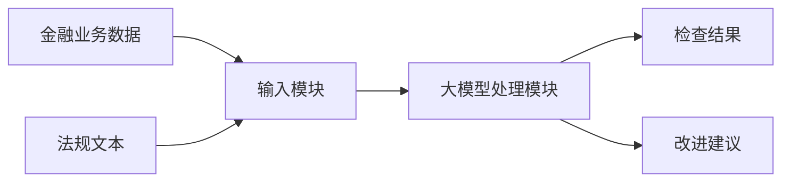
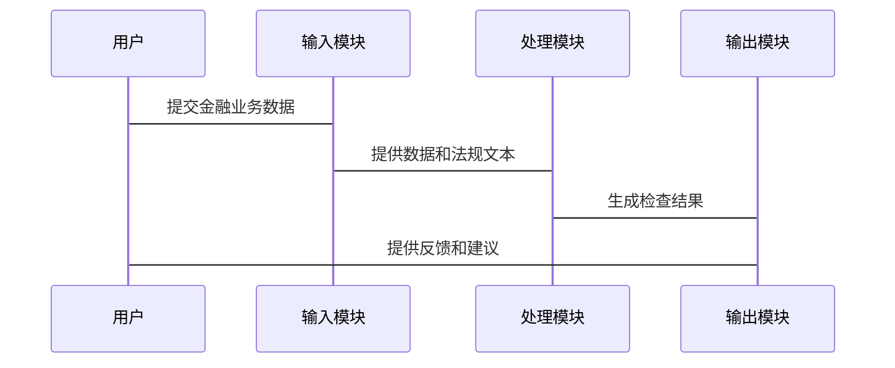

                 


# 开发基于大模型的金融法规遵从性检查系统

**关键词**：金融法规、大模型、自然语言处理、系统架构、人工智能

**摘要**：随着金融行业的快速发展，法规遵从性检查变得越来越复杂和重要。本文详细探讨了基于大模型的金融法规遵从性检查系统，从问题背景、核心概念到算法原理、系统架构，再到项目实战和最佳实践，为读者提供全面的解决方案和深入的技术分析。

---

# 第1章: 问题背景与现状

## 1.1 问题背景

### 1.1.1 金融法规遵从性的重要性
金融法规是维护金融市场秩序、保护投资者权益的重要手段。随着金融业务的复杂化和全球化，合规性检查的难度和成本也在不断增加。传统的基于规则的检查方法难以应对日益复杂的法规变化和多样化的业务场景。

### 1.1.2 当前金融监管的痛点
- **法规更新频繁**：金融法规不断更新，人工检查难以跟上步伐。
- **数据量大**：金融机构处理的数据量庞大，传统方法效率低下。
- **人为因素**：人工检查容易受到主观因素影响，准确性不足。

### 1.1.3 大模型技术的引入意义
大模型技术，尤其是自然语言处理（NLP）模型，能够自动解析复杂的法规文本，并快速生成符合法规的业务流程，显著提高了合规性检查的效率和准确性。

## 1.2 问题描述

### 1.2.1 金融法规遵从性的核心要素
- **法规解读**：准确理解法规内容和意图。
- **业务规则匹配**：将法规要求与具体业务流程对应。
- **实时检查**：对业务操作进行实时监控和反馈。

### 1.2.2 系统目标与边界
- **目标**：开发一个基于大模型的系统，能够自动检查金融业务是否符合相关法规。
- **边界**：仅关注法规遵从性检查，不涉及业务决策或其他合规领域。

### 1.2.3 问题解决的必要性与可行性
- **必要性**：金融行业的合规性要求日益严格，传统方法已难以满足需求。
- **可行性**：大模型技术在NLP领域的突破为解决此类问题提供了可能。

## 1.3 本章小结
本章介绍了金融法规遵从性检查的重要性，分析了当前监管的痛点，并提出了引入大模型技术的必要性和可行性。

---

# 第2章: 核心概念与联系

## 2.1 大模型技术的核心原理

### 2.1.1 大模型的基本概念
大模型（如GPT-3、BERT）是一种基于深度学习的自然语言处理模型，具有强大的文本理解和生成能力。

### 2.1.2 大模型的训练目标
- **语言建模**：预测下一个词的概率分布。
- **预训练**：利用大规模数据进行无监督学习。

### 2.1.3 大模型的数学模型
大模型通常采用多层神经网络，包括编码器和解码器结构。以下是其核心数学公式：

$$ P(y|x) = \prod_{i=1}^{n} P(y_i|y_{i-1}, x) $$

其中，$x$ 是输入，$y$ 是输出序列。

## 2.2 金融法规遵从性检查系统的架构

### 2.2.1 系统的核心要素
- **输入模块**：接收金融业务数据和法规文本。
- **处理模块**：利用大模型进行法规理解和业务检查。
- **输出模块**：生成检查结果并提供改进建议。

### 2.2.2 系统的实体关系图
使用Mermaid绘制的实体关系图如下：



### 2.2.3 大模型与金融法规的关联
- **法规解读**：大模型能够理解复杂的法规文本，提取关键信息。
- **业务匹配**：通过自然语言处理，大模型可以将法规要求与具体业务流程进行匹配。

## 2.3 本章小结
本章详细介绍了大模型的核心原理，并分析了其在金融法规检查中的应用，展示了系统的整体架构和各模块之间的关系。

---

# 第3章: 算法原理与数学模型

## 3.1 大模型的算法原理

### 3.1.1 大模型的训练流程
1. **数据预处理**：清洗和标注数据。
2. **模型初始化**：随机初始化网络参数。
3. **反向传播**：计算损失函数的梯度并更新参数。

### 3.1.2 大模型的推理机制
- **编码器**：将输入文本转换为向量表示。
- **解码器**：根据编码结果生成输出。

### 3.1.3 模型优化策略
- **学习率调整**：使用Adam优化器。
- **正则化**：添加Dropout层防止过拟合。

## 3.2 金融法规检查的数学模型

### 3.2.1 模型的输入与输出
- **输入**：金融业务文本和法规文本。
- **输出**：是否符合法规的二分类结果。

### 3.2.2 模型的训练目标
最小化交叉熵损失函数：

$$ L = -\frac{1}{N}\sum_{i=1}^{N} \log P(y_i|x_i) $$

### 3.2.3 模型的损失函数
交叉熵损失函数的具体形式：

$$ H(p,q) = -\sum_{i=1}^{n} p_i \log q_i $$

## 3.3 本章小结
本章详细讲解了大模型的算法原理和数学模型，为后续的系统设计和实现奠定了基础。

---

# 第4章: 系统架构与设计

## 4.1 系统的功能设计

### 4.1.1 系统的模块划分
- **数据输入模块**：接收金融业务数据和法规文本。
- **模型处理模块**：利用大模型进行法规理解和业务检查。
- **结果输出模块**：生成检查结果并提供改进建议。

### 4.1.2 模块之间的交互关系
使用Mermaid绘制的交互流程图如下：



## 4.2 系统的架构设计

### 4.2.1 系统的分层架构
- **数据层**：存储金融业务数据和法规文本。
- **逻辑层**：实现法规检查的业务逻辑。
- **表示层**：展示检查结果和改进建议。

### 4.2.2 每层的详细设计
- **数据层**：使用数据库存储结构化数据。
- **逻辑层**：调用大模型API进行处理。
- **表示层**：通过Web界面展示结果。

## 4.3 系统的接口设计

### 4.3.1 系统的输入接口
- **输入格式**：JSON格式的金融业务数据和法规文本。

### 4.3.2 系统的输出接口
- **输出格式**：JSON格式的检查结果和改进建议。

### 4.3.3 接口的交互流程
用户提交数据，系统处理后返回结果，整个流程通过API完成。

## 4.4 本章小结
本章详细设计了系统的架构和接口，确保系统的高效运行和良好的可扩展性。

---

# 第5章: 项目实战与实现

## 5.1 环境搭建

### 5.1.1 开发环境的选择
推荐使用Python 3.8及以上版本，安装必要的库如TensorFlow、Keras和Hugging Face的Transformers库。

### 5.1.2 开发工具的安装
- 安装Python
- 安装必要的库：`pip install tensorflow transformers`

### 5.1.3 环境配置的注意事项
确保GPU支持，安装NVIDIA显卡驱动和CUDA工具链。

## 5.2 核心代码实现

### 5.2.1 数据处理代码
```python
import pandas as pd

def preprocess_data(data):
    # 数据清洗
    data = data.dropna()
    return data
```

### 5.2.2 模型训练代码
```python
from tensorflow.keras.models import Model
from tensorflow.keras.layers import Input, Dense

input_layer = Input(shape=(100,))
dense_layer = Dense(64, activation='relu')(input_layer)
output_layer = Dense(1, activation='sigmoid')(dense_layer)

model = Model(inputs=input_layer, outputs=output_layer)
model.compile(optimizer='adam', loss='binary_crossentropy', metrics=['accuracy'])
model.fit(X_train, y_train, epochs=10, batch_size=32)
```

### 5.2.3 模型推理代码
```python
def check_compliance(input_text):
    prediction = model.predict(input_text)
    return prediction > 0.5
```

## 5.3 代码解读与分析
- **数据处理代码**：对输入数据进行清洗和预处理。
- **模型训练代码**：定义模型结构并进行训练。
- **模型推理代码**：利用训练好的模型进行合规性检查。

## 5.4 实际案例分析
假设我们有一个金融交易数据，系统会自动检查其是否符合相关法规，并提供改进建议。

## 5.5 本章小结
本章通过具体的代码实现和案例分析，展示了如何利用大模型技术开发金融法规检查系统。

---

# 第6章: 最佳实践与总结

## 6.1 最佳实践

### 6.1.1 开发过程中的注意事项
- **数据质量**：确保数据的完整性和准确性。
- **模型优化**：定期更新模型以适应法规变化。

### 6.1.2 系统优化的建议
- **性能优化**：使用分布式计算提高处理速度。
- **可扩展性**：设计模块化架构方便未来扩展。

### 6.1.3 未来发展的方向
- **多模态模型**：结合图像和文本信息进行检查。
- **实时监控**：实现对金融业务的实时合规性检查。

## 6.2 项目总结
本项目通过引入大模型技术，成功实现了金融法规遵从性检查系统的开发，显著提高了合规性检查的效率和准确性。

---

作者：AI天才研究院/AI Genius Institute & 禅与计算机程序设计艺术 /Zen And The Art of Computer Programming

