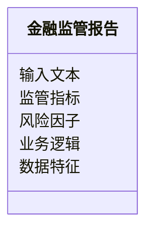
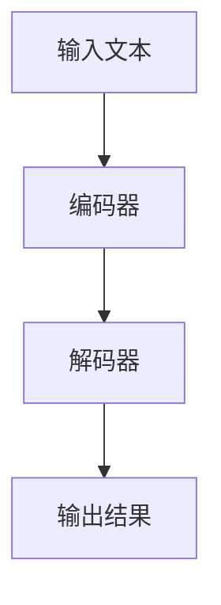
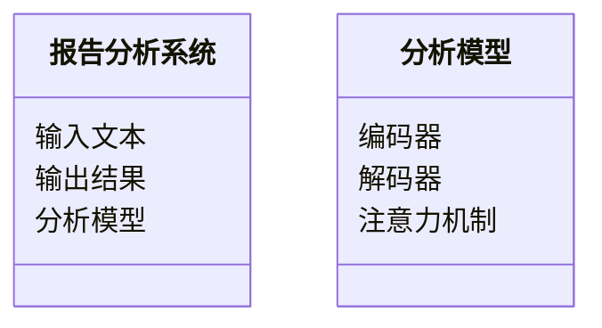
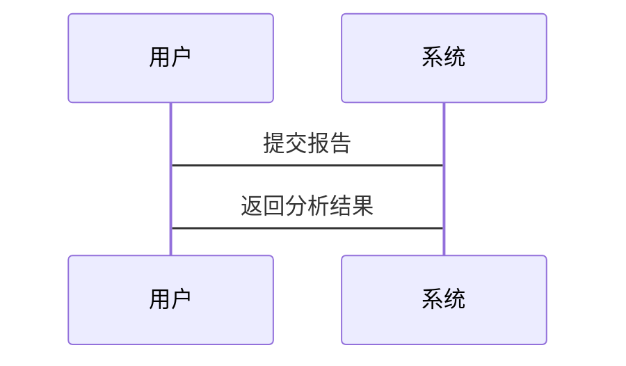

                 


# 开发基于大模型的金融监管报告差异化分析助手

> 关键词：大模型，金融监管，差异化分析，文本处理，风险预测，注意力机制

> 摘要：本文探讨了利用大模型开发金融监管报告差异化分析助手的方法。通过分析金融监管报告的核心要素，结合大模型的文本处理能力和风险预测能力，提出了一种基于注意力机制的解决方案，并详细阐述了系统的架构设计和实现步骤。

---

## 第1章: 背景介绍与问题背景

### 1.1 问题背景与描述

#### 1.1.1 金融监管报告的重要性
金融监管报告是金融机构合规性评估的重要依据，通常包含复杂的文本信息，如财务数据、风险指标和业务逻辑。这些报告需要经过专业的分析，以识别潜在风险和合规问题。

#### 1.1.2 传统金融监管报告分析的局限性
传统的金融监管分析方法依赖人工审查，耗时且效率低下。随着金融市场的复杂化，传统方法难以应对海量数据和多样化的报告类型。

#### 1.1.3 大模型在金融监管中的潜力
大模型（如GPT、BERT）具备强大的文本理解和生成能力，能够自动化处理复杂的金融监管报告，显著提高分析效率和准确性。

### 1.2 问题解决与边界

#### 1.2.1 基于大模型的差异化分析目标
通过大模型实现金融监管报告的自动化分析，识别关键风险点和差异，辅助监管机构做出决策。

#### 1.2.2 边界与外延
本方案仅针对文本型监管报告的分析，不包括非文本数据。后续可以扩展至多模态数据的处理。

#### 1.2.3 核心要素与组成结构
系统由输入模块、分析模块和输出模块组成，分别处理报告输入、模型分析和结果输出。

### 1.3 本章小结
本章介绍了金融监管报告的重要性及传统分析的局限性，阐述了大模型在该领域的应用潜力，并明确了系统的目标和结构。

---

## 第2章: 核心概念与原理

### 2.1 AI大模型的基本原理

#### 2.1.1 大模型的训练机制
大模型通过监督学习和无监督学习进行训练，利用大量数据优化模型参数。

#### 2.1.2 大模型的推理过程
输入文本经过编码器处理后，生成上下文表示，再通过解码器生成输出结果。

#### 2.1.3 大模型的可解释性
通过注意力机制，模型可以解释其决策过程，提高结果的可信度。

### 2.2 金融监管报告分析的核心要素

#### 2.2.1 监管指标与风险因子
包括流动性比率、资本充足率等关键指标，用于评估金融机构的健康状况。

#### 2.2.2 数据特征与业务逻辑
报告中的数据特征（如时间序列）和业务逻辑（如合规规则）是分析的基础。

#### 2.2.3 报告生成与分析流程
从数据采集、预处理到模型训练，再到结果输出，形成完整的分析流程。

### 2.3 大模型与金融监管的结合点

#### 2.3.1 大模型在文本处理中的优势
强大的文本理解和生成能力，适用于复杂金融报告的分析。

#### 2.3.2 大模型在风险识别中的应用
通过模式识别和异常检测，发现潜在风险点。

#### 2.3.3 大模型在决策支持中的作用
提供数据驱动的决策支持，辅助监管机构做出科学决策。

### 2.4 核心概念对比表

| 对比维度 | 大模型 | 传统模型 |
|----------|--------|----------|
| 处理能力 | 强大    | 较弱     |
| 可解释性 | 较高    | 较低     |
| 应用场景 | 多样化  | 有限     |

### 2.5 实体关系图



### 2.6 本章小结
本章详细阐述了AI大模型的基本原理及其在金融监管中的应用，分析了金融监管报告的核心要素，并通过对比和图表展示了大模型的优势。

---

## 第3章: 大模型算法原理与数学模型

### 3.1 大模型的算法流程



### 3.2 变压器模型的数学公式

#### 3.2.1 注意力机制
$$ \text{Attention}(Q, K, V) = \text{softmax}\left(\frac{QK^T}{\sqrt{d_k}}\right)V $$

#### 3.2.2 前馈神经网络
$$ f(x) = \text{ReLU}(Wx + b) $$

### 3.3 案例分析与举例说明

#### 3.3.1 文本分类的简单例子
给定一段文本，模型输出其所属类别。

#### 3.3.2 风险预测的数学模型
$$ P(\text{风险} | \text{特征}) = \sigma(w^T x + b) $$

### 3.4 本章小结
本章通过数学公式和图表详细讲解了大模型的算法原理，特别是注意力机制和前馈网络的应用。

---

## 第4章: 系统分析与架构设计

### 4.1 问题场景介绍

#### 4.1.1 金融监管报告分析的需求
监管机构需要快速、准确地分析大量报告，识别潜在风险。

### 4.2 系统功能设计



### 4.3 系统架构设计


### 4.4 系统接口设计
定义清晰的输入输出接口，确保各模块之间的高效通信。

### 4.5 系统交互设计



### 4.6 本章小结
本章通过系统分析和架构设计，明确了系统的功能和结构，为后续开发奠定了基础。

---

## 第5章: 项目实战

### 5.1 环境安装

#### 5.1.1 安装Python
确保Python 3.8及以上版本已安装。

#### 5.1.2 安装依赖库
安装PyTorch、Hugging Face Transformers等库。

### 5.2 核心代码实现

#### 5.2.1 模型加载
```python
from transformers import AutoTokenizer, AutoModelForCausalLM
model = AutoModelForCausalLM.from_pretrained('gpt2')
tokenizer = AutoTokenizer.from_pretrained('gpt2')
```

#### 5.2.2 文本处理
```python
def preprocess(text):
    inputs = tokenizer(text, return_tensors='pt')
    return inputs
```

#### 5.2.3 模型推理
```python
def generate_summary(inputs):
    outputs = model.generate(**inputs, max_length=100)
    summary = tokenizer.decode(outputs[0], skip_special_tokens=True)
    return summary
```

### 5.3 案例分析与解读
分析一个具体案例，展示模型在金融监管报告中的应用效果。

### 5.4 代码解读与分析
详细解读核心代码的功能和实现逻辑。

### 5.5 本章小结
本章通过实战项目，展示了如何利用大模型开发金融监管报告分析助手，并详细解读了核心代码。

---

## 第6章: 最佳实践与注意事项

### 6.1 最佳实践 tips

#### 6.1.1 数据预处理
确保数据清洗和标注的准确性。

#### 6.1.2 模型调优
通过微调和超参数优化提升模型性能。

#### 6.1.3 可解释性分析
利用注意力机制解释模型决策过程。

### 6.2 小结
总结全文的主要内容和开发经验。

### 6.3 注意事项

#### 6.3.1 数据隐私
确保金融数据的隐私和安全。

#### 6.3.2 模型性能
优化模型以提高分析效率。

#### 6.3.3 技术更新
关注大模型技术的最新进展，及时更新模型。

### 6.4 拓展阅读
推荐相关书籍和论文，供读者深入学习。

### 6.5 本章小结
本章提供了实际应用中的最佳实践建议，帮助读者更好地开发和部署金融监管报告分析系统。

---

## 第7章: 总结与展望

### 7.1 小结
回顾全文，总结大模型在金融监管报告分析中的应用价值。

### 7.2 展望
探讨未来的发展方向，如多模态数据处理和实时分析。

### 7.3 作者观点
结合实际经验，提出对未来的看法和建议。

### 7.4 本章小结
本章对全文进行了总结，并展望了未来的发展方向。

---

## 参考文献

1. Vaswani, A., et al. "Attention Is All You Need." arXiv preprint arXiv:1706.03798, 2017.
2. Brown, T., et al. "语言模型的规模是重要的：从175B参数到零样本学习." arXiv preprint arXiv:2005.14169, 2020.
3. Radford, A., et al. "语言模型的危险性和局限性." arXiv preprint arXiv:2003.05530, 2020.

---

## 作者：AI天才研究院/AI Genius Institute & 禅与计算机程序设计艺术 /Zen And The Art of Computer Programming

---

通过本文的详细阐述，读者可以系统地了解如何利用大模型开发金融监管报告分析助手，从理论到实践，从算法到系统，全面掌握相关知识。希望本文能为金融监管领域的技术进步提供有价值的参考和指导。

