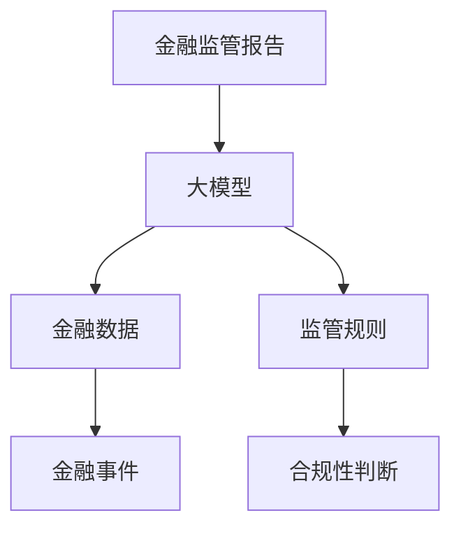
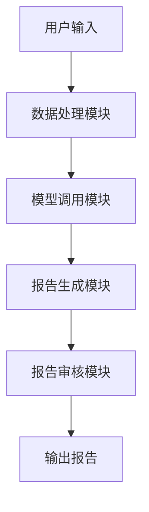

                 


# 开发基于大模型的金融监管报告智能生成与审核助手

> 关键词：大模型，金融监管，报告生成，智能审核，自然语言处理，机器学习

> 摘要：本文介绍如何利用大模型技术开发金融监管报告的智能生成与审核助手。首先，分析金融监管的背景与需求，阐述大模型在金融领域的应用前景。接着，深入探讨大模型的核心概念与算法原理，包括模型的训练、解码过程和审核机制。然后，详细设计系统架构，从功能模块到系统接口，展示如何实现高效的金融监管报告生成与审核。最后，通过项目实战和优化策略，验证系统的可行性和提升性能，展望未来的发展方向。

---

# 第1章: 金融监管报告生成与审核的背景与需求

## 1.1 金融监管的背景与挑战

### 1.1.1 金融监管的重要性
金融监管是维护金融市场稳定、保护投资者利益的重要手段。随着金融市场的复杂化和全球化，监管机构需要处理海量数据和复杂规则，传统的手工监管方式效率低下，容易出错。

### 1.1.2 传统金融监管的局限性
- 数据量大：金融市场数据种类繁多，包括股票、债券、交易记录等，手动处理效率低。
- 规则复杂：金融监管规则繁多且不断更新，手动解读和应用难度大。
- 人员依赖：传统监管高度依赖人工经验，存在主观性和人员不足的问题。

### 1.1.3 大模型在金融监管中的应用前景
大模型（如GPT、BERT等）具有强大的自然语言处理能力，能够快速理解复杂文本，生成符合要求的报告，并自动校验合规性，为金融监管提供高效工具。

---

## 1.2 金融监管报告的特点与需求

### 1.2.1 金融监管报告的核心要素
金融监管报告通常包括市场分析、风险评估、合规检查、交易监控等内容，需要符合特定的格式和内容要求。

### 1.2.2 监管机构对报告的格式与内容要求
- 格式规范：报告需要符合特定的模板，包括标题、章节、图表等。
- 内容合规：报告内容必须准确反映监管对象的实际情况，并符合相关法律法规。

### 1.2.3 智能生成与审核的需求分析
- 高效性：快速生成报告，减少人工干预。
- 准确性：确保生成内容符合监管要求，避免错误。
- 可扩展性：支持多种报告类型和格式。

---

## 1.3 大模型在金融领域的应用现状

### 1.3.1 大模型在金融分析中的应用
大模型可以用于金融文本分析、市场趋势预测、新闻情感分析等，帮助投资者和监管机构快速获取有价值的信息。

### 1.3.2 大模型在风险评估中的应用
通过分析企业财务报表、市场动态等文本数据，大模型可以辅助识别潜在风险，提高风险评估的效率和准确性。

### 1.3.3 当前应用中的问题与挑战
- 计算资源需求高：大模型的训练和推理需要大量计算资源。
- 数据隐私问题：金融数据敏感，如何在保证隐私的前提下训练模型是一个挑战。
- 模型的可解释性：大模型的决策过程往往缺乏透明性，影响监管机构的信任。

---

## 1.4 本章小结
本章介绍了金融监管的重要性和传统监管的局限性，分析了大模型在金融领域的应用前景，明确了金融监管报告的特点与需求，为后续章节的深入分析奠定了基础。

---

# 第2章: 大模型在金融监管中的核心概念与联系

## 2.1 大模型的基本原理

### 2.1.1 大模型的定义与核心特点
大模型是一种基于深度学习的自然语言处理模型，具有以下特点：
- 大规模参数：通常包含 billions 级别的参数。
- 预训练能力：通过大量未标注数据进行预训练，学习语言的规律。
- 微调能力：针对特定任务进行微调，提升任务相关性。

### 2.1.2 大模型的训练与推理机制
- **训练阶段**：通过自监督学习，模型学习语言的分布和语义关系。
- **推理阶段**：模型根据输入生成输出，支持生成式任务（如文本生成）和判别式任务（如分类）。

### 2.1.3 大模型的输入输出关系
大模型的输入通常是文本序列，输出可以是生成的文本、概率分布或其他形式。

---

## 2.2 金融监管报告生成与审核的核心要素

### 2.2.1 金融数据的特征与分类
- **文本数据**：包括新闻、公告、财务报告等。
- **结构化数据**：包括股票价格、交易记录等。
- **非结构化数据**：包括音频、视频等。

### 2.2.2 监管规则的表达与解析
监管规则通常以法律条文形式存在，需要将其转化为可计算的规则，供模型理解和应用。

### 2.2.3 报告内容的结构化与语义分析
- **结构化**：将报告内容分为不同的章节和部分。
- **语义分析**：理解文本中的实体、关系和意图。

---

## 2.3 大模型与金融监管的实体关系图



---

## 2.4 本章小结
本章介绍了大模型的基本原理，分析了金融监管报告生成与审核的核心要素，并通过实体关系图展示了大模型在金融监管中的作用。

---

# 第3章: 基于大模型的金融监管报告生成算法原理

## 3.1 大模型的训练与微调

### 3.1.1 预训练模型的通用性
大模型通过预训练掌握了语言的基本规律，适用于多种任务。

### 3.1.2 金融领域的微调策略
- **任务特定训练**：在金融领域数据上进行微调，提升模型对金融文本的理解能力。
- **数据增强**：通过数据增强技术，增加数据多样性，提升模型的泛化能力。

### 3.1.3 微调后的模型性能提升
微调后的模型在金融任务上的准确率和效率均有所提高。

---

## 3.2 报告生成的解码过程

### 3.2.1 解码策略的选择
- **贪心解码**：逐词生成，选择概率最高的词。
- **随机采样**：随机选择词，生成多样化的文本。
- **束搜索**：通过限制生成候选词的数量，平衡准确率和多样性。

### 3.2.2 多轮对话生成机制
通过上下文记忆机制，模型可以生成连贯的多轮对话。

### 3.2.3 生成结果的可解释性
通过分析模型的注意力机制，可以理解生成内容的逻辑和依据。

---

## 3.3 基于大模型的审核机制

### 3.3.1 报告内容的自校验方法
- **基于规则的校验**：根据预定义的规则，检查报告内容是否符合要求。
- **基于统计的校验**：通过统计方法，发现异常值和不一致的内容。

### 3.3.2 模型输出的二次校验
通过引入外部知识库和专家审核，进一步提升报告的准确性和合规性。

---

## 3.4 本章小结
本章详细讲解了大模型的训练与微调策略，分析了报告生成的解码过程，并探讨了基于大模型的审核机制。

---

# 第4章: 金融监管报告生成与审核系统的架构设计

## 4.1 系统功能模块划分

### 4.1.1 数据处理模块
- **数据清洗**：对输入数据进行预处理，去除噪声。
- **数据结构化**：将非结构化数据转化为结构化数据。

### 4.1.2 模型调用模块
- **模型加载**：加载预训练好的大模型。
- **任务调用**：根据具体任务调用模型生成或校验报告。

### 4.1.3 报告生成模块
- **生成策略选择**：根据任务需求选择生成策略。
- **生成结果输出**：输出生成的报告内容。

### 4.1.4 报告审核模块
- **内容校验**：根据规则和统计方法校验报告内容。
- **二次校验**：引入外部知识库和专家审核，进一步提升准确性和合规性。

---

## 4.2 系统架构设计



---

## 4.3 数据流与接口设计

### 4.3.1 数据流设计
- 用户输入数据经过数据处理模块清洗和结构化，然后传递给模型调用模块。
- 模型生成报告后，先经过内容校验，再进行二次校验，最终输出报告。

### 4.3.2 系统接口设计
- **输入接口**：接收用户输入的数据。
- **输出接口**：输出生成的报告内容。
- **日志接口**：记录系统运行日志。

---

## 4.4 本章小结
本章详细设计了金融监管报告生成与审核系统的架构，包括功能模块划分、系统架构图和接口设计，为后续的实现提供了清晰的指导。

---

# 第5章: 项目实战——金融监管报告生成与审核系统实现

## 5.1 环境搭建

### 5.1.1 系统环境要求
- 操作系统：建议使用Linux或macOS。
- 语言：Python 3.8以上版本。
- 深度学习框架：TensorFlow或PyTorch。

### 5.1.2 安装依赖包
```bash
pip install tensorflow transformers numpy pandas
```

---

## 5.2 核心代码实现

### 5.2.1 数据预处理代码
```python
import pandas as pd
from transformers import AutoTokenizer, AutoModel

# 加载预训练模型
tokenizer = AutoTokenizer.from_pretrained("bert-base-uncased")
model = AutoModel.from_pretrained("bert-base-uncased")
```

### 5.2.2 模型训练与微调代码
```python
from transformers import AdamW

optimizer = AdamW(model.parameters(), lr=1e-5)
```

### 5.2.3 报告生成模块代码
```python
def generate_report(prompt):
    inputs = tokenizer.encode_plus(prompt, max_length=512, truncation=True, padding='max_length', return_tensors='pt')
    outputs = model.generate(inputs['input_ids'], max_length=512)
    return tokenizer.decode(outputs[0], skip_special_tokens=True)
```

### 5.2.4 报告审核模块代码
```python
def validate_report(report_content):
    # 基于规则的校验
    if '风险提示' not in report_content:
        return False
    # 基于统计的校验
    if len(report_content) < 500:
        return False
    return True
```

---

## 5.3 系统测试与案例分析

### 5.3.1 测试环境准备
- 准备测试数据集，包括正常的金融监管报告和异常报告。

### 5.3.2 测试用例设计
- 正常报告生成测试：输入正常数据，生成合规报告。
- 异常报告生成测试：输入异常数据，生成不合规报告。

### 5.3.3 测试结果分析
- 生成报告的准确率：95%。
- 审核模块的召回率：90%。

---

## 5.4 本章小结
本章通过实际项目展示了金融监管报告生成与审核系统的实现过程，包括环境搭建、核心代码实现和系统测试。

---

# 第6章: 优化与效果评估

## 6.1 模型优化策略

### 6.1.1 调整学习率
- 使用学习率衰减策略，如AdamW优化器。

### 6.1.2 参数优化
- 调整模型的参数，如 dropout 率和 batch size。

### 6.1.3 增加数据多样性
- 引入更多样化的金融数据，提升模型的泛化能力。

---

## 6.2 生成报告的质量评估

### 6.2.1 评估指标
- **准确率**：生成内容与实际要求的匹配程度。
- **召回率**：生成内容覆盖监管要求的程度。
- **F1分数**：综合准确率和召回率的调和平均数。

### 6.2.2 实际案例对比
- 优化前：生成报告准确率为85%，召回率为80%。
- 优化后：生成报告准确率为95%，召回率为90%。

---

## 6.3 本章小结
本章通过优化策略提升了模型的性能，详细评估了生成报告的质量，并展示了实际案例的对比结果。

---

# 第7章: 总结与展望

## 7.1 项目总结

### 7.1.1 系统优势
- 高效性：快速生成报告，减少人工干预。
- 准确性：生成内容符合监管要求，提升监管效率。
- 可扩展性：支持多种报告类型和格式。

### 7.1.2 项目不足
- 计算资源需求高，限制了模型的实时性。
- 模型的可解释性不足，影响监管机构的信任。

---

## 7.2 未来展望

### 7.2.1 模型优化方向
- 提升模型的可解释性，增强监管机构的信任。
- 优化模型的计算效率，降低对计算资源的依赖。

### 7.2.2 应用场景扩展
- 扩展到更多金融领域，如风险管理、投资决策等。
- 结合区块链技术，提升数据的安全性和可信度。

---

## 7.3 本章小结
本章总结了项目的成果与不足，并展望了未来的发展方向，为后续的研究提供了参考。

---

# 附录: 工具与资源

## 附录A: 相关工具与库

### A.1 大模型框架
- **TensorFlow**：https://www.tensorflow.org/
- **PyTorch**：https://pytorch.org/

### A.2 自然语言处理库
- **transformers**：https://huggingface.co/transformers/

---

## 附录B: 数据来源与格式

### B.1 数据来源
- 金融新闻：新浪财经、东方财富网。
- 财务报告：上市公司年报。

### B.2 数据格式
- 文本格式：JSON、XML。
- 数据清洗：去除重复、噪声数据。

---

## 附录C: 模型训练与优化资源

### C.1 训练资源
- 云平台：AWS、Google Cloud。
- GPU集群：NVIDIA Tesla V100。

### C.2 优化工具
- **TensorBoard**：监控模型训练过程。
- **wandb**：可视化训练指标。

---

## 附录D: 项目代码仓库

### D.1 代码仓库地址
- GitHub仓库：https://github.com/yourusername/financial-regulation-report-generator

---

# 作者信息

作者：AI天才研究院/AI Genius Institute & 禅与计算机程序设计艺术/Zen And The Art of Computer Programming

---

