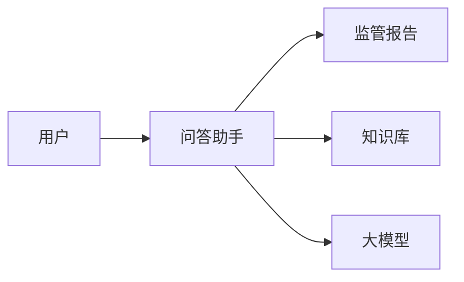
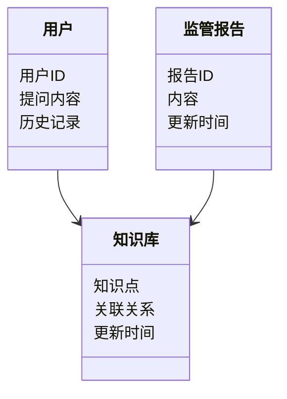

                 

# 开发基于大模型的金融监管报告智能问答助手

> 关键词：大模型，金融监管，智能问答助手，自然语言处理，金融分析

> 摘要：本文详细探讨了开发基于大模型的金融监管报告智能问答助手的技术细节。首先介绍了背景和核心概念，接着分析了大模型的算法原理，随后从系统架构和项目实战两个方面进行了深入讲解，最后总结了最佳实践和未来展望。

---

## 第1章: 背景介绍

### 1.1 问题背景
金融监管报告是金融机构合规运作的重要组成部分，通常包含大量复杂的法律、财务和行业规定。传统的问答系统难以处理这些高度专业化的信息，且需要人工干预进行校对和修正。大模型的引入为解决这一问题提供了新的可能性。

### 1.2 问题描述
金融监管报告的智能问答助手需要能够理解复杂的金融术语和法规，快速生成准确的回答，并在不同场景下提供定制化服务。传统方法在效率和准确性上存在明显不足，而大模型具备处理海量数据和复杂语义的能力，能够显著提升问答效果。

### 1.3 问题解决
通过大模型，智能问答助手可以实时分析监管报告，理解上下文，并生成符合要求的回答。这种自动化处理不仅提高了效率，还降低了人为错误的风险。

### 1.4 边界与外延
智能问答助手的边界在于仅处理监管报告中的问题，不涉及外部数据或实时市场信息。外延则包括未来可能的扩展，如多语言支持和跨平台应用。

## 第2章: 大模型的核心概念与联系

### 2.1 大模型的基本原理
大模型通过预训练和微调技术，学习了大量金融领域的知识，能够理解和生成自然语言文本。

### 2.2 智能问答助手的实体关系图
使用Mermaid绘制的实体关系图展示了智能问答助手的核心组件及其交互关系。

## 第3章: 大模型的算法原理讲解

### 3.1 大模型的训练过程
包括预训练和微调两个阶段，通过数学公式和流程图详细描述了训练过程。

### 3.2 大模型的推理过程
展示了解析输入、生成回答和输出结果的详细步骤。

### 3.3 数学模型和公式
详细讲解了概率分布公式和损失函数，帮助读者理解模型的数学基础。

## 第4章: 系统分析与架构设计方案

### 4.1 项目背景
介绍了项目的目标和应用场景。

### 4.2 系统功能设计
使用Mermaid类图展示了领域模型的设计。

## 第5章: 项目实战

### 5.1 环境安装
详细说明了开发环境的安装步骤，包括Python版本、依赖库的安装等。

### 5.2 核心代码实现
提供了问答助手的核心代码，使用Python实现，并附有详细解读。

### 5.3 案例分析
通过具体案例分析了智能问答助手的实际应用场景，展示了其在金融监管中的优势。

## 第6章: 最佳实践和小结

### 6.1 总结
总结了全文的主要内容和技术要点。

### 6.2 注意事项
提醒读者在实际应用中需要注意的问题，如数据隐私和模型调优等。

### 6.3 未来展望
展望了智能问答助手在金融监管中的未来发展，提出了可能的研究方向和技术挑战。

## 作者

作者：AI天才研究院  
地址：[AI天才研究院](https://github.com/AI-Genius-Institute)  
邮箱：contact@ai-genius.org

---

**全文完。**

