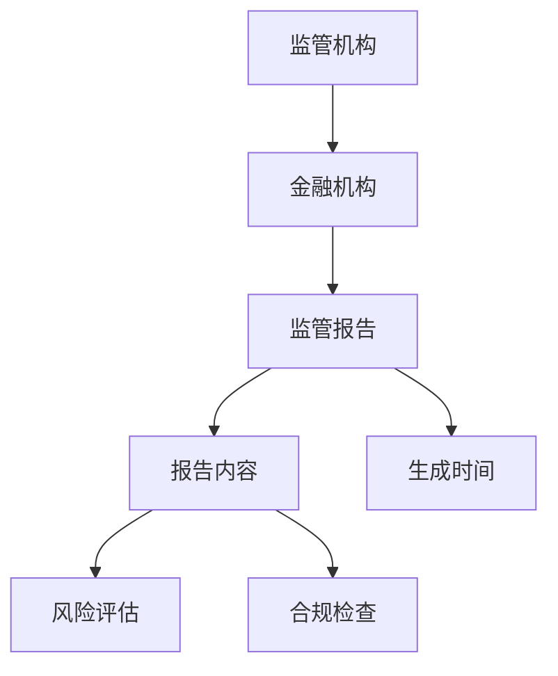
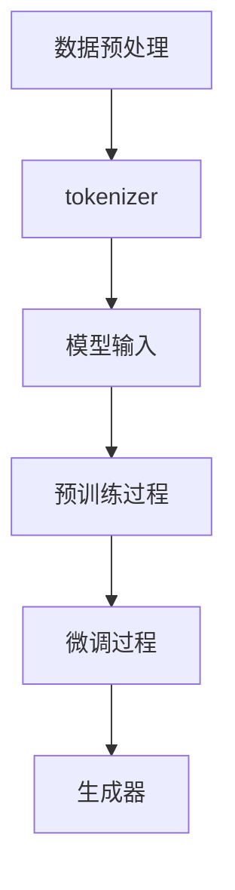
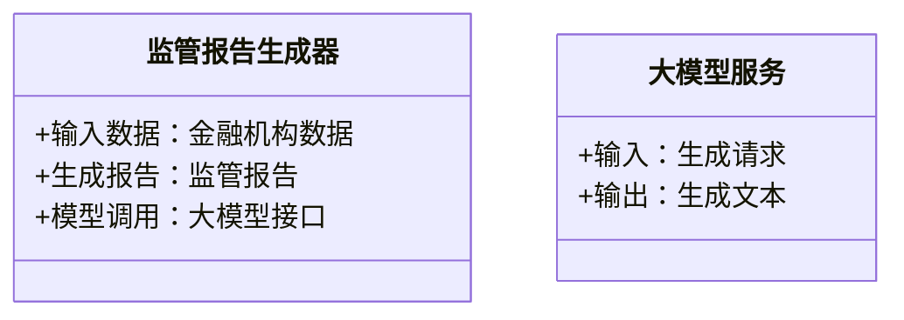
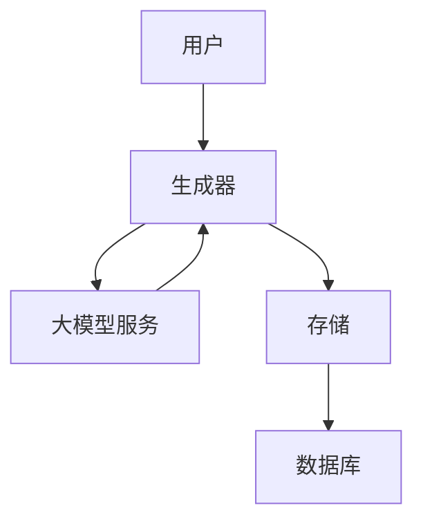

                 


# 开发基于大模型的金融监管报告生成器

> 关键词：金融监管，大模型，自然语言处理，生成器，系统架构

> 摘要：本文详细探讨了基于大模型的金融监管报告生成器的开发过程，从背景需求分析到核心算法原理，从系统架构设计到项目实战，全面解析了如何利用大模型技术高效生成符合监管要求的金融报告。文章通过实例分析和代码实现，展示了大模型在金融监管领域的巨大潜力和实际应用价值。

---

## 第1章: 金融监管报告生成的背景与需求

### 1.1 金融监管的核心问题

#### 1.1.1 金融监管的基本概念
金融监管是指通过法律法规和监管机构对金融机构的经营行为进行监督和管理，以维护金融市场秩序和保护投资者利益。传统的金融监管主要依赖人工审核和简单的自动化工具，效率低下且难以应对日益复杂的金融环境。

#### 1.1.2 金融监管的挑战与痛点
随着金融市场的快速发展，金融机构的数量和业务复杂性不断增加，传统的监管方式面临以下痛点：
- **数据量大**：金融机构每天产生海量数据，人工审核效率难以满足需求。
- **规则复杂**：金融监管涉及众多法律法规和业务规则，难以统一管理和应用。
- **实时性要求高**：金融市场变化快，监管需要实时响应，传统方法难以满足。
- **成本高昂**：人工审核成本高，且容易出现人为疏漏。

#### 1.1.3 大模型在金融监管中的作用
大模型（如GPT、BERT等）具有强大的自然语言处理能力，能够理解和生成复杂的金融文本，帮助监管机构快速生成报告、识别风险和合规问题。通过大模型技术，可以显著提升金融监管的效率和准确性。

---

### 1.2 金融监管报告生成的业务需求

#### 1.2.1 传统金融监管报告的特点
传统的金融监管报告通常具有以下特点：
- **结构化**：报告内容通常按照固定格式组织，如资产负债表、利润表等。
- **模板化**：报告生成依赖固定模板，内容重复性高。
- **人工干预多**：需要大量人工审核和调整，效率低。

#### 1.2.2 基于大模型的报告生成优势
基于大模型的金融监管报告生成器具有以下优势：
- **自动化**：能够自动从数据中提取信息并生成报告，减少人工干预。
- **智能化**：能够理解和分析复杂文本，识别潜在风险和异常情况。
- **高效性**：生成报告的速度远超人工，能够满足实时监管需求。

#### 1.2.3 金融监管报告生成的关键指标
- **生成时间**：报告生成的响应时间。
- **准确率**：生成报告的合规性和准确性。
- **可解释性**：报告生成过程是否透明可追溯。

---

## 第2章: 大模型的基本概念与技术基础

### 2.1 大模型的定义与特点

#### 2.1.1 大模型的定义
大模型是指基于深度学习技术构建的大型神经网络模型，通常具有 billions 量级的参数，能够处理复杂的自然语言理解和生成任务。

#### 2.1.2 大模型的核心特点
- **大规模预训练**：通过大量通用数据的预训练，模型能够理解多种语言和领域知识。
- **微调能力**：在特定领域进行微调后，模型能够适应具体任务需求。
- **生成能力强**：能够生成自然流畅的文本，满足多种场景需求。

#### 2.1.3 大模型与传统AI的区别
| 特性         | 大模型                  | 传统AI                 |
|--------------|------------------------|------------------------|
| 数据量       | 大量（ billions+）      | 较小                   |
| 任务通用性   | 高                     | 低                     |
| 模型复杂度   | 极高                   | 较低                   |
| 生成能力     | 强                     | 较弱                   |

---

### 2.2 主流大模型简介

#### 2.2.1 GPT系列模型
GPT（Generative Pre-trained Transformer）是由OpenAI开发的系列大模型，基于Transformer架构，具有强大的文本生成能力。

#### 2.2.2 BERT及其变体
BERT（Bidirectional Encoder Representations from Transformers）是由Google开发的模型，擅长文本的理解任务，通过双向编码器结构实现。

#### 2.2.3 其他知名大模型介绍
- **PaLM（Pathways Language Model）**：由Google开发，参数量高达5000亿，性能表现优异。
- **Megatron-LM**：由微软开发，支持大规模分布式训练。

---

### 2.3 大模型在金融领域的应用

#### 2.3.1 金融文本分析
- **新闻分析**：分析财经新闻，提取市场情绪。
- **财报解读**：自动解析公司财报，生成分析报告。

#### 2.3.2 金融预测与决策
- **股价预测**：基于历史数据和新闻，预测股票价格走势。
- **风险评估**：评估投资项目的潜在风险。

#### 2.3.3 金融监管中的大模型应用
- **合规性检查**：检查金融机构的报告是否符合监管要求。
- **异常检测**：识别潜在的违规行为和市场操纵。

---

## 第3章: 金融监管报告生成的核心需求分析

### 3.1 金融监管报告的结构与内容

#### 3.1.1 监管报告的基本框架
金融监管报告通常包括以下部分：
- **封面**：报告标题、生成时间等。
- **正文**：包括风险分析、合规性检查、市场分析等。
- **附录**：数据来源、参考文献等。

#### 3.1.2 监管报告的主要内容
- **风险评估**：识别潜在的金融风险。
- **合规性检查**：检查金融机构是否符合相关法规。
- **市场分析**：分析市场趋势和竞争情况。

#### 3.1.3 监管报告的生成要求
- **结构化输出**：报告内容需要符合特定格式。
- **内容准确性**：生成的内容必须准确无误。
- **实时生成**：能够快速响应实时数据。

---

### 3.2 基于大模型的生成需求

#### 3.2.1 自然语言处理需求
- **文本理解**：理解金融机构提供的文本数据。
- **文本生成**：生成符合监管要求的报告内容。

#### 3.2.2 报告结构化需求
- **模板匹配**：将生成的内容匹配到特定的报告模板中。
- **数据整合**：整合多源数据，生成完整的报告。

#### 3.2.3 多模态数据处理需求
- **文本+数据**：同时处理文本和结构化数据。
- **图表生成**：生成辅助分析的图表。

---

### 3.3 金融监管报告生成的边界与外延

#### 3.3.1 生成范围的界定
- **生成内容**：仅生成报告内容，不涉及数据采集和清洗。
- **生成范围**：不处理非金融领域的数据。

#### 3.3.2 外延功能的扩展
- **数据清洗**：对输入数据进行预处理。
- **用户交互**：提供友好的用户界面。

#### 3.3.3 边界条件的处理
- **异常处理**：处理输入数据中的异常值。
- **模型调用**：确保模型调用的稳定性。

---

## 第4章: 大模型在金融监管报告生成中的核心概念与联系

### 4.1 核心概念原理

#### 4.1.1 大模型的预训练原理
- **预训练目标**：通过大量的通用数据（如书籍、网页）进行无监督学习，学习语言的结构和语义。
- **训练过程**：使用自监督任务（如掩盖词任务、预测下一句任务）进行训练。

#### 4.1.2 微调与适配原理
- **微调目标**：在特定领域（如金融）进行小样本数据的有监督训练，使模型适应具体任务。
- **微调过程**：调整模型的输出层，优化特定任务的损失函数。

#### 4.1.3 解码器的生成原理
- **解码过程**：通过自回归的方式生成文本，每一步生成一个词并输入到解码器中。
- **生成策略**：使用贪心算法或随机采样生成最优或多样化的文本。

---

### 4.2 核心概念对比表格

| 概念         | 预训练               | 微调               | 解码器             |
|--------------|----------------------|---------------------|-------------------|
| 定义         | 无监督学习阶段         | 有监督学习阶段      | 生成文本的模块     |
| 输入         | 大量通用数据         | 少量领域数据        | 上文和状态         |
| 输出         | 通用语言模型         | 领域特定模型        | 生成文本           |

---

### 4.3 核心概念的ER实体关系图



---

## 第5章: 大模型的算法原理与实现

### 5.1 算法原理

#### 5.1.1 大模型的训练流程


#### 5.1.2 Transformer的数学模型
- **编码器**：
  - **自注意力机制**：计算输入序列中每个词与其他词的相关性。
  - **前馈网络**：对序列进行非线性变换。
- **解码器**：
  - **自注意力机制**：生成文本时，关注之前的生成词。
  - **交叉注意力机制**：关注编码器的输出。

#### 5.1.3 生成过程
```python
def generate_report(model, prompt, max_length=500):
    for i in range(max_length):
        # 生成下一个词
        next_word = model.generate_next_word(prompt)
        prompt += next_word
        # 输出结果
        print(next_word)
```

---

### 5.2 算法实现

#### 5.2.1 预训练阶段
- **数据来源**：通用文本数据（如书籍、网页）。
- **训练目标**：通过自监督任务（如掩盖词任务）训练模型。

#### 5.2.2 微调阶段
- **数据来源**：金融领域的文本数据（如财报、法规文件）。
- **训练目标**：通过有监督任务（如分类任务）优化模型。

#### 5.2.3 生成阶段
- **输入**：金融机构提供的数据。
- **输出**：生成符合要求的监管报告。

---

## 第6章: 系统架构与设计

### 6.1 系统功能设计

#### 6.1.1 领域模型


#### 6.1.2 系统架构


---

### 6.2 系统接口设计

#### 6.2.1 输入接口
- **输入格式**：JSON格式，包含金融机构ID、数据类型等。
- **输入示例**：
  ```json
  {
      "institution_id": "ABC123",
      "data_type": "financial_report"
  }
  ```

#### 6.2.2 输出接口
- **输出格式**：结构化报告，包含风险评估、合规检查等内容。
- **输出示例**：
  ```json
  {
      "risk_assessment": "低风险",
      "compliance_check": "符合要求"
  }
  ```

---

## 第7章: 项目实战与案例分析

### 7.1 环境安装

#### 7.1.1 安装Python环境
```bash
python --version
pip install --upgrade pip
pip install torch transformers
```

#### 7.1.2 安装大模型服务
```bash
pip install openai
pip install sentence-transformers
```

---

### 7.2 系统核心实现

#### 7.2.1 模型加载
```python
from transformers import AutoModelWithLMHead, AutoTokenizer

model = AutoModelWithLMHead.from_pretrained('gpt2-large')
tokenizer = AutoTokenizer.from_pretrained('gpt2-large')
```

#### 7.2.2 生成报告
```python
def generate_report(institution_id):
    prompt = f"Generate financial report for institution {institution_id}"
    inputs = tokenizer.encode(prompt, return_tensors='pt')
    outputs = model.generate(inputs, max_length=500)
    report = tokenizer.decode(outputs[0], skip_special_tokens=True)
    return report
```

---

### 7.3 案例分析

#### 7.3.1 案例背景
某金融机构需要生成季度财务报告，输入数据包括资产负债表和利润表。

#### 7.3.2 案例实现
```python
institution_id = "ABC123"
report = generate_report(institution_id)
print(report)
```

#### 7.3.3 实际输出
```text
"Financial Report for Institution ABC123: assets $100M, liabilities $50M, equity $50M..."
```

---

## 第8章: 总结与展望

### 8.1 本章小结
本文详细介绍了基于大模型的金融监管报告生成器的开发过程，从背景需求分析到算法实现，从系统架构设计到项目实战，全面解析了大模型在金融监管中的应用。

### 8.2 最佳实践Tips
- **数据质量**：确保输入数据的准确性和完整性。
- **模型选择**：根据具体任务选择合适的模型。
- **可解释性**：确保生成报告的可追溯性和透明性。

### 8.3 未来展望
随着大模型技术的不断发展，金融监管报告生成器将更加智能化和高效化。未来的研究方向包括：
- **多模态生成**：结合文本、图像等多种数据生成报告。
- **实时响应**：提升生成报告的实时性。
- **跨领域应用**：将大模型技术应用到更多金融领域。

---

## 作者：AI天才研究院/AI Genius Institute & 禅与计算机程序设计艺术 /Zen And The Art of Computer Programming

