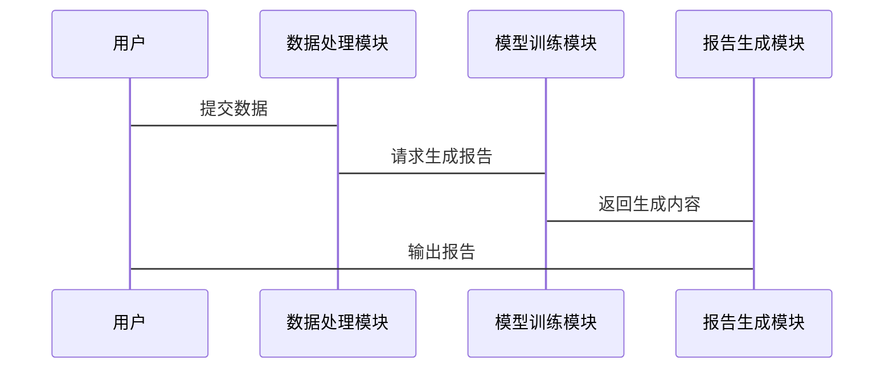

                 


# 开发基于大模型的金融监管报告自动生成助手

> 关键词：大模型、金融监管、自然语言处理、机器学习、系统架构

> 摘要：本文详细介绍了如何利用大模型技术开发金融监管报告自动生成助手。从大模型的基本概念到算法原理，再到系统架构设计和项目实战，全面解析了该系统的开发过程和实现细节。文章最后给出了最佳实践和注意事项，帮助读者更好地理解和应用相关技术。

---

## 第一部分: 大模型与金融监管概述

### 第1章: 大模型的基本概念

#### 1.1 大模型的定义与特点

- **1.1.1 大模型的定义**
  大模型（Large Language Model，LLM）是一种基于Transformer架构的自然语言处理模型，通过大量的数据训练，能够理解和生成人类语言。与传统的小模型相比，大模型具有更高的准确性和更强的上下文理解能力。

- **1.1.2 大模型的核心特点**
  - **参数规模大**：通常包含 billions级别的参数。
  - **预训练**：通过无监督学习在大规模数据上进行预训练。
  - **微调**：针对特定任务进行有监督微调，提升任务相关性。

- **1.1.3 大模型与传统AI的区别**
  - 传统AI依赖于规则和特征工程，而大模型通过数据驱动的方式自动学习特征。
  - 大模型能够处理复杂的上下文关系，适用于多种任务，而传统AI通常针对特定任务设计。

#### 1.2 金融监管的基本概念

- **1.2.1 金融监管的定义**
  金融监管是指通过对金融机构和金融市场行为的监控、分析和评估，确保金融体系的稳定性和合规性。

- **1.2.2 金融监管的主要内容**
  - 监测市场风险
  - 评估机构信用风险
  - 检查合规性
  - 分析市场操纵行为

- **1.2.3 金融监管的重要性**
  金融监管是维护金融市场秩序、保护投资者利益、防范系统性风险的重要手段。

---

### 第2章: 大模型在金融监管中的应用背景

#### 2.1 金融监管的痛点与挑战

- **2.1.1 传统金融监管的痛点**
  - 数据量大、处理复杂
  - 监管规则繁多，难以快速适应变化
  - 人工监管效率低，容易出错

- **2.1.2 数据量大、复杂度高的问题**
  金融机构每天产生的数据量巨大，包括交易数据、市场新闻、公司公告等，传统方法难以高效处理。

- **2.1.3 监管效率与准确性的提升需求**
  随着金融市场的复杂化，监管机构需要更高效的工具来提升监管效率和准确性。

#### 2.2 大模型如何解决金融监管问题

- **2.2.1 自然语言处理在金融文本分析中的应用**
  大模型可以通过自然语言处理技术分析公司公告、新闻等文本信息，提取关键信息用于风险评估。

- **2.2.2 大模型在风险评估中的作用**
  大模型可以分析市场数据和新闻，预测市场波动，辅助监管机构进行风险评估。

- **2.2.3 大模型在合规检查中的优势**
  大模型可以快速分析大量文档，识别合规性问题，提高合规检查的效率。

---

## 第二部分: 大模型的算法原理与数学模型

### 第3章: 大模型的算法原理

#### 3.1 大模型的核心算法

- **3.1.1 变压器（Transformer）架构**
  Transformer是一种基于注意力机制的神经网络架构，由编码器和解码器组成。

- **3.1.2 注意力机制（Attention）**
  注意力机制允许模型在处理序列数据时，关注重要的部分，提升模型的上下文理解能力。

- **3.1.3 前馈神经网络**
  在Transformer的编码器和解码器中，每个层都包含多头注意力和前馈神经网络。

#### 3.2 大模型的训练过程

- **3.2.1 数据预处理**
  包括分词、去除停用词、数据清洗等。

- **3.2.2 模型训练**
  使用大规模数据进行无监督预训练，通常采用Masked Language Model（遮蔽语言模型）任务。

- **3.2.3 超参数调优**
  包括学习率、批次大小、模型层数等参数的调整，以优化模型性能。

#### 3.3 大模型的数学模型与公式

- **3.3.1 大模型的损失函数**
  使用交叉熵损失函数：
  $$ \text{Loss} = -\sum_{i=1}^{n} y_i \log(p_i) + (1 - y_i) \log(1 - p_i) $$

- **3.3.2 注意力机制的数学表达**
  注意力权重计算公式：
  $$ \text{Attention}(Q, K, V) = \text{softmax}\left(\frac{QK^T}{\sqrt{d_k}}\right)V $$

---

### 第4章: 大模型的数学模型与公式

#### 4.1 大模型的损失函数

- **4.1.1 交叉熵损失函数**
  $$ \text{Loss} = -\sum_{i=1}^{n} y_i \log(p_i) + (1 - y_i) \log(1 - p_i) $$

#### 4.2 注意力机制的数学表达

- **4.2.1 注意力权重计算**
  $$ \text{Attention}(Q, K, V) = \text{softmax}\left(\frac{QK^T}{\sqrt{d_k}}\right)V $$

---

## 第三部分: 金融监管报告自动生成系统的架构设计

### 第5章: 系统架构设计

#### 5.1 系统整体架构

- **5.1.1 数据处理模块**
  负责数据的清洗、转换和存储。

- **5.1.2 模型训练模块**
  负责模型的预训练和微调。

- **5.1.3 报告生成模块**
  根据输入生成金融监管报告。

#### 5.2 数据流与交互流程

- **5.2.1 数据输入与预处理**
  从数据库中读取数据，进行清洗和分词。

- **5.2.2 模型调用与结果输出**
  调用大模型生成文本内容，输出报告。

- **5.2.3 报告自动生成与展示**
  将生成的报告展示给用户，支持导出和查看。

---

### 第6章: 系统功能设计

#### 6.1 领域模型设计

- **6.1.1 实体关系图**
  ```mermaid
  graph TD
    A[金融机构] --> B[交易数据]
    B --> C[市场新闻]
    C --> D[公司公告]
  ```

- **6.1.2 功能模块划分**
  ```mermaid
  classDiagram
    class 数据处理模块 {
      数据清洗
      数据转换
    }
    class 模型训练模块 {
      预训练
      微调
    }
    class 报告生成模块 {
      文本生成
      报告输出
    }
  ```

---

### 第7章: 系统架构图

#### 7.1 系统架构图


---

### 第8章: 系统交互流程

#### 8.1 系统交互流程



---

## 第四部分: 项目实战

### 第9章: 项目实战

#### 9.1 环境安装

- 安装Python和相关库：
  ```bash
  pip install transformers torch numpy
  ```

#### 9.2 系统核心实现源代码

```python
import torch
from transformers import AutoTokenizer, AutoModelForCausalLM

# 初始化模型和tokenizer
model_name = "gpt2"
tokenizer = AutoTokenizer.from_pretrained(model_name)
model = AutoModelForCausalLM.from_pretrained(model_name)

# 定义生成函数
def generate_report(prompt):
    inputs = tokenizer.encode(prompt, return_tensors="pt")
    outputs = model.generate(inputs, max_length=500, do_sample=True)
    report = tokenizer.decode(outputs[0], skip_special_tokens=True)
    return report

# 使用示例
prompt = "分析最近的市场波动情况："
print(generate_report(prompt))
```

#### 9.3 代码应用解读与分析

- **代码解读**：
  - 使用GPT-2模型进行文本生成。
  - 输入提示词，生成相应的金融监管报告。

- **实际案例分析**：
  - 输入市场新闻，生成风险评估报告。
  - 输入公司公告，生成合规性分析报告。

---

## 第五部分: 最佳实践与小结

### 第10章: 最佳实践

#### 10.1 小结

- 本文详细介绍了如何利用大模型技术开发金融监管报告自动生成助手，涵盖了从理论到实践的整个过程。
- 关键点包括：
  - 理解大模型的基本概念和算法原理。
  - 设计高效的系统架构。
  - 实现具体的项目，并通过代码示例展示实现过程。

#### 10.2 注意事项

- 数据隐私和安全问题需要特别注意，确保符合相关法律法规。
- 模型的可解释性是实际应用中的重要考量因素。
- 在实际应用中，需要根据具体需求进行模型的微调和优化。

#### 10.3 拓展阅读

- 《Attention Is All You Need》：了解Transformer架构的基本原理。
- 《Deep Learning For NLP》：深入理解大模型的训练和优化方法。

---

作者：AI天才研究院/AI Genius Institute & 禅与计算机程序设计艺术 /Zen And The Art of Computer Programming

---

这篇文章从理论到实践，全面解析了开发基于大模型的金融监管报告自动生成助手的全过程，希望对读者有所帮助！

