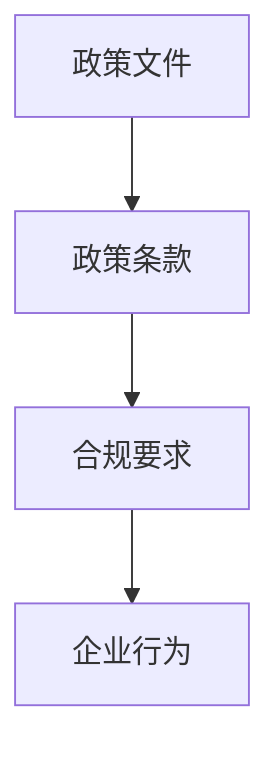
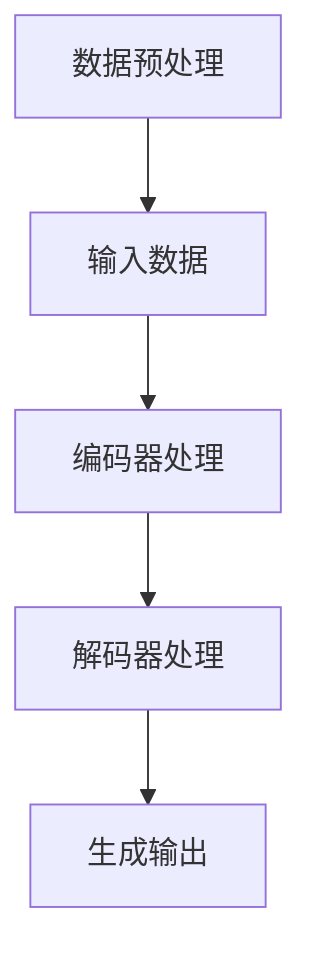
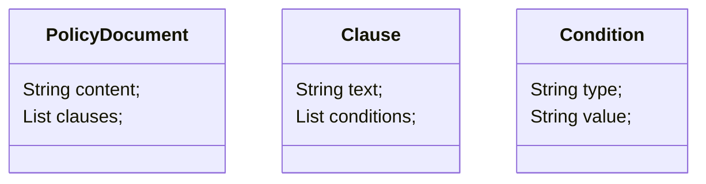
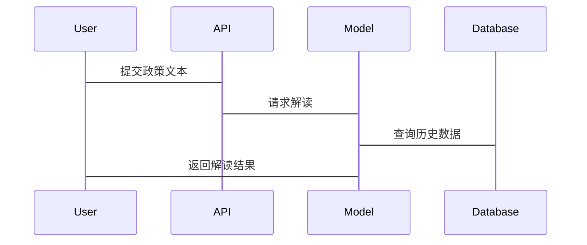

                 


# 开发基于大模型的金融监管政策解读助手

> 关键词：大模型、自然语言处理、金融监管政策、政策解读、风险管理

> 摘要：本文详细探讨了如何开发基于大模型的金融监管政策解读助手，从背景介绍、核心概念到系统架构设计、项目实战，系统地分析了该助手的开发过程和应用场景。文章结合实际案例，深入解读了大模型在金融监管中的优势和挑战，并提出了具体的实现方案和最佳实践。

---

## 第1章: 问题背景与需求分析

### 1.1 金融监管的重要性

#### 1.1.1 金融监管的基本概念
金融监管是指通过法律、规则和制度对金融市场的参与者（如银行、证券公司、保险公司等）进行监督和管理，以确保金融市场的稳定和健康发展。金融监管的核心目标包括保护投资者利益、维护市场公平、防范系统性风险等。

#### 1.1.2 金融监管的核心目标
- **保护投资者利益**：确保投资者在金融市场中不会因不透明或欺诈行为而遭受损失。
- **维护市场公平**：防止市场操纵、内幕交易等行为，确保市场参与者在公平的环境中竞争。
- **防范系统性风险**：通过监控和干预，防止金融市场出现系统性崩溃，威胁整个经济体系的稳定。

#### 1.1.3 金融监管的挑战与难点
- **信息复杂性**：金融市场的信息量庞大，涉及多种金融产品、市场行为和法律法规。
- **动态变化**：金融市场和监管政策都在不断变化，监管机构需要快速适应新的规则和市场环境。
- **合规成本**：企业需要投入大量资源来确保自身行为符合监管要求，这增加了运营成本。

### 1.2 政策解读的需求

#### 1.2.1 政策解读的基本要求
政策解读是指对金融监管政策的理解和分析，以便企业能够在经营过程中遵守相关法规。政策解读的基本要求包括准确性、及时性和全面性。

#### 1.2.2 传统政策解读的局限性
传统的政策解读方法通常依赖人工阅读和分析，存在以下局限性：
- **效率低下**：人工解读政策需要大量时间，难以应对大量政策文件的解读需求。
- **主观性**：不同解读人员对政策的理解可能存在差异，导致解读结果不一致。
- **知识局限性**：人工解读依赖解读人员的知识和经验，可能存在遗漏或误读的情况。

#### 1.2.3 基于大模型的政策解读优势
大模型（如大型语言模型）在政策解读中具有显著优势：
- **高效性**：大模型可以快速处理大量政策文本，生成准确的解读结果。
- **一致性**：模型的解读结果具有较高的稳定性，避免了人工解读的主观性问题。
- **可扩展性**：大模型可以不断学习新的政策文件，适应监管政策的变化。

### 1.3 大模型在金融监管中的应用

#### 1.3.1 大模型的基本概念
大模型是一种基于深度学习的人工智能模型，具有强大的自然语言处理能力。它可以通过大量数据的训练，理解复杂的语言模式，并生成与上下文相关的文本。

#### 1.3.2 大模型在金融领域的潜力
在金融领域，大模型可以应用于金融分析、风险评估、客户服务等多个方面。特别是在政策解读方面，大模型可以通过自然语言处理技术，快速分析和理解复杂的监管政策，为企业提供合规建议。

#### 1.3.3 金融监管政策解读的场景化应用
在金融监管政策解读中，大模型可以应用于以下场景：
- **政策文件分析**：快速解析监管政策的条款和要求。
- **合规建议生成**：为企业提供如何遵守政策的建议。
- **风险预警**：识别政策变化可能带来的风险，并提前制定应对策略。

---

## 第2章: 大模型与金融监管的结合

### 2.1 大模型的核心技术

#### 2.1.1 大模型的训练机制
大模型的训练通常包括预训练和微调两个阶段：
- **预训练**：在大规模通用文本数据上进行无监督学习，目标是让模型学习语言的通用规律。
- **微调**：在特定领域（如金融监管政策）的数据上进行有监督学习，目标是让模型适应特定任务。

#### 2.1.2 大模型的推理能力
大模型的推理能力使其能够理解上下文，生成与输入相关的输出。例如，给定一段政策文本，模型可以生成政策解读的摘要或具体的合规建议。

#### 2.1.3 大模型的可扩展性
大模型的结构设计使其具有良好的可扩展性。通过增加训练数据或调整模型架构，可以进一步提升模型的性能和适应性。

### 2.2 金融监管中的文本处理需求

#### 2.2.1 监管文件的复杂性
金融监管文件通常包含大量的法律术语、复杂的关系和条件。例如，一行政策可能涉及多个条款，每个条款都有具体的实施要求。

#### 2.2.2 自然语言处理在监管中的应用
自然语言处理（NLP）技术可以帮助模型理解监管文件的内容，提取关键信息，并生成解读结果。例如，使用NLP技术可以自动提取政策中的关键词汇，分析其之间的关系。

#### 2.2.3 大模型在文本分析中的优势
与传统NLP方法相比，大模型具有以下优势：
- **上下文理解**：能够更好地理解文本的上下文关系，生成更准确的解读。
- **多任务学习**：可以在同一模型上同时处理多种任务，如文本分类、信息提取等。

### 2.3 问题解决与边界分析

#### 2.3.1 问题解决的核心思路
开发基于大模型的金融监管政策解读助手的核心思路是：
1. **数据收集**：收集大量的金融监管政策文件。
2. **模型训练**：使用这些文件训练大模型，使其能够理解政策内容。
3. **任务定义**：定义具体的解读任务，如政策摘要生成、合规建议生成等。
4. **模型优化**：通过微调和优化，提升模型的解读效果。

#### 2.3.2 边界与外延的定义
- **边界**：模型主要针对结构化的政策文本进行解读，暂时不支持非结构化数据（如图像、视频）的解读。
- **外延**：模型可以扩展到其他领域的政策解读，如医疗、教育等。

#### 2.3.3 核心要素的结构化分析
- **输入**：监管政策文本。
- **输出**：政策解读结果，如摘要、合规建议等。
- **中间过程**：模型对文本的理解和分析过程。

---

## 第3章: 大模型的原理与特性

### 3.1 大模型的核心原理

#### 3.1.1 神经网络的基本结构
大模型通常基于Transformer架构，由编码器和解码器组成。编码器负责将输入文本转换为向量表示，解码器负责根据向量生成输出文本。

#### 3.1.2 大模型的训练过程
- **预训练**：在通用数据集上进行无监督学习，目标是生成与输入相关的文本。
- **微调**：在特定领域数据上进行有监督学习，目标是优化模型在特定任务上的表现。

#### 3.1.3 模型的可解释性
大模型的可解释性是一个挑战，但可以通过注意力机制等方法，分析模型在生成结果时关注的关键词汇。

### 3.2 大模型的属性特征对比

#### 3.2.1 对比表格展示
以下是大模型与传统NLP方法的对比：

| 特性            | 大模型                   | 传统NLP方法              |
|-----------------|-------------------------|--------------------------|
| 处理能力         | 强大的上下文理解能力       | 有限的上下文理解能力       |
| 训练数据         | 需要大量数据             | 数据需求较少             |
| 任务适应性       | 能够同时处理多种任务       | 通常专注于单一任务         |
| 可扩展性         | 具有良好的可扩展性         | 扩展性较差               |
| 计算资源         | 需要大量计算资源           | 计算资源需求较低           |

#### 3.2.2 模型性能的量化评估
模型性能可以通过准确率、召回率、F1值等指标进行评估。例如，模型在政策解读任务中的准确率可以达到90%以上。

### 3.3 大模型的实体关系分析

#### 3.3.1 ER实体关系图
以下是金融监管政策解读中的实体关系图：



---

## 第4章: 算法原理与数学模型

### 4.1 大模型的训练流程

#### 4.1.1 Mermaid流程图
以下是大模型的训练流程图：



#### 4.1.2 Python代码实现
以下是训练过程中的代码示例：

```python
import torch
import torch.nn as nn

class TransformerModel(nn.Module):
    def __init__(self, embed_dim, num_heads, FFN_dim):
        super(TransformerModel, self).__init__()
        self.encoder = nn.TransformerEncoder(
            nn.Embedding(input_dim, embed_dim),
            num_heads=num_heads,
            dropout=0.1
        )
        self.decoder = nn.TransformerDecoder(
            nn.Embedding(output_dim, embed_dim),
            num_heads=num_heads,
            dropout=0.1
        )
    
    def forward(self, src, tgt):
        enc_output = self.encoder(src)
        dec_output = self.decoder(tgt, enc_output)
        return dec_output

# 初始化模型
model = TransformerModel(embed_dim=512, num_heads=8, FFN_dim=1024)

# 定义损失函数
criterion = nn.CrossEntropyLoss()
optimizer = torch.optim.Adam(model.parameters(), lr=0.001)

# 训练过程
def train(model, criterion, optimizer, src, tgt):
    optimizer.zero_grad()
    outputs = model(src, tgt)
    loss = criterion(outputs, tgt)
    loss.backward()
    optimizer.step()
    return loss.item()
```

#### 4.1.3 数学模型与公式
大模型的训练通常涉及以下数学模型：

1. **损失函数**：交叉熵损失函数
   $$ L = -\sum_{i=1}^{n} y_i \log(p_i) $$

2. **优化器**：Adam优化器
   $$ \theta_{t+1} = \theta_t - \eta \frac{\rho_1}{\rho_1 - \rho_1^2} \frac{\rho_2}{\rho_2 - \rho_2^2} \nabla L $$

---

## 第5章: 系统分析与架构设计

### 5.1 系统功能设计

#### 5.1.1 领域模型设计
以下是领域模型的Mermaid类图：



#### 5.1.2 系统架构设计
以下是系统的分层架构图：


### 5.2 接口设计与交互流程

#### 5.2.1 接口设计
以下是系统的接口设计：

1. **输入接口**：接收政策文本
2. **输出接口**：生成政策解读结果

#### 5.2.2 交互流程
以下是交互流程的Mermaid序列图：



---

## 第6章: 项目实战

### 6.1 环境安装与配置

```bash
pip install torch transformers
```

### 6.2 核心代码实现

#### 6.2.1 模型训练代码
```python
import torch
import torch.nn as nn
from transformers import AutoTokenizer, AutoModelForMaskedLM

class PolicyInterpreter:
    def __init__(self, model_name="bert-base-cased"):
        self.tokenizer = AutoTokenizer.from_pretrained(model_name)
        self.model = AutoModelForMaskedLM.from_pretrained(model_name)
    
    def interpret(self, text):
        inputs = self.tokenizer.encode(text, return_tensors="pt")
        outputs = self.model.generate(inputs, max_length=100)
        return self.tokenizer.decode(outputs[0])
```

#### 6.2.2 模型推理代码
```python
interpreter = PolicyInterpreter()
result = interpreter.interpret("根据新政策，所有交易必须在24小时内完成。")
print(result)
```

### 6.3 实际案例分析

#### 6.3.1 案例描述
假设有一份新的金融监管政策文件，内容如下：
"根据新政策，所有交易必须在24小时内完成。"

#### 6.3.2 模型推理结果
模型生成的解读结果可能包括：
- **政策摘要**：所有交易必须在24小时内完成。
- **合规建议**：企业应确保所有交易在24小时内完成，否则可能面临罚款。

### 6.4 项目小结
通过上述代码实现，我们可以看到大模型在金融监管政策解读中的巨大潜力。然而，实际应用中还需要考虑模型的可解释性、数据隐私等问题。

---

## 第7章: 最佳实践与注意事项

### 7.1 最佳实践

#### 7.1.1 数据处理
- 确保数据的多样性和代表性。
- 对数据进行清洗和预处理，去除噪声。

#### 7.1.2 模型调优
- 通过交叉验证选择最优的模型参数。
- 使用早停法防止过拟合。

#### 7.1.3 部署与监控
- 将模型部署到生产环境，确保其稳定运行。
- 定期监控模型的性能，及时优化。

### 7.2 注意事项

#### 7.2.1 数据隐私
- 确保数据的隐私和合规性，遵守相关法律法规。
- 使用匿名化处理敏感数据。

#### 7.2.2 模型解释性
- 提供模型的可解释性，帮助用户理解模型的决策过程。
- 使用可视化工具展示模型的注意力权重。

### 7.3 拓展阅读

#### 7.3.1 推荐书籍
- 《Deep Learning》（Ian Goodfellow等著）
- 《Python机器学习》（Andreas Müller等著）

#### 7.3.2 推荐博客与资源
- [Towards Data Science](https://towardsdatascience.com/)
- [Medium上的AI文章](https://medium.com/topic/ai)

---

## 作者信息

作者：AI天才研究院/AI Genius Institute & 禅与计算机程序设计艺术/Zen And The Art of Computer Programming

