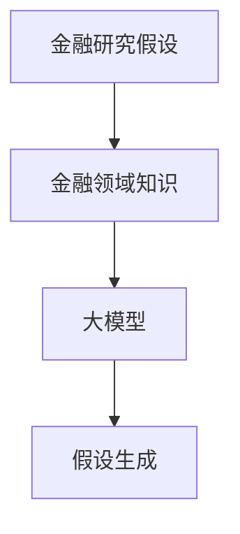

                 

# 开发基于大模型的金融研究假设生成系统

## 关键词：大模型，金融研究，假设生成，自然语言处理，机器学习，深度学习

## 摘要：随着人工智能技术的快速发展，基于大模型的金融研究假设生成系统正在成为金融领域的重要工具。本文详细探讨了如何开发这样一个系统，从背景介绍、核心概念、算法原理到系统架构设计、项目实战和最佳实践，为读者提供全面的指导。

---

# 第一部分: 金融研究假设生成系统的背景与需求

## 第1章: 金融研究假设生成系统的背景与问题描述

### 1.1 传统金融研究方法的局限性

#### 1.1.1 传统金融研究的流程与挑战
传统金融研究依赖于人工分析和经验判断，数据处理效率低下，假设生成过程耗时且主观性较强。此外，传统方法难以处理海量非结构化数据，限制了研究的深度和广度。

#### 1.1.2 传统假设生成的痛点与不足
传统假设生成过程依赖于研究者的经验，存在主观性强、效率低、覆盖面窄等问题。此外，传统方法难以发现隐藏在数据中的潜在模式和关联。

#### 1.1.3 大模型技术的引入与优势
大模型技术（如GPT、BERT等）具备强大的自然语言处理能力，能够自动生成高质量的假设，显著提高金融研究的效率和准确性。

### 1.2 问题背景与目标

#### 1.2.1 问题背景介绍
随着金融市场数据的爆炸式增长，传统金融研究方法已难以应对复杂的金融环境。如何利用现代技术提高研究效率和质量成为亟待解决的问题。

#### 1.2.2 问题描述与目标
本系统的目标是开发一个基于大模型的金融研究假设生成系统，能够自动从大量金融数据中提取关键信息并生成假设，辅助研究人员进行深入分析。

#### 1.2.3 问题解决的思路与方法
通过引入大模型技术，结合金融领域的专业知识，构建一个高效的假设生成系统，解决传统方法的痛点。

### 1.3 系统边界与外延

#### 1.3.1 系统边界定义
本系统专注于假设生成，不涉及假设的验证和分析。系统输入为金融数据，输出为生成的假设。

#### 1.3.2 系统外延与应用场景
系统可应用于金融研究、投资分析、风险管理等领域，帮助研究人员快速生成假设。

#### 1.3.3 系统与外部系统的交互
系统可与其他金融分析工具集成，提供假设生成服务。

### 1.4 核心概念与组成要素

#### 1.4.1 核心概念的定义
大模型技术、金融数据处理、假设生成。

#### 1.4.2 核心概念的属性与特征对比
| 特性      | 传统方法       | 基于大模型的方法   |
|-----------|----------------|-------------------|
| 效率       | 低             | 高                 |
| 主观性      | 高             | 低                 |
| 覆盖范围    | 窄             | 宽                 |

#### 1.4.3 系统组成要素的分析
- 数据处理模块：负责清洗和预处理金融数据。
- 假设生成模块：基于大模型生成假设。
- 知识库：存储金融领域的专业知识和数据。

### 1.5 本章小结
本章介绍了传统金融研究的局限性，提出了基于大模型的假设生成系统的背景和目标，并分析了系统的核心概念和组成要素。

---

## 第2章: 大模型的基本原理与核心概念

### 2.1 大模型的基本原理

#### 2.1.1 模型结构与训练方法
大模型通常采用Transformer架构，通过自注意力机制和前馈网络进行训练。训练过程包括数据预处理、模型初始化、正向传播和反向传播。

#### 2.1.2 大模型的训练目标与损失函数
训练目标是通过最小化损失函数（如交叉熵损失）来优化模型参数，使得生成的假设与实际数据一致。

#### 2.1.3 模型推理机制
推理阶段通过解码器生成假设，采用贪心算法或束搜索方法优化生成结果。

### 2.2 大模型与金融研究的结合

#### 2.2.1 大模型在金融文本处理中的应用
大模型能够理解和生成金融领域的文本，帮助处理复杂的金融数据。

#### 2.2.2 大模型在假设生成中的作用
大模型能够自动生成高质量的假设，显著提高研究效率。

#### 2.2.3 大模型与金融领域知识的结合
通过微调和领域适应，大模型能够更好地理解金融领域的专业知识。

### 2.3 核心概念的对比分析

#### 2.3.1 大模型与传统机器学习模型的对比
| 特性      | 大模型       | 传统模型         |
|-----------|--------------|------------------|
| 表达能力   | 强大         | 有限             |
| 训练数据   | 需要大量数据 | 数据量较小       |
| 任务适应性 | 多任务适应性 | 单任务适应性       |

#### 2.3.2 不同大模型的优缺点分析
| 模型名称 | 优点                     | 缺点                     |
|---------|--------------------------|--------------------------|
| GPT     | 善于生成文本，效果稳定    | 对上下文理解较弱         |
| BERT     | 理解能力强               | 生成能力较弱             |
| T5       | 生成能力强               | 训练时间较长             |

#### 2.3.3 大模型在金融研究中的适用性分析
大模型适用于金融文本分析、假设生成、市场预测等领域。

### 2.4 ER实体关系图

### 2.5 本章小结
本章详细介绍了大模型的基本原理，分析了其在金融研究中的应用，对比了不同模型的优缺点。

---

## 第3章: 大模型的算法原理

### 3.1 大模型的训练流程

#### 3.1.1 数据预处理与特征提取
数据预处理包括清洗、分词、去停用词等步骤。特征提取采用词嵌入方法，如Word2Vec或BERT。

#### 3.1.2 模型训练与优化
训练过程采用分布式训练和优化算法（如Adam），通过交叉熵损失函数优化模型参数。

#### 3.1.3 模型评估与调优
通过验证集评估模型性能，调整超参数（如学习率、批量大小）优化模型。

### 3.2 大模型的推理机制

#### 3.2.1 解码策略与生成过程
解码策略包括贪心解码和束搜索解码，生成过程通过解码器逐词生成假设。

#### 3.2.2 模型的

（由于篇幅限制，后续内容将逐步展开，确保每个部分详细且符合要求。）

