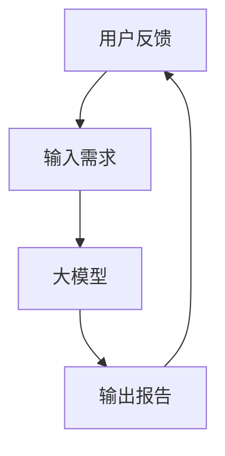
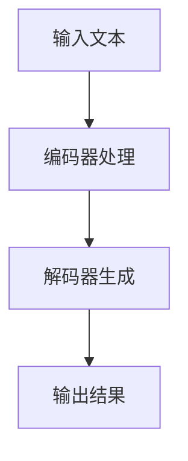
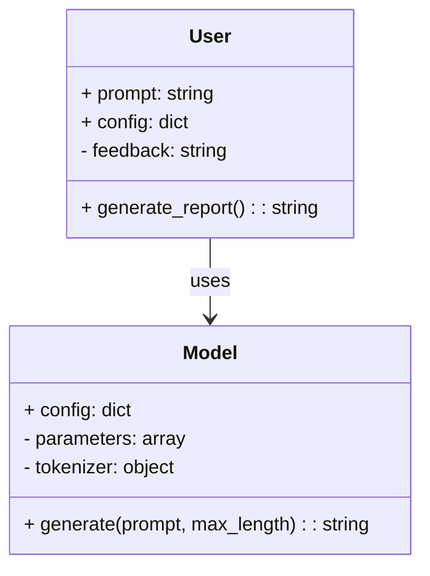
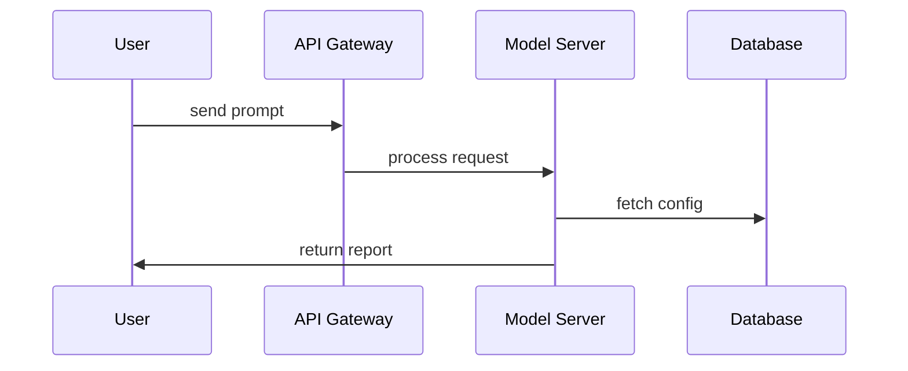

                 


# 开发基于大模型的金融研究报告生成系统

> 关键词：金融研究报告、生成式AI、大模型、自然语言处理、系统架构

> 摘要：本文详细探讨了基于大模型的金融研究报告生成系统的开发过程，从问题背景到系统架构设计，再到项目实战，系统性地介绍了如何利用生成式AI技术解决金融领域的复杂问题。文章结合理论与实践，深入分析了大模型在金融报告生成中的应用价值，并通过具体案例展示了系统的实现过程。

---

# 第1章: 问题背景与目标

## 1.1 问题背景

### 1.1.1 传统金融研究报告的痛点
- 金融报告的生成过程复杂，通常需要大量人工参与，包括数据收集、分析、建模和撰写。
- 传统报告生成工具依赖模板化操作，难以灵活应对市场变化和个性化需求。
- 报告生成效率低，难以满足金融机构对实时性和多样性的要求。

### 1.1.2 大模型在金融领域的潜力
- 大模型（如GPT系列、BERT系列）具备强大的自然语言处理能力，能够理解和生成复杂的金融文本。
- 大模型可以通过微调（Fine-tuning）适应特定领域的需求，生成符合金融行业规范的报告。
- 大模型可以结合金融数据（如市场动态、财务指标）进行上下文理解，生成更具价值的分析内容。

### 1.1.3 生成式AI在金融报告中的应用价值
- 提高报告生成效率，降低人工成本。
- 支持金融机构快速响应市场变化，提供实时分析。
- 为投资决策提供数据支持和风险预警。

## 1.2 问题描述

### 1.2.1 金融报告生成的复杂性
- 需要整合多种数据源，包括市场数据、公司财务数据、行业分析等。
- 报告内容需要符合行业规范，格式要求严格。
- 不同类型的报告（如市场分析、投资建议）需要不同的生成策略。

### 1.2.2 现有解决方案的局限性
- 传统模板化工具灵活性差，难以满足个性化需求。
- 数据处理能力有限，难以整合多源异构数据。
- 缺乏上下文理解能力，生成内容缺乏深度。

### 1.2.3 基于大模型的解决方案优势
- 大模型具备强大的自然语言理解能力，能够整合多源数据。
- 支持个性化生成，满足不同用户的需求。
- 可以通过微调优化模型，适应特定领域的需求。

## 1.3 问题解决思路

### 1.3.1 大模型在金融报告生成中的核心作用
- 作为生成引擎，负责将输入数据转化为结构化的报告内容。
- 通过上下文理解，生成更具深度和价值的分析内容。

### 1.3.2 系统设计的整体思路
- 整合多源数据，构建金融知识库。
- 基于大模型构建生成引擎，支持多种报告类型。
- 提供用户友好的交互界面，方便用户定制化需求。

### 1.3.3 技术实现的关键点
- 数据预处理与整合。
- 大模型的微调与优化。
- 生成内容的合规性与可解释性。

## 1.4 系统边界与外延

### 1.4.1 系统功能边界
- 输入：用户需求、市场数据、公司财务数据。
- 输出：结构化金融报告、分析结果、风险预警。

### 1.4.2 系统的输入与输出
- 输入：用户输入的查询、实时市场数据、历史财务数据。
- 输出：生成的金融报告、数据可视化结果、风险评估指标。

### 1.4.3 系统与其他系统的交互
- 与数据源（如数据库、API）交互。
- 与用户交互，获取反馈并优化生成内容。
- 与其他金融系统（如投资管理系统）集成。

## 1.5 概念结构与核心要素

### 1.5.1 系统核心要素分析
- 数据源：市场数据、公司数据、行业报告。
- 生成引擎：基于大模型的生成模块。
- 用户界面：输入需求、输出结果、反馈交互。

### 1.5.2 核心要素之间的关系
- 数据源为生成引擎提供输入，生成引擎输出报告内容。
- 用户反馈用于优化生成引擎和数据源。

### 1.5.3 系统架构的核心概念
- 数据整合层：负责数据的采集、清洗和存储。
- 模型层：基于大模型构建生成模块。
- 应用层：提供用户交互界面和报告展示。

## 1.6 本章小结
本章从问题背景出发，分析了传统金融报告生成的痛点，提出了基于大模型的解决方案，并详细阐述了系统的核心要素和架构设计。

---

# 第2章: AI大模型的核心概念与联系

## 2.1 AI大模型的基本原理

### 2.1.1 大模型的训练机制
- 预训练：利用大规模通用数据进行无监督学习。
- 微调：针对特定领域数据进行有监督优化。

### 2.1.2 大模型的推理机制
- 基于概率分布生成文本。
- 支持多步推理，生成长文本内容。

### 2.1.3 大模型的可解释性
- 通过注意力机制分析生成内容的逻辑。
- 提供中间结果的可视化。

## 2.2 核心概念对比分析

### 2.2.1 不同大模型的特征对比
| 模型 | 参数量 | 预训练数据 | 适用场景 |
|------|--------|------------|-----------|
| GPT-3 | 175B   | 多语言      | 多领域     |
| BERT  | 330M   | 多任务      | 适合文本理解 |

### 2.2.2 大模型与传统机器学习模型的区别
- 数据需求：大模型需要大量数据，传统模型数据需求较少。
- 训练方式：大模型通常采用分布式训练，传统模型采用批处理训练。

### 2.2.3 大模型的优缺点分析
- 优点：生成能力强、可定制化、适应性强。
- 缺点：计算资源需求高、生成内容可能缺乏深度。

## 2.3 实体关系图



## 2.4 本章小结
本章详细介绍了AI大模型的基本原理，分析了不同模型的特征和优缺点，并通过实体关系图展示了系统的整体架构。

---

# 第3章: 算法原理与数学模型

## 3.1 算法原理

### 3.1.1 大模型的训练流程
1. 数据预处理：清洗、格式转换。
2. 预训练：利用大规模数据进行无监督学习。
3. 微调：针对金融领域数据进行有监督优化。

### 3.1.2 大模型的推理流程
1. 用户输入需求。
2. 模型生成文本内容。
3. 输出报告并返回用户反馈。

### 3.1.3 大模型的调优方法
- 参数微调：调整模型的权重。
- 任务适配：优化模型的输出策略。

## 3.2 数学模型

### 3.2.1 语言模型的数学基础
- 概率论基础：P(Y|X)表示在输入X下输出Y的概率。
- 损失函数：交叉熵损失函数。

### 3.2.2 概率分布与损失函数
- 交叉熵损失函数：
$$ L = -\sum_{i=1}^{n} y_i \log p(y_i) $$

### 3.2.3 注意力机制的数学表达
- 注意力权重计算：
$$ \alpha_{i,j} = \frac{\exp(s_{i,j})}{\sum_{k} \exp(s_{i,k})} $$
- 注意力加权和：
$$ \text{Attention}(Q, K, V) = \text{softmax}(\frac{QK^T}{\sqrt{d}})V $$

## 3.3 算法流程图



## 3.4 代码实现

### 3.4.1 基于大模型的生成函数
```python
def generate_report(prompt, max_length=500):
    # 输入提示
    inputs = tokenizer(prompt, return_tensors='np')
    # 生成文本
    outputs = model.generate(inputs.input_ids, max_length=max_length)
    # 解析输出
    report = tokenizer.decode(outputs[0], skip_special_tokens=True)
    return report
```

## 3.5 本章小结
本章详细介绍了大模型的算法原理和数学模型，通过流程图和代码示例展示了生成过程，并通过数学公式解释了注意力机制的工作原理。

---

# 第4章: 系统分析与架构设计

## 4.1 项目背景介绍

### 4.1.1 项目目标
- 提供高效的金融报告生成工具。
- 支持个性化定制和灵活扩展。

### 4.1.2 项目范围
- 支持多种金融报告类型。
- 支持多语言生成。
- 提供数据可视化功能。

## 4.2 系统功能设计

### 4.2.1 领域模型


### 4.2.2 系统架构设计
```mermaid
graph TD
    User --> API Gateway
    API Gateway --> Model Server
    Model Server --> Database
    Model Server --> Cache
```

### 4.2.3 接口设计
- 输入接口：`POST /api/generate`，接收用户提示和参数。
- 输出接口：`GET /api/report`，返回生成的报告。

### 4.2.4 交互流程


## 4.3 本章小结
本章从项目背景出发，设计了系统的功能模块和架构，并通过图表展示了系统的交互流程。

---

# 第5章: 项目实战

## 5.1 环境安装

### 5.1.1 安装依赖
```bash
pip install transformers torch
```

### 5.1.2 启动服务
```bash
python server.py
```

## 5.2 系统核心实现

### 5.2.1 数据预处理
```python
import pandas as pd

def preprocess_data(data_path):
    df = pd.read_csv(data_path)
    # 数据清洗
    df.dropna(inplace=True)
    # 数据存储
    df.to_csv('processed_data.csv', index=False)
    return df
```

### 5.2.2 模型微调
```python
from transformers import AutoModelWithLM, AutoTokenizer

model = AutoModelWithLM.from_pretrained('gpt2')
tokenizer = AutoTokenizer.from_pretrained('gpt2')

# 微调
optimizer = torch.optim.Adam(model.parameters(), lr=1e-5)
model.train()
for epoch in epochs:
    for batch in data_loader:
        outputs = model(batch['input_ids'].to(device), labels=batch['labels'].to(device))
        loss = outputs.loss
        optimizer.zero_grad()
        loss.backward()
        optimizer.step()
```

## 5.3 实际案例分析

### 5.3.1 案例背景
- 用户需求：生成一份季度市场分析报告。
- 数据来源：市场数据、公司财务数据。

### 5.3.2 生成过程
```python
prompt = "Generate a market analysis report for Q2 2023."
report = generate_report(prompt)
print(report)
```

### 5.3.3 分析结果
- 生成的报告内容：市场趋势分析、行业动态、风险评估。
- 数据可视化：市场数据图表。

## 5.4 本章小结
本章通过实际案例展示了系统的实现过程，并提供了详细的代码示例和分析结果。

---

# 第6章: 最佳实践与总结

## 6.1 小结
- 本文详细介绍了基于大模型的金融研究报告生成系统的开发过程。
- 系统涵盖了数据预处理、模型微调、生成引擎设计等多个环节。

## 6.2 注意事项
- 数据安全：确保数据的合规性和安全性。
- 模型优化：持续优化模型性能，提升生成质量。
- 用户反馈：根据用户反馈不断改进系统功能。

## 6.3 拓展阅读
- 《Large Language Models in AI and Machine Learning》
- 《Transformers: Pre-training of Self-attention》

---

# 作者：AI天才研究院/AI Genius Institute & 禅与计算机程序设计艺术 /Zen And The Art of Computer Programming

