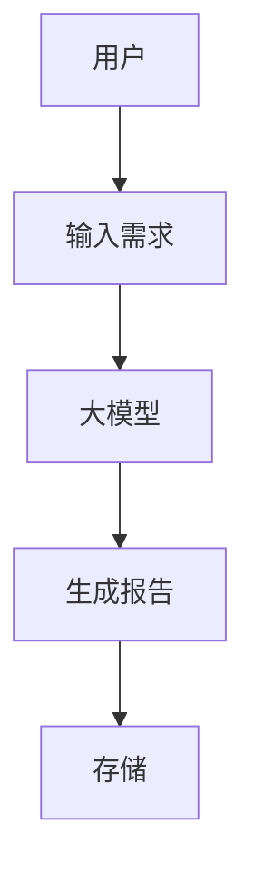
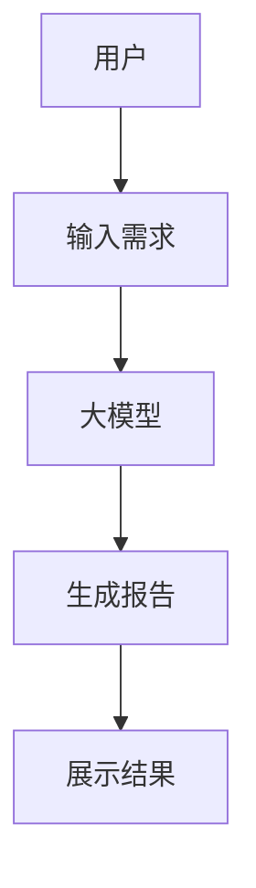
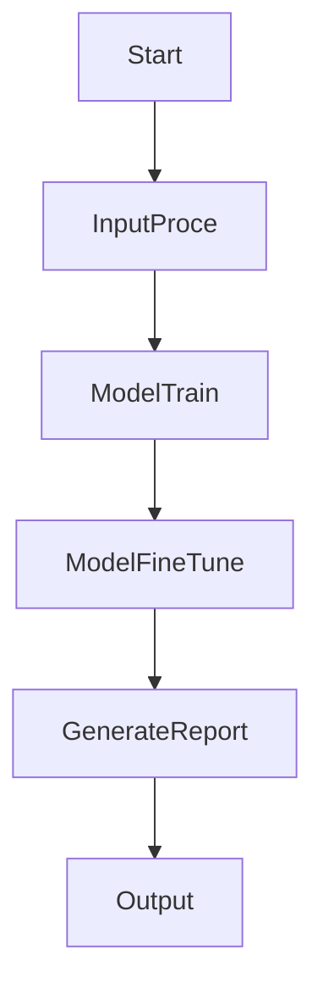
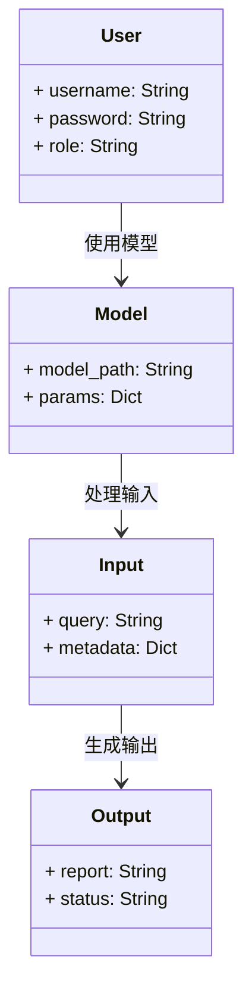
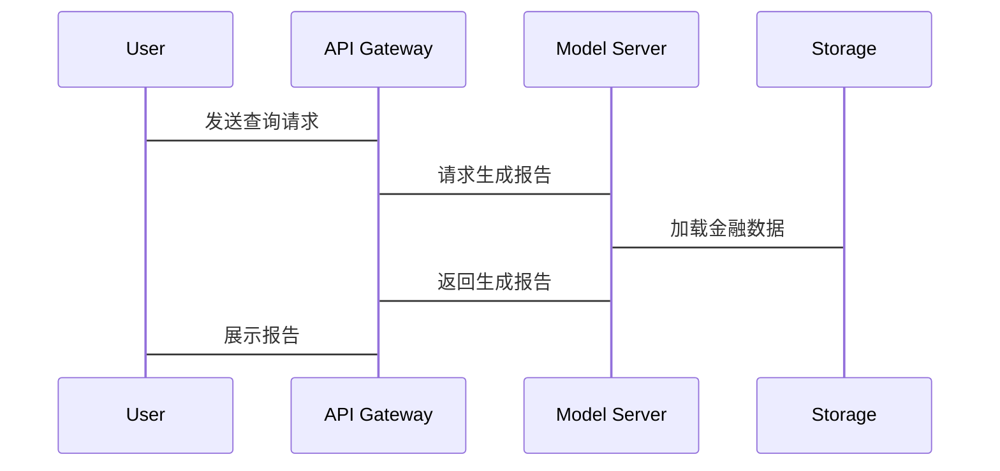

                 


# 开发基于大模型的金融研究报告自动生成器

## 关键词：
AI大模型，金融报告，自然语言处理，文本生成，自动化生成

## 摘要：
随着人工智能技术的快速发展，AI大模型在金融领域的应用越来越广泛。本文将详细介绍如何开发基于大模型的金融研究报告自动生成器。从背景介绍、核心概念到算法原理、系统架构设计，再到项目实战和最佳实践，全面解析该系统的技术实现和应用场景。通过本文，读者可以掌握从理论到实践的完整流程，为金融行业的智能化转型提供有力支持。

---

# 第1章: 背景介绍

## 1.1 问题背景

### 1.1.1 传统金融研究报告的痛点
- **效率低下**：金融报告的生成需要大量的人工劳动，尤其是数据收集、分析和撰写阶段。
- **一致性不足**：不同分析师生成的报告可能存在格式、风格和内容上的差异。
- **成本高昂**：专业金融分析师的工资和时间成本较高，限制了中小企业的使用。

### 1.1.2 AI大模型在金融领域的应用潜力
- **自然语言处理**：大模型可以理解和生成复杂的金融文本。
- **数据驱动决策**：利用大模型对海量金融数据进行分析和挖掘。
- **实时性**：大模型可以快速生成最新的市场分析和报告。

### 1.1.3 自动化生成报告的市场需求
- **企业需求**：金融机构需要高效、一致的报告生成工具。
- **用户需求**：投资者和分析师需要快速获取可靠的市场信息。
- **技术驱动**：AI技术的成熟为自动化报告生成提供了可能。

## 1.2 问题描述

### 1.2.1 金融报告生成的复杂性
- **多领域覆盖**：金融报告涉及股票、债券、基金等多个领域。
- **数据多样性**：报告需要结合市场数据、财务报表、新闻等多源信息。
- **专业性要求高**：报告内容需要符合金融行业的专业标准。

### 1.2.2 传统报告生成的效率瓶颈
- **人工主导**：报告生成过程依赖大量人工操作。
- **时间滞后**：传统报告生成周期长，难以满足实时需求。
- **资源分配不合理**：专业分析师的资源有限，难以满足大规模需求。

### 1.2.3 基于大模型的解决方案
- **自动化处理**：利用大模型实现数据处理、分析和报告生成的自动化。
- **实时更新**：大模型可以快速生成最新的市场分析和报告。
- **统一输出**：通过大模型实现报告格式和风格的统一。

## 1.3 问题解决

### 1.3.1 大模型在文本生成中的优势
- **强大的生成能力**：大模型可以生成高质量、复杂的金融文本。
- **可定制性**：支持不同风格和格式的报告生成。
- **灵活性**：适用于多种金融场景，如市场分析、风险评估等。

### 1.3.2 自动化生成报告的实现路径
- **数据输入**：用户输入需求，如行业、公司名称或市场趋势。
- **模型处理**：大模型根据输入生成初步报告内容。
- **结果优化**：通过反馈机制优化生成内容的质量。

### 1.3.3 技术与业务的结合点
- **技术层面**：利用大模型的自然语言处理能力实现文本生成。
- **业务层面**：结合金融数据和业务规则，生成符合需求的报告。

## 1.4 边界与外延

### 1.4.1 技术边界
- **模型能力**：受限于大模型的训练数据和参数规模。
- **计算资源**：生成过程需要高性能计算支持。
- **数据隐私**：金融数据的隐私保护和合规性要求。

### 1.4.2 业务边界
- **适用场景**：适用于市场分析、行业报告等标准化场景。
- **不适用场景**：不适用于需要高度定制化或敏感决策的场景。
- **数据范围**：限制在公开可用的金融数据范围内。

### 1.4.3 外延与扩展
- **模型升级**：未来可以集成更先进的大模型，如GPT-4。
- **功能扩展**：增加数据可视化、报告导出等功能。
- **行业扩展**：将技术应用到其他领域，如法律文档生成。

## 1.5 概念结构与核心要素

### 1.5.1 核心概念
- **输入需求**：用户输入的查询条件，如“最近的市场趋势”。
- **大模型处理**：模型根据输入生成报告内容。
- **输出结果**：生成的金融报告，包括分析和建议。

### 1.5.2 概念属性对比表
| 概念 | 属性 | 描述 |
|------|------|------|
| 输入需求 | 类型 | 文本或关键词 |
| 大模型处理 | 方法 | 自然语言生成 |
| 输出结果 | 格式 | 文本报告 |

### 1.5.3 实体关系图


---

# 第2章: 核心概念与联系

## 2.1 AI大模型的工作原理

### 2.1.1 大模型的训练过程
- **数据预处理**：清洗、标注和格式化金融数据。
- **模型训练**：利用海量金融文本数据进行监督学习。
- **模型调优**：通过微调任务优化模型在金融领域的表现。

### 2.1.2 模型的推理机制
- **编码器-解码器结构**：将输入转换为向量，再生成输出文本。
- **注意力机制**：关注输入中的重要部分，提升生成质量。
- **概率生成**：基于上下文生成最可能的下一个词。

### 2.1.3 大模型的可解释性
- **可视化工具**：如attention可视化，帮助理解模型决策过程。
- **可解释性层**：通过中间层输出，解释生成结果的原因。

## 2.2 大模型与金融报告的关系

### 2.2.1 金融报告的特点
- **专业性**：内容需符合金融行业的术语和标准。
- **数据驱动**：报告依赖大量金融数据支持。
- **时效性**：报告需要反映最新的市场动态。

### 2.2.2 大模型生成报告的优势
- **快速生成**：模型可以秒级生成报告。
- **一致性**：确保所有报告格式和风格统一。
- **可扩展性**：支持多种金融场景和数据源。

### 2.2.3 生成报告的可定制性
- **风格调整**：支持不同语言、语气的报告生成。
- **内容定制**：根据用户需求生成特定领域的报告。
- **数据筛选**：支持基于特定数据源的报告生成。

## 2.3 核心概念对比表

| 概念 | 属性 | 描述 |
|------|------|------|
| 传统报告 | 生成方式 | 人工撰写 |
| 基于大模型的报告 | 生成方式 | 自动化生成 |
| 传统报告 | 效率 | 低 |
| 基于大模型的报告 | 效率 | 高 |
| 传统报告 | 一致性 | 差异大 |
| 基于大模型的报告 | 一致性 | 高 |

---

## 2.4 实体关系图



---

# 第3章: 算法原理讲解

## 3.1 大模型的训练过程

### 3.1.1 数据预处理
- **数据清洗**：去除噪声数据，如特殊字符、无效信息。
- **数据标注**：标注金融术语、实体和关系。
- **数据格式化**：将数据转换为模型可读的格式。

### 3.1.2 模型训练
- **训练数据**：使用金融领域的文本数据，如新闻、分析报告。
- **训练目标**：最小化生成文本的交叉熵损失。
- **训练过程**：利用GPU集群加速训练。

### 3.1.3 模型调优
- **微调任务**：在金融领域数据上进行微调。
- **超参数优化**：调整学习率、批量大小等参数。
- **评估指标**：使用BLEU、ROUGE等指标评估生成质量。

## 3.2 生成报告的算法流程

### 3.2.1 输入处理
- **输入解析**：将用户输入解析为模型可理解的向量。
- **上下文构建**：构建生成文本的上下文信息。

### 3.2.2 模型推理
- **解码器生成**：解码器根据编码器输出生成文本。
- **注意力机制**：关注输入中的重要部分，提升生成质量。

### 3.2.3 输出生成
- **文本生成**：模型生成完整的报告内容。
- **结果优化**：通过后处理优化生成文本的质量。

## 3.3 算法流程图



---

## 3.4 数学模型

### 3.4.1 损失函数
$$ \text{损失函数} = -\sum_{i=1}^{n} \log P(y_i|x_{1:i}) $$
其中，$P(y_i|x_{1:i})$ 是条件概率，表示在已知前面生成的文本的情况下，生成下一个词的概率。

### 3.4.2 优化器
常用Adam优化器，优化过程如下：
$$ \theta_{t+1} = \theta_t - \eta \frac{\partial L}{\partial \theta_t} $$
其中，$\eta$ 是学习率，$\frac{\partial L}{\partial \theta_t}$ 是损失函数对参数的梯度。

---

# 第4章: 系统分析与架构设计

## 4.1 问题场景介绍

### 4.1.1 项目背景
- **目标**：开发一个基于大模型的金融报告自动生成器。
- **用户角色**：金融分析师、投资者。
- **使用场景**：市场分析、行业报告生成。

## 4.2 系统功能设计

### 4.2.1 领域模型


### 4.2.2 系统架构设计
```mermaid
graph TD
    Client --> API Gateway
    API Gateway --> Model Server
    Model Server --> Storage
```

### 4.2.3 接口设计
- **输入接口**：接受用户的查询请求。
- **输出接口**：返回生成的报告内容。
- **状态反馈**：提供生成过程中的状态信息。

### 4.2.4 交互设计


## 4.3 项目小结

### 4.3.1 核心挑战
- **模型性能**：如何提升生成报告的质量。
- **数据隐私**：如何保护用户数据的安全。
- **计算资源**：如何优化模型的计算效率。

### 4.3.2 解决方案
- **模型优化**：通过微调和参数调整提升生成质量。
- **数据加密**：采用加密技术保护用户数据。
- **资源管理**：优化模型部署和计算资源分配。

---

# 第5章: 项目实战

## 5.1 环境安装

### 5.1.1 安装Python和依赖
```bash
pip install torch transformers
```

### 5.1.2 下载大模型
```bash
# 下载GPT-2模型
python -m transformers download gpt2
```

## 5.2 核心代码实现

### 5.2.1 模型加载
```python
from transformers import AutoTokenizer, AutoModelWithLMHead

tokenizer = AutoTokenizer.from_pretrained("gpt2")
model = AutoModelWithLMHead.from_pretrained("gpt2")
```

### 5.2.2 生成报告
```python
def generate_report(prompt, max_length=500):
    inputs = tokenizer.encode(prompt, return_tensors="pt")
    outputs = model.generate(inputs, max_length=max_length)
    report = tokenizer.decode(outputs[0], skip_special_tokens=True)
    return report
```

### 5.2.3 代码解读
- **模型加载**：加载预训练的GPT-2模型。
- **生成报告**：根据输入提示生成指定长度的报告内容。
- **返回结果**：将生成的文本返回给用户。

## 5.3 实际案例分析

### 5.3.1 案例描述
用户输入：“生成一份关于2023年第四季度科技行业的市场分析报告。”

### 5.3.2 代码运行
```python
prompt = "生成一份关于2023年第四季度科技行业的市场分析报告。"
report = generate_report(prompt)
print(report)
```

### 5.3.3 结果分析
生成的报告内容可能包括市场趋势、主要公司表现、行业预测等。

## 5.4 项目总结

### 5.4.1 成功经验
- **模型选择**：选择了适合金融领域的模型。
- **代码实现**：实现了高效的生成流程。
- **结果优化**：通过后处理提升了生成质量。

### 5.4.2 改进建议
- **模型升级**：未来可以尝试使用更大参数的模型。
- **数据增强**：引入更多金融数据提升生成质量。
- **用户反馈**：通过用户反馈不断优化生成内容。

---

# 第6章: 最佳实践

## 6.1 小结
- **系统优势**：基于大模型的金融报告生成器具有高效、一致的优势。
- **技术要点**：掌握大模型的训练和调优方法是关键。

## 6.2 注意事项
- **数据隐私**：确保用户数据的安全和合规性。
- **模型性能**：持续优化模型性能以提升生成质量。
- **用户体验**：设计友好的用户界面提升用户体验。

## 6.3 拓展阅读
- **推荐书籍**：《Deep Learning》、《Natural Language Processing with PyTorch》。
- **推荐博客**：关注技术博客和开源项目，获取最新技术动态。

---

# 作者

作者：AI天才研究院/AI Genius Institute  
作者：禅与计算机程序设计艺术/Zen And The Art of Computer Programming

---

通过以上章节的详细解析和实战案例，读者可以全面掌握开发基于大模型的金融研究报告自动生成器的核心技术和实践方法。

