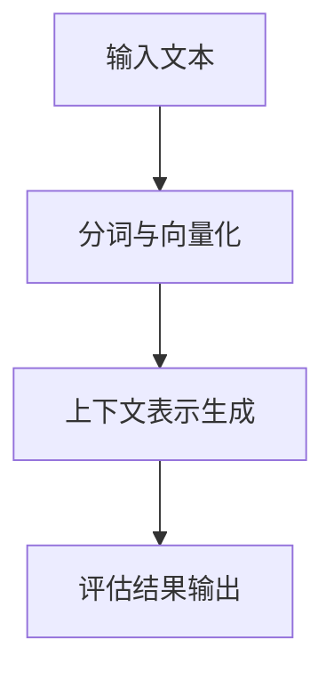

                 


# 开发基于大模型的金融研究报告评估系统

## 关键词：大模型, 金融报告, 自然语言处理, 评估系统, AI技术

## 摘要：本文详细介绍了基于大模型的金融研究报告评估系统的开发过程。从问题背景到系统架构设计，从算法原理到项目实战，全面阐述了该系统的实现方法。文章内容涵盖系统功能模块划分、大模型的自然语言处理流程、系统架构设计、系统接口设计以及实际案例分析，为读者提供了一个完整的开发指南。

---

## 第一部分: 开发基于大模型的金融研究报告评估系统概述

### 第1章: 背景介绍

#### 1.1 问题背景
- **金融研究报告的重要性**：金融研究报告是投资者、分析师和金融机构做出决策的重要依据。然而，传统的人工评估方式耗时且容易受到主观因素的影响。
- **传统金融研究报告评估的局限性**：传统评估方法依赖人工经验，存在主观性强、效率低、成本高等问题。
- **大模型技术在金融领域的应用潜力**：大模型具备强大的自然语言处理能力，能够快速分析大量文本数据，为金融报告评估提供新的解决方案。

#### 1.2 问题描述
- **金融研究报告评估的核心问题**：如何高效、客观地评估金融报告的质量和准确性。
- **现有评估方法的不足**：传统方法依赖人工经验，难以量化评估标准，且效率低下。
- **基于大模型的评估系统的优势**：能够快速处理大量文本数据，提供客观的评估结果，并且可以不断优化模型性能。

#### 1.3 问题解决
- **大模型在金融报告评估中的应用价值**：通过自然语言处理技术，大模型能够提取报告中的关键信息，分析其逻辑性和准确性。
- **基于大模型的评估系统解决方案**：构建一个基于大模型的金融报告评估系统，实现自动化、智能化的报告评估。
- **系统设计的核心目标与关键指标**：核心目标是实现高效的报告评估，关键指标包括评估速度、准确性和用户满意度。

#### 1.4 系统边界与外延
- **系统的功能边界**：系统仅负责报告的文本分析和评估，不涉及报告生成或其他业务流程。
- **系统的输入输出范围**：输入是金融报告文本，输出是评估结果和相关分析。
- **系统与其他金融系统的交互关系**：系统可以与投资决策系统、数据分析平台等其他金融系统进行交互。

#### 1.5 核心概念结构与组成
- **金融研究报告的特征分析**：包括报告的结构、语言风格、数据引用等。
- **大模型在金融领域的核心要素**：包括模型的训练数据、自然语言处理能力、上下文理解能力等。
- **系统架构的关键组成部分**：包括输入模块、处理模块、评估模块和输出模块。

---

## 第二部分: 核心概念与联系

### 第2章: 核心概念与联系

#### 2.1 AI大模型在金融报告评估中的原理
- **大模型的自然语言处理能力**：大模型能够理解和生成自然语言文本，能够识别文本中的关键词、主题和情感倾向。
- **大模型的上下文理解和推理能力**：大模型能够分析文本的上下文关系，推理出隐含的信息。
- **大模型在金融领域的应用优势**：大模型能够处理大量金融领域的专业文本，提取关键信息，帮助评估报告的质量。

#### 2.2 核心概念原理
- **大模型的训练与推理机制**：大模型通过大量金融领域的文本数据进行预训练，能够在新的金融报告文本上进行推理和评估。
- **金融报告的文本特征提取**：包括关键词提取、主题分类、情感分析等。
- **系统评估指标的设计与实现**：评估指标包括报告的逻辑性、数据准确性、语言清晰度等。

#### 2.3 核心概念属性对比
- **不同大模型的性能对比**：包括模型的训练效率、推理速度、准确率等。
- **不同金融报告评估方法的优缺点**：包括人工评估、基于规则的评估和基于模型的评估。
- **系统架构的可扩展性与可维护性**：系统的架构设计需要考虑未来的扩展性和维护成本。

---

## 第三部分: 算法原理讲解

### 第3章: 算法原理讲解

#### 3.1 大模型的自然语言处理流程
- **输入文本的分词与向量化**：将文本分成词语或短语，并将其转换为向量表示。
- **上下文表示的生成**：通过模型生成上下文表示，捕捉文本中的语义信息。
- **评估结果的输出与解释**：根据上下文表示生成评估结果，并提供解释。

#### 3.2 算法流程图


#### 3.3 算法数学模型
- **预训练目标函数**
  $$ L = -\sum_{i=1}^{n} \log P(w_i|w_{i-1}) $$
- **评估指标计算公式**
  $$ Score = \sum_{i=1}^{m} (w_i \cdot x_i) $$

---

## 第四部分: 系统分析与架构设计方案

### 第4章: 系统分析与架构设计方案

#### 4.1 问题场景介绍
- **金融报告评估的典型场景**：投资者需要快速评估报告的质量，机构需要批量处理大量报告。
- **系统用户角色与权限分配**：包括普通用户、管理员等。
- **系统运行环境与资源需求**：包括硬件配置、软件环境等。

#### 4.2 系统功能设计
- **系统功能模块划分**：包括文本输入模块、文本处理模块、评估模块和结果输出模块。
- **系统功能流程图**
  ```mermaid
  graph TD
  A[用户输入报告] --> B[预处理模块]
  B --> C[大模型评估模块]
  C --> D[结果输出模块]
  ```

#### 4.3 系统架构设计
- **系统架构图**
  ```mermaid
  graph TD
  A[用户] --> B[前端界面]
  B --> C[后端服务]
  C --> D[大模型服务]
  D --> E[数据库]
  ```

#### 4.4 系统接口设计
- **系统接口描述**：包括输入接口和输出接口的设计。
- **系统交互设计**
  ```mermaid
  sequenceDiagram
  participant 用户 as 用户
  participant 前端界面 as 前端
  participant 后端服务 as 后端
  用户 -> 前端: 提交报告
  前端 -> 后端: 请求评估
  后端 -> 用户: 返回结果
  ```

---

## 第五部分: 项目实战

### 第5章: 项目实战

#### 5.1 环境安装
- **安装Python环境**：使用Anaconda或虚拟环境。
- **安装大模型框架**：如TensorFlow、PyTorch等。
- **安装其他依赖库**：如Numpy、Pandas等。

#### 5.2 系统核心实现源代码
```python
# 模型加载
from transformers import AutoTokenizer, AutoModelForMaskedLM

tokenizer = AutoTokenizer.from_pretrained('bert-base-uncased')
model = AutoModelForMaskedLM.from_pretrained('bert-base-uncased')

# 文本处理
def process_text(text):
    inputs = tokenizer.encode_plus(text, return_tensors='pt', padding=True, truncation=True)
    return inputs

# 模型推理
def evaluate_report(text):
    inputs = process_text(text)
    outputs = model(**inputs)
    # 处理输出结果
    return {"score": outputs[0].item(), "explanation": "..."}

# 系统接口
def main():
    import sys
    text = sys.stdin.read()
    result = evaluate_report(text)
    print(result)
```

#### 5.3 实际案例分析
- **案例背景**：假设有一份关于某公司的财务报告。
- **案例分析**：系统如何处理报告文本，生成评估结果。
- **详细讲解**：包括文本分词、上下文表示生成、评估结果输出等步骤。

#### 5.4 项目小结
- **项目实现的关键点**：包括模型的选择、文本处理流程、评估指标的设计等。
- **项目的优缺点**：优点是高效、准确，缺点是需要大量的计算资源。
- **项目的未来改进方向**：包括优化模型性能、增加更多评估指标等。

---

## 第六部分: 最佳实践与总结

### 第6章: 最佳实践与总结

#### 6.1 最佳实践
- **模型选择**：选择适合金融领域的模型，如BERT、GPT等。
- **数据处理**：确保数据的质量和多样性，避免过拟合。
- **系统优化**：优化系统的运行效率，降低资源消耗。

#### 6.2 小结
- **系统的整体总结**：总结系统的实现过程、优势和不足。
- **系统的核心价值**：强调系统在金融领域的应用价值。
- **系统的未来发展方向**：展望系统未来的发展方向和应用前景。

#### 6.3 注意事项
- **模型的可解释性**：确保模型的决策过程是可解释的。
- **系统的安全性**：确保系统的数据安全和隐私保护。
- **系统的可扩展性**：确保系统能够适应未来的发展需求。

#### 6.4 拓展阅读
- **相关文献**：推荐一些关于大模型在金融领域的应用的文献。
- **技术博客**：推荐一些相关的技术博客和开源项目。

---

## 作者：AI天才研究院/AI Genius Institute & 禅与计算机程序设计艺术 /Zen And The Art of Computer Programming

---

通过以上详细的内容，希望读者能够全面理解基于大模型的金融研究报告评估系统的开发过程，并能够实际操作和应用这些技术。

