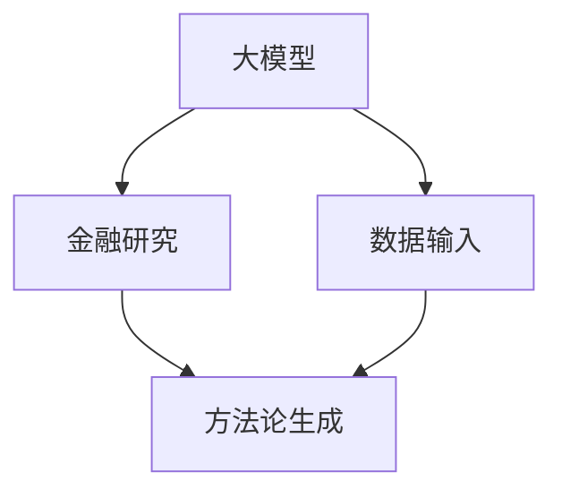
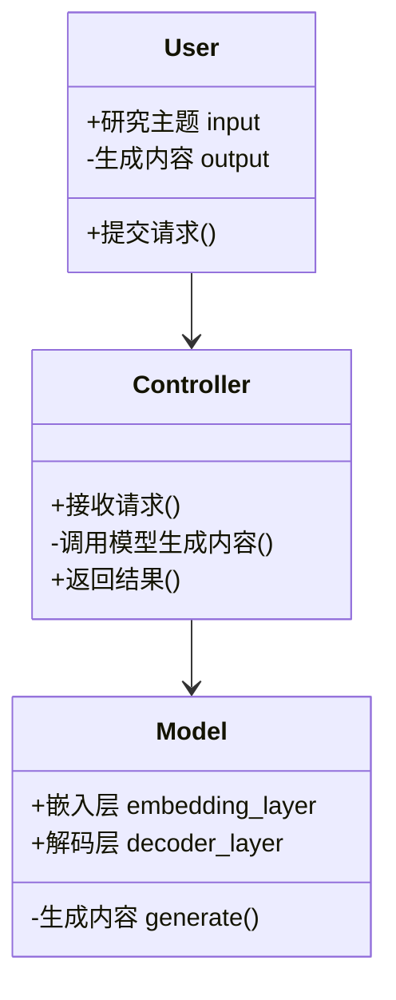
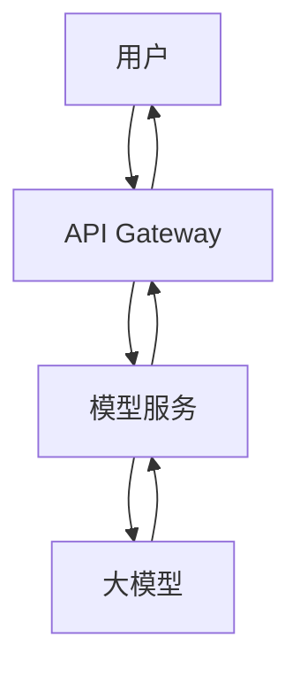
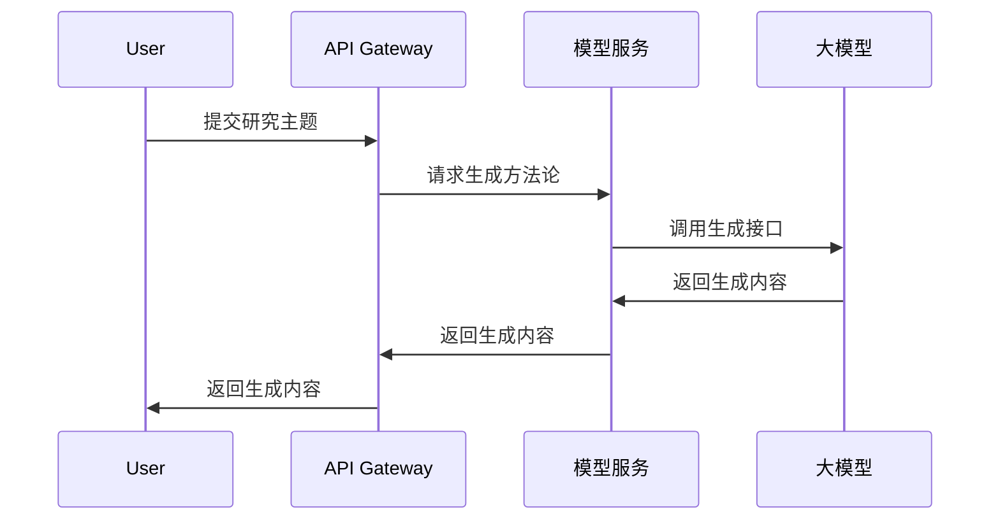

                 


# 开发基于大模型的金融研究方法论生成器

## 关键词：
- 生成式AI
- 金融研究
- 大模型
- 方法论生成
- 系统架构设计
- 项目实战

## 摘要：
本文探讨如何利用生成式人工智能（AI）大模型，开发一个能够自动生成金融研究方法论的工具。文章从背景、核心概念、算法原理、系统架构到项目实战，逐步分析和实现这一目标。通过详细的技术解析和实际案例，揭示大模型在金融研究中的潜力和应用。

---

# 第1章: 问题背景与目标

## 1.1 问题背景介绍

### 1.1.1 传统金融研究方法的局限性
传统的金融研究依赖人工经验、复杂的数据处理和大量的文献查阅，存在以下问题：
- 数据量大且复杂，难以快速提取关键信息。
- 方法论的生成依赖人工经验，难以系统化和自动化。
- 研究效率低下，难以应对快速变化的金融市场。

### 1.1.2 大模型在金融研究中的潜在价值
生成式AI大模型（如GPT系列）具有强大的自然语言处理和生成能力，能够帮助金融研究实现：
- 快速生成研究方法论的框架。
- 自动生成文献综述和数据处理步骤。
- 提供研究方向和假设的建议。

### 1.1.3 当前行业痛点与挑战
- 数据隐私和安全问题。
- 大模型的训练和推理成本高。
- 方法论生成的可解释性不足。

## 1.2 问题描述与目标

### 1.2.1 金融研究方法论生成的需求
金融研究通常需要明确的研究目标、数据收集方法和分析框架。生成式AI可以自动生成这些内容，帮助研究人员快速启动项目。

### 1.2.2 基于大模型的解决方案
利用大模型的生成能力，开发一个金融研究方法论生成器，能够根据输入的研究主题，自动生成研究框架、数据收集方法和分析步骤。

### 1.2.3 目标与预期成果
- 开发一个能够自动生成金融研究方法论的工具。
- 提高金融研究的效率和系统性。
- 降低金融研究的门槛，让更多人能够快速进入研究领域。

## 1.3 问题解决思路

### 1.3.1 大模型在金融领域中的应用潜力
- 自然语言处理：理解金融文献和数据。
- 文本生成：生成研究方法论和报告。
- 数据分析：辅助数据收集和处理。

### 1.3.2 方法论生成的实现路径
1. 数据收集与预处理：收集金融领域的文献和数据。
2. 模型训练：基于金融数据训练生成式AI模型。
3. 方法论生成：输入研究主题，输出方法论框架。

### 1.3.3 技术与业务结合的关键点
- 模型的可解释性：生成的方法论需要可追溯和可验证。
- 数据隐私：确保金融数据的安全性。
- 系统的稳定性：保证生成器的高效运行。

## 1.4 本章小结
本章分析了传统金融研究方法的局限性，提出了基于大模型的解决方案，并明确了开发目标和实现路径。

---

# 第2章: 核心概念与联系

## 2.1 大模型的基本原理

### 2.1.1 大模型的定义与核心要素
生成式AI大模型通常基于Transformer架构，由编码器和解码器组成，能够生成与输入相关联的文本。

### 2.1.2 大模型的训练与推理机制
- **训练**：通过大量金融文献和数据进行预训练，学习语言模型。
- **推理**：根据输入的研究主题，生成方法论框架。

### 2.1.3 大模型的可解释性与局限性
- **可解释性**：生成结果难以完全解释。
- **局限性**：可能生成不准确或不符合金融逻辑的内容。

## 2.2 金融研究方法论的构成

### 2.2.1 金融研究的基本框架
- **研究目标**：明确研究的核心问题。
- **数据收集**：确定数据来源和处理方法。
- **分析方法**：选择适合的统计或机器学习方法。
- **结果解读**：解释研究结果并提出结论。

### 2.2.2 方法论的核心要素
- 研究问题：明确研究的主题和目标。
- 数据来源：数据的获取方式和处理方法。
- 分析方法：选择的统计或机器学习模型。

### 2.2.3 方法论的适用场景与边界
- 适用于初步研究框架的生成。
- 不适用于高度专业化的金融分析。

## 2.3 大模型与金融研究方法论的关联

### 2.3.1 大模型在方法论生成中的作用
- 自动生成研究框架和数据收集方法。
- 帮助研究人员快速启动项目。

### 2.3.2 方法论生成的流程与模式
1. **输入**：研究人员输入研究主题。
2. **生成**：模型生成研究框架和数据收集方法。
3. **调整**：根据实际情况调整生成内容。

### 2.3.3 大模型与金融研究的双向促进
- 大模型推动金融研究的自动化。
- 金融研究为大模型提供丰富的训练数据。

## 2.4 核心概念对比表

| 比较维度 | 大模型 | 传统金融研究方法 |
|----------|--------|------------------|
| 数据依赖 | 高度依赖大规模数据 | 依赖少量高质量数据 |
| 可扩展性 | 高，可以快速生成大量内容 | 低，依赖人工经验 |
| 精准度 | 中等，可能生成错误内容 | 高，依赖专家经验 |

## 2.5 ER实体关系图


## 2.6 本章小结
本章详细介绍了大模型的基本原理和金融研究方法论的构成，并分析了两者之间的联系。

---

# 第3章: 算法原理与实现

## 3.1 算法原理

### 3.1.1 大模型的训练流程
- 数据预处理：清洗和格式化金融文献数据。
- 模型训练：使用Transformer架构，优化损失函数。

### 3.1.2 方法论生成的流程
- 输入研究主题，生成初步研究框架。
- 根据框架生成数据收集和分析方法。

### 3.1.3 算法的数学模型
损失函数：交叉熵损失
$$ L = -\sum_{i=1}^{n} y_i \log p(y_i|x_i) $$
优化器：Adam
$$ \theta_{t+1} = \theta_t - \eta \frac{\partial L}{\partial \theta_t} $$

## 3.2 算法实现

### 3.2.1 Python代码实现
```python
import torch
import torch.nn as nn

class Transformer(nn.Module):
    def __init__(self, embed_dim):
        super().__init__()
        self.encoder = nn.Embedding(embed_dim, embed_dim)
        self.decoder = nn.Embedding(embed_dim, embed_dim)
        
    def forward(self, input, target):
        encoder_output = self.encoder(input)
        decoder_output = self.decoder(encoder_output)
        return decoder_output

# 训练过程
model = Transformer(embed_dim=512)
optimizer = torch.optim.Adam(model.parameters(), lr=0.001)
criterion = nn.CrossEntropyLoss()

for epoch in range(num_epochs):
    inputs, targets = get_batch()
    outputs = model(inputs, targets)
    loss = criterion(outputs, targets)
    optimizer.zero_grad()
    loss.backward()
    optimizer.step()
```

### 3.2.2 代码解读与分析
- **Transformer模型**：编码器和解码器用于处理输入和生成输出。
- **训练过程**：使用Adam优化器和交叉熵损失函数进行训练。

## 3.3 算法优化

### 3.3.1 模型调优
- 调整嵌入维度和层数。
- 使用更大的数据集进行微调。

### 3.3.2 生成效果评估
- 使用BLEU和ROUGE等指标评估生成内容的质量。

## 3.4 本章小结
本章详细介绍了大模型的算法原理和实现过程，并展示了具体的代码实现。

---

# 第4章: 系统架构与设计

## 4.1 系统架构设计

### 4.1.1 问题场景介绍
系统需要支持多用户同时使用，提供高效的生成服务。

### 4.1.2 系统功能设计
- 用户输入研究主题。
- 系统生成研究方法论。
- 提供生成内容的可调整选项。

### 4.1.3 领域模型类图


### 4.1.4 系统架构图


## 4.2 接口与交互设计

### 4.2.1 API接口设计
- **输入**：研究主题（字符串）。
- **输出**：研究方法论（JSON格式）。

### 4.2.2 交互流程


## 4.3 系统实现

### 4.3.1 环境配置
- 安装Python、PyTorch和相关库。
- 配置GPU加速。

### 4.3.2 代码实现
```python
from flask import Flask, request, jsonify

app = Flask(__name__)

@app.route('/generate', methods=['POST'])
def generate_methodology():
    input = request.json['input']
    # 调用大模型生成方法论
    output = model.generate(input)
    return jsonify({'output': output})

if __name__ == '__main__':
    app.run(debug=True)
```

## 4.4 本章小结
本章详细介绍了系统架构设计、接口与交互设计，并展示了具体的实现代码。

---

# 第5章: 项目实战与分析

## 5.1 项目实战

### 5.1.1 环境安装
- 安装Python和相关库：`pip install torch flask`

### 5.1.2 系统核心实现

```python
import torch
import torch.nn as nn
from flask import Flask, request, jsonify

class Transformer(nn.Module):
    def __init__(self, embed_dim):
        super().__init__()
        self.encoder = nn.Embedding(embed_dim, embed_dim)
        self.decoder = nn.Embedding(embed_dim, embed_dim)
        
    def forward(self, input, target):
        encoder_output = self.encoder(input)
        decoder_output = self.decoder(encoder_output)
        return decoder_output

app = Flask(__name__)

@app.route('/generate', methods=['POST'])
def generate_methodology():
    input = request.json['input']
    # 调用大模型生成方法论
    output = model.generate(input)
    return jsonify({'output': output})

if __name__ == '__main__':
    model = Transformer(embed_dim=512)
    app.run(debug=True)
```

### 5.1.3 代码解读与分析
- **Transformer模型**：编码器和解码器用于处理输入和生成输出。
- **Flask应用**：提供API接口，接收输入并返回生成内容。

## 5.2 实际案例分析

### 5.2.1 案例背景
用户输入研究主题：股票价格预测。

### 5.2.2 系统生成内容
1. **研究目标**：预测股票价格的变化趋势。
2. **数据收集**：获取过去一年的股票数据和市场新闻。
3. **分析方法**：使用LSTM进行时间序列预测。

### 5.2.3 生成结果
$$ \text{预测结果：股票价格将在未来一周上涨} $$

## 5.3 项目小结
通过实际案例分析，展示了系统的核心功能和实现过程。

---

# 第6章: 最佳实践与总结

## 6.1 小结

### 6.1.1 核心概念总结
- 大模型在金融研究中的应用潜力。
- 方法论生成器的开发过程。

### 6.1.2 系统设计总结
- 问题场景的分析。
- 系统架构的设计与实现。

## 6.2 最佳实践

### 6.2.1 实践小结
- 确保模型的可解释性。
- 保护数据隐私和安全。
- 提供灵活的生成选项。

### 6.2.2 注意事项
- 避免生成错误的金融建议。
- 定期更新模型以适应市场变化。

## 6.3 拓展阅读

### 6.3.1 相关书籍
- 《深度学习》—— Ian Goodfellow
- 《生成式AI：原理与应用》—— 李开复

### 6.3.2 技术博客与资源
- Hugging Face大模型库。
- PyTorch官方文档。

## 6.4 本章小结
本章总结了项目的开发过程，并提出了最佳实践建议和拓展资源。

---

# 结语

通过本文的详细讲解，我们了解了如何利用生成式AI大模型开发金融研究方法论生成器。从背景分析到系统实现，再到项目实战，我们展示了整个开发过程的细节和挑战。未来，随着大模型技术的不断发展，金融研究的效率和深度将进一步提升。

---

作者：AI天才研究院/AI Genius Institute & 禅与计算机程序设计艺术/Zen And The Art of Computer Programming

