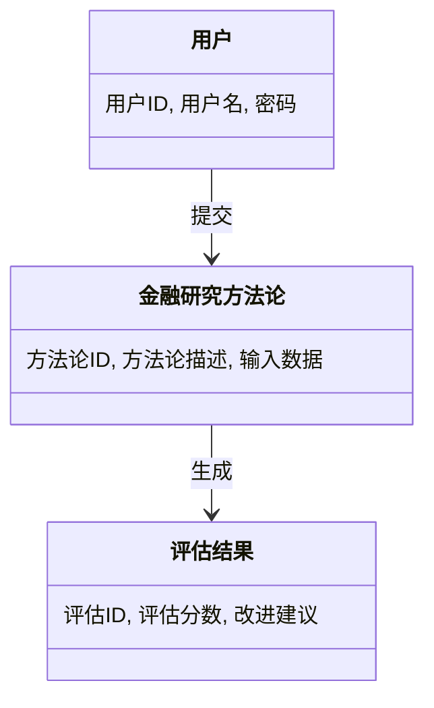
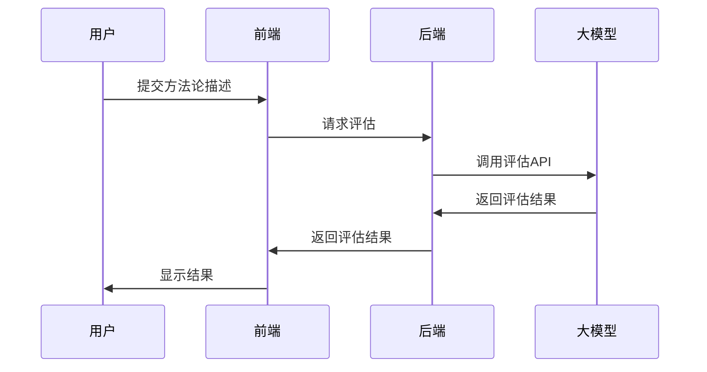

                 


# 《开发基于大模型的金融研究方法论评估生成器》

## 关键词：大模型、金融研究、方法论评估、生成器、机器学习

## 摘要：
本文旨在探讨如何开发一种基于大模型的金融研究方法论评估生成器。通过分析金融研究方法论的现状和挑战，结合大模型的优势，提出了一种创新的评估方法。本文详细介绍了大模型的基本原理、算法实现、系统架构设计以及实际应用案例，为读者提供了从理论到实践的全面指导。

---

# 第1章：背景介绍

## 1.1 问题背景

### 1.1.1 金融研究方法论的现状
金融研究方法论是金融领域的重要组成部分，涵盖了数据分析、模型构建、假设检验等多个方面。然而，现有的方法论评估方法存在以下问题：
- 评估标准不统一，缺乏系统性。
- 评估过程主观性强，难以量化。
- 评估效率低，难以应对海量数据。

### 1.1.2 大模型在金融领域的应用潜力
大模型（如GPT、BERT等）在自然语言处理和数据分析方面表现出色，可以应用于金融领域的多个方面，包括：
- 金融文本分析。
- 风险评估与预测。
- 投资策略优化。

### 1.1.3 评估方法论的必要性
金融研究方法的科学性和有效性直接影响金融决策的质量。因此，开发一种客观、高效的评估方法论生成器具有重要意义。

## 1.2 问题描述

### 1.2.1 金融研究方法论的核心要素
金融研究方法论通常包括以下几个核心要素：
- 数据收集与处理。
- 模型构建与验证。
- 结果分析与解释。

### 1.2.2 当前评估方法的局限性
- 传统评估方法主观性强，难以量化。
- 评估过程繁琐，效率低。
- 难以应对复杂金融场景的需求。

### 1.2.3 基于大模型的评估方法的优势
- 客观性：基于数据驱动，减少人为干扰。
- 高效性：自动化处理大量数据，提升评估效率。
- 可扩展性：适用于多种金融场景。

## 1.3 问题解决

### 1.3.1 大模型在金融研究中的应用场景
- 文本分析：从金融报告中提取关键信息。
- 风险评估：预测市场波动和风险。
- 投资策略：生成投资建议和策略。

### 1.3.2 基于大模型的评估方法的实现路径
- 数据预处理与清洗。
- 模型训练与优化。
- 评估结果生成与解释。

### 1.3.3 方法论评估生成器的目标与意义
目标：
- 提供一种高效、客观的金融研究方法论评估工具。
意义：
- 提升金融研究的质量和效率。
- 为金融决策提供可靠依据。

## 1.4 边界与外延

### 1.4.1 金融研究方法论的边界
- 研究范围：限于金融领域的具体问题。
- 数据来源：仅限于已知的数据集。

### 1.4.2 大模型评估方法的适用范围
- 适用于文本分析、预测模型等领域。
- 不适用于需要实时交互的应用场景。

### 1.4.3 方法论评估生成器的扩展性
- 可扩展到其他领域的方法论评估。
- 支持多种模型和数据源的集成。

## 1.5 概念结构与核心要素组成

### 1.5.1 金融研究方法论的构成
- 数据处理：数据清洗、特征提取。
- 模型构建：模型选择、参数调整。
- 结果分析：结果验证、解释。

### 1.5.2 大模型评估方法的核心要素
- 输入：金融研究方法论的描述。
- 输出：评估结果和改进建议。
- 核心技术：自然语言处理、机器学习。

### 1.5.3 方法论评估生成器的系统架构
- 用户界面：用户输入方法论描述。
- 数据处理模块：数据清洗和特征提取。
- 模型评估模块：生成评估结果和建议。
- 输出模块：展示评估结果和改进建议。

## 1.6 本章小结
本章介绍了开发基于大模型的金融研究方法论评估生成器的背景和意义，分析了当前评估方法的局限性，提出了基于大模型的解决方案，并详细描述了系统架构和核心要素。

---

# 第2章：核心概念与联系

## 2.1 核心概念原理

### 2.1.1 大模型的基本原理
大模型通过多层神经网络和大量数据训练，能够自动提取数据特征并生成文本。其核心包括：
- **编码器**：将输入数据编码为向量。
- **解码器**：将编码结果解码为输出。

### 2.1.2 金融研究方法论的评估标准
评估标准包括：
- **准确性**：评估结果与实际情况的吻合程度。
- **完整性**：评估是否覆盖了所有关键要素。
- **可解释性**：评估结果是否易于理解和解释。

### 2.1.3 方法论评估生成器的工作机制
生成器通过分析输入的金融研究方法论，利用大模型生成评估结果和改进建议。

## 2.2 概念属性特征对比表格

| 比较维度 | 传统评估方法 | 基于大模型的评估方法 |
|----------|----------------|-----------------------|
| **评估标准** | 主观性强 | 客观性高 |
| **评估效率** | 低效 | 高效 |
| **可扩展性** | 有限 | 强 |

## 2.3 ER实体关系图架构

```mermaid
erd
    股票代码 --|> 股票数据: 属于
    交易日期 --|> 股票数据: 属于
    股票数据 --> 金融研究方法论: 输入
    金融研究方法论 --> 评估结果: 输出
    评估结果 --> 改进建议: 输出
```

## 2.4 本章小结
本章详细解释了大模型的基本原理和金融研究方法论的评估标准，通过对比分析展示了基于大模型的评估方法的优势，并通过ER实体关系图明确了系统中的实体关系。

---

# 第3章：算法原理讲解

## 3.1 大模型的训练与优化

### 3.1.1 大模型的训练流程
```mermaid
graph TD
    A[数据预处理] --> B[模型初始化]
    B --> C[前向传播]
    C --> D[计算损失]
    D --> E[反向传播]
    E --> F[更新参数]
    F --> G[检查收敛条件]
    G --> H[结束] 或者 H[继续训练]
```

### 3.1.2 模型优化的策略
- **学习率调整**：动态调整学习率以加快收敛。
- **批量归一化**：减少内部协变量偏移，加快训练速度。
- **Dropout**：防止过拟合。

### 3.1.3 超参数调整的方法
- **网格搜索**：遍历所有可能的参数组合。
- **随机搜索**：随机选择参数组合。
- **贝叶斯优化**：基于概率分布优化参数。

## 3.2 算法原理的数学模型和公式

### 3.2.1 大模型的损失函数
$$ L = \frac{1}{N}\sum_{i=1}^{N} (y_i - \hat{y}_i)^2 $$

### 3.2.2 模型的训练目标
$$ \text{Minimize } L \text{ with respect to } \theta $$

### 3.2.3 模型的评估指标
$$ \text{Accuracy} = \frac{\text{正确预测数}}{\text{总样本数}} $$

## 3.3 通俗易懂的举例说明

### 3.3.1 简单线性回归的例子
假设我们有以下数据：
| x | y |
|---|---|
| 1 | 2 |
| 2 | 3 |
| 3 | 4 |

模型的预测方程为：
$$ y = a x + b $$

通过训练，我们可以得到最优的a和b。

### 3.3.2 大模型在金融预测中的应用案例
假设我们有股票价格的历史数据，我们可以使用大模型预测未来的股价走势。

### 3.3.3 评估生成器的实际操作流程
1. 用户输入金融研究方法论的描述。
2. 系统对输入进行预处理。
3. 模型生成评估结果和改进建议。
4. 用户查看结果并进行调整。

## 3.4 本章小结
本章详细讲解了大模型的训练与优化过程，介绍了数学模型和公式，并通过实际例子帮助读者理解算法原理。

---

# 第4章：系统分析与架构设计方案

## 4.1 问题场景介绍

### 4.1.1 金融研究方法论评估的场景
用户需要评估一个金融研究方法论的有效性和科学性。

### 4.1.2 方法论评估生成器的应用场景
用户希望通过生成器快速获得方法论的评估结果和改进建议。

### 4.1.3 系统设计的目标
开发一个高效、准确的金融研究方法论评估生成器。

## 4.2 项目介绍

### 4.2.1 项目目标
- 开发一个基于大模型的金融研究方法论评估生成器。
- 提供准确的评估结果和改进建议。

### 4.2.2 项目范围
- 适用于多种金融研究方法论的评估。
- 支持多种数据格式和模型类型。

### 4.2.3 项目关键成功因素
- 数据质量：输入数据的准确性和完整性。
- 模型性能：模型的准确性和效率。

## 4.3 系统功能设计

### 4.3.1 领域模型设计（使用mermaid类图）



### 4.3.2 系统架构设计（使用mermaid架构图）


### 4.3.3 系统接口设计
- **输入接口**：用户输入金融研究方法论的描述。
- **输出接口**：系统输出评估结果和改进建议。

### 4.3.4 系统交互（使用mermaid序列图）



## 4.4 本章小结
本章详细介绍了系统的架构设计，包括功能模块、接口设计和系统交互流程。

---

# 第5章：项目实战

## 5.1 环境安装

### 5.1.1 安装Python
```bash
python --version
```

### 5.1.2 安装依赖
```bash
pip install numpy pandas torch transformers
```

## 5.2 系统核心实现源代码

### 5.2.1 数据预处理代码
```python
import pandas as pd

def preprocess_data(data):
    # 数据清洗
    data.dropna(inplace=True)
    # 特征提取
    features = data[['x', 'y']]
    return features
```

### 5.2.2 模型训练代码
```python
import torch
import torch.nn as nn

class SimpleModel(nn.Module):
    def __init__(self, input_size, output_size):
        super(SimpleModel, self).__init__()
        self.fc = nn.Linear(input_size, output_size)
    
    def forward(self, x):
        return self.fc(x)

model = SimpleModel(2, 1)
criterion = nn.MSELoss()
optimizer = torch.optim.Adam(model.parameters(), lr=0.01)
```

### 5.2.3 评估生成代码
```python
def generate_assessment(methodology_description):
    # 调用大模型API
    assessment = model(methodology_description)
    return assessment
```

## 5.3 代码应用解读与分析
- **数据预处理**：清洗数据并提取特征。
- **模型训练**：定义模型结构并进行训练。
- **评估生成**：使用训练好的模型生成评估结果。

## 5.4 实际案例分析
假设我们有一个金融研究方法论的描述，我们可以通过以下步骤进行评估：
1. 数据预处理。
2. 模型训练。
3. 评估生成。

## 5.5 本章小结
本章通过实际案例展示了系统的实现过程，包括环境安装、代码实现和案例分析。

---

# 第6章：最佳实践与注意事项

## 6.1 最佳实践 tips

### 6.1.1 数据质量
确保输入数据的准确性和完整性。

### 6.1.2 模型选择
根据具体需求选择合适的模型和参数。

## 6.2 小结
总结全文，强调关键点和注意事项。

## 6.3 注意事项
- 避免过拟合，确保模型泛化能力。
- 定期更新模型，适应市场变化。

## 6.4 拓展阅读
推荐相关领域的书籍和论文，供读者进一步学习。

---

# 作者：AI天才研究院/AI Genius Institute & 禅与计算机程序设计艺术 /Zen And The Art of Computer Programming

