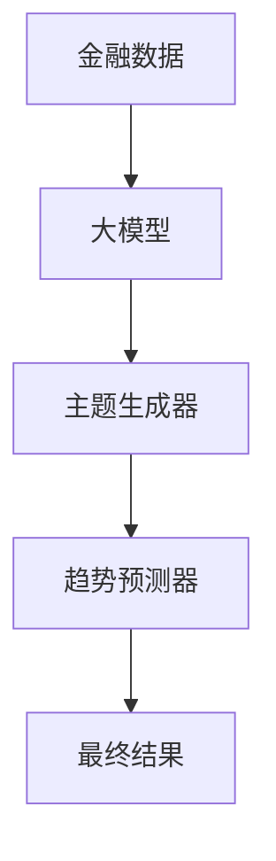
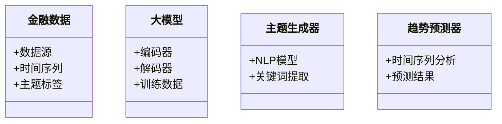
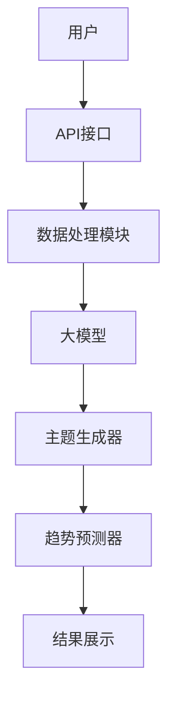
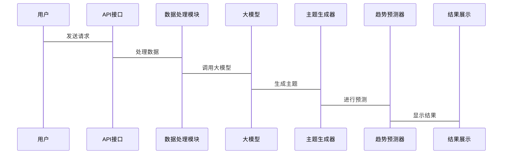

                 


# 开发基于大模型的金融研究趋势预测与主题生成器

> 关键词：大模型、金融趋势预测、主题生成器、算法原理、系统架构设计

> 摘要：本文详细探讨了基于大模型的金融研究趋势预测与主题生成器的开发过程。从问题背景、核心概念到算法原理、系统架构设计，再到项目实战，本文为读者提供了全面的技术指导。通过深入分析大模型在金融领域的应用，结合具体的数学公式和系统架构图，本文展示了如何利用大模型技术实现金融研究的趋势预测和主题生成。

---

# 第1章: 背景介绍

## 1.1 问题背景

### 1.1.1 金融研究趋势预测的挑战
金融市场的复杂性和不确定性使得趋势预测成为一个具有挑战性的任务。传统的方法依赖于统计分析和人工经验，但随着数据量的指数级增长，这种方法的局限性日益显现。

### 1.1.2 主题生成器在金融研究中的作用
主题生成器能够从大量金融数据中提取关键词和主题，为研究者提供重要的参考信息。然而，现有的主题生成器在生成准确和相关主题方面仍存在不足。

### 1.1.3 大模型技术的引入与应用
大模型（如GPT、BERT等）在自然语言处理领域取得了显著成果。通过引入大模型技术，我们可以提升金融研究趋势预测和主题生成的准确性和效率。

## 1.2 问题描述

### 1.2.1 金融数据的复杂性
金融数据通常包括时间序列、文本、市场情绪等多种类型的数据，这些数据的复杂性使得传统的数据分析方法难以应对。

### 1.2.2 研究趋势预测的不确定性
金融市场受多种因素影响，包括宏观经济、政策变化、市场情绪等，这些因素使得趋势预测具有高度不确定性。

### 1.2.3 主题生成器的局限性与改进方向
现有的主题生成器在生成主题时缺乏对上下文和领域知识的深度理解，导致生成的主题相关性不足。

## 1.3 问题解决

### 1.3.1 大模型在金融研究中的优势
大模型具有强大的特征提取能力和上下文理解能力，能够在复杂的数据中发现潜在模式和关联。

### 1.3.2 基于大模型的解决方案
通过将大模型与金融数据分析技术结合，我们可以构建一个高效、准确的金融研究趋势预测与主题生成系统。

### 1.3.3 技术实现路径与目标
技术实现路径包括数据收集、模型训练、接口开发等，目标是实现一个能够实时预测金融趋势并生成相关主题的系统。

## 1.4 边界与外延

### 1.4.1 金融研究的边界
金融研究通常关注市场趋势、投资策略、风险评估等领域，但不涉及具体的交易操作。

### 1.4.2 大模型应用的边界
大模型的应用主要集中在数据处理和模式识别方面，但其解释性和可定制性相对有限。

### 1.4.3 技术与业务的结合点
技术与业务的结合点在于如何将大模型与具体的金融研究场景结合，例如市场情绪分析、投资策略生成等。

## 1.5 概念结构与核心要素

### 1.5.1 核心概念组成
- **金融数据**：包括时间序列数据、新闻文本、市场报告等。
- **大模型**：用于特征提取和模式识别。
- **主题生成器**：生成与金融数据相关的主题。
- **趋势预测器**：基于模型输出进行趋势预测。

### 1.5.2 概念之间的关系
金融数据是输入，经过大模型处理后生成主题，最后通过趋势预测器得出预测结果。

### 1.5.3 系统架构的初步设想


---

# 第2章: 核心概念与联系

## 2.1 核心概念原理

### 2.1.1 大模型的原理
大模型通过多层神经网络结构进行特征提取和生成，其核心在于大规模预训练和微调。

### 2.1.2 金融趋势预测的原理
金融趋势预测基于时间序列分析和模型的输出结果，结合市场数据进行预测。

### 2.1.3 主题生成器的原理
主题生成器通过自然语言处理技术从金融数据中提取关键词和主题。

## 2.2 概念属性特征对比

| 概念       | 输入       | 输出       | 方法         |
|------------|------------|------------|--------------|
| 大模型     | 金融数据   | 特征/主题   | 预训练+微调  |
| 趋势预测器  | 主题/特征   | 预测结果    | 时间序列分析 |
| 主题生成器  | 金融数据   | 主题关键词   | NLP生成       |

### 2.2.1 对比表格展示
如上表所示，大模型、趋势预测器和主题生成器在输入、输出和方法上存在差异。

### 2.2.2 关键特征分析
- **输入**：金融数据的多样性和复杂性是关键特征。
- **输出**：主题和预测结果的准确性和相关性是核心目标。
- **方法**：结合大模型和传统数据分析方法是关键。

### 2.2.3 属性之间的关系
金融数据是输入，经过大模型处理后生成主题，最后通过趋势预测器得出预测结果。

## 2.3 ER实体关系图


---

# 第3章: 算法原理讲解

## 3.1 大模型的算法原理

### 3.1.1 大模型的训练过程
大模型的训练过程包括预训练和微调两个阶段。

#### 预训练
预训练阶段使用大规模通用数据进行无监督学习，目标是提取通用语言特征。

#### 微调
微调阶段使用特定领域的金融数据进行有监督学习，目标是适应金融领域的任务。

### 3.1.2 金融趋势预测的算法原理
金融趋势预测基于时间序列分析和大模型的输出结果。

#### 时间序列分析
时间序列分析是一种统计技术，用于分析随时间变化的数据，预测未来的趋势。

### 3.1.3 结合大模型的改进方法
通过将大模型的输出作为时间序列分析的输入，可以提升预测的准确性。

## 3.2 算法实现的数学模型

### 3.2.1 损失函数
$$ \text{损失函数} = \sum_{i=1}^{n} (y_i - \hat{y_i})^2 $$

### 3.2.2 梯度下降
$$ \theta_{\text{新}} = \theta_{\text{旧}} - \eta \frac{\partial L}{\partial \theta} $$

---

# 第4章: 系统分析与架构设计方案

## 4.1 问题场景介绍

### 4.1.1 金融研究的典型场景
金融研究通常涉及市场趋势分析、投资策略生成、风险评估等领域。

### 4.1.2 大模型的应用场景
大模型在金融领域的应用场景包括金融文本生成、市场情绪分析、投资策略生成等。

### 4.1.3 系统的目标与范围
系统的目标是实现金融研究趋势预测与主题生成，范围包括数据收集、模型训练、接口开发等。

## 4.2 项目介绍

### 4.2.1 项目背景
随着金融数据的快速增长，传统方法难以应对复杂的数据分析任务。

### 4.2.2 项目目标
开发一个基于大模型的金融研究趋势预测与主题生成系统，提升金融研究的效率和准确性。

### 4.2.3 项目范围
包括数据收集、模型训练、系统架构设计、接口开发等。

## 4.3 系统功能设计

### 4.3.1 领域模型类图



### 4.3.2 系统架构图



### 4.3.3 系统接口设计
- **输入接口**：接收金融数据和用户请求。
- **输出接口**：返回预测结果和生成的主题。

### 4.3.4 系统交互序列图



---

# 第5章: 项目实战

## 5.1 环境安装

### 5.1.1 安装Python
```bash
python --version
```

### 5.1.2 安装必要的库
```bash
pip install numpy pandas tensorflow transformers
```

## 5.2 核心代码实现

### 5.2.1 数据预处理
```python
import pandas as pd
import numpy as np

# 加载数据
data = pd.read_csv('financial_data.csv')

# 数据清洗
data = data.dropna()
```

### 5.2.2 大模型训练
```python
from tensorflow.keras import layers

# 定义模型
model = tf.keras.Sequential()
model.add(layers.Embedding(input_dim=10000, output_dim=16))
model.add(layers.LSTM(64))
model.add(layers.Dense(1, activation='sigmoid'))

# 编译模型
model.compile(optimizer='adam', loss='binary_crossentropy', metrics=['accuracy'])
```

### 5.2.3 主题生成器实现
```python
from transformers import GPT2Tokenizer, GPT2Model

tokenizer = GPT2Tokenizer.from_pretrained('gpt2')
model = GPT2Model.from_pretrained('gpt2')

# 生成主题
inputs = tokenizer.encode("Generate financial themes:", add_special_tokens=True)
outputs = model.generate(inputs, max_length=50)
themes = tokenizer.decode(outputs[0], skip_special_tokens=True)
print(themes)
```

### 5.2.4 趋势预测器实现
```python
import numpy as np

# 时间序列预测
def predict_trend(data):
    model = ARIMA(order=(1,1,0))
    model.fit(data)
    return model.forecast(1)

trend = predict_trend(data)
print(trend)
```

## 5.3 案例分析

### 5.3.1 数据来源
数据来源包括金融新闻、市场报告和历史价格数据。

### 5.3.2 案例分析
通过实际案例分析，验证系统的预测准确性和主题生成的相关性。

## 5.4 项目小结
通过项目实战，我们验证了基于大模型的金融研究趋势预测与主题生成系统的可行性，并展示了其在实际应用中的潜力。

---

# 第6章: 最佳实践 tips

## 6.1 tips
- 数据质量是关键，确保数据的完整性和准确性。
- 模型调参是提升性能的重要手段，建议进行多次实验。
- 系统的可扩展性设计，便于后续功能的添加和优化。

## 6.2 小结
本文详细介绍了基于大模型的金融研究趋势预测与主题生成器的开发过程，从背景介绍到系统设计，再到项目实战，为读者提供了全面的技术指导。

## 6.3 注意事项
- 数据隐私和安全问题需要注意。
- 模型的可解释性是一个重要考虑因素。
- 系统的实时性和稳定性需要充分测试。

## 6.4 扩展阅读
建议读者进一步阅读相关领域的最新论文和技术报告，以深入了解大模型在金融领域的更多应用。

---

# 作者：AI天才研究院/AI Genius Institute & 禅与计算机程序设计艺术 /Zen And The Art of Computer Programming

