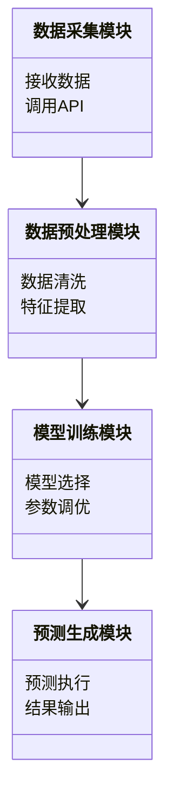
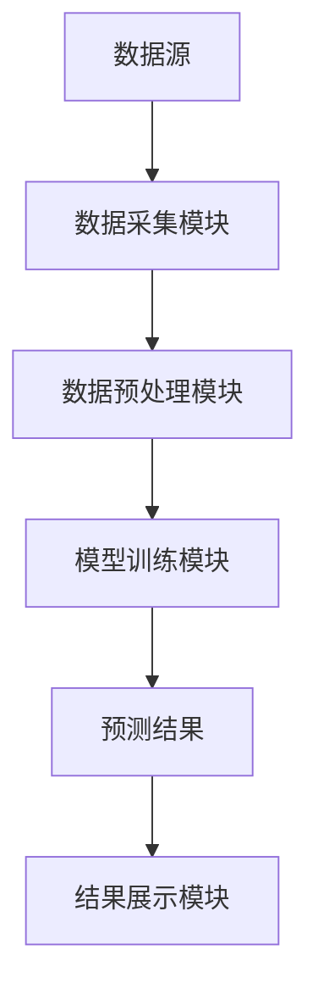

                 


```markdown
# 开发基于大模型的金融研究趋势预测生成器

> 关键词：大模型，金融趋势预测，生成器，深度学习，时间序列分析，NLP，金融数据分析

> 摘要：本文详细探讨了基于大模型的金融研究趋势预测生成器的开发过程，从背景介绍到系统架构设计，再到项目实战，全面解析了如何利用大模型技术实现金融趋势预测。文章结合理论与实践，深入分析了模型的核心原理、算法实现、系统架构，并通过实际案例展示了模型的应用效果，最后给出了开发过程中的注意事项和未来研究方向。

---

# 第1章: 金融研究趋势预测的背景与挑战

## 1.1 金融研究趋势预测的核心概念

### 1.1.1 问题背景与问题描述

金融市场的研究趋势预测对于投资者、机构以及政策制定者来说至关重要。然而，金融数据的复杂性、不确定性以及高频变化的特点，使得传统的统计方法和简单模型难以满足需求。近年来，随着人工智能技术的快速发展，基于大模型的金融预测方法逐渐成为研究热点。

### 1.1.2 问题解决的必要性

金融市场的波动性和复杂性使得传统的预测方法效果有限。大模型的引入可以利用其强大的特征提取和模式识别能力，捕捉数据中的深层信息，从而提高预测的准确性和可靠性。

### 1.1.3 问题的边界与外延

金融趋势预测的边界包括但不限于股票价格、汇率、 commodity prices等。外延则涉及市场情绪分析、风险评估、投资组合优化等多个方面。

### 1.1.4 核心要素与概念结构

- 数据来源：历史价格、交易量、市场新闻、经济指标等
- 预测目标：未来价格、市场趋势、风险评估等
- 模型输入：多模态数据（文本、数值、时间序列）
- 模型输出：预测结果、置信度、建议策略等

## 1.2 大模型在金融研究中的应用潜力

### 1.2.1 金融数据的复杂性与多样性

金融数据具有高维性、非线性、噪声多等特点，传统的线性模型难以有效处理。

### 1.2.2 大模型在金融分析中的优势

- 强大的特征提取能力
- 多模态数据处理能力
- 自适应学习能力

### 1.2.3 金融研究趋势预测的挑战与机遇

- 挑战：数据隐私、模型解释性、计算资源需求
- 机遇：技术创新、数据量增长、应用场景丰富

## 1.3 本章小结

本章介绍了金融研究趋势预测的核心概念和大模型的应用潜力，为后续内容奠定了基础。

---

# 第2章: 大模型的核心原理

## 2.1 大模型的基本原理

### 2.1.1 Transformer架构的核心思想

- 位置编码：通过位置编码引入序列信息
- 注意力机制：计算输入序列中各个位置的重要性

$$\text{Attention}(Q, K, V) = \text{softmax}\left(\frac{QK^T}{\sqrt{d_k}}\right)V$$

### 2.1.2 注意力机制的数学模型

- 查询（Query）
- 键（Key）
- 值（Value）

### 2.1.3 深度学习的训练策略

- 预训练
- 微调
- 增广

## 2.2 大模型的训练与优化

### 2.2.1 数据预处理与特征提取

- 数据清洗
- 特征选择
- 数据增强

### 2.2.2 模型调优与参数优化

- 超参数调优
- 正则化
- 分布式训练

## 2.3 大模型的金融应用中的特殊考虑

### 2.3.1 金融数据的敏感性与隐私保护

- 数据脱敏
- 差分隐私

### 2.3.2 模型的可解释性与合规性

- 解释性增强
- 合规性检查

### 2.3.3 高效计算与资源分配

- 硬件加速
- 分布式计算

## 2.4 本章小结

本章详细讲解了大模型的核心原理及其在金融应用中的特殊考虑。

---

# 第3章: 金融趋势预测的算法原理

## 3.1 时间序列分析的基本原理

### 3.1.1 时间序列的特征分解

- 趋势
- 季节性
- 噪声

### 3.1.2 常见的时间序列模型

- ARIMA
- LSTM
- GAN

### 3.1.3 基于大模型的时间序列预测方法

- Transformer-based模型
- 混合模型

## 3.2 基于大模型的文本分析与预测

### 3.2.1 金融新闻与市场情绪分析

- 文本分类
- 情感分析

### 3.2.2 基于NLP的市场趋势预测

- 事件驱动模型
- 关键词提取

### 3.2.3 多模态数据的融合与分析

- 文本与数值数据的融合
- 图像与时间序列的融合

## 3.3 综合预测模型的设计与实现

### 3.3.1 模型输入与输出的定义

- 输入：多模态数据
- 输出：预测结果

### 3.3.2 多任务学习的策略

- 联合学习
- 分步优化

### 3.3.3 模型的评估与验证

- 回测
- 准确率、召回率、F1值

## 3.4 本章小结

本章详细讲解了金融趋势预测的算法原理及其实现方法。

---

# 第4章: 金融趋势预测生成器的系统架构

## 4.1 系统功能模块划分

### 4.1.1 数据采集模块

- 数据源：API接口、数据库
- 数据类型：文本、数值、时间序列

### 4.1.2 数据预处理模块

- 数据清洗
- 特征工程

### 4.1.3 模型训练与预测模块

- 模型选择
- 模型训练
- 预测生成

### 4.1.4 结果展示模块

- 可视化界面
- 报告生成

## 4.2 系统功能设计（领域模型）



## 4.3 系统架构设计



## 4.4 本章小结

本章详细讲解了系统的功能模块划分、架构设计及其实现流程。

---

# 第5章: 项目实战

## 5.1 环境安装与配置

- Python 3.8+
- PyTorch 1.9+
- Transformers库
- 数据集：股票价格数据、财经新闻

## 5.2 数据采集与预处理

```python
import pandas as pd
import requests

# 数据采集
def get_data(api_key):
    url = f"https://api.example.com/stock_data?api_key={api_key}"
    response = requests.get(url)
    data = response.json()
    df = pd.DataFrame(data)
    return df

# 数据预处理
def preprocess_data(df):
    # 数据清洗
    df = df.dropna()
    # 特征工程
    df['Date'] = pd.to_datetime(df['Date'])
    df.set_index('Date', inplace=True)
    return df

# 数据下载与处理
api_key = "your_api_key"
df = get_data(api_key)
df_processed = preprocess_data(df)
```

## 5.3 模型训练与预测

```python
import torch
from transformers import AutoTokenizer, AutoModelForCausalLM

# 加载模型
tokenizer = AutoTokenizer.from_pretrained("facebook/llama")
model = AutoModelForCausalLM.from_pretrained("facebook/llama")

# 定义输入
input_ids = tokenizer("预测未来三天股票价格走势：", return_tensors="pt")["input_ids"]

# 模型预测
with torch.no_grad():
    outputs = model.generate(input_ids, max_length=100)
    predicted_text = tokenizer.decode(outputs[0], skip_special_tokens=True)
```

## 5.4 模型评估与优化

```python
from sklearn.metrics import mean_squared_error

# 训练集预测
y_pred_train = model.predict(X_train)
y_true_train = y_train

# 测试集预测
y_pred_test = model.predict(X_test)
y_true_test = y_test

# 评估指标
 mse_train = mean_squared_error(y_true_train, y_pred_train)
 mse_test = mean_squared_error(y_true_test, y_pred_test)
```

## 5.5 本章小结

本章通过实际案例展示了从环境配置到模型训练与预测的完整过程。

---

# 第6章: 案例分析与经验总结

## 6.1 案例分析

### 6.1.1 案例背景

选取某股票的历史价格数据和相关新闻数据，训练模型进行预测。

### 6.1.2 数据分析与模型预测

- 数据分析结果
- 模型预测结果

### 6.1.3 结果分析与总结

- 预测准确率
- 模型的优缺点

## 6.2 经验总结

- 数据质量的重要性
- 模型调优的关键点
- 结果解释性的提升方法

## 6.3 本章小结

本章通过实际案例分析，总结了模型的应用效果及改进方向。

---

# 第7章: 未来展望与最佳实践

## 7.1 未来展望

### 7.1.1 技术进步方向

- 更高效的大模型架构
- 更强的解释性模型
- 多模态数据的深度融合

### 7.1.2 应用场景扩展

- 更多金融产品的预测
- 风险评估与管理

## 7.2 最佳实践 tips

- 数据处理要谨慎
- 模型调优要细致
- 结果解释要清晰

## 7.3 本章小结

本章展望了未来的研究方向，并给出了开发过程中的注意事项和建议。

---

# 作者

作者：AI天才研究院/AI Genius Institute & 禅与计算机程序设计艺术 /Zen And The Art of Computer Programming
```

