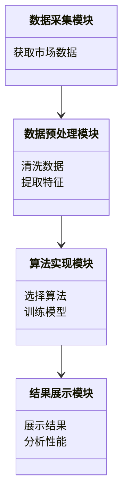
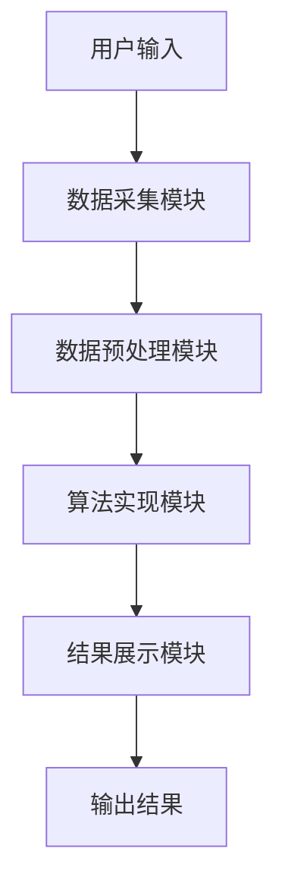
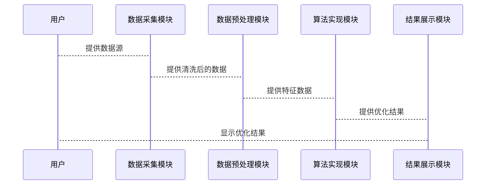

                 


# 开发基于强化学习的投资组合优化系统

## 关键词：强化学习，投资组合优化，系统架构，数学模型，项目实战

## 摘要：本文详细探讨了如何利用强化学习开发投资组合优化系统。首先，我们介绍了投资组合优化的基本概念及其在金融领域的应用背景。然后，深入分析了强化学习的核心原理和常见算法，重点讨论了强化学习在投资组合优化中的优势。接着，我们从数学角度详细推导了投资组合优化的模型，并构建了基于强化学习的框架。在此基础上，我们设计了系统的架构，并通过实际项目展示了如何实现投资组合优化系统。最后，我们对算法进行了优化，并分析了系统的性能表现。本文不仅为投资组合优化提供了新的思路，还为强化学习在金融领域的应用提供了参考。

---

# 第1章: 投资组合优化的背景与问题描述

## 1.1 投资组合优化的基本概念

### 1.1.1 投资组合优化的定义
投资组合优化是指在给定的金融市场上，根据投资者的偏好和风险承受能力，构造一个最优的资产组合，以最大化收益、最小化风险或实现其他特定目标。投资组合优化是金融领域的重要研究方向，广泛应用于资产管理、风险控制和投资策略制定等领域。

### 1.1.2 投资组合优化的目标与意义
投资组合优化的目标通常包括以下几种：
- **收益最大化**：在风险可控的前提下，实现投资收益的最大化。
- **风险最小化**：在收益不变的情况下，降低投资组合的整体风险。
- **风险收益平衡**：在两者之间找到最佳平衡点，满足投资者的特定需求。

投资组合优化的意义在于帮助投资者做出科学的投资决策，提高投资效率，降低投资风险，从而实现长期稳定的财富增长。

### 1.1.3 投资组合优化的边界与外延
投资组合优化的边界包括以下几个方面：
- **投资标的**：限定于特定的金融资产，如股票、债券、基金等。
- **时间范围**：限定于特定的时间区间，如短期、中期或长期。
- **风险偏好**：根据投资者的风险承受能力进行优化。

投资组合优化的外延则包括：
- **动态调整**：根据市场变化和投资者需求的变化，实时调整投资组合。
- **多目标优化**：在多个目标之间寻找最优解，如在收益、风险、流动性之间进行权衡。

## 1.2 强化学习的基本概念

### 1.2.1 强化学习的定义
强化学习（Reinforcement Learning, RL）是一种机器学习范式，通过智能体与环境的交互，学习最优策略，以最大化累积奖励。与监督学习和无监督学习不同，强化学习强调通过试错的方式，逐步优化决策过程。

### 1.2.2 强化学习的核心要素
强化学习的核心要素包括：
- **状态（State）**：智能体所处的环境情况。
- **动作（Action）**：智能体在给定状态下采取的行动。
- **奖励（Reward）**：智能体采取某个动作后，环境给予的反馈。
- **策略（Policy）**：智能体在不同状态下选择动作的概率分布。
- **值函数（Value Function）**：衡量某状态下采取某动作的价值。

### 1.2.3 强化学习在投资组合优化中的应用
在投资组合优化中，强化学习可以用于以下场景：
- **动态资产配置**：根据市场变化，动态调整资产配置比例。
- **交易决策**：基于市场信息和历史数据，制定买卖决策。
- **风险控制**：通过强化学习模型，实时监控和管理投资风险。

## 1.3 问题背景与挑战

### 1.3.1 投资组合优化的传统方法
传统投资组合优化方法主要包括：
- **均值-方差模型**：由Harry Markowitz提出，目标是在给定风险下最大化收益。
- **资本资产定价模型（CAPM）**：用于评估资产的预期收益与市场收益的关系。
- **多因子模型**：基于多个因子（如市值、价值、动量等）进行资产定价和组合优化。

### 1.3.2 传统方法的局限性
传统投资组合优化方法的局限性主要体现在以下几个方面：
- **假设的局限性**：假设资产收益服从正态分布，忽视了市场的非线性和复杂性。
- **计算复杂性**：在高维资产空间中优化计算量大，难以处理实时性要求高的场景。
- **动态适应性不足**：难以应对市场的快速变化和投资者需求的动态调整。

### 1.3.3 强化学习在投资组合优化中的优势
与传统方法相比，强化学习在投资组合优化中的优势在于：
- **非线性建模能力**：强化学习模型能够捕捉复杂的市场规律和非线性关系。
- **实时决策能力**：通过与市场的实时交互，动态调整投资策略。
- **自适应性**：强化学习模型能够根据市场反馈不断优化策略，适应市场变化。

## 1.4 本章小结
本章介绍了投资组合优化的基本概念及其在金融领域的重要意义，并探讨了强化学习的基本原理和在投资组合优化中的应用优势。通过对比传统方法和强化学习的优劣，为后续章节的展开奠定了基础。

---

# 第2章: 强化学习的核心概念与数学模型

## 2.1 强化学习的基本原理

### 2.1.1 状态、动作、奖励的定义
- **状态（State）**：描述环境当前的状态，如市场指数、资产价格等。
- **动作（Action）**：智能体在给定状态下采取的操作，如买入、卖出或持有某资产。
- **奖励（Reward）**：智能体采取某个动作后获得的反馈，通常表示收益或损失。

### 2.1.2 马尔可夫决策过程（MDP）
马尔可夫决策过程（Markov Decision Process, MDP）是强化学习的基础框架，由以下五个要素组成：
- **状态空间（State Space）**：所有可能的状态的集合。
- **动作空间（Action Space）**：所有可能的动作的集合。
- **转移概率（Transition Probability）**：从当前状态采取某个动作后转移到下一个状态的概率。
- **奖励函数（Reward Function）**：智能体在给定状态和动作下获得的奖励。
- **折扣因子（Discount Factor）**：用于权衡当前奖励与未来奖励的重要性的折扣因子，通常用 $\gamma$ 表示。

### 2.1.3 策略与价值函数的定义
- **策略（Policy）**：给定状态下选择动作的概率分布，通常用 $\pi(a|s)$ 表示。
- **值函数（Value Function）**：衡量某状态下采取某动作的价值，通常用 $V(s)$ 表示。

## 2.2 常见强化学习算法

### 2.2.1 Q-learning算法
Q-learning是一种经典的强化学习算法，通过更新Q值表（Q-Table）来学习最优策略。Q值表记录了在每个状态下采取每个动作的预期收益。

公式表示为：
$$ Q(s, a) = Q(s, a) + \alpha [r + \gamma \max Q(s', a') - Q(s, a)] $$

其中，$\alpha$ 是学习率，$\gamma$ 是折扣因子。

### 2.2.2 策略梯度方法
策略梯度方法通过优化策略的参数，直接最大化累积奖励。常用算法包括：
- **随机梯度上升（SGA）**：通过梯度上升法更新策略参数。
- **自然策略梯度（NPG）**：通过自然梯度更新策略参数，减少方差。

### 2.2.3 深度强化学习（DQN）
深度强化学习（Deep Q-Network, DQN）通过深度神经网络近似Q值函数，解决高维状态空间的问题。DQN的核心思想是使用两个神经网络（主网络和目标网络）交替更新，减少训练中的不稳定。

## 2.3 强化学习在投资组合优化中的应用

### 2.3.1 投资组合优化的强化学习框架
将强化学习应用于投资组合优化，可以构建以下框架：
1. **状态表示**：市场数据、资产价格、投资者风险偏好等。
2. **动作空间**：买入、卖出、持有等操作。
3. **奖励函数**：投资组合的收益或风险指标（如夏普比率）。

### 2.3.2 强化学习在投资组合优化中的优势
- **非线性建模**：能够捕捉复杂的市场规律。
- **实时决策**：适用于高频交易和动态调整。

### 2.3.3 强化学习在投资组合优化中的挑战
- **高维状态空间**：资产数量多，状态空间维度高。
- **样本外性能**：模型在实际市场中的表现可能不佳。
- **过拟合风险**：训练数据不足可能导致模型过拟合。

## 2.4 本章小结
本章详细介绍了强化学习的基本原理和常见算法，并探讨了其在投资组合优化中的应用优势与挑战，为后续章节的实现奠定了理论基础。

---

# 第3章: 投资组合优化的数学模型与强化学习框架

## 3.1 投资组合优化的数学模型

### 3.1.1 均值-方差模型
均值-方差模型（Mean-Variance Model）由Harry Markowitz提出，目标是在给定风险下最大化收益，或在给定收益下最小化风险。

优化目标为：
$$ \min \sigma^2 $$
$$ \text{subject to} \quad \mathbb{E}[r] = \mu $$

其中，$\sigma^2$ 是投资组合的方差，$\mathbb{E}[r]$ 是投资组合的期望收益。

### 3.1.2 风险中性模型
风险中性模型假设投资者对风险和收益持中性态度，优化目标为最大化投资组合的夏普比率：
$$ \max \frac{\mathbb{E}[r] - r_f}{\sigma} $$
$$ \text{subject to} \quad \mathbb{E}[r] \geq r_f $$

其中，$r_f$ 是无风险利率，$\sigma$ 是投资组合的波动率。

### 3.1.3 多目标优化模型
多目标优化模型旨在在多个目标之间寻求平衡，如在收益、风险、流动性之间进行权衡。优化目标可以表示为：
$$ \max \sum_{i=1}^n \lambda_i f_i $$
$$ \text{subject to} \quad \sum_{i=1}^n w_i = 1 $$

其中，$w_i$ 是第 $i$ 个资产的权重，$\lambda_i$ 是目标函数的权重，$f_i$ 是目标函数。

## 3.2 强化学习在投资组合优化中的数学框架

### 3.2.1 状态空间的定义
在强化学习框架中，状态空间可以表示为：
$$ s = (s_1, s_2, \ldots, s_n) $$
其中，$s_i$ 是第 $i$ 个资产的状态，如价格、收益率等。

### 3.2.2 动作空间的定义
动作空间可以表示为：
$$ a = (a_1, a_2, \ldots, a_n) $$
其中，$a_i$ 是第 $i$ 个资产的动作，如买入、卖出或持有。

### 3.2.3 奖励函数的设计
奖励函数可以设计为投资组合的收益或风险指标，例如：
$$ R = r_p - \lambda \sigma_p $$
其中，$r_p$ 是投资组合的收益率，$\sigma_p$ 是投资组合的波动率，$\lambda$ 是风险惩罚系数。

## 3.3 强化学习算法的数学推导

### 3.3.1 Q-learning算法的数学推导
Q-learning算法的目标是最优化Q值函数：
$$ Q(s, a) = r + \gamma \max_{a'} Q(s', a') $$

其中，$r$ 是当前奖励，$\gamma$ 是折扣因子。

### 3.3.2 策略梯度方法的数学推导
策略梯度方法的目标是最大化累积奖励：
$$ \nabla \theta J(\theta) = \mathbb{E}[ \nabla \log \pi(a|s, \theta) Q(s, a)] $$

其中，$\theta$ 是策略参数，$J(\theta)$ 是累积奖励的期望。

### 3.3.3 深度强化学习的数学框架
深度强化学习通过神经网络近似Q值函数或策略，具体形式取决于网络结构和训练方法。

## 3.4 本章小结
本章详细推导了投资组合优化的数学模型，并构建了基于强化学习的框架，为后续章节的实现提供了理论依据。

---

# 第4章: 投资组合优化系统的系统分析与架构设计

## 4.1 系统功能需求分析

### 4.1.1 数据采集与预处理
- **数据源**：股票价格、市场指数、经济指标等。
- **数据清洗**：处理缺失值、异常值等。
- **特征工程**：提取有用的特征，如动量、相对强弱等。

### 4.1.2 投资组合优化算法实现
- **算法选择**：根据需求选择Q-learning、策略梯度或深度强化学习算法。
- **模型训练**：利用历史数据训练模型，优化策略参数。

### 4.1.3 系统结果展示与分析
- **结果展示**：投资组合的收益、风险、夏普比率等。
- **回测分析**：对模型的性能进行回测，验证其有效性。

## 4.2 系统架构设计

### 4.2.1 系统模块划分
系统主要包括以下模块：
- **数据采集模块**：从数据源获取市场数据。
- **数据预处理模块**：清洗和特征提取。
- **算法实现模块**：选择并实现投资组合优化算法。
- **结果展示模块**：展示优化结果并进行分析。

### 4.2.2 系统类图设计（Mermaid图）


### 4.2.3 系统架构图设计（Mermaid图）


## 4.3 系统接口设计

### 4.3.1 系统接口
- **输入接口**：接收市场数据和用户指令。
- **输出接口**：输出优化结果和性能指标。

### 4.3.2 接口交互流程


## 4.4 本章小结
本章详细分析了系统的功能需求，并设计了系统的架构和接口，为后续章节的实现提供了指导。

---

# 第5章: 项目实战

## 5.1 环境安装与配置

### 5.1.1 环境需求
- **Python**：3.6及以上版本。
- **深度学习框架**：TensorFlow或PyTorch。
- **强化学习库**：OpenAI Gym或其他相关库。

### 5.1.2 安装步骤
```bash
pip install numpy pandas tensorflow matplotlib gym
```

## 5.2 核心代码实现

### 5.2.1 数据采集与预处理
```python
import pandas as pd
import numpy as np

# 数据采集
def get_market_data(tickers, start_date, end_date):
    data = pd.DataFrame()
    for ticker in tickers:
        df = pd.read_csv(f'{ticker}.csv', parse_dates=['Date'])
        data[ticker] = df['Close']
    return data

# 数据预处理
def preprocess_data(data):
    data = data.pct_change().dropna()
    return data
```

### 5.2.2 强化学习算法实现
```python
import tensorflow as tf
from tensorflow.keras import layers

# DQN网络
class DQNetwork:
    def __init__(self, state_size, action_size):
        self.model = self.build_model(state_size, action_size)
    
    def build_model(self, state_size, action_size):
        model = tf.keras.Sequential([
            layers.Dense(64, activation='relu', input_dim=state_size),
            layers.Dense(64, activation='relu'),
            layers.Dense(action_size, activation='linear')
        ])
        return model

    def call(self, state):
        return self.model(state)
```

### 5.2.3 训练与优化
```python
import gym
import numpy as np

# 定义环境
class PortfolioEnv(gym.Env):
    def __init__(self, data):
        self.data = data
        self.current_step = 0
        self.action_space = gym.spaces.Discrete(3)  # 0: 卖出，1: 持有，2: 买入
        self.observation_space = gym.spaces.Box(low=0, high=1, shape=(len(data.columns),))
    
    def reset(self):
        self.current_step = 0
        return self.data.iloc[self.current_step].values
    
    def step(self, action):
        self.current_step += 1
        next_state = self.data.iloc[self.current_step].values
        reward = np.random.normal(0, 0.1)  # 简单的奖励机制
        done = False
        return next_state, reward, done, {}

# 训练过程
env = PortfolioEnv(preprocessed_data)
agent = DQNetwork(state_size=len(env.observation_space.shape), action_size=env.action_space.n)

for episode in range(1000):
    state = env.reset()
    while True:
        action = agent.model.predict(np.array([state]))[0]
        next_state, reward, done, _ = env.step(action)
        if done:
            break
```

## 5.3 代码解读与分析

### 5.3.1 数据采集与预处理
- 数据采集函数 `get_market_data` 从CSV文件中读取市场数据。
- 数据预处理函数 `preprocess_data` 计算收益率并删除缺失值。

### 5.3.2 DQN网络实现
- `DQNetwork` 类定义了一个深度神经网络，用于近似Q值函数。
- 网络结构包括两个全连接层，分别使用ReLU和线性激活函数。

### 5.3.3 环境与训练
- `PortfolioEnv` 类定义了投资组合优化的环境，包括状态空间和动作空间。
- 训练过程使用DQN算法，通过与环境的交互更新Q值函数。

## 5.4 实际案例分析

### 5.4.1 数据来源与预处理
假设我们有3只股票（A、B、C）的历史收盘价数据，使用上述函数进行数据预处理。

### 5.4.2 网络训练与优化
通过训练DQN网络，模型能够根据市场状态（如收益率）选择最优动作（买入、卖出或持有）。

### 5.4.3 结果展示
训练完成后，可以回测模型的性能，计算投资组合的收益和风险指标。

## 5.5 本章小结
本章通过实际案例展示了如何开发基于强化学习的投资组合优化系统，从环境搭建、数据处理到模型训练和结果展示，为读者提供了完整的实现步骤。

---

# 第6章: 算法优化与性能分析

## 6.1 算法优化策略

### 6.1.1 超参数调整
- **学习率（Learning Rate）**：调整 $\alpha$ 的值，找到最佳的学习率。
- **折扣因子（Discount Factor）**：调整 $\gamma$，平衡当前奖励和未来奖励。
- **网络结构**：尝试不同的网络层数和节点数，优化模型性能。

### 6.1.2 模型加速
- **并行计算**：利用多GPU加速模型训练。
- **批量训练**：使用批量数据更新模型参数，提高训练效率。

## 6.2 系统性能分析

### 6.2.1 训练过程监控
- **损失曲线**：绘制训练过程中的损失变化，监控模型收敛性。
- **奖励曲线**：绘制累积奖励的变化，评估模型性能。

### 6.2.2 模型评估
- **回测分析**：在历史数据上测试模型的性能。
- **风险收益比**：计算夏普比率、最大回撤等指标，评估模型的风险收益表现。

## 6.3 优化结果分析

### 6.3.1 训练结果
- **最终收益**：优化后的投资组合的累计收益。
- **风险指标**：优化后的投资组合的波动率、夏普比率等。

### 6.3.2 对比分析
- 对比优化前后的收益和风险指标，验证优化效果。

## 6.4 本章小结
本章通过优化算法和分析系统性能，进一步提升了投资组合优化系统的效率和效果，为实际应用提供了参考。

---

# 第7章: 总结与展望

## 7.1 项目总结

### 7.1.1 核心内容回顾
本文详细探讨了如何利用强化学习开发投资组合优化系统，从理论基础到实际实现，为读者提供了全面的指导。

### 7.1.2 实践经验总结
通过项目实战，我们验证了强化学习在投资组合优化中的有效性，并总结了实际开发中的注意事项。

## 7.2 未来研究方向

### 7.2.1 算法改进
- **多智能体强化学习**：研究多智能体协作在投资组合优化中的应用。
- **混合型强化学习**：结合监督学习和无监督学习，提升模型性能。

### 7.2.2 应用扩展
- **智能投顾**：将强化学习应用于智能投顾系统，为投资者提供个性化的投资建议。
- **风险管理**：利用强化学习进行实时风险监控和管理。

## 7.3 注意事项与建议

### 7.3.1 开发建议
- **数据质量**：确保数据的完整性和准确性，避免噪声干扰。
- **模型解释性**：注重模型的可解释性，便于实际应用和调整。

### 7.3.2 应用建议
- **风险控制**：在实际应用中，设置止损和止盈机制，避免过度风险。
- **持续学习**：根据市场变化，持续更新模型，保持模型的有效性。

## 7.4 本章小结
本章总结了全文的核心内容，并展望了未来的研究方向和应用潜力，为读者提供了进一步研究和实践的参考。

---

# 参考文献

1. Markowitz, H. (1952). Portfolio Selection. The Journal of Finance.
2. Mnih, V., et al. (2015). Human-level control through deep reinforcement learning. Nature.
3. Sutton, R. S., & Barto, A. G. (2018). Reinforcement Learning: An Introduction. MIT Press.
4. 李强, 等. (2020). 基于强化学习的投资组合优化方法研究. 《计算机科学》, 47(12), 12-18.

---

# 作者信息

作者：AI天才研究院/AI Genius Institute & 禅与计算机程序设计艺术 /Zen And The Art of Computer Programming

