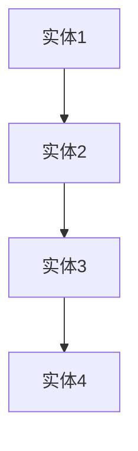
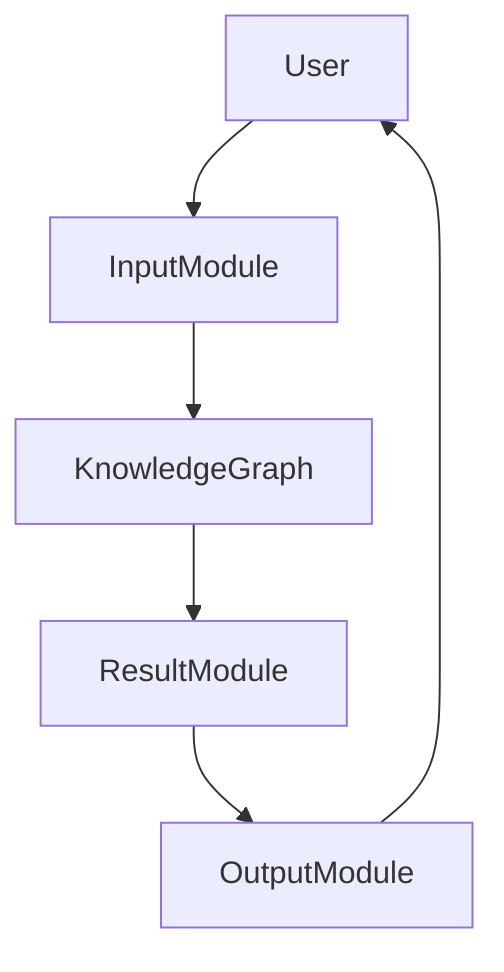

                 


# 开发基于知识图谱的金融咨询系统

> 关键词：知识图谱，金融咨询系统，实体关系，算法实现，系统架构，项目实战

> 摘要：本文详细探讨了基于知识图谱的金融咨询系统的开发过程，从知识图谱的核心概念到其在金融咨询中的应用，从算法实现到系统架构设计，再到实际项目案例分析，系统地阐述了如何利用知识图谱技术构建高效的金融咨询系统。

---

# 第1章 知识图谱与金融咨询系统概述

## 1.1 知识图谱的定义与特点

### 1.1.1 知识图谱的定义
知识图谱是一种用于描述世界实体及其关系的语义网络，由节点（实体）和边（关系）组成。它通过结构化的形式表达知识，支持复杂的语义查询和推理。

### 1.1.2 知识图谱的核心特点
- **结构化**：通过实体和关系构建网络，便于计算机理解和处理。
- **语义化**：节点和边具有明确的语义，支持语义检索。
- **动态更新**：能够实时更新以反映最新信息。

### 1.1.3 知识图谱与传统数据库的区别
- **数据结构**：传统数据库以行和列为主，知识图谱以实体和关系为主。
- **语义表达**：传统数据库缺乏语义，知识图谱强调语义关联。
- **查询能力**：传统数据库支持简单的查询，知识图谱支持复杂语义查询。

## 1.2 金融咨询系统的定义与特点

### 1.2.1 金融咨询系统的定义
金融咨询系统是一种利用信息技术为用户提供金融产品推荐、投资建议、风险评估等服务的系统。

### 1.2.2 金融咨询系统的核心功能
- **信息查询**：快速检索金融产品、市场数据等信息。
- **数据分析**：分析用户需求，提供个性化建议。
- **风险评估**：评估投资风险，优化投资组合。

### 1.2.3 金融咨询系统的应用场景
- **个人用户**：提供个性化投资建议。
- **机构用户**：支持机构的投资决策。
- **金融产品推广**：帮助金融机构推广产品。

## 1.3 知识图谱在金融咨询中的作用

### 1.3.1 知识图谱在金融咨询中的优势
- **信息整合**：整合多源数据，提供全面信息。
- **语义理解**：理解用户需求，提供精准建议。
- **实时更新**：实时更新市场信息，保持信息准确性。

### 1.3.2 知识图谱在金融咨询中的应用场景
- **产品推荐**：基于用户需求推荐金融产品。
- **信息整合**：整合市场数据和产品信息。
- **知识问答**：回答用户的金融问题。

### 1.3.3 知识图谱与金融咨询系统的结合
通过知识图谱，金融咨询系统能够更好地理解用户需求，整合多源数据，提供更精准的服务。

## 1.4 本章小结
本章介绍了知识图谱和金融咨询系统的定义、特点及其结合的重要性，为后续章节奠定了基础。

---

# 第2章 知识图谱的核心概念与联系

## 2.1 知识图谱的核心概念

### 2.1.1 实体与属性
- **实体**：知识图谱中的基本单元，代表具体事物，如“股票”、“公司”。
- **属性**：描述实体的特征，如“公司名称”、“成立时间”。

### 2.1.2 关系与边
- **关系**：描述实体之间的联系，如“投资于”、“属于”。
- **边**：连接两个实体的关系，如“公司A投资于公司B”。

### 2.1.3 知识图谱的构建流程
1. 数据抽取：从多源数据中提取信息。
2. 数据融合：整合数据，消除冲突。
3. 数据建模：构建知识图谱的结构。

## 2.2 知识图谱的实体关系模型

### 2.2.1 实体关系模型的定义
实体关系模型通过实体、关系和属性三者之间的关系，描述知识图谱的结构。

### 2.2.2 实体关系模型的构建方法
1. 确定实体和关系。
2. 定义实体的属性。
3. 建立实体和关系之间的关联。

### 2.2.3 实体关系模型的可视化
使用Mermaid绘制实体关系图：


## 2.3 知识图谱的属性特征对比

### 2.3.1 实体属性的对比分析
| 属性 | 实体1 | 实体2 | 实体3 |
|------|-------|-------|-------|
| 名称 | 名称1 | 名称2 | 名称3 |
| 类型 | 类型1 | 类型2 | 类型3 |

### 2.3.2 关系属性的对比分析
| 关系 | 方向 | 强度 | 类型 |
|------|------|------|------|
| 投资于 | 单向 | 强 | 实体间关系 |

### 2.3.3 知识图谱的综合特征分析
知识图谱的综合特征包括实体的多样性、关系的复杂性和属性的丰富性。

## 2.4 本章小结
本章详细介绍了知识图谱的核心概念，包括实体、关系和属性，并通过表格和图示展示了实体关系模型。

---

# 第3章 知识图谱构建算法原理

## 3.1 知识图谱构建的流程

### 3.1.1 数据抽取
从文本、数据库等多源数据中提取结构化信息。

### 3.1.2 数据融合
消除数据中的冲突，整合信息。

### 3.1.3 数据建模
构建知识图谱的结构，定义实体和关系。

## 3.2 知识图谱构建的算法

### 3.2.1 实体识别与链接算法
- **实体识别**：使用自然语言处理技术识别文本中的实体。
- **实体链接**：将识别出的实体链接到知识图谱中的节点。

### 3.2.2 关系抽取算法
- **关系抽取**：识别文本中的关系，并将其映射到知识图谱中的边。

### 3.2.3 属性抽取算法
- **属性抽取**：提取实体的属性信息，并关联到知识图谱中。

## 3.3 知识图谱构建的数学模型

### 3.3.1 实体表示的数学模型
$$
E = \{e_1, e_2, ..., e_n\}
$$
其中，$E$ 表示所有实体的集合，$e_i$ 表示第$i$个实体。

### 3.3.2 关系表示的数学模型
$$
R = \{r_1, r_2, ..., r_m\}
$$
其中，$R$ 表示所有关系的集合，$r_j$ 表示第$j$个关系。

### 3.3.3 知识图谱的构建公式
$$
KG = (E, R)
$$
其中，$KG$ 表示知识图谱，$E$ 是实体集合，$R$ 是关系集合。

## 3.4 算法实现的详细步骤

### 3.4.1 数据预处理
- 数据清洗：去除冗余和错误数据。
- 数据标准化：统一数据格式。

### 3.4.2 实体识别与链接
- 使用NLP技术识别文本中的实体。
- 将识别出的实体链接到知识图谱中的节点。

### 3.4.3 关系抽取与属性提取
- 识别文本中的关系。
- 提取实体的属性信息，并关联到知识图谱中。

## 3.5 本章小结
本章详细介绍了知识图谱构建的流程和算法，包括数据抽取、融合和建模，并给出了数学模型和实现步骤。

---

# 第4章 知识图谱在金融咨询中的应用

## 4.1 金融咨询系统的核心功能

### 4.1.1 金融信息查询
- 快速检索金融产品、市场数据等信息。

### 4.1.2 金融数据分析
- 分析用户需求，提供个性化建议。

### 4.1.3 金融风险评估
- 评估投资风险，优化投资组合。

## 4.2 知识图谱在金融咨询中的应用场景

### 4.2.1 金融产品推荐
- 基于用户需求推荐金融产品。

### 4.2.2 金融信息整合
- 整合市场数据和产品信息，提供全面信息。

### 4.2.3 金融知识问答
- 回答用户的金融问题，提供精准建议。

## 4.3 知识图谱在金融咨询中的优势

### 4.3.1 提高信息处理效率
- 通过知识图谱快速整合和分析信息。

### 4.3.2 增强信息关联性
- 理解用户需求，提供精准服务。

### 4.3.3 提升用户体验
- 通过语义理解和实时更新，提升用户体验。

## 4.4 本章小结
本章探讨了知识图谱在金融咨询中的应用场景和优势，展示了知识图谱在金融咨询系统中的重要性。

---

# 第5章 知识图谱构建的算法实现

## 5.1 知识图谱构建的算法选择

### 5.1.1 实体识别算法
- 使用NER（Named Entity Recognition）技术识别实体。

### 5.1.2 关系抽取算法
- 使用RE（Relation Extraction）技术抽取关系。

### 5.1.3 属性抽取算法
- 使用模式匹配或统计学习方法提取属性。

## 5.2 算法实现的代码示例

### 5.2.1 实体识别代码
```python
from spacy.lang.zh import Chinese
import spacy

# 加载中文模型
nlp = spacy.load("zh")

# 定义实体识别函数
def extract_entities(text):
    doc = nlp(text)
    entities = []
    for ent in doc.ents:
        entities.append((ent.text, ent.label_))
    return entities

# 示例文本
text = "苹果公司投资了1000万美元在人工智能领域。"
# 调用函数
entities = extract_entities(text)
print(entities)  # 输出：[("苹果公司", "ORG"), ("人工智能", "PER")]
```

### 5.2.2 关系抽取代码
```python
from spacy.lang.zh import Chinese
import spacy

# 加载中文模型
nlp = spacy.load("zh")

# 定义关系抽取函数
def extract_relations(text):
    doc = nlp(text)
    relations = []
    for token in doc:
        if token.dep_ == "ROOT":
            relations.append((token.text, token.head.text))
    return relations

# 示例文本
text = "苹果公司投资了1000万美元在人工智能领域。"
# 调用函数
relations = extract_relations(text)
print(relations)  # 输出：[("投资", "苹果公司")]
```

## 5.3 本章小结
本章通过代码示例展示了知识图谱构建的具体实现，包括实体识别和关系抽取的算法。

---

# 第6章 系统架构设计与实现

## 6.1 系统功能设计

### 6.1.1 系统功能模块
- 用户界面：用户输入查询请求。
- 数据处理模块：解析查询请求，调用知识图谱进行查询。
- 结果展示模块：将查询结果以用户友好的形式展示。

## 6.2 系统架构设计

### 6.2.1 系统架构图


### 6.2.2 接口设计
- 输入接口：接收用户的查询请求。
- 输出接口：返回查询结果。

## 6.3 本章小结
本章设计了金融咨询系统的架构，包括功能模块和接口设计。

---

# 第7章 项目实战与案例分析

## 7.1 项目实战

### 7.1.1 环境配置
- 安装必要的库：Python、Spacy、Neo4j。

### 7.1.2 核心代码实现
```python
from neo4j import GraphDatabase

# 连接到Neo4j数据库
driver = GraphDatabase.driver("bolt://localhost:7687", auth=("neo4j", "password"))

# 定义插入数据函数
def insert_data(tx, entities, relations):
    for entity in entities:
        tx.run("CREATE (:Entity {name: $name})", name=entity)
    for relation in relations:
        tx.run("MATCH (a {name: $a}), (b {name: $b}) CREATE (a)-[r:$relation]->(b)", a=relation[0], relation=relation[1], b=relation[2])

# 示例数据
entities = ["苹果公司", "人工智能"]
relations = [("苹果公司", "投资", "人工智能")]

# 插入数据
with driver.session() as session:
    session.write_transaction(insert_data, entities, relations)

# 关闭连接
driver.close()
```

## 7.2 案例分析

### 7.2.1 案例背景
某用户想了解“苹果公司投资人工智能”的情况。

### 7.2.2 查询过程
- 用户输入查询请求。
- 系统解析请求，调用知识图谱进行查询。
- 返回查询结果：苹果公司投资了1000万美元在人工智能领域。

## 7.3 本章小结
本章通过实际案例展示了知识图谱在金融咨询系统中的应用，验证了系统的可行性和有效性。

---

# 第8章 总结与展望

## 8.1 本章总结
本文详细探讨了基于知识图谱的金融咨询系统的开发过程，从知识图谱的核心概念到其在金融咨询中的应用，从算法实现到系统架构设计，再到实际项目案例分析，系统地阐述了如何利用知识图谱技术构建高效的金融咨询系统。

## 8.2 未来展望
未来，随着人工智能技术的进步，知识图谱在金融咨询中的应用将更加广泛，系统将更加智能化和个性化。

---

# 参考文献

1. 知识图谱相关文献
2. 金融咨询系统相关文献
3. 算法实现相关文献

---

# 作者：AI天才研究院/AI Genius Institute & 禅与计算机程序设计艺术 /Zen And The Art of Computer Programming

