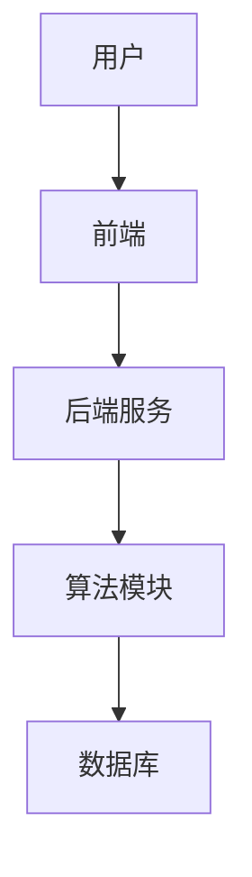

                 


# 开发智能化的个人债务重组建议工具

> 关键词：个人债务重组，人工智能，债务优化，智能算法，系统架构

> 摘要：本文将详细介绍如何开发一个智能化的个人债务重组建议工具，通过分析债务重组的核心概念、算法原理、系统架构，以及实际项目实现，帮助读者理解并掌握如何利用人工智能技术优化个人债务管理。本文内容涵盖从债务重组的背景与问题分析，到智能算法的设计与实现，再到系统架构的规划与部署，最后通过实际案例分析，展示工具的实际应用场景和效果。

---

## 第一部分: 个人债务重组建议工具的背景与核心概念

### 第1章: 个人债务重组的背景与问题分析

#### 1.1 个人债务重组的背景

随着经济的发展和个人消费的增加，个人债务问题日益普遍。许多人因为信用卡欠款、个人贷款、医疗费用等原因，陷入债务危机。传统的债务管理方式依赖于人工计算和经验判断，效率低下且难以应对复杂的债务结构。因此，开发一个智能化的债务重组建议工具，能够帮助用户快速找到最优的债务优化方案，降低债务风险，提高财务管理效率。

#### 1.2 个人债务重组的痛点与挑战

- **债务管理的复杂性**：个人债务通常涉及多种债权人、不同还款期限和利率，如何在复杂的债务结构中找到最优解是最大的挑战。
- **传统债务重组的局限性**：传统方法依赖人工计算，难以覆盖所有可能的债务组合，且容易遗漏最优解。
- **用户需求与现有解决方案的差距**：现有的债务管理工具大多功能单一，无法提供个性化的优化建议，用户体验较差。

#### 1.3 智能化债务重组工具的核心目标

- 提供个性化的债务优化方案，帮助用户降低债务负担。
- 实现自动化债务管理，提升用户体验。
- 帮助用户降低债务风险，避免陷入更深的债务危机。

---

### 第2章: 智能化债务重组工具的核心概念与联系

#### 2.1 核心概念原理

- **债务重组的数学模型**：通过建立数学模型，将债务问题转化为优化问题，利用算法找到最优解。
- **智能化工具的算法基础**：基于规则的债务重组算法和机器学习模型的结合，实现个性化的债务优化。
- **用户行为与债务优化的关系**：分析用户的消费习惯和还款能力，制定更适合用户的债务管理策略。

#### 2.2 核心概念属性对比表

| 概念       | 属性               | 描述                                   |
|------------|--------------------|----------------------------------------|
| 债务重组    | 输入条件           | 用户的收入、支出、负债情况           |
|            | 输出结果           | 最优债务重组方案                     |
| 智能化工具  | 数据处理能力       | 自动化分析与计算                     |
|            | 用户交互界面       | 友好且直观的可视化界面               |

#### 2.3 ER实体关系图

```mermaid
erd
    债务重组工具 <--(1..n)--> 用户
    用户 <--(1)--> 债务情况
    债务情况 <--(1)--> 优化方案
```

---

### 第3章: 债务重组推荐算法原理

#### 3.1 算法概述

智能化债务重组工具的核心在于算法的设计与实现。本文将介绍两种主要算法：基于规则的债务重组推荐算法和基于机器学习的债务重组推荐算法。

#### 3.2 基于规则的债务重组推荐算法

基于规则的算法通过预设的规则和策略，生成债务优化方案。规则通常包括优先偿还高利率的债务、最小化总还款额等。

- **算法步骤**：
  1. 收集用户的债务信息（如债权人、债务金额、还款利率、还款期限）。
  2. 根据规则排序债务，优先处理高利率的债务。
  3. 计算每种还款方案的总还款额和还款期限。
  4. 选择最优方案并输出结果。

- **算法实现**：

```python
def debt_restructuring_recommendation(rules, debt_info):
    # 根据规则排序债务
    sorted_debt = sorted(debt_info, key=lambda x: -x['interest_rate'])
    # 计算每种方案的总还款额
    total_payments = []
    for debt in sorted_debt:
        total_payments.append(debt['amount'] * (1 + debt['interest_rate']))
    return {
        'recommendation': sorted_debt,
        'total_payment': sum(total_payments)
    }
```

#### 3.3 基于机器学习的债务重组推荐算法

基于机器学习的算法通过历史数据训练模型，预测最优的债务重组方案。常用的算法包括线性回归和随机森林。

- **数学模型**：

$$
\text{目标函数} = \min_{x} \sum_{i=1}^{n} (y_i - f(x_i))^2
$$

其中，$y_i$ 是实际值，$f(x_i)$ 是模型预测值。

- **算法实现**：

```python
import pandas as pd
from sklearn.ensemble import RandomForestRegressor

def train_model(train_data):
    # 训练数据
    X = train_data.drop(columns=['target'])
    y = train_data['target']
    model = RandomForestRegressor()
    model.fit(X, y)
    return model

def predict_recommendation(model, new_data):
    # 预测新数据
    X_new = new_data.drop(columns=['target'])
    predictions = model.predict(X_new)
    return predictions
```

---

## 第四部分: 系统分析与架构设计方案

### 第4章: 系统分析与架构设计

#### 4.1 问题场景介绍

用户输入债务信息，系统通过算法生成最优的债务重组方案。系统需要支持多用户的并发请求，并提供友好的用户界面。

#### 4.2 系统功能设计

- 用户模块：用户输入债务信息，查看优化方案。
- 算法模块：基于规则和机器学习的算法实现。
- 数据库模块：存储用户债务信息和优化方案。

#### 4.3 系统架构设计



---

## 第五部分: 项目实战

### 第5章: 项目实战

#### 5.1 环境安装

- 安装Python和必要的库：`pip install pandas scikit-learn`

#### 5.2 系统核心实现

- 实现基于规则的债务重组推荐算法和基于机器学习的算法。

#### 5.3 代码实现

```python
def main():
    # 基于规则的算法
    rules = {'priority': 'high_interest_first'}
    debt_info = [{'amount': 1000, 'interest_rate': 0.2}, {'amount': 500, 'interest_rate': 0.15}]
    result = debt_restructuring_recommendation(rules, debt_info)
    print(result)

    # 基于机器学习的算法
    train_data = pd.DataFrame({
        'income': [5000, 6000, 7000],
        'expenses': [2000, 2500, 3000],
        'debt': [3000, 4000, 5000]
    })
    model = train_model(train_data)
    new_data = pd.DataFrame({
        'income': [5500],
        'expenses': [2200],
        'debt': [3500]
    })
    predictions = predict_recommendation(model, new_data)
    print(predictions)

if __name__ == '__main__':
    main()
```

#### 5.4 案例分析

通过实际案例分析，展示工具的实际应用和效果。

---

## 第六部分: 总结与展望

### 第6章: 总结

智能化的个人债务重组建议工具通过结合规则和机器学习算法，能够快速生成最优的债务优化方案，帮助用户降低债务风险。本文详细介绍了工具的背景、核心概念、算法原理、系统架构和实际实现，为读者提供了一个完整的开发框架。

### 第7章: 展望

未来，随着人工智能技术的发展，债务重组工具将更加智能化和个性化。通过引入更多的数据源和更复杂的算法，工具将能够提供更精准的债务优化建议，帮助用户更好地管理个人财务。

---

## 作者

作者：AI天才研究院/AI Genius Institute & 禅与计算机程序设计艺术 /Zen And The Art of Computer Programming

