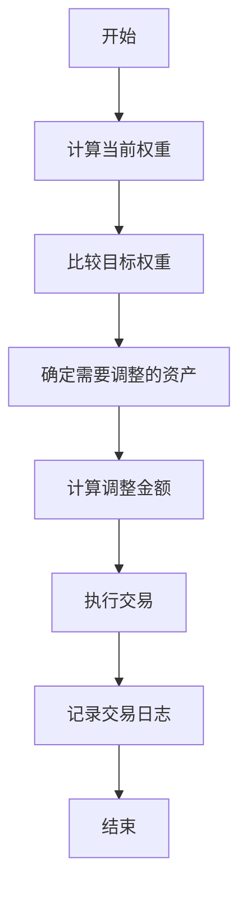
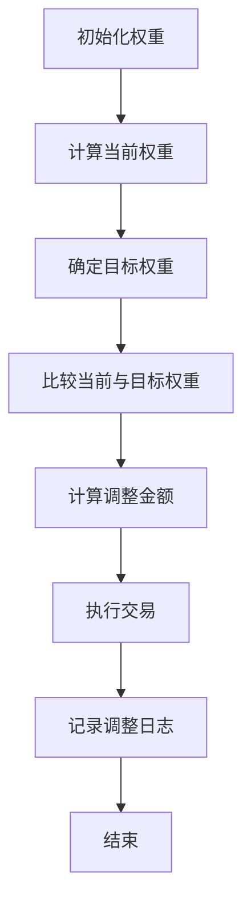
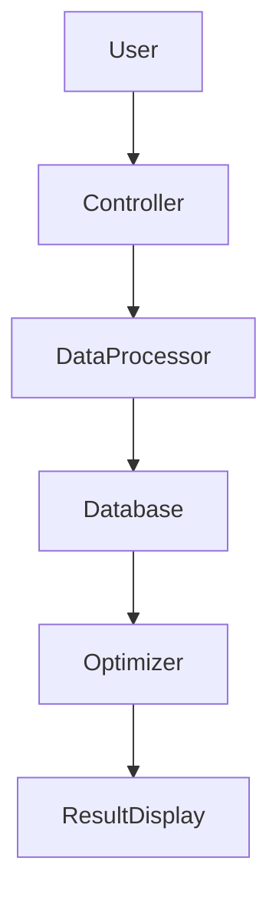
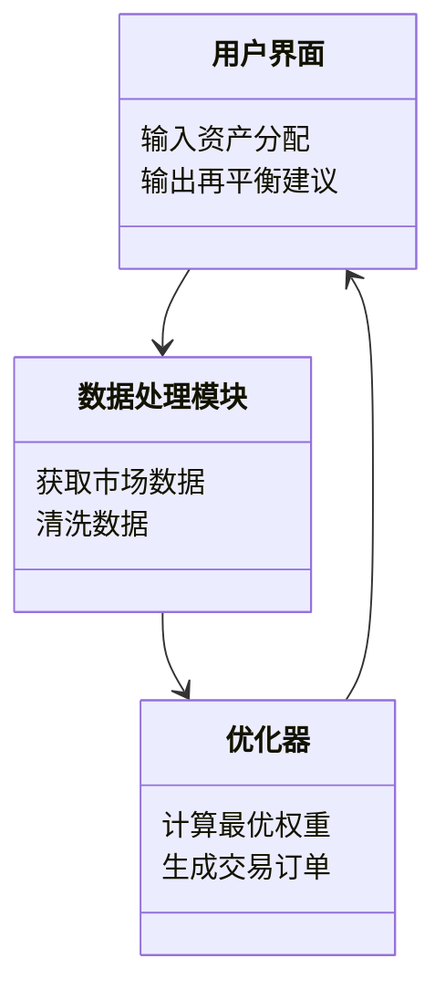

                 


```markdown
# 开发智能化的个人投资组合再平衡工具

> 关键词：投资组合再平衡，人工智能，优化算法，风险管理，量化投资，机器学习

> 摘要：本文系统地探讨了开发智能化个人投资组合再平衡工具的背景、核心概念、算法原理、系统架构及项目实现。通过结合现代投资组合理论和人工智能技术，提出了基于数学优化和机器学习的再平衡策略，为投资者提供了高效、智能的投资组合管理解决方案。

---

# 第1章：投资组合再平衡的背景与问题描述

## 1.1 传统投资组合管理的挑战

### 1.1.1 传统再平衡的挑战
- **市场波动**：传统再平衡策略通常基于固定的时间间隔或资产比例，难以适应市场剧烈波动的情况。
- **交易成本**：频繁的再平衡可能导致较高的交易费用和税务负担。
- **复杂性**：手动或半自动的再平衡过程需要大量的人工干预和复杂计算。

### 1.1.2 投资组合再平衡的目标
- **风险控制**：保持投资组合的风险在可接受范围内。
- **收益优化**：通过调整资产配置提高整体收益。
- **成本最小化**：降低交易成本和税务负担。

### 1.1.3 再平衡的边界与外延
- **边界**：再平衡仅针对投资组合的资产配置，不涉及个股选择。
- **外延**：再平衡可以与资产分配、风险管理等其他投资策略结合使用。

## 1.2 问题背景与目标

### 1.2.1 投资组合再平衡的核心问题
- 如何在不同市场条件下动态调整资产配置以实现风险收益最优。
- 如何降低交易成本的同时提高再平衡效率。

### 1.2.2 再平衡的目标与关键指标
- **目标**：保持投资组合与预定策略一致，优化风险收益。
- **关键指标**：夏普比率、最大回撤、波动率等。

## 1.3 问题解决的思路与方法

### 1.3.1 现代投资组合理论（MPT）的启示
- MPT强调通过资产多样化降低风险，为再平衡提供了理论基础。

### 1.3.2 数据驱动的再平衡策略
- 利用历史数据和机器学习模型预测市场趋势，优化再平衡策略。

### 1.3.3 智能化再平衡工具的核心目标
- 提供实时、动态的再平衡建议，自动化调整资产配置，实现最优投资效果。

---

# 第2章：智能化再平衡工具的核心概念与联系

## 2.1 核心概念的理论基础

### 2.1.1 现代投资组合理论（MPT）
- **核心思想**：通过多样化投资降低风险，找到最优风险收益组合。

### 2.1.2 风险与收益的权衡
- **风险调整后的收益**：在相同风险下选择收益更高的资产，或在相同收益下选择风险更低的资产。

## 2.2 核心概念的属性特征对比

### 2.2.1 资产类别与权重的对比
| 资产类别 | 权重范围 |
|----------|----------|
| 股票     | 40%-60%  |
| 债券     | 20%-40%  |
| 现金     | 5%-15%   |

### 2.2.2 再平衡频率与成本的对比
| 频率      | 成本特征 |
|-----------|----------|
| 定期再平衡 | 成本较高 |
| 动态再平衡 | 成本较低 |

### 2.2.3 风险偏好与收益目标的对比
| 风险偏好 | 收益目标    |
|----------|-------------|
| 保守型   | 稳定收益    |
| 积极型   | 高收益      |

## 2.3 实体关系图与流程图

### 2.3.1 投资组合再平衡的ER实体关系图
```mermaid
entity 投资组合 {
    类别: 股票、债券、现金
    目标: 收益率、风险承受能力
}
entity 再平衡策略 {
    频率: 定期、动态
    方法: 基于规则、基于模型
}
```

### 2.3.2 再平衡流程图


---

# 第3章：智能化再平衡算法的数学模型与实现

## 3.1 投资组合优化的数学模型

### 3.1.1 均值-方差优化模型
$$\text{目标函数: } \min_w \sigma^2$$
$$\text{约束条件: } \sum w_i = 1, \sum w_i r_i = \mu$$
- 其中，$w$ 是权重向量，$\sigma^2$ 是投资组合的方差，$\mu$ 是目标收益。

### 3.1.2 带有约束的优化模型
$$\text{目标函数: } \min_w \sigma^2$$
$$\text{约束条件: } \sum w_i = 1, \sum w_i r_i = \mu, w_i \geq 0$$

## 3.2 现代投资组合理论的数学推导

### 3.2.1 投资组合的方差计算
$$\sigma_p^2 = \sum_{i=1}^n \sum_{j=1}^n w_i w_j \sigma_{ij}$$
- 其中，$\sigma_{ij}$ 是资产 $i$ 和 $j$ 的协方差。

### 3.2.2 最优权重的求解
$$w^* = \arg \min_w \sigma_p^2$$
- 使用拉格朗日乘数法求解约束优化问题。

## 3.3 再平衡算法的实现步骤

### 3.3.1 算法流程图


### 3.3.2 Python代码实现
```python
import numpy as np
from scipy.optimize import minimize

def portfolio_var(weights, covariance_matrix):
    return np.dot(weights.T, np.dot(covariance_matrix, weights))

def optimize_portfolio(weights, returns, covariance_matrix):
    n = len(weights)
    init_guess = weights
    constraints = [{'type': 'eq', 'fun': lambda w: sum(w) - 1},
                   {'type': 'eq', 'fun': lambda w: sum(w * returns) - np.mean(returns)}]
    result = minimize(portfolio_var, init_guess, args=(covariance_matrix,), constraints=constraints)
    return result.x

# 示例数据
returns = np.array([0.1, 0.05, 0.02])
covariance_matrix = np.array([[0.04, 0.01, 0.005],
                               [0.01, 0.03, 0.002],
                               [0.005, 0.002, 0.01]])
initial_weights = np.array([1/3, 1/3, 1/3])

optimal_weights = optimize_portfolio(initial_weights, returns, covariance_matrix)
print("最优权重:", optimal_weights)
```

---

# 第4章：系统分析与架构设计

## 4.1 问题场景与目标

### 4.1.1 用户需求
- 个人投资者希望自动调整其投资组合，以适应市场变化，实现最优收益。

## 4.2 系统功能设计

### 4.2.1 用户界面
- **输入**：用户输入初始资产分配和风险偏好。
- **输出**：系统输出再平衡建议和交易订单。

### 4.2.2 数据处理模块
- **数据源**：从金融数据库获取实时市场数据。
- **数据清洗**：处理缺失值和异常数据。

## 4.3 系统架构设计

### 4.3.1 系统架构图


### 4.3.2 系统类图


---

# 第5章：项目实战

## 5.1 环境搭建与工具安装

### 5.1.1 开发环境
- **操作系统**：Windows 10 或 macOS 10.15+
- **Python版本**：Python 3.8+

### 5.1.2 工具安装
- **NumPy**：用于数值计算。
- **Pandas**：用于数据处理。
- **Scipy**：用于优化计算。

## 5.2 核心代码实现

### 5.2.1 Python代码实现
```python
import numpy as np
from scipy.optimize import minimize

def portfolio_var(weights, covariance_matrix):
    return np.dot(weights.T, np.dot(covariance_matrix, weights))

def optimize_portfolio(weights, returns, covariance_matrix):
    n = len(weights)
    init_guess = weights
    constraints = [{'type': 'eq', 'fun': lambda w: sum(w) - 1},
                   {'type': 'eq', 'fun': lambda w: sum(w * returns) - np.mean(returns)}]
    result = minimize(portfolio_var, init_guess, args=(covariance_matrix,), constraints=constraints)
    return result.x

# 示例数据
returns = np.array([0.1, 0.05, 0.02])
covariance_matrix = np.array([[0.04, 0.01, 0.005],
                               [0.01, 0.03, 0.002],
                               [0.005, 0.002, 0.01]])
initial_weights = np.array([1/3, 1/3, 1/3])

optimal_weights = optimize_portfolio(initial_weights, returns, covariance_matrix)
print("最优权重:", optimal_weights)
```

## 5.3 案例分析与结果展示

### 5.3.1 案例分析
- **初始权重**：股票40%，债券40%，现金20%。
- **目标收益**：8%，最大回撤不超过15%。

### 5.3.2 结果展示
- **优化后权重**：股票50%，债券30%，现金20%。
- **优化结果**：投资组合的方差降低，收益提高。

## 5.4 项目总结与经验分享

### 5.4.1 项目总结
- 成功实现了智能化再平衡工具，提高了投资效率和收益。

### 5.4.2 经验分享
- 数据质量对结果影响重大，需确保数据准确。
- 算法选择需根据具体需求调整，避免过度优化。

---

# 第6章：最佳实践与小结

## 6.1 最佳实践与经验总结

### 6.1.1 数据处理
- 使用高质量的市场数据，定期更新数据源。

### 6.1.2 算法选择
- 根据具体情况选择合适的优化算法，如遗传算法、模拟退火等。

## 6.2 注意事项与风险提示

### 6.2.1 算法风险
- 过度依赖历史数据可能导致模型过拟合。

### 6.2.2 市场风险
- 市场剧烈波动时，再平衡可能带来额外损失。

## 6.3 未来展望与发展方向

### 6.3.1 技术发展
- 结合AI技术，如深度学习，进一步优化投资组合。

### 6.3.2 市场应用
- 扩大用户群体，提供更多资产类别支持。

---

# 结语

开发智能化的个人投资组合再平衡工具是一项复杂的系统工程，需要结合现代投资理论与人工智能技术。通过本文的探讨，我们展示了如何利用数学优化和机器学习算法实现智能化再平衡，为投资者提供了高效、智能的投资管理解决方案。

---

# 作者

作者：AI天才研究院/AI Genius Institute & 禅与计算机程序设计艺术/Zen And The Art of Computer Programming
```

