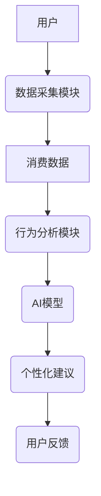

                 


# 开发智能化的个人消费习惯改善建议工具

> 关键词：人工智能、消费习惯、用户行为分析、机器学习、个性化建议

> 摘要：本文旨在探讨如何利用人工智能技术开发一个智能化的个人消费习惯改善工具。通过对用户消费数据的分析和挖掘，结合机器学习算法，提供个性化的消费建议，帮助用户优化消费习惯，实现财务健康和可持续消费。文章详细介绍了背景、核心概念、算法原理、系统架构设计、项目实现及最佳实践。

---

## 第一部分：背景介绍

### 第1章：问题背景与目标

#### 1.1 问题背景
- **消费习惯的重要性**：个人消费习惯直接影响财务健康和生活质量。不良的消费习惯可能导致超支、债务累积甚至影响社会稳定。
- **技术的潜力**：人工智能和大数据技术的发展为分析个人消费行为提供了新的可能性，能够帮助人们更科学地管理消费。

#### 1.2 问题描述
- **消费行为的多样性**：不同用户的消费模式和习惯差异显著，传统的方法难以满足个性化需求。
- **数据的复杂性**：消费数据涉及金额、时间、地点等多个维度，如何高效分析这些数据是一个挑战。
- **改善消费习惯的困难性**：用户往往缺乏自我约束能力，需要借助工具提供持续的指导和支持。

#### 1.3 解决思路
- **技术驱动**：利用AI和大数据分析技术，构建智能化工具，帮助用户分析消费数据并提供个性化建议。
- **用户参与**：通过可视化和互动反馈，增强用户的参与感和接受度，提升工具的使用效果。

---

## 第二部分：核心概念与联系

### 第2章：核心概念解析

#### 2.1 用户行为分析
- **消费数据采集**：通过应用程序、银行流水等多渠道获取用户的消费数据。
- **行为模式识别**：使用聚类分析识别用户的消费习惯，例如高频低额消费与低频高额消费。

#### 2.2 消费数据挖掘
- **数据预处理**：清洗数据，处理缺失值和异常值。
- **关联规则挖掘**：发现消费中的关联性，例如经常一起购买的商品。

#### 2.3 AI驱动的消费建议生成
- **机器学习模型**：使用决策树、随机森林等算法预测用户的消费行为，生成个性化建议。
- **规则引擎**：基于预设规则提供即时反馈，例如超出预算时触发警告。

#### 2.4 概念属性对比表
| 概念       | 特性1 | 特性2 | 特性3 |
|------------|--------|--------|--------|
| 消费数据   | 类型   | 时间   | 金额   |
| 用户行为   | 模式   | 频率   | 场景   |
| AI模型     | 类型   | 参数   | 性能   |

#### 2.5 ER实体关系图
```mermaid
erDiagram
    用户行为 <--- 用户行为模式
    用户行为模式 <--> 消费数据
    消费数据 <--> AI模型
    AI模型 <--> 个性化建议
```

---

## 第三部分：算法原理讲解

### 第3章：算法原理与实现

#### 3.1 机器学习算法选择
- **分类算法的选择与比较**：使用决策树、随机森林等算法进行消费行为分类。
- **回归算法的应用场景**：预测消费金额和频率。

#### 3.2 基于决策树的消费行为分类
- **决策树模型简介**：决策树是一种树状结构，用于分类和回归问题。
- **ID3算法的实现步骤**：
  1. 计算信息增益，选择信息增益最大的特征作为根节点。
  2. 递归地构建子树，直到叶子节点无法再分割。
- **信息增益的计算公式**：
  $$信息增益 = \frac{总熵 - 条件熵}{总熵}$$

#### 3.3 代码实现与分析
```python
from sklearn.tree import DecisionTreeClassifier
from sklearn.model_selection import train_test_split
from sklearn.metrics import accuracy_score

# 示例数据加载
data = [...]  # 加载消费数据

# 数据分割
X = data.drop(columns=['消费标签'])
y = data['消费标签']
X_train, X_test, y_train, y_test = train_test_split(X, y, test_size=0.2)

# 模型训练
model = DecisionTreeClassifier()
model.fit(X_train, y_train)

# 预测与评估
y_pred = model.predict(X_test)
print("准确率:", accuracy_score(y_test, y_pred))
```

---

## 第四部分：系统分析与架构设计

### 第4章：系统架构与实现

#### 4.1 问题场景介绍
- **目标用户**：希望通过工具优化消费习惯的个人。
- **功能需求**：数据采集、行为分析、个性化建议生成。

#### 4.2 系统功能设计
- **数据采集模块**：从多种来源获取消费数据。
- **行为分析模块**：使用机器学习算法分析用户行为。
- **个性化建议模块**：基于分析结果生成消费建议。

#### 4.3 系统架构设计


---

## 第五部分：项目实战

### 第5章：项目实现与案例分析

#### 5.1 环境安装
- **工具安装**：安装Python、机器学习库（如scikit-learn）。
- **数据获取**：从银行API获取消费数据。

#### 5.2 核心代码实现
```python
import pandas as pd
from sklearn.tree import DecisionTreeClassifier
from sklearn.model_selection import train_test_split
from sklearn.metrics import accuracy_score

# 数据加载
data = pd.read_csv('消费数据.csv')

# 数据分割
X = data.drop(columns=['消费标签'])
y = data['消费标签']
X_train, X_test, y_train, y_test = train_test_split(X, y, test_size=0.2)

# 模型训练
model = DecisionTreeClassifier()
model.fit(X_train, y_train)

# 预测与评估
y_pred = model.predict(X_test)
print("准确率:", accuracy_score(y_test, y_pred))
```

#### 5.3 案例分析
- **案例一**：用户A的消费数据分析，生成节省开支的建议。
- **案例二**：用户B的消费习惯调整，优化月度支出结构。

---

## 第六部分：最佳实践

### 第6章：实践总结与注意事项

#### 6.1 小结
- **技术总结**：AI和大数据技术在消费习惯改善中的应用前景广阔。
- **用户反馈**：工具的个性化和易用性是用户接受的关键。

#### 6.2 注意事项
- **数据隐私**：确保用户数据的安全和隐私保护。
- **模型优化**：持续优化AI模型，提高建议的准确性。

#### 6.3 未来趋势
- **实时反馈**：未来工具将提供实时消费反馈，帮助用户即时调整消费行为。
- **多维度分析**：结合更多数据源，提供更全面的消费分析。

---

## 作者

作者：AI天才研究院/AI Genius Institute & 禅与计算机程序设计艺术 /Zen And The Art of Computer Programming

---

以上是《开发智能化的个人消费习惯改善建议工具》的完整目录和内容概览。文章详细讲解了从背景到实现的各个方面，结合理论与实践，帮助读者全面理解如何利用技术改善个人消费习惯。

