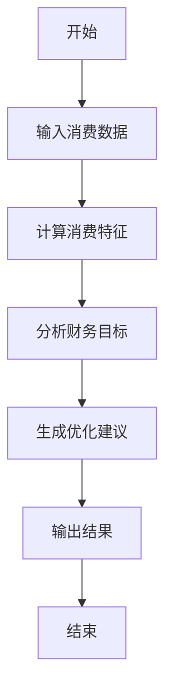
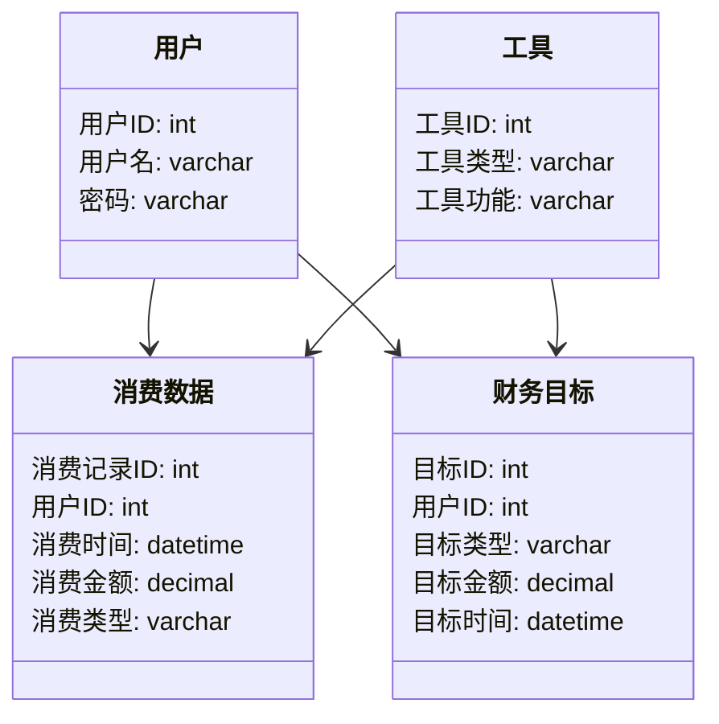
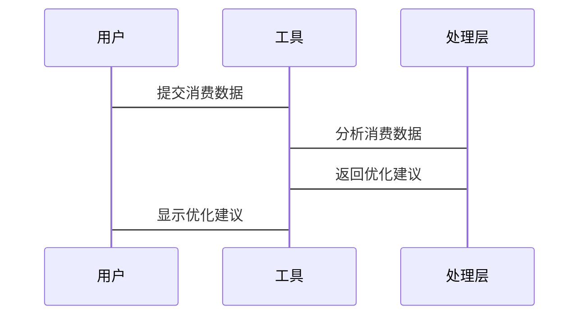

                 


# 开发智能化的个人消费行为优化与财务目标对齐工具

## 关键词：智能化工具，个人消费行为优化，财务目标对齐，人工智能，大数据分析

## 摘要：  
本文详细探讨了开发智能化的个人消费行为优化与财务目标对齐工具的核心概念、算法原理、系统架构及项目实战。通过对消费行为优化和财务目标对齐的深入分析，结合人工智能和大数据技术，提出了高效的解决方案，并通过实际案例展示了工具的实现与应用。本文旨在为开发者和用户提供一个系统化的开发框架，帮助个人更好地管理消费行为，实现财务目标的对齐。

---

# 第一部分：个人消费行为优化与财务目标对齐工具的背景与概念

## 第1章：问题背景与核心概念

### 1.1 问题背景
- **消费行为的复杂性**：现代社会中，个人消费行为涉及多个维度，如日常开支、投资、借贷等，难以通过简单的方法进行优化。
- **财务目标的多样性**：财务目标包括短期目标（如月度预算）和长期目标（如购房、退休计划），需要动态调整和对齐。
- **智能化工具的必要性**：传统的人工优化方法效率低，难以应对复杂多变的消费环境和财务目标。

### 1.2 核心概念
- **消费行为优化**：通过分析消费数据，识别浪费，提出优化建议。
- **财务目标对齐**：将消费行为与财务目标进行匹配，确保消费行为支持财务目标的实现。
- **智能化工具**：利用人工智能和大数据技术，提供个性化的优化建议和对齐方案。

### 1.3 问题解决
- **优化路径**：通过数据分析和算法推荐，帮助用户优化消费行为。
- **对齐策略**：通过动态调整消费计划，确保消费行为与财务目标一致。
- **工具价值**：提供实时反馈和个性化建议，提升用户财务管理效率。

### 1.4 问题边界
- **消费行为的范围**：包括日常开支、投资和借贷等。
- **财务目标的范围**：包括短期和长期目标，如月度预算、购房计划等。
- **工具的适用场景**：适用于个人用户，不包括企业或机构的财务管理。

### 1.5 概念结构
- **核心要素**：
  1. 消费行为数据：记录用户的消费记录、金额、时间等信息。
  2. 财务目标数据：用户设定的财务目标，包括目标类型、金额和时间。
  3. 优化算法：基于消费数据和财务目标，生成优化建议。
- **关系网络**：
  - 消费行为数据影响财务目标的实现。
  - 工具通过优化算法将消费行为与财务目标对齐。

---

## 第2章：核心概念与联系

### 2.1 核心概念原理
- **消费行为优化原理**：基于数据分析和机器学习算法，识别消费模式，发现浪费点，提出优化建议。
- **财务目标对齐原理**：通过动态规划和预算分配，将消费行为与财务目标对齐。
- **智能化工具原理**：利用AI和大数据技术，实时分析消费数据，提供个性化建议。

### 2.2 核心概念属性特征对比
| 概念       | 属性特征                       |
|------------|--------------------------------|
| 消费行为优化 | 数据驱动、实时性、个性化       |
| 财务目标对齐 | 预测性、动态性、目标导向性     |
| 工具       | 智能性、实时性、可扩展性       |

### 2.3 ER实体关系图架构
```mermaid
er
    entity 个人消费行为 {
        id: int
        消费时间: datetime
        消费金额: decimal
        消费类型: varchar
    }
    entity 财务目标 {
        id: int
        目标类型: varchar
        目标金额: decimal
        目标时间: datetime
    }
    entity 工具 {
        id: int
        工具类型: varchar
        工具功能: varchar
    }
    relationship 消费行为与财务目标 {
        个人消费行为 --> 财务目标
        关联方式: 影响
    }
    relationship 工具与消费行为 {
        工具 --> 个人消费行为
        关联方式: 优化
    }
    relationship 工具与财务目标 {
        工具 --> 财务目标
        关联方式: 对齐
    }
```

### 2.4 本章小结
- 通过核心概念的对比和ER实体关系图，明确了消费行为优化与财务目标对齐工具的核心要素及其关系。

---

# 第二部分：算法原理与实现

## 第3章：算法原理讲解

### 3.1 算法概述
- **算法目标**：优化消费行为，实现消费行为与财务目标的对齐。
- **算法输入**：消费数据、财务目标数据。
- **算法输出**：优化建议、对齐方案。

### 3.2 算法流程图


### 3.3 算法实现代码
```python
def optimize_consumption_behavior(consumption_data, financial_goals):
    # 计算消费特征
    consumption_features = calculate_consumption_features(consumption_data)
    
    # 分析财务目标
    financial_feature = analyze_financial_goals(financial_goals)
    
    # 生成优化建议
    optimization_suggestion = generate_optimization_suggestion(consumption_features, financial_feature)
    
    return optimization_suggestion
```

### 3.4 数学模型与公式
- **消费特征计算**：
  $$消费特征 = \sum_{i=1}^{n} (消费金额_i \times 消费频率_i)$$
- **优化建议生成**：
  $$优化建议 = \argmin_{x} (消费金额 - 财务目标)$$

### 3.5 本章小结
- 通过算法流程图和代码示例，详细讲解了消费行为优化与财务目标对齐的实现过程。

---

## 第4章：系统分析与架构设计

### 4.1 问题场景介绍
- **用户场景**：用户希望通过工具优化消费行为，实现财务目标对齐。
- **功能需求**：提供消费数据分析、目标设定、优化建议生成等功能。

### 4.2 系统功能设计


### 4.3 系统架构设计


### 4.4 系统接口设计
- **接口1**：获取消费数据
  $$ APIEndpoint: /api/consumption_data $$

### 4.5 系统交互设计


### 4.6 本章小结
- 通过系统分析与架构设计，明确了工具的实现框架和交互流程。

---

## 第5章：项目实战

### 5.1 环境安装
- **工具安装**：安装Python、Jupyter Notebook、数据库等开发环境。

### 5.2 核心实现
```python
# 数据库连接
import sqlite3
conn = sqlite3.connect('consumption.db')
cursor = conn.cursor()

# 插入消费数据
cursor.execute('''
    INSERT INTO consumption_data (用户ID, 消费时间, 消费金额, 消费类型)
    VALUES (?, ?, ?, ?)
''', (1, '2023-10-01', 100.5, '餐饮'))

conn.commit()
conn.close()
```

### 5.3 实际案例分析
- **案例1**：用户月收入5000元，希望在6个月内节省2000元用于旅行。
- **优化建议**：减少餐饮和娱乐开支，增加储蓄比例。

### 5.4 本章小结
- 通过实际案例分析，展示了工具在现实中的应用价值。

---

## 第6章：最佳实践与小结

### 6.1 最佳实践
- **数据隐私保护**：确保用户数据的安全性。
- **算法优化**：通过机器学习模型的优化，提升工具的智能性。
- **用户体验设计**：注重界面设计和用户反馈，提升用户体验。

### 6.2 小结
- 本文详细探讨了开发智能化的个人消费行为优化与财务目标对齐工具的核心概念、算法原理、系统架构及项目实战。
- 通过实际案例分析，展示了工具的实现与应用。

### 6.3 注意事项
- 确保数据的准确性和完整性。
- 定期更新算法模型，适应用户的个性化需求。

### 6.4 拓展阅读
- 推荐阅读《人工智能入门》、《大数据分析与挖掘》等书籍。

---

# 作者：AI天才研究院/AI Genius Institute & 禅与计算机程序设计艺术/Zen And The Art of Computer Programming

