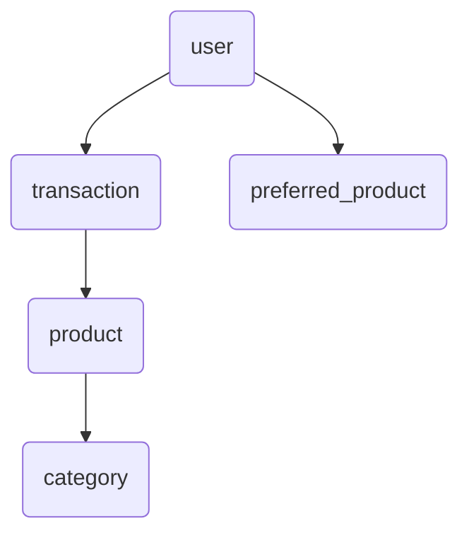

                 

# 开发智能化的个人消费行为优化建议工具

> 关键词：智能化消费优化、推荐算法、系统架构、个人财务管理、数据驱动决策

> 摘要：本文将详细探讨如何开发一个智能化的个人消费行为优化建议工具。文章从背景介绍出发，逐步分析核心概念、算法原理、系统架构设计，再到项目实战和总结，为您提供从理论到实践的全面指导。通过本文，您将掌握如何利用数据驱动的方法优化个人消费行为，提升财务管理效率。

---

## 第1章: 个人消费行为优化背景与问题描述

### 1.1 个人消费行为优化的背景

#### 1.1.1 当前消费行为的主要问题
现代生活中，个人消费行为日益复杂，主要面临以下问题：
- **冲动消费**：消费者在缺乏理性分析的情况下做出购买决策，导致不必要的开支。
- **财务管理不善**：缺乏系统化的消费记录和分析工具，难以有效管理支出和储蓄。
- **信息过载**：市场上的产品种类繁多，消费者难以快速找到满足需求的最优选项。
- **个性化需求未满足**：传统的消费建议工具往往缺乏个性化的分析，无法满足不同用户的多样化需求。

#### 1.1.2 个人消费行为优化的必要性
随着生活水平的提高和消费场景的多样化，个人消费行为优化显得尤为重要：
- **提升资金利用率**：通过优化消费行为，最大化个人资金的使用效率。
- **降低非必要开支**：减少冲动消费和无效支出，帮助个人实现财务目标。
- **支持可持续消费**：优化消费行为有助于减少浪费，推动可持续消费理念的实践。

#### 1.1.3 智能化工具在消费优化中的作用
智能化工具通过数据驱动的方式，为消费者提供个性化的消费建议：
- **自动化记录与分析**：自动收集和分析消费数据，帮助用户了解消费习惯。
- **智能推荐与优化**：基于历史数据和用户偏好，推荐最优的消费方案。
- **实时反馈与提醒**：实时监控消费行为，提供及时的反馈和提醒，避免超支。

---

### 1.2 问题背景与目标

#### 1.2.1 消费行为优化的核心目标
本工具的核心目标是帮助用户实现以下目标：
- 提供个性化的消费建议，优化消费结构。
- 预警潜在的财务风险，避免超支。
- 提供可持续消费建议，支持环保和可持续发展。

#### 1.2.2 问题边界与外延
- **问题边界**：专注于个人消费行为的优化，不涉及企业或团体的消费管理。
- **外延**：扩展到消费数据的分析、个性化推荐、消费行为预测等领域。

#### 1.2.3 核心问题的解决方向
通过数据驱动的方式，解决以下核心问题：
- 如何高效采集和处理消费数据？
- 如何建立个性化消费模型？
- 如何实现智能推荐和实时反馈？

---

### 1.3 核心概念与定义

#### 1.3.1 消费行为的定义与分类
消费行为是指消费者在购买、使用和处置产品或服务的过程中所表现出来的行为特征。根据行为特征，消费行为可以分为：
- **冲动性消费**：基于情感或短期需求的消费。
- **理性消费**：基于长期目标和预算的消费。
- **习惯性消费**：基于长期习惯的消费。

#### 1.3.2 智能化优化工具的定义
智能化个人消费行为优化工具是指通过数据采集、分析和算法处理，为用户提供个性化的消费建议和优化方案的工具。

#### 1.3.3 工具的核心功能与属性
- **数据采集**：支持多渠道消费数据的采集和整合。
- **数据分析**：通过算法分析消费数据，识别消费模式。
- **智能推荐**：基于分析结果，推荐最优消费方案。
- **实时反馈**：提供实时的消费提醒和优化建议。

---

## 第2章: 消费行为优化的核心概念与联系

### 2.1 核心概念原理

#### 2.1.1 消费行为分析的基本原理
消费行为分析是通过对用户消费数据的统计、分析和建模，揭示消费行为的内在规律。常见的分析方法包括：
- **统计分析**：通过均值、方差等统计指标，分析消费数据的分布特征。
- **数据挖掘**：利用聚类、分类等技术，发现消费行为的模式和趋势。
- **机器学习**：通过训练模型，预测未来的消费行为。

#### 2.1.2 智能化优化的算法基础
智能化优化的核心是算法，常见的算法包括：
- **协同过滤**：基于用户行为的相似性推荐。
- **内容推荐**：基于商品属性的推荐。
- **混合推荐**：结合协同过滤和内容推荐的混合算法。

---

### 2.2 核心概念属性对比

#### 2.2.1 消费行为与消费习惯的对比
| 属性       | 消费行为             | 消费习惯             |
|------------|----------------------|----------------------|
| 时间维度   | 即时性               | 长期性               |
| 影响因素   | 心理、环境、价格     | 个人习惯、品牌偏好   |
| 可控性     | 较高                 | 较低                 |

#### 2.2.2 数据驱动与规则驱动的优化方式对比
| 方式         | 数据驱动             | 规则驱动             |
|-------------|----------------------|----------------------|
| 优化依据     | 数据分析结果         | 预定义规则           |
| 灵活性       | 高                   | 低                   |
| 适用场景     | 复杂、多样化的场景   | 简单、规则明确的场景 |

---

### 2.3 ER实体关系图

---

## 总结

本文通过详细分析智能化个人消费行为优化工具的背景、核心概念、算法原理和系统架构，为读者提供了一套完整的开发思路。从背景介绍到项目实战，每一步都进行了详细的讲解，帮助读者掌握从理论到实践的全过程。

作者：AI天才研究院 & 禅与计算机程序设计艺术

---

**注意事项**：
- 本文内容仅限个人学习和研究，未经授权不得转载或商用。
- 代码示例均为简化版本，实际应用需根据具体需求进行调整和优化。
- 如需进一步探讨或合作，请联系作者邮箱：[您的邮箱地址]。

---

**拓展阅读**：
- [推荐算法的经典论文](#)
- [数据驱动决策的更多案例](#)
- [系统架构设计的最佳实践](#)

