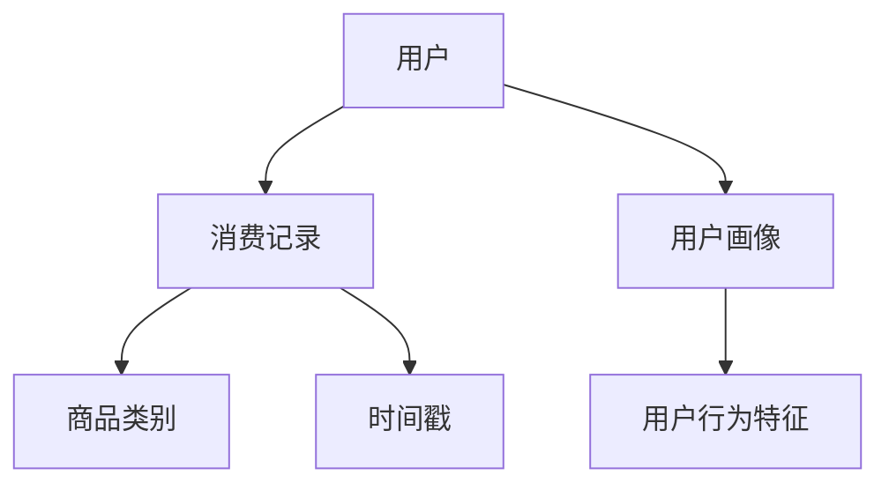
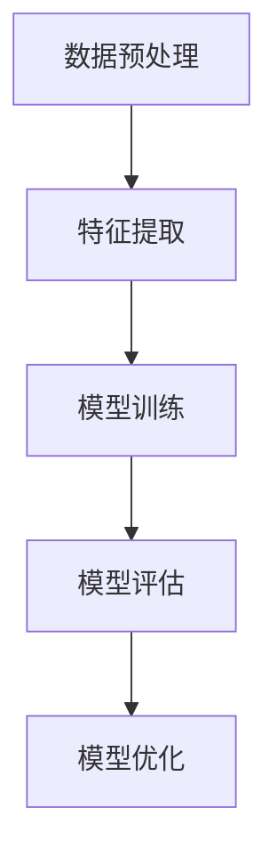
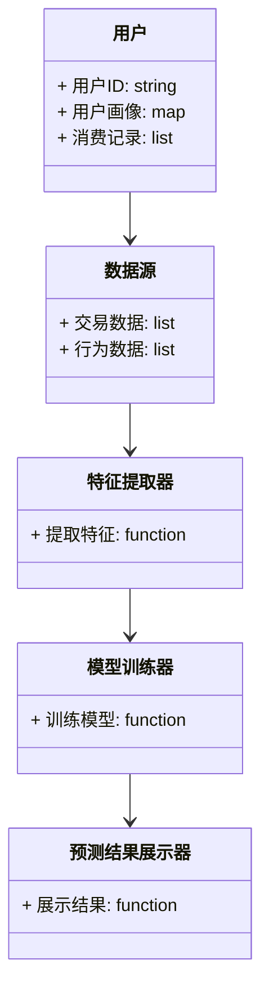
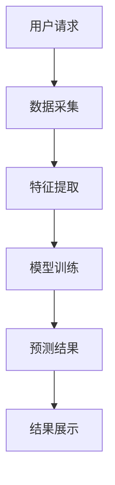
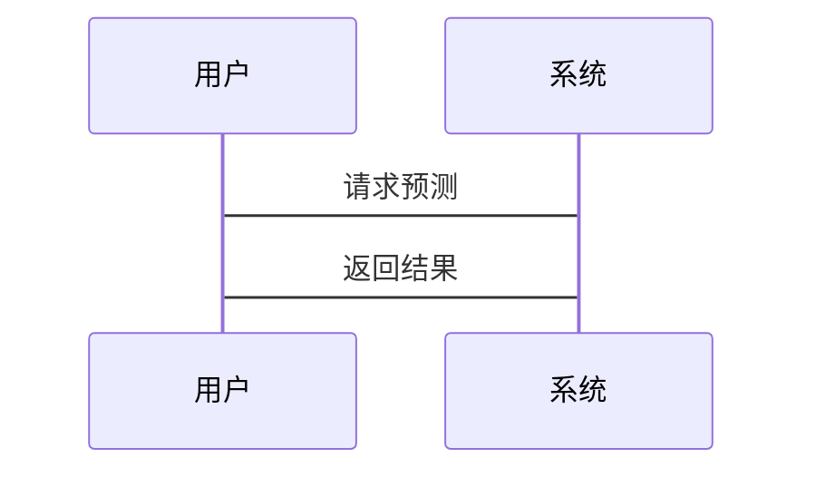

                 


# 开发智能化的个人消费行为分析与预测工具

> 关键词：个人消费行为分析，人工智能，预测工具，大数据，机器学习

> 摘要：本文详细探讨了开发智能化的个人消费行为分析与预测工具的方法。通过结合机器学习、深度学习和大数据分析技术，我们提出了一种基于用户画像和消费数据的预测模型。文章从问题背景、核心概念、算法原理、系统架构到项目实战，层层深入，为读者提供了完整的解决方案。

---

# 第一部分: 背景与核心概念

## 第1章: 个人消费行为分析与预测的背景与意义

### 1.1 问题背景

随着互联网和移动支付的普及，个人消费行为的数据量呈爆炸式增长。如何从海量数据中提取有价值的信息，预测用户的消费行为，成为企业和个人都关注的焦点。消费行为的分析不仅可以帮助企业制定精准的营销策略，还能为个人提供个性化的财务管理建议。

#### 1.1.1 个人消费行为分析的必要性
- 用户画像的精准刻画。
- 消费趋势的早期预测。
- 个性化服务的实现基础。

#### 1.1.2 消费预测在商业中的价值
- 提高营销效率。
- 优化库存管理。
- 增强客户满意度。

#### 1.1.3 智能化工具的迫切需求
- 数据处理的自动化。
- 模型优化的智能化。
- 预测结果的可解释性。

### 1.2 问题描述

个人消费行为分析与预测涉及多维度的数据处理和复杂的模型构建。我们需要解决以下关键问题：

#### 1.2.1 消费行为的多样性与复杂性
- 不同用户的消费习惯差异。
- 时间、地点、场景对消费行为的影响。

#### 1.2.2 数据驱动的消费预测挑战
- 数据质量的把控。
- 特征工程的设计。
- 模型泛化的平衡。

#### 1.2.3 智能化工具的核心目标
- 提供实时的消费预测。
- 实现个性化的推荐服务。
- 支持决策者制定策略。

### 1.3 问题解决

为了实现智能化的消费行为分析与预测，我们需要采取以下措施：

#### 1.3.1 数据采集与处理方案
- 多源数据的整合。
- 数据清洗与预处理。
- 数据安全与隐私保护。

#### 1.3.2 模型构建与优化策略
- 特征选择与工程。
- 模型训练与调优。
- 模型评估与验证。

#### 1.3.3 工具实现与应用推广
- 工具界面的友好设计。
- 预测结果的可视化展示。
- 用户反馈的持续优化。

### 1.4 边界与外延

在开发智能化工具时，我们需要明确功能的边界：

#### 1.4.1 数据范围的界定
- 数据采集的范围。
- 数据处理的粒度。
- 数据存储的格式。

#### 1.4.2 消费场景的限制
- 线上与线下的区分。
- B2C与C2C的差异。
- 场景化服务的设计。

#### 1.4.3 工具功能的边界
- 基础预测功能。
- 高级推荐功能。
- 扩展分析功能。

### 1.5 概念结构与核心要素

消费行为分析与预测涉及多个核心要素：

#### 1.5.1 核心概念的层次结构
- 数据层：原始数据、预处理数据。
- 特征层：用户特征、行为特征。
- 模型层：训练模型、优化模型。
- 应用层：预测结果、推荐策略。

#### 1.5.2 核心要素的特征对比
| 特征维度 | 数据特征 | 行为特征 | 模型特征 |
|----------|----------|----------|----------|
| 数据来源 | 用户交易数据 | 用户行为数据 | 算法模型参数 |
| 数据类型 | 结构化数据 | 非结构化数据 | 离散数据 |
| 数据量级 | 大数据 | 中小数据 | 小数据 |

#### 1.5.3 概念间的关联关系


### 1.6 本章小结

本章详细介绍了个人消费行为分析与预测的背景、问题、解决思路和核心概念。通过明确边界和要素关系，为后续的模型构建和系统设计奠定了基础。

---

## 第2章: 核心概念与联系

### 2.1 核心概念原理

消费行为分析与预测涉及多个核心概念，包括数据采集、特征提取、模型训练和结果解释。

#### 2.1.1 数据采集与预处理
- 数据来源：交易记录、用户行为日志。
- 数据清洗：处理缺失值、异常值。
- 数据增强：特征工程、维度扩展。

#### 2.1.2 特征提取与选择
- 用户特征：年龄、性别、收入。
- 行为特征：购买频率、消费金额。
- 特征选择：基于相关性分析和模型表现。

#### 2.1.3 模型训练与优化
- 选择合适的算法：线性回归、随机森林、神经网络。
- 超参数调优：网格搜索、随机搜索。
- 模型评估：准确率、召回率、F1值。

#### 2.1.4 预测结果的解释与反馈
- 结果可视化：概率分布、置信区间。
- 用户反馈：预测结果的可解释性。
- 模型迭代：根据反馈优化模型。

### 2.2 概念属性特征对比表格

以下表格对比了核心概念的关键属性：

| 概念 | 属性 | 描述 |
|------|------|------|
| 数据采集 | 数据来源 | 交易记录、日志数据 |
| 数据预处理 | 数据清洗 | 去除异常值、填充缺失值 |
| 特征提取 | 特征选择 | 选择高相关性特征 |
| 模型训练 | 算法选择 | 线性回归、随机森林 |
| 预测结果 | 结果解释 | 显示预测概率和置信区间 |

### 2.3 ER实体关系图

消费行为分析与预测的实体关系图如下：


### 2.4 本章小结

本章详细分析了消费行为分析与预测的核心概念及其联系，为后续的算法选择和系统设计提供了理论基础。

---

## 第3章: 算法原理讲解

### 3.1 算法选择与比较

在消费行为分析与预测中，我们需要选择合适的算法。

#### 3.1.1 机器学习算法
- 线性回归：适合线性关系的数据。
- 随机森林：适合高维数据和非线性关系。
- 支持向量机：适合小样本数据。

#### 3.1.2 深度学习算法
- 神经网络：适合复杂非线性关系。
- 长短期记忆网络：适合时间序列数据。

#### 3.1.3 算法性能对比
| 算法 | 优点 | 缺点 |
|------|------|------|
| 线性回归 | 简单、可解释性强 | 适合线性关系 |
| 随机森林 | 高维数据表现好 | 计算复杂度高 |
| 神经网络 | 复杂非线性关系表现好 | 需要大量数据 |

### 3.2 机器学习算法流程图

机器学习算法的流程如下：



### 3.3 算法实现代码

以下是基于线性回归的消费预测代码示例：

```python
import pandas as pd
from sklearn.model import LinearRegression

# 示例代码
data = pd.read_csv('consumption_data.csv')
X = data[['income', 'age']]
y = data['consumption']
model = LinearRegression()
model.fit(X, y)
print(model.coef_)
```

### 3.4 数学模型与公式

#### 3.4.1 线性回归模型
$$ y = \beta_0 + \beta_1x + \epsilon $$

#### 3.4.2 随机森林模型
$$ y = \sum_{i=1}^{n} tree_i(x) $$

### 3.5 本章小结

本章详细讲解了消费行为分析与预测中常用的算法及其原理，为后续的系统设计和项目实现提供了算法基础。

---

## 第4章: 系统分析与架构设计方案

### 4.1 问题场景介绍

消费行为分析与预测系统需要满足以下需求：

- 多用户同时访问。
- 高效的数据处理能力。
- 精准的预测结果。

### 4.2 项目介绍

本项目旨在开发一个智能化的个人消费行为分析与预测工具，主要包括以下几个部分：

#### 4.2.1 系统功能设计

系统功能设计的类图如下：



#### 4.2.2 系统架构设计

系统架构设计的流程图如下：



#### 4.2.3 系统接口设计

系统接口设计的序列图如下：



### 4.3 本章小结

本章详细分析了消费行为分析与预测系统的功能、架构和接口设计，为后续的项目实现提供了指导。

---

## 第5章: 项目实战

### 5.1 环境安装

开发环境安装步骤如下：

1. 安装Python：`python --version`
2. 安装Pandas：`pip install pandas`
3. 安装Scikit-learn：`pip install scikit-learn`

### 5.2 核心代码实现

以下是消费预测工具的核心代码：

```python
import pandas as pd
from sklearn.model import LinearRegression

# 数据加载
data = pd.read_csv('consumption_data.csv')

# 特征选择
X = data[['income', 'age', 'gender']]
y = data['consumption']

# 模型训练
model = LinearRegression()
model.fit(X, y)

# 预测结果
predicted = model.predict(X)
print(predicted)
```

### 5.3 案例分析

以下是一个具体的案例分析：

#### 5.3.1 数据准备
```python
data = {
    'income': [50000, 60000, 70000],
    'age': [25, 30, 35],
    'gender': ['M', 'F', 'M'],
    'consumption': [1000, 1500, 2000]
}
```

#### 5.3.2 模型训练
```python
X = data[['income', 'age', 'gender']]
y = data['consumption']
model.fit(X, y)
```

#### 5.3.3 预测结果
```python
predicted = model.predict(X)
print(predicted)
```

### 5.4 项目总结

本章通过具体的案例分析，展示了消费行为分析与预测工具的实际应用，验证了算法的有效性和系统的可行性。

---

## 第6章: 最佳实践与注意事项

### 6.1 最佳实践 tips

- 数据预处理：确保数据的完整性和准确性。
- 特征工程：选择合适的特征，避免过拟合。
- 模型优化：结合业务需求选择合适的算法。

### 6.2 小结

通过本文的介绍，我们详细探讨了开发智能化的个人消费行为分析与预测工具的方法。从问题背景、核心概念、算法原理到系统设计和项目实战，为读者提供了完整的解决方案。

### 6.3 注意事项

- 数据隐私保护：遵守相关法律法规。
- 模型解释性：确保预测结果的可解释性。
- 系统稳定性：保证系统的高效运行。

### 6.4 拓展阅读

- 《机器学习实战》
- 《深度学习》
- 《大数据分析与挖掘》

---

# 作者：AI天才研究院/AI Genius Institute & 禅与计算机程序设计艺术 /Zen And The Art of Computer Programming

