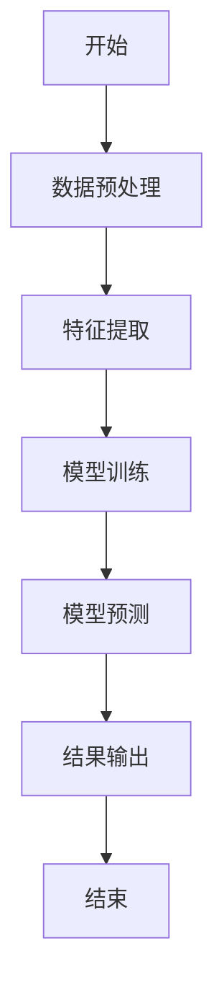
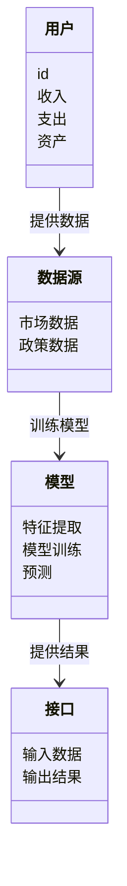
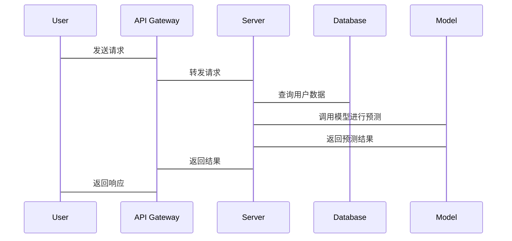

                 


# 开发智能化的个人退休规划助手

## 关键词：人工智能，退休规划，大数据，机器学习，系统架构

## 摘要：随着人口老龄化加剧，个人退休规划的重要性日益凸显。智能化退休规划助手通过整合大数据和人工智能技术，能够为用户提供个性化的退休计划和投资建议。本文将详细介绍智能化个人退休规划助手的开发背景、核心概念、算法原理、系统架构及项目实战，帮助读者全面理解如何利用技术手段提升退休规划的智能化水平。

---

# 第一部分：智能化个人退休规划助手的背景与需求

## 第1章：智能化个人退休规划助手的背景介绍

### 1.1 退休规划的现状与挑战

#### 1.1.1 传统退休规划的局限性
传统退休规划主要依赖人工计算和简单的历史数据分析，存在以下问题：
- 数据维度有限，无法全面考虑经济波动、健康状况等复杂因素。
- 个性化程度不足，难以满足不同用户的多样化需求。
- 计算效率低下，难以快速响应用户需求。

#### 1.1.2 个人退休规划的重要性
随着人口老龄化加剧，个人需要更早规划退休生活，确保退休后的生活质量。退休规划需要考虑的因素包括：
- 收入来源：工资、投资收益、社保等。
- 支出预测：医疗费用、生活开支等。
- 时间跨度：从工作到退休的时间跨度通常在30-40年。

#### 1.1.3 智能化退休规划的必要性
人工智能技术的快速发展为退休规划带来了新的可能性。智能化退休规划助手可以通过以下方式提升用户体验：
- 利用大数据分析，提供个性化建议。
- 实时跟踪市场变化，动态调整规划。
- 提供可视化界面，帮助用户更好地理解规划内容。

### 1.2 人工智能在退休规划中的应用

#### 1.2.1 AI技术如何赋能退休规划
人工智能技术在退休规划中的应用主要体现在以下几个方面：
- 数据采集与处理：通过爬取公开数据、用户输入等多渠道获取数据，并进行清洗和预处理。
- 模型训练与预测：利用机器学习算法，构建退休规划模型，预测用户的退休金、支出等关键指标。
- 个性化推荐：基于用户特征，提供定制化的退休规划方案。

#### 1.2.2 数据驱动的退休规划新范式
数据驱动的退休规划范式以数据为核心，通过分析用户的历史数据和实时数据，提供精准的规划建议。其核心步骤包括：
1. 数据采集：获取用户的收入、支出、资产等信息。
2. 数据分析：利用统计学方法和机器学习算法，分析数据，发现潜在规律。
3. 模型预测：构建预测模型，评估用户的退休准备情况。
4. 个性化推荐：根据预测结果，提供定制化的规划建议。

#### 1.2.3 智能化退休规划的优势
智能化退休规划助手相较于传统方法具有以下优势：
- 高效性：通过自动化处理数据，提高规划效率。
- 个性化：基于用户特征，提供定制化建议。
- 实时性：能够实时跟踪市场变化，动态调整规划。

---

## 第2章：智能化个人退休规划助手的核心概念

### 2.1 核心概念原理

#### 2.1.1 数据采集与处理
数据是智能化退休规划的基础，主要包括以下几类：
- 用户数据：收入、支出、资产等个人信息。
- 市场数据：经济指标、投资产品收益率等市场数据。
- 政策数据：社保、税收政策等影响退休规划的政策信息。

#### 2.1.2 AI算法与预测模型
预测模型是智能化退休规划的核心，常用的算法包括：
- 线性回归：用于预测退休金和支出之间的关系。
- 支持向量机（SVM）：用于分类和回归分析。
- 随机森林：用于特征选择和模型预测。

#### 2.1.3 个性化推荐策略
个性化推荐是基于用户特征，提供定制化建议。推荐策略包括：
- 基于规则的推荐：根据预先设定的规则，推荐适合用户的方案。
- 基于协同过滤的推荐：根据用户行为和偏好，推荐相似用户的方案。
- 基于内容的推荐：根据用户特征和市场数据，推荐适合用户的方案。

### 2.2 核心概念属性特征对比表

| 概念         | 属性               | 特征描述                                                                 |
|--------------|--------------------|--------------------------------------------------------------------------|
| 数据采集     | 数据来源           | 包括用户输入、公开数据、第三方接口等                                       |
| 数据处理     | 数据清洗           | 去除异常值、填补缺失值等                                                     |
| AI算法       | 算法类型           | 包括机器学习、深度学习、强化学习等                                         |
| 预测模型     | 模型评估           | 通过准确率、召回率等指标评估模型性能                                       |
| 个性化推荐   | 推荐方式           | 基于规则、基于协同过滤、基于内容的推荐等                                   |

### 2.3 ER实体关系图

```mermaid
er
  actor: 用户
  model: 退休规划模型
  data_source: 数据源
  interface: 接口
  actor --> data_source: 提供输入数据
  data_source --> model: 训练模型
  model --> interface: 提供规划建议
```

---

## 第3章：智能化个人退休规划助手的算法原理

### 3.1 算法流程图



### 3.2 算法数学模型

#### 3.2.1 数据预处理
$$
\text{标准化公式：} \quad z = \frac{x - \mu}{\sigma}
$$
其中，\( x \) 是原始数据，\( \mu \) 是均值，\( \sigma \) 是标准差。

#### 3.2.2 机器学习模型
使用随机森林算法进行预测，模型训练过程如下：
$$
\text{预测值} = \text{输入特征} \times \text{模型权重} + \text{偏置}
$$

---

## 第4章：智能化个人退休规划助手的系统架构

### 4.1 系统功能设计

#### 4.1.1 领域模型


### 4.2 系统架构设计

#### 4.2.1 架构图


### 4.3 系统接口设计
- 用户接口：提供数据输入和结果查看功能。
- 数据接口：与第三方数据源（如金融数据平台）对接，获取市场数据。
- 模型接口：与训练好的机器学习模型对接，进行预测和推荐。

### 4.4 系统交互序列图



---

## 第5章：智能化个人退休规划助手的项目实战

### 5.1 环境安装
- 安装Python和必要的库（如NumPy、Pandas、Scikit-learn）。
- 安装Jupyter Notebook用于开发和测试。

### 5.2 核心代码实现

#### 5.2.1 数据预处理
```python
import pandas as pd
import numpy as np

# 读取数据
data = pd.read_csv('retirement_data.csv')

# 去除缺失值
data.dropna(inplace=True)

# 标准化处理
from sklearn.preprocessing import StandardScaler
scaler = StandardScaler()
data_scaled = scaler.fit_transform(data)
```

#### 5.2.2 模型训练
```python
from sklearn.ensemble import RandomForestRegressor
from sklearn.metrics import mean_squared_error

# 划分训练集和测试集
X_train, X_test, y_train, y_test = train_test_split(data_scaled, target_column, test_size=0.2)

# 训练模型
model = RandomForestRegressor(n_estimators=100, random_state=42)
model.fit(X_train, y_train)

# 预测
y_pred = model.predict(X_test)

# 评估
print('均方误差:', mean_squared_error(y_test, y_pred))
```

### 5.3 代码应用解读与分析
- 数据预处理：清洗数据，确保模型输入的质量。
- 模型训练：使用随机森林算法，训练退休规划模型。
- 模型评估：通过均方误差评估模型的预测精度。

### 5.4 实际案例分析
假设一位用户年收入10万元，希望在退休后生活30年，目标生活品质为中等。通过模型预测，用户需要在退休前积累约500万元的资产。

---

## 第6章：总结与展望

### 6.1 总结
智能化个人退休规划助手通过整合大数据和人工智能技术，为用户提供个性化、高效的退休规划服务。本文详细介绍了其开发背景、核心概念、算法原理、系统架构和项目实战，帮助读者全面理解其开发过程。

### 6.2 展望
未来，随着AI技术的不断进步，退休规划助手将更加智能化和个性化。可能的发展方向包括：
- 更精准的预测模型：引入深度学习技术，提升预测精度。
- 更丰富的数据源：接入更多金融数据和用户行为数据。
- 更智能的交互方式：通过自然语言处理技术，提供更便捷的交互体验。

---

## 作者：AI天才研究院 & 禅与计算机程序设计艺术

---

以上是《开发智能化的个人退休规划助手》的技术博客文章，内容涵盖了从背景到实战的各个方面，旨在为读者提供全面的技术解读和实践指导。

