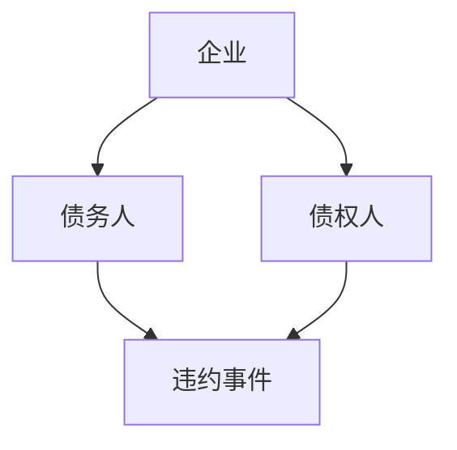
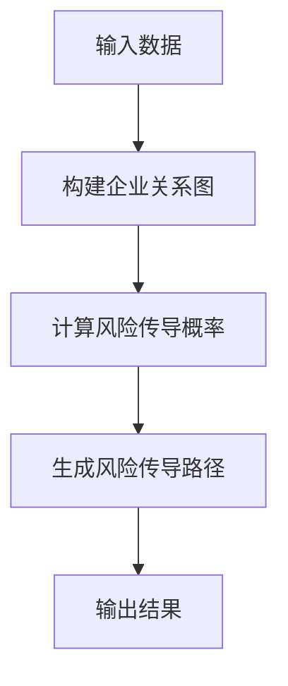
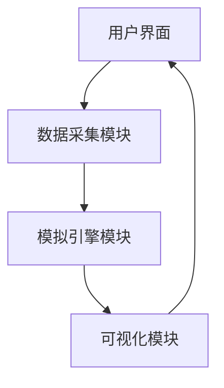

                 


# 开发智能化的企业信用风险传导模拟与可视化系统

## 关键词：企业信用风险，风险传导，智能化系统，可视化，数据模拟

## 摘要：本文详细介绍了开发智能化的企业信用风险传导模拟与可视化系统的各个方面。从背景介绍到系统设计，从算法实现到项目实战，本文通过系统化的分析和详细的代码示例，帮助读者全面理解如何构建一个高效的信用风险管理系统。文章最后给出了最佳实践和系统优化的建议，为实际应用提供了宝贵的参考。

---

# 第一部分：背景介绍

## 第1章：问题背景

### 1.1 信用风险的基本概念
- 信用风险的定义：企业因债务人违约而产生的损失风险。
- 信用风险的分类：单体信用风险、系统性信用风险。

### 1.2 问题描述
- 传统信用风险评估的局限性：依赖人工分析，效率低，覆盖面有限。
- 企业信用风险传导的复杂性：多层级、多维度的复杂关系，难以量化。

### 1.3 问题解决
- 开发智能化系统的必要性：利用大数据和人工智能技术，提高风险评估的效率和准确性。
- 系统目标：实现企业信用风险的智能化评估、传导模拟与可视化展示。

---

# 第二部分：核心概念与联系

## 第2章：信用风险传导的基本原理

### 2.1 信用风险传导的机制
- 信用风险通过企业间的关联关系进行传导。
- 关键因素：企业间的债务关系、供应链关系、投资关系。

### 2.2 概念属性特征对比表
| 风险类型 | 定义 | 主要影响 | 评估方法 |
|----------|------|----------|----------|
| 信用风险 | 因债务人违约产生的风险 | 企业财务状况 | 信用评分模型 |
| 市场风险 | 因市场价格波动产生的风险 | 市场整体波动 | VaR模型 |
| 操作风险 | 因内部操作失误产生的风险 | 内部流程 | 操作风险指标 |

### 2.3 ER实体关系图架构


---

# 第三部分：算法原理讲解

## 第3章：算法原理概述

### 3.1 算法的基本思想
- 基于图论的信用风险传导模型：构建企业间的关联网络，计算风险传导路径。
- 使用概率论模型评估风险影响程度。

### 3.2 算法流程图


### 3.3 算法实现代码
```python
import networkx as nx

def calculate_credit_risk(G):
    # 计算风险传导概率
    for node in G.nodes():
        G.nodes[node]['risk'] = 0
    # 初始化风险值
    for node in G.nodes():
        if G.nodes[node]['is_defaulter']:
            G.nodes[node]['risk'] = 1
    # 计算风险传导
    for _ in range(100):
        for node in G.nodes():
            total_risk = 0
            for neighbor in G.neighbors(node):
                total_risk += G.nodes[neighbor]['risk']
            G.nodes[node]['risk'] = total_risk / len(list(G.neighbors(node)))
    return G
```

### 3.4 数学模型与公式
- 概率论模型：$$ P(default) = \alpha \cdot R + \beta $$
- 图论模型：$$ R_i = \sum_{j \in N(i)} R_j $$

---

# 第四部分：系统分析与架构设计

## 第4章：系统功能设计

### 4.1 系统功能模块
- 数据采集模块：采集企业信用数据。
- 模拟引擎模块：计算风险传导路径。
- 可视化模块：展示风险传导结果。

### 4.2 系统架构设计


---

# 第五部分：项目实战

## 第5章：环境安装与代码实现

### 5.1 环境安装
- 安装Python和相关库：networkx、matplotlib。

### 5.2 核心代码实现
```python
import networkx as nx
import matplotlib.pyplot as plt

# 创建企业关系图
G = nx.DiGraph()
G.add_nodes_from(['A', 'B', 'C', 'D'])
G.add_edges_from([('A', 'B'), ('B', 'C'), ('C', 'D')])
nx.draw(G, with_labels=True)
plt.show()
```

### 5.3 实际案例分析
- 案例：假设企业A违约，分析其对其他企业的传导影响。

---

# 第六部分：总结与展望

## 第6章：总结

### 6.1 最佳实践
- 数据质量是关键：确保数据的完整性和准确性。
- 模型的可解释性：在复杂模型中加入可解释性设计。

### 6.2 小结
- 本文详细介绍了企业信用风险传导模拟与可视化的开发过程。
- 提供了从理论到实践的完整解决方案。

### 6.3 注意事项
- 数据隐私保护：在处理企业数据时，需遵守相关法律法规。
- 模型的实时性：在实际应用中，需考虑数据的实时更新。

### 6.4 拓展阅读
- 推荐阅读《信用风险管理：理论与实践》。

---

# 作者：AI天才研究院/AI Genius Institute & 禅与计算机程序设计艺术 /Zen And The Art of Computer Programming

