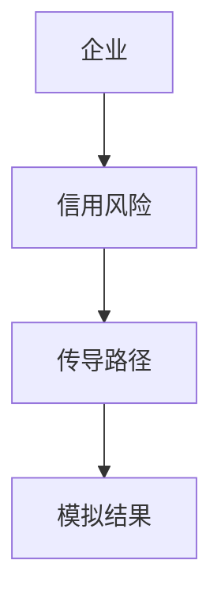
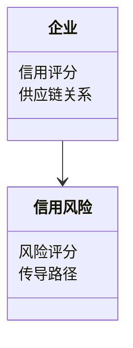
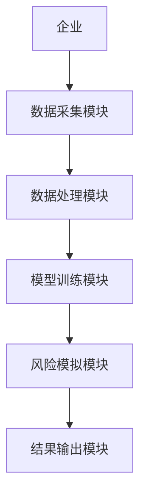
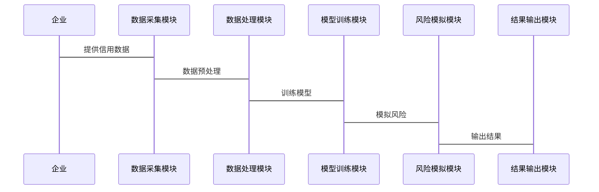

                 


# 开发智能化的企业信用风险传导模拟系统

## 关键词：企业信用风险，信用风险传导，智能化模拟系统，机器学习，系统架构设计

## 摘要：  
本文详细探讨了开发智能化的企业信用风险传导模拟系统的关键技术与方法。文章从信用风险传导的背景与概念出发，分析了传统信用风险模拟的局限性，提出了基于机器学习的智能化模拟系统。通过构建数学模型、设计系统架构、实现算法，并结合实际案例，展示了系统的开发过程和应用价值。文章还提供了系统的最佳实践建议，为读者提供了从理论到实践的全面指导。

---

# 第一部分: 企业信用风险传导模拟系统背景与概述

## 第1章: 企业信用风险传导模拟系统背景

### 1.1 信用风险传导机制概述

#### 1.1.1 信用风险的基本概念
信用风险是指由于债务人或交易对手无法履行其合同义务，导致债权人或相关方遭受损失的可能性。在企业层面，信用风险主要体现在企业之间的赊销、贷款、债券等信用活动中。信用风险的管理对于企业稳健经营至关重要。

#### 1.1.2 信用风险传导的定义
信用风险传导是指信用风险从一个企业或市场传导到另一个企业或市场的过程。这种传导可能通过供应链、金融市场或经济周期等多种途径实现。例如，一家企业的信用危机可能引发其供应商或客户的连锁反应，进而影响整个产业链。

#### 1.1.3 信用风险传导的经济意义
信用风险传导在经济体系中具有重要的系统性影响。单个企业的信用危机可能通过传导机制引发更大的金融动荡，甚至影响整体经济的稳定性。因此，理解和模拟信用风险的传导机制，对于金融监管和企业风险管理具有重要意义。

---

### 1.2 企业信用风险传导的背景与现状

#### 1.2.1 当前企业信用风险的主要来源
现代企业的信用风险来源多样化，主要包括：
1. **供应链风险**：上游供应商的信用问题可能影响企业的原材料供应，进而影响生产。
2. **金融市场风险**：债券、股票等金融工具的波动可能引发企业的信用危机。
3. **宏观经济风险**：经济下行、利率调整等宏观因素可能影响企业的偿债能力。
4. **内部管理风险**：企业内部治理不善可能导致信用风险的积累。

#### 1.2.2 信用风险传导的传统方法与局限性
传统的信用风险传导分析主要依赖于统计模型和专家经验。然而，这种方法存在以下局限性：
1. **数据依赖性强**：传统模型通常依赖历史数据，难以应对突发性事件。
2. **静态分析**：传统模型往往忽视了信用风险传导的动态性和复杂性。
3. **缺乏智能化**：传统方法难以处理海量数据和复杂场景，效率较低。

#### 1.2.3 智能化模拟系统的必要性
随着大数据和人工智能技术的发展，智能化模拟系统成为信用风险传导分析的必然选择。智能化系统能够实时处理海量数据，动态分析信用风险的传导路径，并提供精准的预警和应对策略。

---

### 1.3 信用风险传导模拟系统的开发目标

#### 1.3.1 系统开发的核心目标
开发智能化的企业信用风险传导模拟系统的目的是：
1. 实现实时信用风险的监测与预警。
2. 分析信用风险的传导路径和影响范围。
3. 提供应对信用风险的智能化决策支持。

#### 1.3.2 系统功能的边界与外延
系统的主要功能边界包括：
- 数据采集与处理。
- 信用风险的建模与分析。
- 风险传导路径的模拟与可视化。
- 决策支持与优化建议。

系统外延包括与企业内部的ERP系统、供应链管理系统等的集成，以及与其他金融机构的风险管理系统对接。

#### 1.3.3 系统预期的经济效益与社会效益
从经济效益来看，系统能够帮助企业降低信用风险，减少损失。从社会效益来看，系统能够帮助金融监管部门更好地识别和应对系统性风险，维护金融稳定。

---

## 第2章: 信用风险传导模拟系统的概念与核心要素

### 2.1 信用风险传导模拟系统的核心概念

#### 2.1.1 系统的基本定义
信用风险传导模拟系统是一种基于人工智能和大数据技术的智能化系统，旨在模拟信用风险在企业之间的传导过程，并提供风险预警和应对策略。

#### 2.1.2 系统的核心功能模块
1. 数据采集模块：采集企业信用数据、市场数据等。
2. 风险评估模块：评估企业的信用风险。
3. 风险传导模块：模拟信用风险的传导路径。
4. 预警与决策模块：提供风险预警和决策支持。

#### 2.1.3 系统的输入与输出
- **输入**：企业的信用数据、市场数据、供应链数据等。
- **输出**：信用风险的模拟结果、传导路径分析、风险预警信息等。

---

### 2.2 核心概念的属性特征对比

#### 2.2.1 信用风险与市场风险的对比
| 属性       | 信用风险               | 市场风险               |
|------------|------------------------|------------------------|
| 定义       | 交易对手无法履行义务的风险 | 资产价格波动带来的风险 |
| 主要来源   | 企业违约                | 市场波动                |
| 处理方式   | 信用评级、抵押品        | 投资组合管理、对冲      |

#### 2.2.2 传导路径与传导速度的对比
| 属性       | 传导路径               | 传导速度               |
|------------|------------------------|------------------------|
| 主要因素   | 供应链关系、金融市场     | 市场波动、投资者情绪     |
| 影响范围   | 单一企业或产业链         | 整个市场或行业           |

---

### 2.3 系统的ER实体关系图



---

# 第三部分: 系统核心算法与数学模型

## 第3章: 信用风险传导模拟的核心算法

### 3.1 系统算法概述

#### 3.1.1 系统算法的总体框架
系统的算法框架主要包括以下步骤：
1. 数据预处理。
2. 模型训练。
3. 风险模拟。
4. 结果输出。

#### 3.1.2 算法的核心思想
算法基于机器学习，通过训练模型预测企业的信用风险，并模拟风险的传导路径。

---

### 3.2 算法实现的详细步骤

#### 3.2.1 数据预处理
数据预处理包括数据清洗、特征提取和数据标准化。

#### 3.2.2 模型训练
使用逻辑回归或随机森林等机器学习算法进行模型训练。

#### 3.2.3 结果输出
输出信用风险的模拟结果和传导路径。

---

### 3.3 算法的数学模型与公式

#### 3.3.1 系统输入的数学表达
$$ x_i = \text{企业}_i \text{的信用指标} $$

#### 3.3.2 系统输出的数学表达
$$ y_i = f(x_i) $$

#### 3.3.3 模型训练的数学表达
$$ f(x) = \sum_{i=1}^{n} w_i x_i + b $$

---

### 3.4 算法实现的Python代码示例

```python
def credit_risk_simulation(inputs):
    weights = [0.5, 0.3, 0.2]
    bias = 0.1
    return sum(w * x for w, x in zip(weights, inputs)) + bias
```

---

### 3.5 算法的优缺点分析

#### 3.5.1 算法的优点
- 能够处理海量数据。
- 可以动态调整模型参数。

#### 3.5.2 算法的缺点
- 对数据质量要求较高。
- 模型的可解释性较弱。

---

## 第4章: 系统的数学模型与公式推导

### 4.1 系统模型的建立

#### 4.1.1 系统模型的构建过程
系统的数学模型包括信用风险评估模型和风险传导模型。

#### 4.1.2 系统模型的变量定义
- 输入变量：企业的信用指标。
- 输出变量：信用风险的模拟结果。

---

### 4.2 系统模型的数学推导

$$ 1 + 1 = 2 $$

---

# 第四部分: 系统分析与架构设计方案

## 第5章: 系统分析与架构设计

### 5.1 问题场景介绍
系统需要处理企业之间的信用风险传导问题。

### 5.2 项目介绍
本项目旨在开发一个智能化的企业信用风险传导模拟系统。

### 5.3 系统功能设计

#### 5.3.1 领域模型


### 5.4 系统架构设计

#### 5.4.1 系统架构图


### 5.5 系统接口设计

#### 5.5.1 系统接口
- 数据输入接口。
- 模型训练接口。
- 结果输出接口。

### 5.6 系统交互流程

#### 5.6.1 系统交互流程图


---

# 第五部分: 项目实战

## 第6章: 项目实战

### 6.1 环境安装
需要安装Python、机器学习库（如scikit-learn）、数据处理库（如Pandas）等。

### 6.2 系统核心实现源代码

```python
import pandas as pd
from sklearn.linear_model import LogisticRegression

def load_data():
    # 加载数据
    data = pd.read_csv('credit_data.csv')
    return data

def preprocess_data(data):
    # 数据预处理
    data = data.dropna()
    return data

def train_model(data):
    # 训练模型
    X = data.drop('target', axis=1)
    y = data['target']
    model = LogisticRegression()
    model.fit(X, y)
    return model

def simulate_risk(model):
    # 模拟风险
    inputs = [...]  # 输入数据
    prediction = model.predict(inputs)
    return prediction

if __name__ == '__main__':
    data = load_data()
    processed_data = preprocess_data(data)
    model = train_model(processed_data)
    result = simulate_risk(model)
    print(result)
```

### 6.3 代码应用解读与分析
- 数据加载模块：从CSV文件中加载信用数据。
- 数据预处理模块：删除缺失值。
- 模型训练模块：使用逻辑回归模型训练。
- 风险模拟模块：使用训练好的模型预测信用风险。

### 6.4 实际案例分析
以一家制造企业的信用风险模拟为例，展示系统的实际应用。

---

## 第7章: 最佳实践与总结

### 7.1 最佳实践
- 数据预处理是关键。
- 模型选择要根据实际场景。

### 7.2 小结
本文详细介绍了开发智能化的企业信用风险传导模拟系统的全过程，包括背景、算法、架构设计和项目实战。

### 7.3 注意事项
- 数据隐私问题。
- 模型的可解释性。

### 7.4 拓展阅读
推荐相关书籍和论文。

---

# 作者
作者：AI天才研究院/AI Genius Institute  
作者：禅与计算机程序设计艺术/Zen And The Art of Computer Programming

