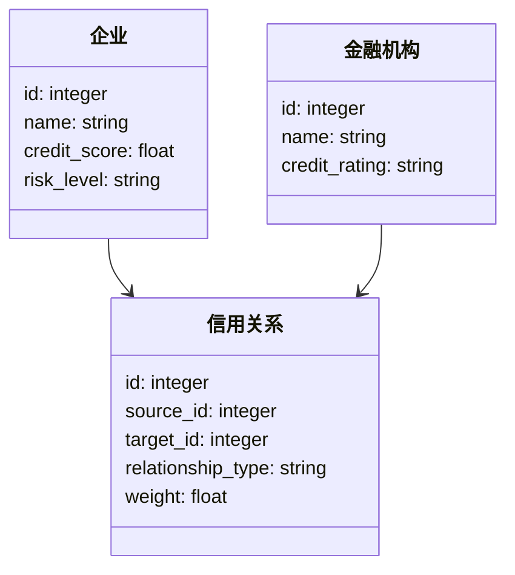
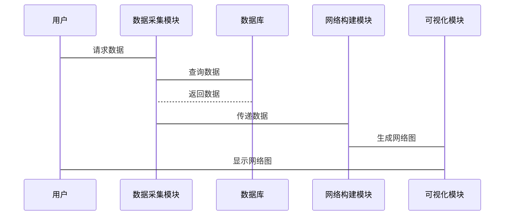

                 


# 开发智能化的企业信用风险传导网络可视化系统

## 关键词：
- 企业信用风险
- 网络可视化
- 系统开发
- 数据分析
- 人工智能

## 摘要：
随着全球经济的快速发展，企业信用风险的管理和可视化需求日益增加。本文深入探讨了如何开发一个智能化的企业信用风险传导网络可视化系统。通过结合大数据分析、网络可视化技术和人工智能算法，系统能够实时监测和分析企业的信用风险，构建风险传导网络，并以直观的可视化方式呈现。本文从背景介绍、核心概念、算法原理、系统架构设计、项目实战到最佳实践等方面进行了详细阐述，为读者提供了一套完整的解决方案。

---

# 第一部分: 企业信用风险传导网络可视化系统概述

## 第1章: 企业信用风险传导网络可视化系统背景

### 1.1 企业信用风险的基本概念
#### 1.1.1 信用风险的定义
信用风险是指企业或个人在借贷活动中，由于债务人或交易对手无法履行其债务义务而导致的损失风险。它是金融风险的重要组成部分，广泛存在于企业融资、投资和日常经营活动中。

#### 1.1.2 信用风险的分类
信用风险可以分为以下几类：
- **单体信用风险**：由于单个企业的信用状况恶化而产生的风险。
- **系统性信用风险**：由于整个金融系统的波动或经济危机导致的广泛信用风险。
- **传染性信用风险**：由于某一家企业或机构的信用问题，通过市场、供应链或金融网络传导到其他企业或机构的风险。

#### 1.1.3 信用风险传导的定义
信用风险的传导是指，由于某一企业的信用问题或负面事件，通过直接或间接的联系，导致其他相关企业或机构的信用状况恶化的现象。这种传导机制可以通过企业之间的供应链、金融投资、合作伙伴关系等复杂网络进行传播。

---

### 1.2 企业信用风险传导网络的构建
#### 1.2.1 信用风险传导的路径分析
信用风险的传导路径可以分为以下几种：
1. **直接传导路径**：通过企业间的直接债务关系或供应链关系，风险直接从一家企业传递到另一家企业。
2. **间接传导路径**：通过中间企业或金融机构，风险逐步扩散到更广泛的网络中。
3. **市场传导路径**：由于市场对某一企业的负面信息反应，导致相关企业的信用评级下降，从而引发风险。

#### 1.2.2 网络化信用风险传导模型
网络化信用风险传导模型将企业、金融机构和市场参与者视为网络中的节点，通过边的权重和方向表示信用关系的强度和方向。模型可以通过图论方法进行分析，识别关键节点和风险传导路径。

#### 1.2.3 网络化信用风险传导的特点
- **复杂性**：企业之间的关系错综复杂，风险传导路径多样。
- **动态性**：随着市场环境的变化，信用关系和风险传导路径也会不断变化。
- **系统性**：风险的传导往往涉及多个层面和机构，具有系统性特征。

---

### 1.3 网络可视化技术在信用风险中的应用
#### 1.3.1 网络可视化的定义
网络可视化是指将复杂的数据关系以图形化的方式展示，帮助用户更直观地理解和分析数据。在网络可视化中，节点通常代表企业和机构，边代表它们之间的信用关系或交易关系。

#### 1.3.2 网络可视化在信用风险分析中的优势
- **直观性**：通过图形化的展示，用户可以快速识别关键节点和风险传导路径。
- **洞察性**：可视化可以帮助发现潜在的风险聚集点和系统性风险。
- **交互性**：用户可以通过交互操作，深入分析特定节点或边的属性。

#### 1.3.3 网络可视化技术的实现方式
- **图论方法**：通过图论中的节点和边表示信用关系，使用图的遍历算法进行网络分析。
- **布局算法**：使用.force布局等算法优化网络的可读性。
- **数据可视化工具**：利用Gephi、NetworkX等工具进行网络可视化。

---

## 第2章: 企业信用风险传导网络的核心概念

### 2.1 信用风险传导网络的构建原理
#### 2.1.1 信用风险传导的基本原理
信用风险的传导是通过企业之间的信用关系网络实现的。当某一家企业的信用状况恶化时，其直接或间接的合作伙伴可能会受到负面影响，进而引发连锁反应。

#### 2.1.2 网络化信用风险传导的核心要素
- **节点**：代表企业和金融机构。
- **边**：表示企业之间的信用关系或交易关系。
- **权重**：表示信用关系的强度。
- **方向**：表示风险传导的方向。

#### 2.1.3 信用风险传导网络的构建步骤
1. 数据收集：收集企业的信用数据、供应链数据和交易数据。
2. 数据清洗：去除无效数据，处理缺失值和异常值。
3. 网络构建：基于数据构建信用关系网络。
4. 风险分析：识别关键节点和风险传导路径。

---

### 2.2 信用风险传导网络的属性特征对比
#### 2.2.1 节点属性对比
| 属性 | 定义 |
|------|------|
| 度数 | 节点的度数表示其在网络中的连接数量，度数高的节点通常具有较高的影响力。 |
| 中心性 | 衡量节点在网络中的中心地位，中心性高的节点通常是关键节点。 |
| 权重 | 衡量节点之间的信用关系强度。 |

#### 2.2.2 边属性对比
| 属性 | 定义 |
|------|------|
| 边权重 | 衡量边的强度，权重高的边表示较强的信用关系。 |
| 边方向 | 表示风险的传导方向。 |
| 边类型 | 表示信用关系的类型，例如供应链关系、投资关系等。 |

#### 2.2.3 网络整体属性对比
| 属性 | 定义 |
|------|------|
| 网络密度 | 衡量网络中边的数量与节点数量的比率，密度高的网络表示信用关系较为紧密。 |
| 网络直径 | 衡量网络中最长的最短路径，直径大的网络表示风险传导路径较长。 |
| 网络模块化 | 衡量网络中社区的划分程度，模块化高的网络表示社区结构明显。 |

---

### 2.3 信用风险传导网络的ER实体关系图
#### 2.3.1 实体关系图的定义
ER实体关系图（Entity-Relationship Diagram）用于描述系统中实体之间的关系。在信用风险传导网络中，实体包括企业和金融机构，关系包括供应链关系、投资关系等。

#### 2.3.2 实体关系图的构建方法
1. 确定实体：识别系统中的核心实体，如企业、金融机构、供应链等。
2. 确定关系：定义实体之间的关系，如“企业A向企业B采购原材料”。
3. 绘制图示：使用工具（如MySQL Workbench）绘制ER图。

#### 2.3.3 实体关系图的分析方法
通过分析ER图，可以识别关键实体和核心关系，为网络化信用风险分析提供基础数据。

---

## 第3章: 企业信用风险传导网络可视化系统的算法原理

### 3.1 社会网络分析算法
#### 3.1.1 社会网络分析的基本原理
社会网络分析（Social Network Analysis, SNA）通过分析网络中节点和边的关系，识别关键节点和社区结构。常用算法包括：
- **度数中心性**：计算节点的度数，度数高的节点影响力大。
- **介数中心性**：计算节点在最短路径中的作用，介数中心性高的节点是关键节点。

#### 3.1.2 社会网络分析的实现步骤
1. 数据预处理：清洗数据，提取节点和边信息。
2. 构建网络：使用图论方法构建网络。
3. 计算中心性：使用算法计算节点的中心性。
4. 可视化网络：使用工具（如Gephi）进行网络可视化。

#### 3.1.3 社会网络分析的数学模型
度数中心性的计算公式为：
$$ C_d(v) = \frac{d(v)}{n-1} $$
其中，$d(v)$ 是节点 $v$ 的度数，$n$ 是网络中的节点总数。

---

### 3.2 聚类算法
#### 3.2.1 聚类算法的基本原理
聚类算法通过将相似的节点分组，识别网络中的社区结构。常用算法包括：
- **K-means算法**：基于距离的聚类算法。
- **社区检测算法**：如Louvain算法，用于检测社区结构。

#### 3.2.2 聚类算法的实现步骤
1. 数据预处理：提取节点特征。
2. 选择算法：根据需求选择聚类算法。
3. 聚类实现：对节点进行聚类。
4. 可视化结果：将聚类结果与网络可视化结合。

#### 3.2.3 聚类算法的数学模型
Louvain算法的目标函数为：
$$ Q = \sum_{i<j} (w_{ij} - \frac{d_i d_j}{m}) ) $$
其中，$w_{ij}$ 是边的权重，$d_i$ 和 $d_j$ 是节点 $i$ 和 $j$ 的度数，$m$ 是网络的总边权重。

---

### 3.3 网络可视化算法
#### 3.3.1 网络可视化算法的基本原理
网络可视化算法通过优化节点和边的布局，提高网络的可读性。常用算法包括：
- **力导引算法**：模拟物理系统的力，将网络布局优化为易于阅读的形式。
- **树状布局**：将网络组织成树状结构，便于层次化展示。

#### 3.3.2 网络可视化算法的实现步骤
1. 数据预处理：提取网络的节点和边信息。
2. 选择布局算法：根据需求选择布局算法。
3. 可视化实现：使用工具或库（如D3.js）进行可视化。
4. 交互设计：增加交互功能，如缩放、过滤等。

#### 3.3.3 网络可视化算法的数学模型
力导引算法的目标函数为：
$$ E = \sum_{i<j} k \cdot d_{ij} $$
其中，$k$ 是弹簧常数，$d_{ij}$ 是节点 $i$ 和 $j$ 之间的距离。

---

## 第4章: 企业信用风险传导网络可视化系统的数学模型

### 4.1 信用风险传导网络的数学模型
#### 4.1.1 信用风险传导网络的图论模型
信用风险传导网络可以用图论中的有向图表示，节点表示企业和金融机构，边表示信用关系。

#### 4.1.2 信用风险传导网络的概率模型
概率模型用于预测企业信用违约的概率，常用模型包括：
- **Logistic回归模型**：基于企业财务指标预测违约概率。
- **XGBoost模型**：基于机器学习算法预测违约概率。

#### 4.1.3 信用风险传导网络的矩阵模型
信用风险传导网络可以用邻接矩阵表示，邻接矩阵的元素表示节点之间的连接强度。

---

### 4.2 网络可视化的数学模型
#### 4.2.1 网络可视化的图论模型
网络可视化的图论模型包括节点和边的属性，如度数、中心性、边权重等。

#### 4.2.2 网络可视化的几何模型
几何模型用于描述网络中节点的位置，如力导引模型中的坐标系。

#### 4.2.3 网络可视化的布局算法模型
布局算法模型用于优化网络的可视化效果，如力导引算法中的弹簧和钉子模型。

---

## 第5章: 系统架构设计与实现

### 5.1 项目介绍
企业信用风险传导网络可视化系统旨在通过大数据分析和网络可视化技术，帮助企业识别和管理信用风险。

### 5.2 系统功能设计
#### 5.2.1 数据采集模块
- 数据来源：企业信用数据、供应链数据、交易数据。
- 数据清洗：去除无效数据，处理缺失值和异常值。

#### 5.2.2 网络构建模块
- 节点表示：企业、金融机构。
- 边表示：信用关系、供应链关系。

#### 5.2.3 可视化模块
- 网络布局：使用力导引算法优化布局。
- 交互设计：支持缩放、过滤、悬停提示等功能。

---

### 5.3 系统架构设计
#### 5.3.1 领域模型
领域模型是系统的核心逻辑模型，描述系统中的实体和关系。以下是领域模型的Mermaid类图：



#### 5.3.2 系统架构
系统采用分层架构，包括数据层、业务逻辑层和表现层。以下是系统架构的Mermaid图：

```mermaid
rectangle 数据层 {
    数据库
}
rectangle 业务逻辑层 {
    数据采集模块
    网络构建模块
}
rectangle 表现层 {
    网络可视化模块
    用户界面
}
数据层 --> 业务逻辑层
业务逻辑层 --> 表现层
```

---

### 5.4 接口设计
系统提供以下接口：
- 数据接口：用于数据采集模块与数据库交互。
- 网络接口：用于网络构建模块与可视化模块交互。
- 用户接口：用于用户与系统进行交互。

---

### 5.5 交互流程
以下是系统交互的Mermaid序列图：



---

## 第6章: 项目实战与应用

### 6.1 项目实战
#### 6.1.1 环境搭建
- 安装Python、Pandas、Matplotlib、NetworkX等库。

#### 6.1.2 核心代码实现
以下是网络构建和可视化的Python代码：

```python
import networkx as nx
import matplotlib.pyplot as plt

# 创建网络
G = nx.DiGraph()

# 添加节点
G.add_nodes_from(["企业A", "企业B", "金融机构C"])

# 添加边
G.add_edges_from([("企业A", "企业B", {"weight": 0.8}), 
                   ("企业B", "金融机构C", {"weight": 0.6})])

# 网络布局
nx.draw(G, pos=nx.spring_layout(G), node_size=1500, 
        edge_color="red", arrowstyle="->", 
        arrowsize=20)
plt.show()
```

---

### 6.2 实际案例分析
以某企业的信用风险为例，通过系统进行分析，识别出关键节点和风险传导路径。

---

## 第7章: 最佳实践与总结

### 7.1 最佳实践
- 数据质量是关键：确保数据的准确性和完整性。
- 算法选择要合理：根据需求选择合适的算法。
- 系统设计要模块化：便于维护和扩展。

### 7.2 小结
企业信用风险传导网络可视化系统能够帮助企业在复杂的金融环境中更好地识别和管理信用风险，提高风险管理的效率和效果。

### 7.3 注意事项
- 系统的实时性：需要实时更新数据和网络结构。
- 数据隐私问题：注意数据的安全性和隐私保护。

### 7.4 拓展阅读
- 推荐阅读《网络科学导论》和《社会网络分析》等相关书籍。

---

# 作者：AI天才研究院/AI Genius Institute & 禅与计算机程序设计艺术 /Zen And The Art of Computer Programming

