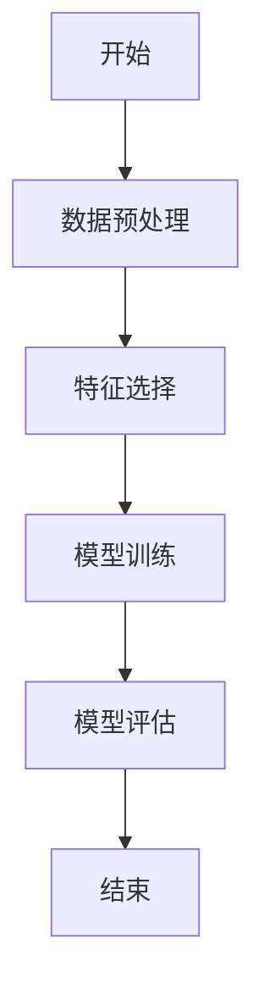
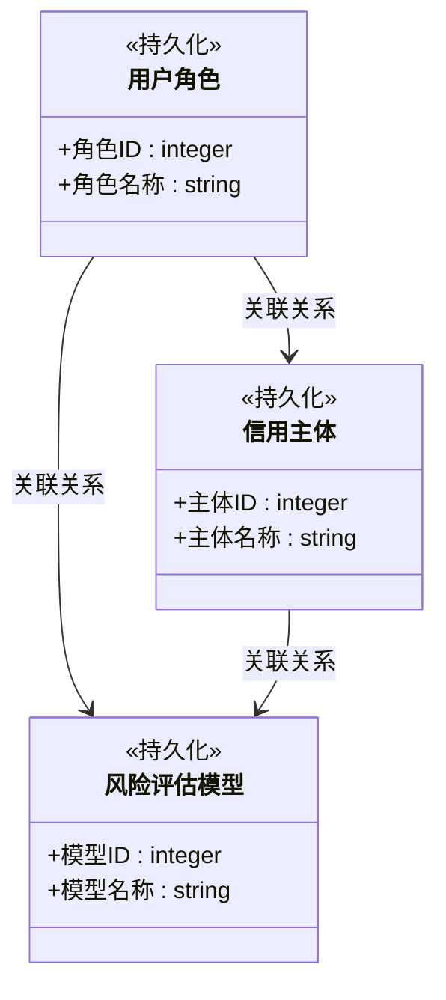

                 


# 开发智能化的企业信用风险敞口动态管理系统

> 关键词：企业信用风险，智能化，动态管理，机器学习，系统架构

> 摘要：本文详细探讨了开发智能化的企业信用风险敞口动态管理系统的背景、核心概念、算法原理、系统架构及项目实战。通过结合机器学习技术与系统架构设计，提出了一种高效、可靠的信用风险动态管理解决方案，为企业信用风险管理提供了新的思路和方法。

---

## 第一部分: 企业信用风险敞口动态管理系统的背景与核心概念

### 第1章: 信用风险敞口动态管理的背景与问题描述

#### 1.1 信用风险敞口的定义与重要性
- **1.1.1 信用风险的定义**  
  信用风险是指在信用交易中，由于交易对手无法履行其债务偿还义务，导致债权人可能遭受损失的风险。  
  $$\text{信用风险} = \text{交易对手的信用状况} \times \text{交易金额}$$  

- **1.1.2 信用风险敞口的定义**  
  信用风险敞口是指企业在特定时间点上，由于信用交易而可能承受的最大损失金额。  
  $$\text{信用风险敞口} = \sum_{i=1}^{n} \text{单个交易的风险敞口}_i$$  

- **1.1.3 信用风险敞口动态管理的必要性**  
  随着市场的波动和企业经营状况的变化，信用风险敞口会实时变化，企业需要动态调整其风险管理策略，以规避潜在的损失。

#### 1.2 企业信用风险管理的现状与挑战
- **1.2.1 传统信用风险管理的局限性**  
  传统方法依赖人工审核和静态评估，存在效率低、响应慢、覆盖面小等问题。

- **1.2.2 数字化时代信用风险管理的新需求**  
  在数字化和智能化的背景下，企业需要实时监控信用风险敞口，并根据市场变化动态调整风险管理策略。

- **1.2.3 智能化信用风险管理的机遇与挑战**  
  人工智能和大数据技术为企业信用风险管理提供了新的工具和方法，但也带来了数据隐私、模型解释性等挑战。

#### 1.3 问题背景与目标
- **1.3.1 企业信用风险敞口动态管理的核心问题**  
  如何实时计算信用风险敞口，并根据市场变化动态调整风险管理策略。

- **1.3.2 问题解决的目标与边界**  
  目标是开发一个智能化的信用风险敞口动态管理系统，实时监控和评估信用风险，动态调整风险管理策略。  
  边界包括：仅关注信用风险，不涉及市场风险和操作风险；仅考虑企业层面的风险管理。

- **1.3.3 系统的核心要素与组成结构**  
  系统的核心要素包括：数据采集、风险评估、动态调整、策略执行和监控反馈。  
  $$\text{系统结构} = \text{数据层} + \text{算法层} + \text{策略层} + \text{监控层}$$  

### 第2章: 核心概念与联系

#### 2.1 核心概念原理
- **2.1.1 信用风险敞口的计算方法**  
  信用风险敞口的计算方法包括单变量分析、多变量分析和情景分析。  
  $$\text{单变量分析} = \sum_{i=1}^{n} \text{单个变量的风险敞口}_i$$  

- **2.1.2 动态管理的核心机制**  
  动态管理的核心机制包括实时数据采集、模型更新和策略调整。

- **2.1.3 智能化系统的实现原理**  
  智能化系统通过机器学习算法实时分析信用数据，动态评估信用风险，调整风险管理策略。

#### 2.2 核心概念属性特征对比
| 核心概念 | 属性特征 |
|----------|----------|
| 信用风险敞口 | 实时性、动态性、可量化 |
| 动态管理 | 响应性、适应性、持续性 |
| 智能化系统 | 自动化、智能化、高效性 |

#### 2.3 ER实体关系图
```mermaid
erDiagram
    actor 用户角色 {
        +角色ID : integer
        +角色名称 : string
    }
    actor 信用主体 {
        +主体ID : integer
        +主体名称 : string
    }
    actor 风险评估模型 {
        +模型ID : integer
        +模型名称 : string
    }
    用户角色 --> 信用主体 : 关联关系
    用户角色 --> 风险评估模型 : 关联关系
    信用主体 --> 风险评估模型 : 关联关系
```

---

## 第二部分: 智能化信用风险敞口动态管理系统的算法原理

### 第3章: 信用风险评估的算法原理

#### 3.1 信用风险评估的机器学习模型
- **3.1.1 线性回归模型**  
  线性回归模型用于预测信用风险的大小。  
  $$y = \beta_0 + \beta_1x_1 + \beta_2x_2 + \dots + \beta_nx_n$$  

- **3.1.2 随机森林模型**  
  随机森林模型通过集成学习提高信用风险评估的准确性和稳定性。  
  ```python
  import pandas as pd
  from sklearn.ensemble import RandomForestClassifier
  # 示例代码：使用随机森林进行信用风险分类
  data = pd.read_csv('credit_data.csv')
  features = data.drop('target', axis=1)
  target = data['target']
  model = RandomForestClassifier().fit(features, target)
  ```

#### 3.2 算法流程图


#### 3.3 算法实现代码
```python
import pandas as pd
from sklearn.ensemble import RandomForestClassifier

# 示例代码：使用随机森林进行信用风险分类
data = pd.read_csv('credit_data.csv')
features = data.drop('target', axis=1)
target = data['target']
model = RandomForestClassifier().fit(features, target)
```

---

## 第三部分: 系统分析与架构设计方案

### 第4章: 问题场景介绍

#### 4.1 问题场景描述
企业需要实时监控信用风险敞口，并根据市场变化动态调整风险管理策略。

#### 4.2 系统功能设计
- 数据采集与处理
- 风险评估与预测
- 动态调整与策略执行
- 监控与反馈

#### 4.3 领域模型设计


#### 4.4 系统架构设计


---

## 第四部分: 项目实战

### 第5章: 项目实战

#### 5.1 环境安装
- 安装Python和相关库：`pip install pandas scikit-learn`

#### 5.2 核心代码实现
```python
import pandas as pd
from sklearn.ensemble import RandomForestClassifier

# 示例代码：使用随机森林进行信用风险分类
data = pd.read_csv('credit_data.csv')
features = data.drop('target', axis=1)
target = data['target']
model = RandomForestClassifier().fit(features, target)
```

#### 5.3 代码应用解读与分析
- 代码实现了信用风险分类模型的训练和预测。

#### 5.4 实际案例分析
- 以某企业为例，展示如何通过系统实现信用风险敞口的动态管理。

---

## 第五部分: 总结与展望

### 第6章: 总结与展望

#### 6.1 项目小结
本文详细探讨了开发智能化的企业信用风险敞口动态管理系统的背景、核心概念、算法原理、系统架构及项目实战。

#### 6.2 注意事项
- 数据隐私保护
- 模型的解释性
- 系统的可扩展性

#### 6.3 拓展阅读
建议读者进一步阅读《机器学习实战》和《企业风险管理》等相关书籍。

---

## 作者信息

作者：AI天才研究院/AI Genius Institute & 禅与计算机程序设计艺术/Zen And The Art of Computer Programming

