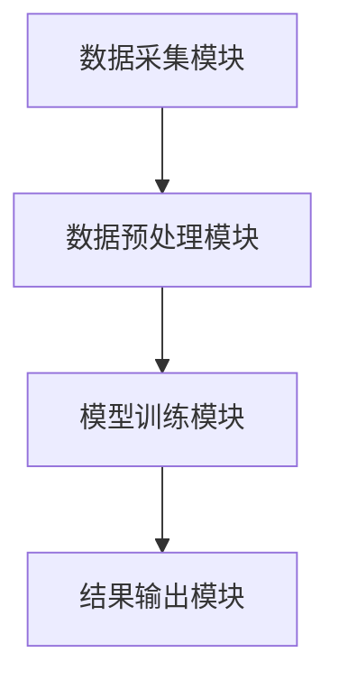
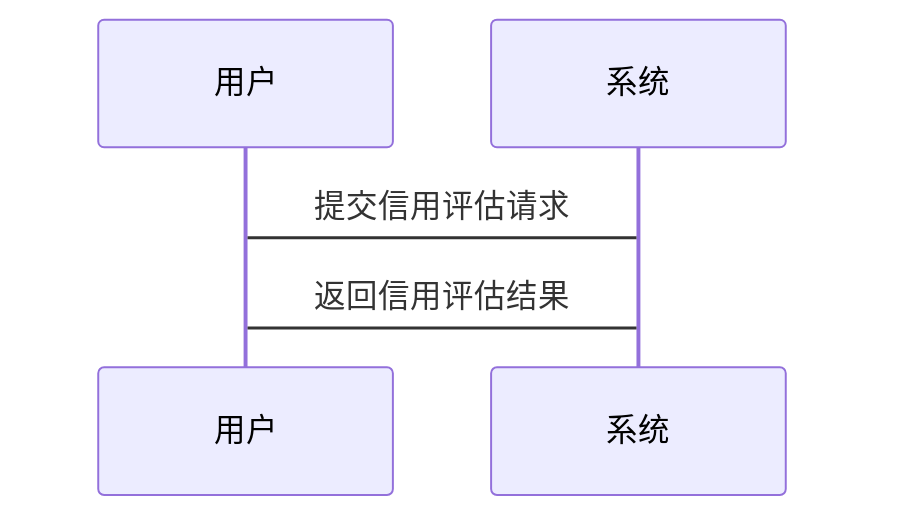

                 


# 开发智能化的企业信用风险评估模型

## 关键词：企业信用风险评估、人工智能、机器学习、风险评估模型、智能化评估

## 摘要：随着企业规模的不断扩大和金融市场的复杂化，传统的信用风险评估方法已经难以满足现代企业的需求。基于人工智能和机器学习的智能化信用风险评估模型能够更精准、更高效地预测和管理信用风险。本文将从背景介绍、核心概念、算法原理、系统架构到项目实战，全面解析开发智能化企业信用风险评估模型的全过程，为企业信用风险管理提供新的思路和解决方案。

---

# 第一部分: 背景介绍

## 第1章: 信用风险评估的基本概念

### 1.1 信用风险的定义与特征

#### 1.1.1 信用风险的定义
信用风险是指企业在信用交易中，由于交易对手或债务人无法履行其债务责任而给债权人带来的损失风险。在企业信用评估中，主要关注的是企业客户的信用状况，包括财务状况、经营能力、偿债能力等。

#### 1.1.2 信用风险的主要特征
- **不确定性**：信用风险的发生具有不确定性，受到市场环境、企业经营状况等多种因素的影响。
- **相关性**：信用风险与企业的财务状况、行业环境、宏观经济等因素高度相关。
- **可测性**：通过数据分析和模型构建，信用风险可以被量化和评估。

#### 1.1.3 信用风险的分类
- **系统性风险**：由宏观经济因素引发的风险，如经济危机、通货膨胀等。
- **非系统性风险**：由企业自身的财务状况、管理能力等因素引发的风险。

### 1.2 企业信用风险评估的重要性

#### 1.2.1 信用风险对企业的影响
信用风险直接影响企业的财务健康和经营稳定性。如果企业在信用交易中发生违约，可能导致资金链断裂，影响企业的正常运营。

#### 1.2.2 信用风险评估在企业决策中的作用
- **融资决策**：通过评估客户的信用风险，企业可以合理安排融资规模和结构。
- **投资决策**：信用风险评估帮助企业识别高风险投资目标，降低投资风险。
- **风险管理**：通过评估信用风险，企业可以制定有效的风险管理策略，降低损失。

#### 1.2.3 信用风险评估的经济意义
信用风险评估是现代金融体系的重要组成部分，能够促进资金的有效配置，维护金融市场的稳定。

### 1.3 传统信用风险评估方法的局限性

#### 1.3.1 传统信用评估方法概述
传统的信用风险评估方法主要包括财务指标分析、信用评分模型等。这些方法基于历史数据和简单的统计分析，能够提供一定的参考价值。

#### 1.3.2 传统方法的局限性
- **数据维度有限**：传统方法主要依赖财务数据，忽略了非财务因素如市场环境、企业声誉等。
- **模型复杂性低**：传统模型难以捕捉复杂的信用风险特征，尤其是在数据量大、维度高的情况下。
- **实时性不足**：传统方法通常需要较长的时间进行数据收集和分析，难以满足实时评估的需求。

#### 1.3.3 智能化评估的必要性
随着大数据和人工智能技术的发展，企业信用风险评估需要更加智能化、精准化。传统的评估方法难以应对复杂的信用风险特征，智能化评估能够通过机器学习等技术，提高评估的准确性和效率。

---

## 第2章: 智能化信用风险评估的发展背景

### 2.1 人工智能技术的快速发展

#### 2.1.1 人工智能技术的演进
人工智能技术的快速发展为信用风险评估提供了新的工具和方法。机器学习、深度学习等技术能够处理大量复杂的数据，发现传统方法难以捕捉的模式和特征。

#### 2.1.2 大数据技术的应用
大数据技术能够帮助企业收集和处理海量数据，为信用风险评估提供丰富的数据来源，包括企业的财务数据、市场数据、交易数据等。

#### 2.1.3 机器学习在信用评估中的应用
机器学习算法，如逻辑回归、决策树、随机森林等，能够通过数据训练模型，自动识别信用风险的关键特征，提高评估的准确性。

### 2.2 企业信用风险评估智能化的需求

#### 2.2.1 企业信用风险的复杂性
现代企业的信用风险受到多种因素的影响，包括宏观经济环境、行业竞争、企业内部管理等。传统的评估方法难以全面捕捉这些因素。

#### 2.2.2 智能化评估的优势
- **数据驱动**：智能化评估能够充分利用大数据技术，结合企业内外部数据，全面评估信用风险。
- **实时性**：通过实时数据处理和模型更新，智能化评估能够快速响应信用风险的变化。
- **精准性**：机器学习算法能够发现数据中的复杂模式，提高评估的精准性。

#### 2.2.3 企业智能化转型的趋势
随着企业对数据驱动决策的需求增加，智能化信用风险评估成为企业转型的重要方向。

### 2.3 智能化信用风险评估的现状与挑战

#### 2.3.1 当前技术的应用现状
目前，智能化信用风险评估已经在金融、电商等领域得到广泛应用，但仍然存在一些技术瓶颈，如模型解释性不足、数据隐私问题等。

#### 2.3.2 智能化评估的主要挑战
- **数据质量**：高质量的数据是模型准确性的基础，但数据清洗和预处理成本较高。
- **模型解释性**：复杂的机器学习模型难以解释其决策过程，影响实际应用中的信任度。
- **技术门槛**：智能化评估需要较高的技术门槛，企业需要投入大量资源进行技术研发和人才培养。

#### 2.3.3 未来发展的方向
未来，智能化信用风险评估将朝着更加个性化、实时化、智能化的方向发展，通过技术进步和数据分析，进一步提高评估的准确性和效率。

---

# 第二部分: 企业信用风险评估模型的核心概念与联系

## 第3章: 核心概念与原理

### 3.1 企业信用风险评估模型的组成

#### 3.1.1 数据输入
信用风险评估模型的输入数据包括企业的财务数据、市场数据、行业数据等。这些数据需要经过清洗和预处理，提取关键特征。

#### 3.1.2 模型构建
模型构建是信用风险评估的核心部分，包括选择合适的算法、训练模型、验证和优化模型等步骤。

#### 3.1.3 结果输出
模型输出包括信用评分、风险等级、违约概率等，帮助企业进行信用决策。

### 3.2 关键属性对比

#### 3.2.1 数据特征对比表
以下是不同信用风险评估模型的数据特征对比表：

| 特征       | 传统信用评分模型 | 机器学习模型 |
|------------|------------------|--------------|
| 数据来源   | 财务数据为主      | 多源数据     |
| 数据维度   | 较低             | 高           |
| 模型复杂性 | 简单             | 复杂         |
| 精度       | 中等             | 高           |

#### 3.2.2 模型性能对比表
以下是不同信用风险评估模型的性能对比表：

| 模型类型   | 逻辑回归 | 决策树 | 随机森林 |
|------------|----------|--------|-----------|
| 准确性     | 中等     | 中等   | 较高      |
| 可解释性   | 较高     | 较低   | 较低      |
| 处理速度   | 较快     | 中等   | 较慢      |

#### 3.2.3 不同模型的优缺点分析
- **逻辑回归**：优点是可解释性强，适用于二分类问题；缺点是模型假设严格，可能无法捕捉复杂的非线性关系。
- **决策树**：优点是易于解释，能够处理非线性关系；缺点是模型容易过拟合，稳定性较差。
- **随机森林**：优点是能够处理高维数据，抗过拟合能力强；缺点是模型解释性较差，计算成本较高。

### 3.3 ER实体关系图

```mermaid
er
actor: 企业
actor --> model: 提供数据
model --> result: 输出评估结果
```

### 3.4 概念层次分析

#### 3.4.1 概念层次分析
信用风险评估模型可以从微观和宏观两个层面进行分析。微观层面包括企业的财务状况、经营能力等，宏观层面包括宏观经济环境、行业竞争状况等。

#### 3.4.2 核心要素的定义
核心要素包括：
- **财务数据**：如收入、利润、资产负债率等。
- **市场数据**：如行业趋势、市场波动等。
- **交易数据**：如交易历史、信用记录等。

#### 3.4.3 要素之间的关系
各要素之间存在相互影响的关系，例如企业的财务状况受行业趋势和宏观经济环境的影响，交易数据能够反映企业的信用历史和信用行为。

---

## 第4章: 企业信用风险评估模型的构建过程

### 4.1 数据收集与预处理

#### 4.1.1 数据来源
数据来源包括：
- 企业内部数据：财务报表、销售数据等。
- 外部数据：行业数据、市场数据、公开信息等。

#### 4.1.2 数据清洗
数据清洗包括处理缺失值、异常值、重复数据等，确保数据的质量。

#### 4.1.3 数据特征提取
从原始数据中提取关键特征，例如将文本数据转换为数值特征，或进行主成分分析（PCA）以降低维度。

### 4.2 模型选择与训练

#### 4.2.1 算法选择
根据数据特征和业务需求选择合适的算法，例如：
- **逻辑回归**：适用于二分类问题。
- **随机森林**：适用于高维数据和非线性关系。
- **XGBoost**：适用于高精度要求的场景。

#### 4.2.2 模型训练
使用训练数据对模型进行训练，调整模型参数，优化模型性能。

#### 4.2.3 模型验证
通过验证数据评估模型的性能，例如计算准确率、召回率、F1分数等。

### 4.3 模型部署与应用

#### 4.3.1 模型部署
将训练好的模型部署到生产环境中，实时处理企业的信用评估请求。

#### 4.3.2 结果解读
根据模型输出的结果，如信用评分、违约概率等，帮助企业进行信用决策。

#### 4.3.3 模型监控与更新
定期监控模型的性能，根据新的数据和业务需求，更新和优化模型。

---

# 第三部分: 算法原理与实现

## 第5章: 逻辑回归算法原理

### 5.1 算法原理

#### 5.1.1 基本原理
逻辑回归是一种常用的二分类算法，通过构建对数似然函数，优化模型参数，实现对信用风险的分类。

#### 5.1.2 数学模型
逻辑回归的数学模型如下：
$$ P(y=1|x) = \frac{1}{1 + e^{- (\beta_0 + \beta_1 x_1 + \cdots + \beta_n x_n)}} $$
其中，$\beta_0, \beta_1, \cdots, \beta_n$是模型参数，$x_1, x_2, \cdots, x_n$是输入特征。

#### 5.1.3 优化过程
逻辑回归通过最大似然估计（MLE）优化模型参数，目标是最小化损失函数：
$$ L(\beta) = - \sum_{i=1}^n [y_i \ln p_i + (1 - y_i) \ln (1 - p_i)] $$
其中，$p_i = \frac{1}{1 + e^{- (\beta_0 + \beta_1 x_{i1} + \cdots + \beta_n x_{in})}}$。

### 5.2 代码实现

#### 5.2.1 环境安装
安装必要的库：
```bash
pip install numpy scikit-learn
```

#### 5.2.2 核心代码
```python
from sklearn.linear_model import LogisticRegression
from sklearn.model_selection import train_test_split
from sklearn.metrics import accuracy_score

# 数据准备
X = ...  # 特征数据
y = ...  # 标签数据

# 数据分割
X_train, X_test, y_train, y_test = train_test_split(X, y, test_size=0.2)

# 模型训练
model = LogisticRegression()
model.fit(X_train, y_train)

# 模型预测
y_pred = model.predict(X_test)

# 模型评估
print("准确率:", accuracy_score(y_test, y_pred))
```

#### 5.2.3 代码解读
- **数据准备**：加载特征数据和标签数据。
- **数据分割**：将数据分为训练集和测试集。
- **模型训练**：使用逻辑回归模型进行训练。
- **模型预测**：使用测试集进行预测。
- **模型评估**：计算准确率，评估模型性能。

---

## 第6章: 随机森林算法原理

### 6.1 算法原理

#### 6.1.1 基本原理
随机森林是一种基于决策树的集成学习算法，通过构建多棵决策树，并行投票或平均的方式进行预测，能够提高模型的准确性和鲁棒性。

#### 6.1.2 数学模型
随机森林的数学模型如下：
$$ f(x) = \text{mode}\{h_t(x) | t = 1, \cdots, T\} $$
其中，$h_t(x)$是第$t$棵决策树的预测结果，$T$是决策树的数量。

#### 6.1.3 优化过程
随机森林通过随机选择特征和样本进行袋装（Bagging）和特征子集选择，降低模型的方差，提高模型的泛化能力。

### 6.2 代码实现

#### 6.2.1 核心代码
```python
from sklearn.ensemble import RandomForestClassifier

# 数据准备
X = ...  # 特征数据
y = ...  # 标签数据

# 数据分割
X_train, X_test, y_train, y_test = train_test_split(X, y, test_size=0.2)

# 模型训练
model = RandomForestClassifier()
model.fit(X_train, y_train)

# 模型预测
y_pred = model.predict(X_test)

# 模型评估
print("准确率:", accuracy_score(y_test, y_pred))
```

#### 6.2.3 代码解读
- **数据准备**：加载特征数据和标签数据。
- **数据分割**：将数据分为训练集和测试集。
- **模型训练**：使用随机森林模型进行训练。
- **模型预测**：使用测试集进行预测。
- **模型评估**：计算准确率，评估模型性能。

---

## 第7章: 神经网络算法原理

### 7.1 算法原理

#### 7.1.1 基本原理
神经网络是一种模仿人脑结构和功能的机器学习算法，通过多层神经元网络，能够捕捉数据中的复杂模式。

#### 7.1.2 数学模型
神经网络的数学模型如下：
$$ y = \sigma(w x + b) $$
其中，$\sigma$是激活函数，$w$是权重，$b$是偏置项。

#### 7.1.3 优化过程
神经网络通过反向传播（Backpropagation）算法，计算损失函数的梯度，更新模型参数，最小化损失函数。

### 7.2 代码实现

#### 7.2.1 核心代码
```python
import tensorflow as tf
from tensorflow.keras import layers

# 数据准备
X = ...  # 特征数据
y = ...  # 标签数据

# 数据分割
X_train, X_test, y_train, y_test = train_test_split(X, y, test_size=0.2)

# 模型构建
model = tf.keras.Sequential([
    layers.Dense(64, activation='relu'),
    layers.Dense(1, activation='sigmoid')
])

# 模型训练
model.compile(optimizer='adam', loss='binary_crossentropy', metrics=['accuracy'])
model.fit(X_train, y_train, epochs=10, batch_size=32)

# 模型预测
y_pred = model.predict(X_test)
y_pred = [int(x[0] > 0.5) for x in y_pred]

# 模型评估
print("准确率:", accuracy_score(y_test, y_pred))
```

#### 7.2.3 代码解读
- **数据准备**：加载特征数据和标签数据。
- **数据分割**：将数据分为训练集和测试集。
- **模型构建**：使用Keras构建神经网络模型，包括输入层、隐藏层和输出层。
- **模型训练**：使用Adam优化器和二进制交叉熵损失函数，训练模型。
- **模型预测**：对测试集进行预测，将概率值转换为二进制标签。
- **模型评估**：计算准确率，评估模型性能。

---

## 第8章: 算法对比与选择

### 8.1 算法对比

#### 8.1.1 逻辑回归
- 优点：可解释性强，计算速度快。
- 缺点：模型假设严格，难以捕捉复杂关系。

#### 8.1.2 随机森林
- 优点：能够处理高维数据，抗过拟合能力强。
- 缺点：模型解释性较差，计算成本较高。

#### 8.1.3 神经网络
- 优点：能够捕捉复杂模式，模型灵活性高。
- 缺点：计算成本高，模型解释性较差。

### 8.2 算法选择

#### 8.2.1 选择依据
- 数据特征：数据维度和类型影响算法选择。
- 模型解释性：业务需求决定是否需要可解释性。
- 计算资源：算法的计算成本影响选择。

#### 8.2.2 实际应用中的建议
- 对于小数据集，逻辑回归和决策树较为适合。
- 对于高维数据，随机森林和神经网络更为合适。
- 对于复杂场景，神经网络能够提供更高的精度。

---

# 第四部分: 系统分析与架构设计方案

## 第9章: 问题场景介绍

### 9.1 问题描述
企业信用风险评估系统需要实时处理大量的信用评估请求，要求系统具有高可用性、高扩展性和高安全性。

### 9.2 项目介绍
本项目旨在开发一个智能化的企业信用风险评估系统，利用机器学习算法，实现对企业的信用风险进行实时评估。

---

## 第10章: 系统功能设计

### 10.1 功能模块划分

#### 10.1.1 数据采集模块
- 数据接口：负责从企业内部和外部数据源采集数据。
- 数据预处理：对数据进行清洗和特征提取。

#### 10.1.2 模型训练模块
- 模型选择：根据数据特征和业务需求选择合适的算法。
- 模型训练：对选定的算法进行训练，优化模型参数。

#### 10.1.3 结果输出模块
- 结果展示：将模型输出的结果以可视化的方式展示。
- 报告生成：生成信用评估报告，供企业决策参考。

### 10.2 系统架构设计

#### 10.2.1 系统架构图



### 10.3 系统接口设计

#### 10.3.1 数据接口
- 输入接口：接收企业的信用评估请求，获取相关数据。
- 输出接口：返回信用评估结果，如信用评分、风险等级等。

#### 10.3.2 模型接口
- 训练接口：接收训练数据，训练模型并保存模型参数。
- 预测接口：接收实时请求，调用模型进行预测。

### 10.4 系统交互设计

#### 10.4.1 系统交互图



---

## 第11章: 系统实现与优化

### 11.1 环境安装

#### 11.1.1 安装依赖
```bash
pip install numpy pandas scikit-learn tensorflow
```

### 11.2 核心代码实现

#### 11.2.1 数据采集模块
```python
import pandas as pd

# 数据采集
def collect_data():
    # 从数据库采集数据
    data = pd.read_sql(...)
    return data
```

#### 11.2.2 数据预处理模块
```python
def preprocess_data(data):
    # 处理缺失值
    data = data.dropna()
    # 特征提取
    data = pd.get_dummies(data)
    return data
```

#### 11.2.3 模型训练模块
```python
from sklearn.ensemble import RandomForestClassifier

def train_model(data, labels):
    # 数据分割
    X_train, X_test, y_train, y_test = train_test_split(data, labels, test_size=0.2)
    # 模型训练
    model = RandomForestClassifier()
    model.fit(X_train, y_train)
    return model
```

#### 11.2.4 结果输出模块
```python
def output_result(model, test_data):
    # 预测结果
    y_pred = model.predict(test_data)
    # 返回信用评分
    return y_pred
```

### 11.3 系统优化

#### 11.3.1 性能优化
- 数据预处理：减少数据维度，降低计算成本。
- 模型优化：选择合适的算法，调整模型参数。

#### 11.3.2 可扩展性优化
- 模块化设计：将系统划分为独立模块，便于扩展和维护。
- 并行计算：利用多线程或分布式计算，提高处理效率。

---

## 第12章: 项目实战

### 12.1 环境安装

#### 12.1.1 安装依赖
```bash
pip install numpy pandas scikit-learn tensorflow
```

### 12.2 核心代码实现

#### 12.2.1 数据采集与预处理
```python
import pandas as pd
from sklearn.model_selection import train_test_split

# 数据采集
data = pd.read_csv('企业信用数据.csv')

# 数据预处理
data = data.dropna()
data = pd.get_dummies(data)
```

#### 12.2.2 模型训练
```python
from sklearn.ensemble import RandomForestClassifier

# 数据分割
X_train, X_test, y_train, y_test = train_test_split(data.drop('标签', axis=1), data['标签'], test_size=0.2)

# 模型训练
model = RandomForestClassifier()
model.fit(X_train, y_train)
```

#### 12.2.3 模型预测与评估
```python
# 模型预测
y_pred = model.predict(X_test)

# 模型评估
from sklearn.metrics import accuracy_score
print("准确率:", accuracy_score(y_test, y_pred))
```

### 12.3 实际案例分析

#### 12.3.1 数据分析
对企业的信用数据进行分析，提取关键特征，例如收入增长率、资产负债率等。

#### 12.3.2 模型分析
分析模型的性能，评估模型的准确率、召回率等指标，优化模型参数。

#### 12.3.3 结果分析
根据模型输出的结果，分析企业的信用风险等级，制定相应的风险管理策略。

---

## 第13章: 最佳实践

### 13.1 小结

#### 13.1.1 本章总结
本章详细介绍了企业信用风险评估模型的构建过程，包括数据收集、模型选择、训练和部署等步骤。通过实际案例分析，展示了如何利用机器学习算法提高信用风险评估的准确性和效率。

### 13.2 注意事项

#### 13.2.1 数据质量
数据质量是模型准确性的基础，需要确保数据的完整性和一致性。

#### 13.2.2 模型解释性
模型的解释性是实际应用中的重要考量，尤其是对于需要决策支持的业务场景。

#### 13.2.3 模型更新
模型需要定期更新，以适应数据分布的变化和业务需求的调整。

### 13.3 拓展阅读

#### 13.3.1 推荐书籍
- 《机器学习实战》
- 《深入浅出机器学习》

#### 13.3.2 推荐博客
- TensorFlow官方博客
- Keras官方博客

#### 13.3.3 推荐课程
- Coursera: 机器学习专项课程
- edX: 人工智能基础课程

---

# 结语

开发智能化的企业信用风险评估模型是一项复杂而重要的任务，需要结合大数据和人工智能技术，通过深入的分析和实践，才能构建出高效、准确的信用风险评估系统。希望本文的内容能够为读者提供有价值的参考和启发，帮助企业更好地应对信用风险挑战。

---

# 作者

**作者：AI天才研究院/AI Genius Institute & 禅与计算机程序设计艺术 /Zen And The Art of Computer Programming**

