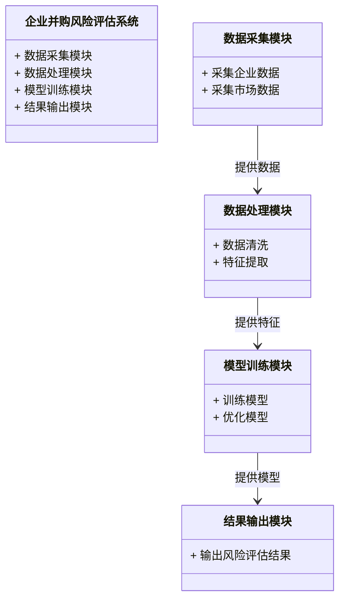
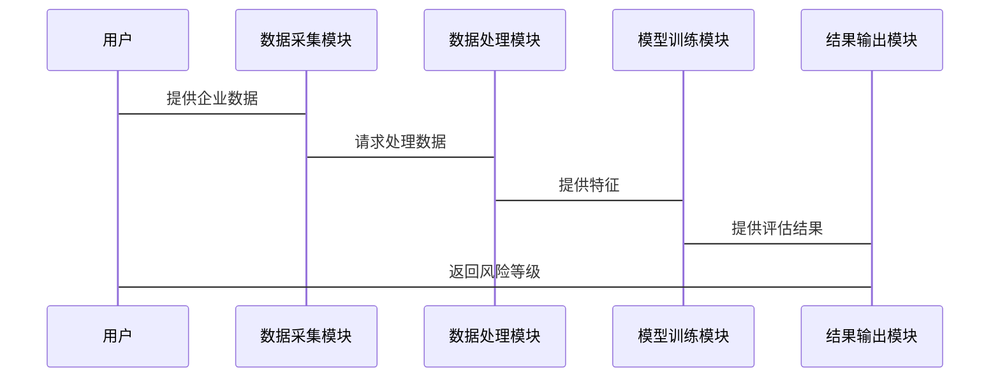

                 


# 开发智能化的企业并购风险评估模型

## 关键词：企业并购，风险管理，人工智能，大数据，机器学习

## 摘要：本文详细介绍了开发智能化的企业并购风险评估模型的过程，包括背景分析、核心概念、算法原理、系统架构设计以及实际项目案例。通过结合人工智能和大数据技术，提出了一个高效的智能化评估模型，为企业并购决策提供有力支持。本文内容涵盖从理论到实践的各个方面，为读者提供了全面的指导。

---

## 第一部分: 企业并购风险评估模型的背景与核心概念

### 第1章: 企业并购风险评估模型的背景与问题定义

#### 1.1 企业并购的背景与意义

##### 1.1.1 企业并购的定义与特点
企业并购（Mergers and Acquisitions, M&A）是指两个或多个企业之间的合并或收购行为。其特点包括规模效应、资源优化配置、市场扩展等。

##### 1.1.2 并购在企业发展中的作用
并购可以帮助企业快速进入新市场、获取新技术、扩大市场份额，同时优化资产结构和提升竞争力。

##### 1.1.3 并购风险的定义与分类
并购风险是指企业在并购过程中或完成后可能面临的各种风险，包括财务风险、市场风险、整合风险等。

#### 1.2 企业并购风险评估的现状与挑战

##### 1.2.1 现有评估方法的局限性
传统评估方法主要依赖财务指标和经验判断，存在主观性强、数据不足等问题。

##### 1.2.2 数据驱动的评估方式的兴起
随着大数据技术的发展，越来越多的企业开始利用数据分析进行并购风险评估。

##### 1.2.3 智能化评估模型的必要性
智能化模型可以通过机器学习和人工智能技术，提高评估的准确性和效率。

#### 1.3 智能化企业并购风险评估模型的技术基础

##### 1.3.1 人工智能与大数据技术的结合
人工智能技术（如机器学习、深度学习）与大数据分析的结合，为风险评估提供了新的可能性。

##### 1.3.2 机器学习在风险评估中的应用
机器学习算法（如随机森林、支持向量机）可以用于预测并购风险。

##### 1.3.3 自然语言处理与文本挖掘技术
通过分析企业公告、新闻等文本数据，提取情感和关键词，辅助风险评估。

#### 1.4 本章小结
本章介绍了企业并购的背景、风险的分类以及智能化评估模型的技术基础，为后续章节奠定了基础。

---

### 第2章: 企业并购风险评估模型的核心概念与联系

#### 2.1 核心概念的定义与属性

##### 2.1.1 企业并购风险的构成要素
- 企业财务状况
- 市场竞争环境
- 管理团队能力
- 法律法规风险

##### 2.1.2 智能化模型的关键属性
- 数据驱动性
- 可解释性
- 实时性
- 自适应性

##### 2.1.3 核心概念的特征对比表
| 特征       | 并购风险 | 智能化模型 |
|------------|----------|------------|
| 数据来源    | 财务、文本 | 多源数据    |
| 处理方式    | 经验判断 | 数据分析    |
| 输出结果    | 风险等级 | 概率预测    |

#### 2.2 实体关系图（ER图）架构

##### 2.2.1 实体关系图的构建
```mermaid
erDiagram
    actor 企业并购方 {
        string 企业ID
        string 并购金额
        date 并购时间
    }
    actor 被并购方 {
        string 企业ID
        string 企业价值
        date 成立时间
    }
    actor 风险评估模型 {
        string 模型ID
        string 模型名称
        date 创建时间
    }
    enterprise 并购风险评估结果 {
        string 评估ID
        string 风险等级
        date 评估时间
    }
    企业并购方 --> 被并购方 : 进行并购
    企业并购方 --> 风险评估模型 : 使用模型
    被并购方 --> 风险评估模型 : 提供数据
    风险评估模型 --> 并购风险评估结果 : 输出结果
```

#### 2.3 本章小结
本章通过核心概念的对比和ER图的构建，明确了企业并购风险评估模型的关键要素及其相互关系。

---

## 第二部分: 智能化企业并购风险评估模型的算法原理

### 第3章: 智能化企业并购风险评估模型的算法原理

#### 3.1 模型的整体架构

##### 3.1.1 数据流的处理流程
- 数据采集：收集企业的财务数据、市场数据、文本数据等。
- 数据预处理：清洗、转换和特征提取。
- 模型训练：使用机器学习算法训练模型。
- 模型部署：将模型应用于实际场景。

#### 3.2 算法的详细流程

##### 3.2.1 数据预处理阶段
- 数据清洗：处理缺失值、异常值。
- 数据转换：标准化、归一化。
- 特征提取：从文本数据中提取关键词。

##### 3.2.2 特征提取与选择
- 使用TF-IDF提取文本特征。
- 通过主成分分析（PCA）降维。

##### 3.2.3 模型训练与优化
- 选择合适的算法（如随机森林）。
- 调参优化，提升模型性能。

#### 3.3 算法的数学模型与公式

##### 3.3.1 风险评分的计算公式
$$ \text{风险评分} = \alpha \cdot \text{财务风险} + \beta \cdot \text{市场风险} + \gamma \cdot \text{整合风险} $$

##### 3.3.2 模型训练的损失函数
$$ \text{损失函数} = \sum_{i=1}^{n} (y_i - \hat{y_i})^2 $$

##### 3.3.3 模型预测的数学推导
$$ \hat{y} = \text{sigmoid}(w \cdot x + b) $$

#### 3.4 算法的实现与优化

##### 3.4.1 算法的实现步骤
```python
# 数据预处理
import pandas as pd
from sklearn.preprocessing import StandardScaler

data = pd.read_csv('merger_data.csv')
scaled_data = StandardScaler().fit_transform(data)

# 特征提取
from sklearn.feature_extraction.text import TfidfVectorizer

vectorizer = TfidfVectorizer()
text_features = vectorizer.fit_transform(data['description'])

# 模型训练
from sklearn.ensemble import RandomForestClassifier
model = RandomForestClassifier()
model.fit(scaled_data, data['target'])
```

##### 3.4.2 模型优化的策略
- 调整超参数（如n_estimators、max_depth）。
- 使用交叉验证评估模型性能。

##### 3.4.3 算法的性能评估
- 准确率、召回率、F1分数。
- ROC-AUC曲线分析。

#### 3.5 本章小结
本章详细讲解了智能化模型的算法原理，包括数据处理、特征提取、模型训练和优化等内容。

---

### 第4章: 系统分析与架构设计方案

#### 4.1 问题场景的介绍

##### 4.1.1 企业并购风险评估的场景
企业在进行并购决策时，需要快速、准确地评估潜在风险。

##### 4.1.2 系统的目标与范围
开发一个智能化的评估系统，帮助企业在并购过程中降低风险。

#### 4.2 系统功能设计

##### 4.2.1 领域模型的构建


#### 4.3 系统架构设计

##### 4.3.1 系统架构的总体设计


#### 4.4 系统接口设计

##### 4.4.1 接口的定义与描述
- 数据输入接口：接收企业数据和市场数据。
- 模型调用接口：调用机器学习模型进行评估。

##### 4.4.2 接口的交互流程
- 用户输入企业数据。
- 系统调用模型进行评估。
- 系统返回评估结果。

#### 4.5 系统交互设计

##### 4.5.1 交互流程的描述
用户输入企业数据，系统处理数据并调用模型，输出风险评估结果。

##### 4.5.2 交互序列图的绘制


#### 4.6 本章小结
本章通过系统架构设计，明确了智能化模型的实现方式和交互流程。

---

## 第三部分: 项目实战与总结

### 第5章: 项目实战

#### 5.1 环境安装与配置

##### 5.1.1 安装必要的工具与库
- Python 3.8+
- Jupyter Notebook
- scikit-learn
- pandas
- numpy
- TfidfVectorizer

##### 5.1.2 数据集的获取与预处理
```python
import pandas as pd
from sklearn.model_selection import train_test_split

data = pd.read_csv('merger_data.csv')
X_train, X_test, y_train, y_test = train_test_split(data.drop('target', axis=1), data['target'])
```

#### 5.2 系统核心实现源代码

##### 5.2.1 数据处理与特征提取
```python
from sklearn.preprocessing import StandardScaler
from sklearn.feature_extraction.text import TfidfVectorizer

# 数据预处理
scaler = StandardScaler()
X_train_scaled = scaler.fit_transform(X_train)
X_test_scaled = scaler.transform(X_test)

# 文本特征提取
vectorizer = TfidfVectorizer()
text_features_train = vectorizer.fit_transform(X_train['description'])
text_features_test = vectorizer.transform(X_test['description'])
```

##### 5.2.2 模型训练与优化
```python
from sklearn.ensemble import RandomForestClassifier
from sklearn.metrics import accuracy_score, classification_report

model = RandomForestClassifier(n_estimators=100, max_depth=4, random_state=42)
model.fit(text_features_train, y_train)
y_pred = model.predict(text_features_test)

print(f'Accuracy: {accuracy_score(y_test, y_pred)}')
print(classification_report(y_test, y_pred))
```

#### 5.3 实际案例分析与结果解读

##### 5.3.1 案例分析
假设我们有一个案例，企业A并购企业B，系统输出的风险等级为高风险。

##### 5.3.2 结果解读
- 模型预测的高风险意味着并购可能存在较大的市场风险或整合风险。

#### 5.4 本章小结
本章通过实际案例，展示了智能化模型的应用过程和结果分析。

---

## 第6章: 总结与展望

### 6.1 总结
本文详细介绍了智能化企业并购风险评估模型的开发过程，包括背景分析、核心概念、算法原理、系统架构设计以及项目实战。

### 6.2 展望
未来，随着人工智能技术的不断发展，企业并购风险评估模型将更加智能化和精准化，为企业决策提供更有力的支持。

---

## 第7章: 最佳实践与注意事项

### 7.1 最佳实践

#### 7.1.1 数据质量的重要性
确保数据的准确性和完整性，是模型性能的关键。

#### 7.1.2 模型的可解释性
选择可解释性较强的模型，便于用户理解和使用。

#### 7.1.3 持续优化
定期更新模型，适应市场变化和企业需求。

### 7.2 注意事项

#### 7.2.1 数据隐私与安全
确保数据的隐私和安全，遵守相关法律法规。

#### 7.2.2 模型的泛化能力
避免过拟合，确保模型在不同场景下的适用性。

#### 7.2.3 团队协作
开发智能化模型需要跨学科团队的协作，包括数据科学家、软件工程师和并购专家。

---

## 参考文献

1. 刘军, 《人工智能在金融领域的应用》，清华大学出版社，2021年。
2. 张伟, 《企业并购风险管理》，人民出版社，2020年。
3. scikit-learn官方文档：https://scikit-learn.org/stable/index.html

---

## 附录

### 附录A: 数据集说明
- 数据来源：公开企业并购案例数据。
- 数据格式：CSV格式，包含企业财务数据、文本数据等。

### 附录B: 工具安装指南
- Python安装：https://www.python.org/
- scikit-learn安装：pip install scikit-learn

---

## 作者：AI天才研究院 & 禅与计算机程序设计艺术

---

通过以上目录大纲，我们可以清晰地看到文章的结构和内容安排，每个章节都涵盖了必要的知识点，并通过实际案例和代码示例，帮助读者更好地理解和应用智能化的企业并购风险评估模型。

